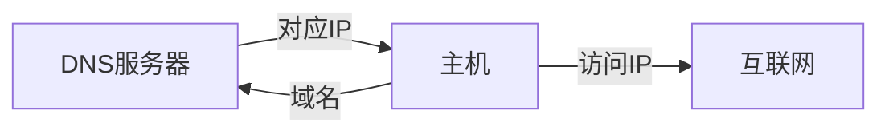
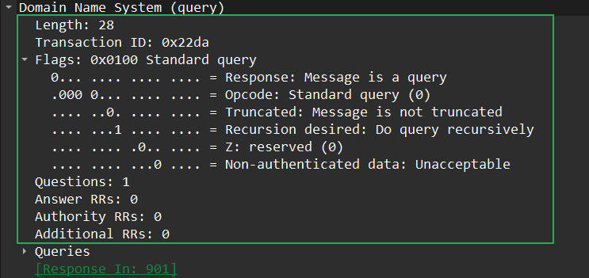
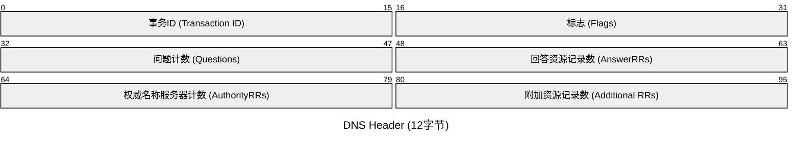
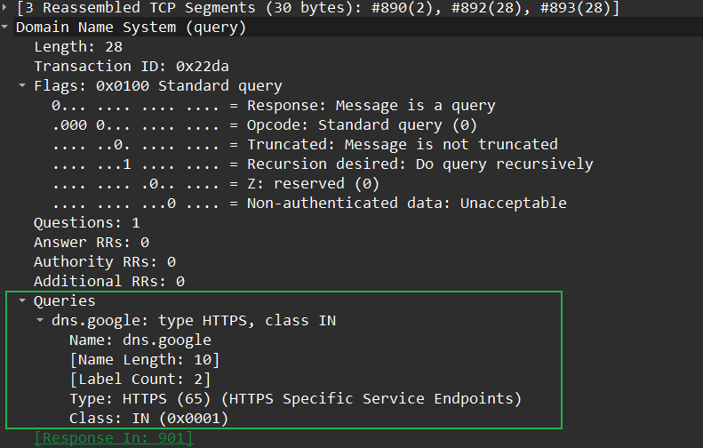
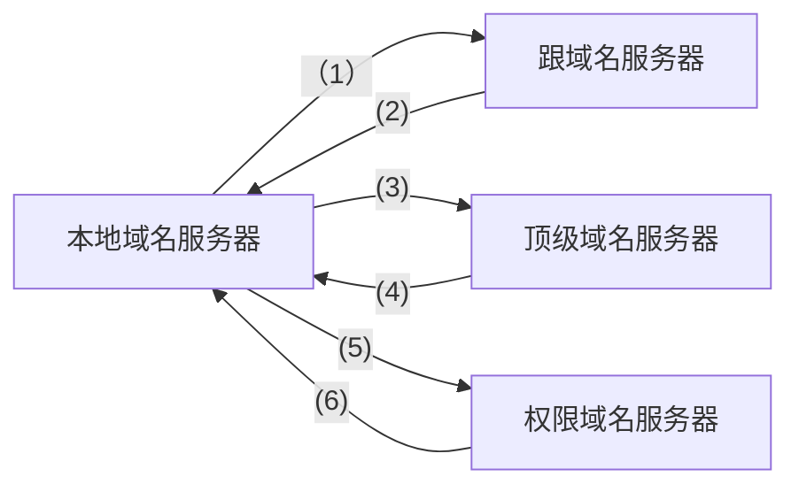
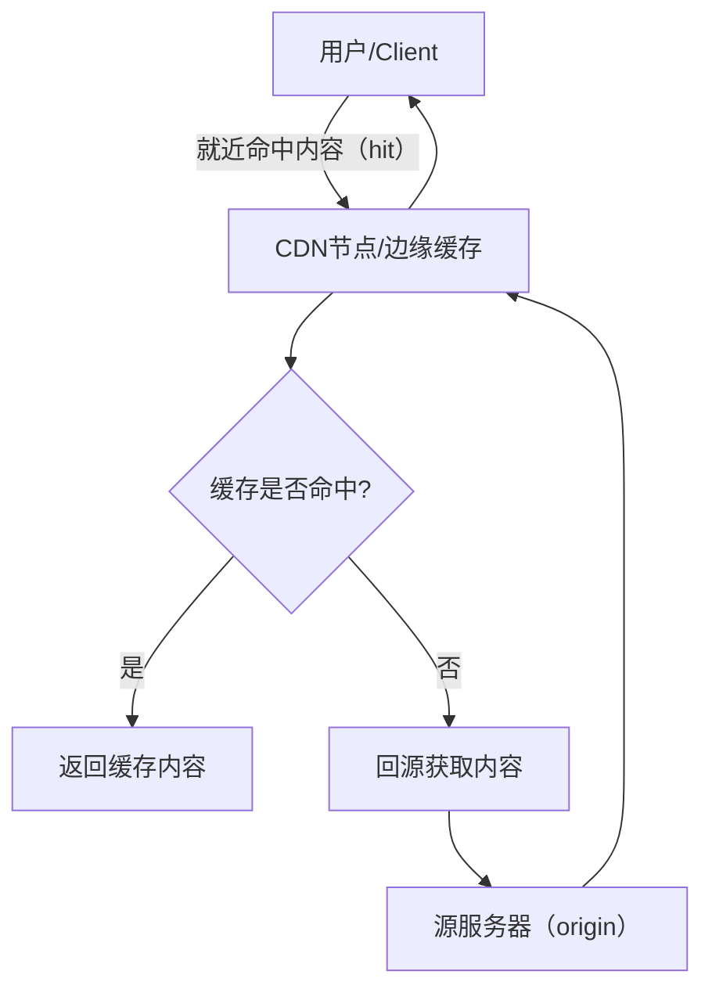
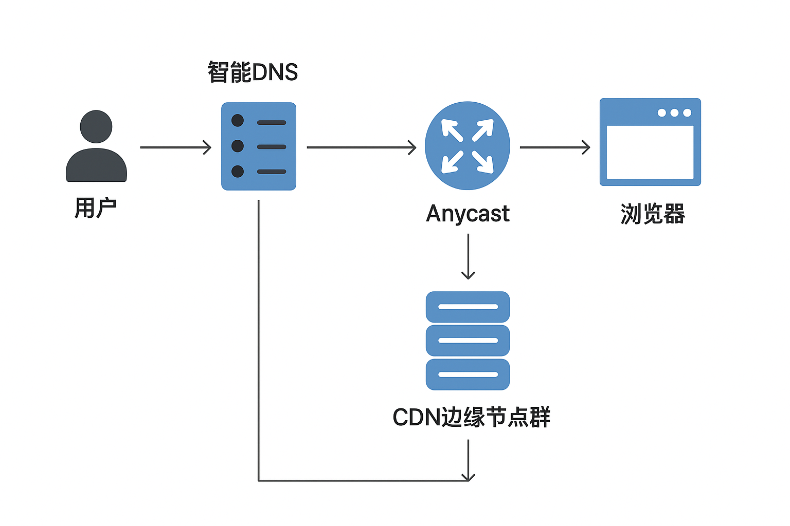

# **DNS(域名解析系统)**

DNS用于IP和域名之间的转换。

在设备的实际发送和转发数据时，只认识IP地址。而IP不利于类记忆，所以域名便诞生了，通常我们使用的浏览器的地址页便包含了域名。

例如：

DNS便是用于将域名与IP之间进行转换的的协议，存储DNS信息的服务器就叫DNS服务器。当我们需要转换域名和IP时便会向DNS服务器进行查询。若DNS服务器有相应的条目则会回复我们相应的信息。

- 使用UDP和TCP的53号端口

---

## **建立IP地址与域名之间的映射关系**

- 将域名解析为IP地址（正向解析）
- 将IP地址解析为域名（逆向解析）

- windows关于DNS的命令：

| 命令 | 备注 |
| --- | --- |
| nslookup | DNS调试工具 |
| Ipconfig/displaydns | 查看DNS缓存 |
| Ipconfig/flushdns | 清空DNS缓存 |

## DNS的UDP与TCP

很多人会不解，DNS独占了UDP与TCP的53号端口。DNS的查询和响应通常都只使用1个数据包，UDP的报文长度限制为512B，当域名过长时可能会超出UDP的报文长度现在，这时就会使用到基于TCP的DNS了，由于TCP的重传特性，这避免了在传输途中丢包导致的无响应错误。

## 权威服务器

---

## DNS报文

DNS的报文可以分为`Header`,`Question`,`Answer`,`Authority`,`Additional` 5个部分。无论查询还是响应都一样。

### Header（报文头部）

标志位：

- 事务ID(Transaction ID)

一个随机数，用于表示DNS报文的ID，对于请求报文和其对应的应答报文，该字段的值是相同的。

- 标志（Flags)
  - QR（查询/响应标志）：`0`代表为查询报文，1代表为响应报文。
  - Opcode（操作码）：用于标识查询方式例如反向查询，标准查询……，通常为`0`，代表标准查询。
  - AA(权威回答)：`0`代表响应服务器为非权威服务器，`1`代表响应服务器为权威服务器。
  - TC(截断)：`1`代表文长度超过了传输协议的限制，`0`则未超过。UDP的传输限制为512B。
  - RD(期望递归)：查询报文中设置 `1`时，表示客户端希望服务器进行递归查询。
  - RA (递归可用)：响应报文中设置 `1`时，表示服务器支持递归查询。
  - Z：保留字段，置0。
  - rcode(响应码)：
    - `0`: No Error - 查询成功。
    - `1`: Format Error - 报文格式错误。
    - `2`: Server Failure - 服务器内部错误。
    - `3`: **NXDOMAIN** (Non-Existent Domain) - 域名不存在。这是最常见的错误之一。
    - `5`: Refused - 服务器拒绝处理该请求。

- 问题计数(Questions）

需要查询的DNS条目数量，通常为1。代表查询1个条目。

- 回答资源记录数（AnswerRRs）

DNS 响应的数量。

- 权威名称服务器计数（AuthorityRRs）

权威服务器的数量。

- 附加资源记录数（Additional RRs）

附加信息部分的资源记录数量。

### Question（问题部分）

- 问题部分为DNS查询问题的部分。

| QNAME | QTYPE | QCLASS |
| ----- | ----- | ------ |

- QNAME (查询名): 要查询的域名，在这里，会将域名的 . 更改为后面字母的数量。
例如，`www.google.com` 会被编码为 `3www6google3com0`，最后以0结尾。这种方式可以有效的压缩域名。
- QTYPE (查询类型): 查询资源的类型，例如A（1）代表IPv4，AAAA（28）代表IPv6。
- QCLASS (查询类): 查询的类别，例如协议簇什么的，通常为1（IN），代表互联网。

### **Resource Record,（RR，资源记录部分）**

- 资源记录部分是`Answer`，`Authority`，`Additional`3个部分的和称，这3个部分使用同一个报文格式。
  - Answer（回答部分）
      回答部分是对问题部分的回答。
  - Authority（权威部分)
     Additional（附加信息部分）
- 通用格式

| 可变 | 2B | 2B | 2B | 2B | 可变 |
| --- | --- | --- | --- | --- | --- |
| NAME(域名) | TYPE(类型) | CLASS（类） | TLL（生存时间） | RDLENGTH(资源数据长度) | RDATA(资源数据) | 

NAME（域名）：记录所关联的域名。

TYPE（类型）：与QTYPE对应，定义了资源数据的类型，例如A（1）代表IPv4，AAAA（28）代表IPv6。

CLASS（类别）：与QCLASS对应，通常为1（IN），代表互联网。

TTL（生存时间）：与IP的TTL用法一致，TTL为0时丢弃数据包。

RDLENGTH（资源数据长度）：指定了下一个 RDATA 字段的长度，以字节为单位。

RDATA（资源数据）：记录的真正内容。这个字段的格式和含义完全由 TYPE 字段决定。

---

## DNS的交互

### **DNS 查询方式**

通常的DNS有两种查询方式。

- 递归查询
- 迭代查询

在**递归查询**中，如果 A 请求 B，那么 B 作为请求的接收者**一定要给 A 想要的答案。**

而**迭代查询**则是指，如果接收者 B 没有请求者 A 所需要的准确内容，接收者 B 将告诉请求者 A，如何去获得这个内容，但是**自己并不去发出请求**。

一般来说，**域名服务器**之间的查询使用**迭代查询**方式，以免根域名服务器的压力过大。

---

## DOT与DOH

传统的DNS是使用明文传输的，这容易导致DNS泄露信息，劫持，篡改等问题。DOT与DOH的共同特点便是使用加密传输，以保护 DNS 查询的隐私性和完整性。

- DOT (DNS over TLS)

DOT技术直接将DNS的查询和应答报文封装在一个TLS的隧道中进行传输，TLS使用TCP853端口。

- DOH (DNS over HTTPS)

DOH技术，将DNS 查询数据打包成一个标准的 HTTPS 请求，DNS应答则是被封装在 HTTPS 的应答中返回。HTTPS使用TCP443端口。

一般来说，更加推荐使用DOH，HTTPS的流量十分常见，使用DOH则更加容易使其流量混淆，难以区分。

---

## 智能DNS和CDN

现在许多的厂商都在多地都设有数据中心或者机房。我们希望在使用时能连接到最近的服务器，而普通的DNS则只是将域名转换成单一的同一个IP地址。智能DNS与CDN便是用于解决这些问题的。

### 智能DNS (Intelligent DNS)

智能DNS是一种在DNS服务器中的规则策略，当智能DNS服务器收到DNS查询包时，会对其需要查询的服务器进行排行，最终返回排行最高，最合适的服务器IP地址。

最常用的智能DNS策略为：

- GEO DNS（基于地理位置的解析 ）：

    智能DNS内部维护着一个庞大的GeoIP数据库，智能DNS会根据DNS查询包的IP地址地理位置，寻找该地区或者附近地区的一个服务器，使用该服务器的IP进行应答。

    例如：你位于北京，你向DNS发送查询包时，智能DNS便会寻找位于北京或者中国的服务器的IP地址，并将其进行应答。

- 基于服务器状态的解析：
    智能DNS系统会不间断地监控其管理的所有服务器。通过响应速度，服务在线情况，连接数等进行分析，评估服务器是否健康。

    当同一个地区有多台健康的服务器时，智能DNS可以根据预设的算法，将用户的请求均匀地分配到这些服务器上，避免单台服务器负载过高。（负载均衡）
当然，在实际的智能DNS配置当中会使用多种规则策略进行判断。

### CDN (Content Delivery Network / 内容分发网络)

CDN 是一个由真实服务器组成的实体网络。它的重点在于“分发”和“缓存”，将一个服务器的数据缓存到多个地点不同的服务器上（边缘节点），使其减少主服务器（源站）的压力。和让用户加速访问。

### CDN的组成

| 模块 | 作用 |
| --- | --- |
| **边缘节点（Edge Node）** | CDN的缓存服务器，分布在各地，用户请求优先访问此节点。 |
| **中心节点（Regional / Mid-tier Node）** | 辅助边缘节点缓存，提高缓存命中率。 |
| **源站（Origin Server）** | 网站或应用的真实服务器（数据源）。 |
| **调度系统（DNS/HTTP重定向）** | 根据用户位置、网络状况，将其请求智能分配到最佳CDN节点。 |
| **缓存系统（Cache System）** | 保存静态内容副本，减少回源。 |
| **监控与健康检测系统** | 检查节点状态、带宽、负载等信息，保证系统可靠。 |

### 访问过程

---

参考：

[DNS报文格式解析（非常详细） - C语言中文网](https://c.biancheng.net/view/6457.html)

[DNS原理和智能DNS及CDN - songguojun - 博客园](https://www.cnblogs.com/songgj/p/11048235.html)

编写：

2025.10.11     春风
