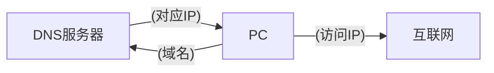
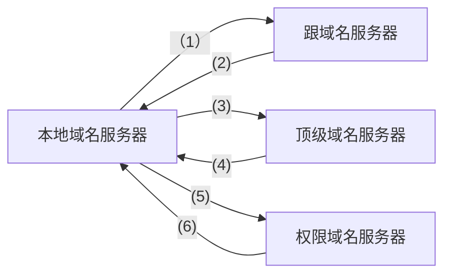
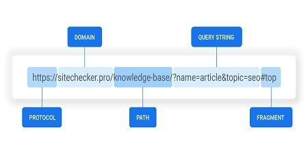
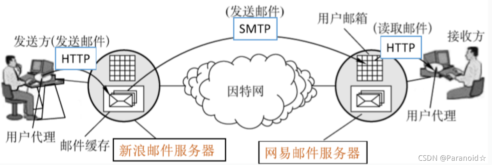
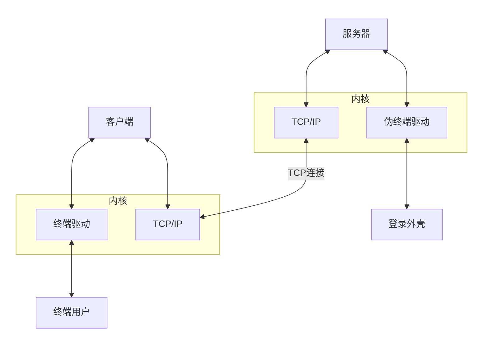

# **应用层概述：**

TCP/IP的最高层

直接为应用程序提供网络服务

## **常见的应用层协议：**

- **DNS**
- **HTTP**
- **SMTP或POP3/IMAP**
- **Telnet**
- **FTP与TFTP**

# **DNS：域名解析系统**

**建立IP地址与域名之间的映射关系**

- 将域名解析为IP地址（正向解析）
- 将IP地址解析为域名（逆向解析）



| 命令 | 备注 |
| --- | --- |
| nslookup | DNS调试工具 |
| Ipconfig/displaydns | 查看DNS缓存 |
| Ipconfig/flushdns | 清空DNS缓存 |

## **4. DNS 查询方式**

- 递归查询
- 迭代查询

在**递归查询**中，如果 A 请求 B，那么 B 作为请求的接收者**一定要给 A 想要的答案**；

而**迭代查询**则是指，如果接收者 B 没有请求者 A 所需要的准确内容，接收者 B 将告诉请求者 A，如何去获得这个内容，但是**自己并不去发出请求**。

一般来说，**域名服务器**之间的查询使用**迭代查询**方式，以免根域名服务器的压力过大。

**迭代查询过程：**


**递归查询过程：**


# **HTTP：超文本传输协议**

它是基于**TCP协议**的**应用层传输协议**，简单来说就是**客户端和服务端进行数据传输的一种规则**。请求和响应消息的头以[ASCII](https://baike.baidu.com/item/ASCII/309296?fromModule=lemma_inlink)形式给出；而 消息内容则具有一个类似[MIME](https://baike.baidu.com/item/MIME/2900607?fromModule=lemma_inlink)的格式。

- 帮助客户**访问万维网**
- 网页浏览器通过翻译**HTML**（超文本标识语言）文件表现文本，图像，音乐，动画及视频等对象

> 特点
> 
- 支持**客户/服务器**模式。
- **灵活**：HTTP允许传输任意类型的数据对象
- **无连接**：无连接的含义是限制每次连接只处理一个请求
- **无状态**：HTTP协议是无状态协议。无状态是指协议对于事务处理没有记忆能力。
- **简单快速**：客户向服务器请求服务时，只需传送请求方法和路径。

**太多，推荐查询[HTTP_百度百科 (baidu.com)](https://baike.baidu.com/item/http/243074)**

## **REQUEST：请求**

客户端发送一个HTTP请求到服务器的请求消息包括以下格式：**请求行、请求头部、空行和请求数据**四个部分组成，下图给出了请求报文的一般格式


### **请求行**

包含三个信息：**请求方式、URI、HTTP 协议版本。**

### **请求方式**

| **get** | 请求**获取**Request-URI所标识的资源 |
| --- | --- |
| **post** | 在Request-URI所标识的资源后**增加新的数据** |
| **head** | 请求获取由Request-URI所标识的资源的响应消息报头 |
| **put** | 请求服务器**存储或修改一个资源**，并用Request-UR作为其标识 |
| **delete** | 请求服务器**删除**Request-UR所标识的资源 |
| **trace** | 请求服务器**回复收到的请求信息**，主要用于测试 |
| **connect** | 保留将来使用 |
| **opptions** | 请求查询服务器的性能，或者查询与资源相关的选项和需求 |

### **URL：统一资源定位符**

URL是对可以从互联网上得到的资源的位置和访问方法的一种简洁的表示，互联网上的每个文件都有一个唯一的URL，它包含的信息指出文件的位置以及浏览器应该怎处理它。**URL是web页的地址。**

URL由3个主要的部分构成：**协议**，**服务器地址**和**具体地址**

- **协议**是告诉我们自己面对的是何种类型的Internet资源。
- 存有该资源所在的**服务器的名称**或**IP地址**(包括端口号);
- 主机资源的**具体地址**

### 格式;
scheme://host[:port#]/path/…/[;url-params][?query-string][#anchor]


| **scheme** | 有我们很熟悉的http，https，ftp以及ed2k，迅雷的thunder等。 |
| --- | --- |
| **host** | http服务器的ip地址或域名 |
| **port** | http的默认端口是80，这种情况下端口号可以省略。如果使用其他端口必须指明。 |
| **path** | 访问资源的路径 |
| **url-params** | 所带参数 |
| **query-string** | 发给http服务器的数据 |
| **anchor** | 锚点定位 |



### **URI:统一资源标识符/** **URN:统一资源名称**

Web上可用的每种资源都由一个通用资源标识符（URI）进行定位。URI可以分为URL,URN（统一资源名称）。**URN**确定了**东西的身份**，**URL**提供了**找到它的方式**。

因此，三者之间的关系是：**URL 一定是 URI，URN + URL 就是 URI。**

例如：

[http://www.baidu.com](https://link.zhihu.com/?target=http%3A//www.baidu.com)是URL.http://www.baidu.com/index.html 是URL 同时也是URI。

所以，URL 就是 URI 的 定位。

### **请求头 Header**

包含一些对消息的描述信息，格式是**<field>:<value>**。具体地，各种消息头又被分为四大类：**通用头、请求头、响应头**（用于响应消息）和**实体头**。

[鲜为人知的HTTP协议头字段详解大全 - 知乎 (zhihu.com)](https://zhuanlan.zhihu.com/p/34908942)

[HTTP头部详解-CSDN博客](https://blog.csdn.net/sinat_34166518/article/details/83584910)

[HTTP请求头和响应头详解 - 简书 (jianshu.com)](https://www.jianshu.com/p/9a68281a3c84)

不想写啦！(╥﹏╥)

## **RESPONSE :响应**

**HTTP响应**

也由四个部分组成，分别是：

**状态行、消息报头、空行和响应正文**
```bash
#状态行

HTTP/1.1 200 0K
#消息头部
Date: Sat, 31 Dec 2005 23:59:59 GMT
Content-Type: text/html;charset=ISO-8859-1
Content-Length: 122
#空行

#响应正文
<!html>
<head>
<title>Wrox Homepage</title>
</head>
<body>
<!-- body goes here -->
</body>
</html>
```


**HTTP状态码:**

| 状态码 | 含义 |
| ------ | ---- |
| 100~199 | 表示成功接收请求，要求客户端继续提交下一次请求才能完成整个处理过程|
| 200~299 |表示成功接收请求并已完成整个处理过程 |
| 300~399 |为完成请求，客户需进一步细化请求。例如，请求的资源已经移动一个新地址|
| 400~499 | 客户端的请求有错误 |
| 500~599 | 服务器端出现错误 |


[**HTTP 状态码 | 菜鸟教程 (runoob.com)**](https://www.runoob.com/http/http-status-codes.html)

# **SMTP与POP3,IMAP: 邮件服务**

## **邮件系统的组成结构**

电子邮件是一种**异步通信方式**，通信时不需要双方同时在场，发送者把邮件发送到收件人使用的邮件服务器，并放在其中的收件人邮箱中，收件人可以随时上网到自己使用的邮件服务器进行读取

### **Email的构成组件**


## **SMTP：简单邮件传输协议**

用于发送邮件，它使用TCP**可靠传输服务**,SMTP采用的是**“推”(Push)**的通信方式，即在用户代理向邮件服务器发送邮件及在邮件服务器之间发送邮件时，**SMTP客户端主动将邮件“推”送到SMTP服务器端**

### **通讯过程**

运行**SMTP客户进程**，具体显示为**C**，运行**SMTP服务器进程**，具体显示为**S**

### **1.建立通讯**

```bash
S：220 hamburger.edu

C：HELO crepes.fr

S：250 Hello crepes.fr, pleased to meet you .
```

发件人的邮件发送到发送方邮件服务器的邮件缓存中后，SMTP客户就每隔一定 时间对邮件缓存扫描一次，如发现有邮件，就使用SMTP的端口号(25) 与接收方邮件服务器的SMTP服务器建立TCP连接

连接建立后，接收方SMTP服务器发出220 Service ready (服务就绪)，然后SMTP客户向SMTP服务器发送HELO命令，附上发送方的主机名

### **2，邮件传送**

```bash
C:MAIL FROM: <alice@crepes.fr>

S：250 alice@crepes.fr... Sender ok

C：RCPT TO: <bob@hamburger.edu>

S：250 bob@hamburger.edu ... Recipient ok

C：DATA

S： 354 Enter mail, end with "." on a line by itself C:Do you like ketchup?

C:How about pickles?

C: .

S:250 Message accepted for delivery
```

连接建立后，就可开始传送邮件, 邮件的传送从MAIL命令开始，MAIL 命令后面有发件人的地址

若SMTP服务器已准备好接收邮件，则回答250 OK

然后SMTP客户端发送一个或多个RCPT命令，格式为RCPTTO: <收件人地址>，每发送一个 RCPT命令，都有相应的信息从SMTP服务器返回，如250 OK或550 No such user here (无此用户)

RCPT命令的作用是：了解接收方系统是否已做好接收邮件的准备，然后才发送邮件，以便不至于发送了很长的邮件后才知道地址错误，进而避免浪费通信资源，

获得0K的回答后，客户端就使用DATA命令，表示要开始传输邮件的内容，正常情况下，SMTP服务器回复信息是354 Enter mail , end with “.” …，此时SMTP客户端就可开始传送邮件内容，后面语句表示邮件内容的结束

### **3，连接释放**

```bash
C: QUIT

S：221 hamburger.edu closing connection
```

邮件发送完毕后，SMTP客户应发送QUIT命令SMTP服务器返回的信息是221 (服务关闭)，表示SMTP同意释放TCP连接, 邮件传送的全部过程就此结束
```bash
c:telent SMTP.163.com25 #以telenet方式连按163邮件服务器
S:220163.com Anti-spamGTfor CoremailSystem #220为响应数字，其后的为欢迎信息
C:HEL0SMTP.163.COm #除了HELO所具有的功能外，EHLO主要用来查询服务器支持的扩充功能
S:250-mail
S: 250-AUTH LOGIN PLAIN
S:250-AUTH=LOGIN PLAIN
S:250 8BITMIME #最后一个响应数字应答码之后跟的是一个空格，而不是'_'。
C:AUTH LOGIN #请求认证
S:334 dxNlcm5hbwU6 #服务器的响应——经过base64编码了的“Username"=
C:Y29zdGFAYW1heGLOLm5ldA==： #发送经过BASE64编码了的用户名
S:334 UGFzc3dvcmQ6 #经过BASE64编码了的" Password:"=
C:1MTk4MJIXNA== #客户端发送的经过BASE64编码了的密码
S:235 auth successfully #认证成功
C:MAILFROM:bripengandre@163.com #发送者邮箱
S:250 _ . #'_'代表省略了一些可读信息
C:RCPTTO:bripengandre@smail.hust.edu.cn #按收者邮箱
S:250 _ . #“_“代表省略了一些可读信息
C：DATA//请求发送数据
S:354 Enter mail, end with "." on a line by itself
C: Enjoy Protocol Studing
C: . 
S: 250 Message sent
C:QUIT #退出连按
S:221 Bye
```

### **代码**

在命令成功时，服务器返回代码**250**，如果失败则返回代码**550**（命令无法识别）、**451**（处理时出错）、**452**（存储空间不够）、**421**（服务器不可用）等，**354**则表示开始信息输入

其他命令[邮件协议讲解（SMTP、POP3、IMAP）_imap/pop3/smtp服务。-CSDN博客](https://blog.csdn.net/m0_49864110/article/details/134819771)

### **SMTP与HTTP的不同（待扩张）**



- **HTTP**主要是一个**拉协议**, 即某些人在Web服务器上装载信息，用户使用HTTP从该服务器拉取这些信息。特别是**TCP连接是由想接收文件的机器发起的**。
- **SMTP** 基本上是一个**推协议**，即发送邮件服务器把文件推向接收邮件服务器。这个**TCP连接是由要发送该文件的机器发起的**。
- HTTP把每个对象封装到单独的HTTP响应报文中。而SMTP则把所有消息对象放在一个报文之中。

```bash
c:telent SMTP.163.com25 #以telenet方式连按163邮件服务器
S:220163.com Anti-spamGTfor CoremailSystem #220为响应数字，其后的为欢迎信息
C:HEL0SMTP.163.COm #除了HELO所具有的功能外，EHLO主要用来查询服务器支持的扩充功能
S:250-mail
S: 250-AUTH LOGIN PLAIN
S:250-AUTH=LOGIN PLAIN
S:250 8BITMIME #最后一个响应数字应答码之后跟的是一个空格，而不是'_'。
C:AUTH LOGIN #请求认证
S:334 dxNlcm5hbwU6 #服务器的响应——经过base64编码了的“Username"=
C:Y29zdGFAYW1heGLOLm5ldA==： #发送经过BASE64编码了的用户名
S:334 UGFzc3dvcmQ6 #经过BASE64编码了的" Password:"=
C:1MTk4MJIXNA== #客户端发送的经过BASE64编码了的密码
S:235 auth successfully #认证成功
C:MAILFROM:bripengandre@163.com #发送者邮箱
S:250 _ . #'_'代表省略了一些可读信息
C:RCPTTO:bripengandre@smail.hust.edu.cn #按收者邮箱
S:250 _ . #“_“代表省略了一些可读信息
C：DATA//请求发送数据
S:354 Enter mail, end with "." on a line by itself
C: Enjoy Protocol Studing
C: . 
S: 250 Message sent
C:QUIT #退出连按
S:221 Bye
```

## **POP3: 邮局协议版本3**

用于**接收邮件**，采用的是**“拉”(Pull)**的通信方式，当用户读取邮件时，**用户代理向邮件服务器发出请求，“拉”取用户邮箱中的邮件**, 首先要进行认证，然后才可以进入事务阶段，进行获取邮件

POP有两种工作方式:

- **下载并保留**
- **下载并删除**
  
```bash
# 认证过程
#user:申明用户
##pass：声明密码
S: +OK POP3 server ready
C: user bob
S:+OK
C: pass hungry
S:+OK user successfully logged on

#事物阶段
#list:列出消息数量
#retr：用编号获取消息
#dele：删除消息
#quit退出
C:list
S:1 498
S:2 912
S:.
C:dele 1
C:retr 2
S:<message 1 contents>
S:.
C: dele 1
C: retr 2
S: <message 1 contents>
S:.
C:dele 2
Quit
C: quit
S: +OK PoP3 server signing cfEN @Paranoida
```

## **IMAP互联网邮件访问协议**

它比POP复杂得多，IMAP为用户提供了**创建文件夹**、**在不同文件夹之间移动邮件**及在**远程文件夹中查询邮件的命令**，为此IMAP服务器维护了会话用户的状态信息

- 所有消息统一保存在一个地方：服务器
- 允许用户利用文件夹组织消息
- IMAP支持跨会话(Session)的用户状态:文件夹的名字文件夹与消息ID之间的映射等
- IMAP允许用户代理只获取报文的某些部分，例如可以只读取一个报文的首部,或一个多部分MIME报文的一部分。

## **POP3与IMAP区别**

|  操作位置 | 操作内容 | IMAP | POP3 |
| --- | --- | --- | --- |
| 收件箱 | 阅读、标记、移动、删除邮件等 | 客户端与邮箱更新同步 | 仅客户端内 |
| 发件箱 | 保存到已发送 | 客户端与邮箱更新同步 | 仅客户端内 |
| 创建文件夹 | 新建自定义的文件夹 | 客户端与邮箱更新同步 | 仅客户端内 |
| 草稿 | 保存草稿 | 客户端与邮箱更新同步 | 仅客户端内 |
| 垃圾文件夹 | 接收误移入垃圾文件夹的邮件 | 支持 | 不支持 |
| 广告邮件 | 接收被移入广告邮件夹的邮件 | 支持 | 不支持 |

# **Telnet：终端网络**

**远程管理的主要协议**（网络设备，服务器，数据库等）是一个**通过创建[虚拟终端](https://baike.baidu.com/item/%E8%99%9A%E6%8B%9F%E7%BB%88%E7%AB%AF/0?fromModule=lemma_inlink)提供连接到远程[主机](https://baike.baidu.com/item/%E4%B8%BB%E6%9C%BA/455151?fromModule=lemma_inlink)[终端仿真](https://baike.baidu.com/item/%E7%BB%88%E7%AB%AF%E4%BB%BF%E7%9C%9F/0?fromModule=lemma_inlink)的[TCP/IP协议](https://baike.baidu.com/item/TCP/IP%E5%8D%8F%E8%AE%AE/212915?fromModule=lemma_inlink)**。协议需要通过用户名和口令进行认证，

常用终端工具：**SecureCRT，Putty，Xshell**

## **NVT：网络虚拟终端**

是一种双向的虚拟设备，连接的双方都必须把它们各自的物理终端同NVT之间进行转换。Telnet协议可以工作在任何主机（任何操作系统）或者任何终端之间就是由于使用了统一的NVT。

NVT是虚拟设备，对于连接的双方，即客户机和服务器，都必须把它们的物理终端和NVT进行相互转换。也就是说，不管客户进程终端是什么类型，操作系统都必须把它转换为NVT格式，同时，不管服务器进程的终端是什么类型，操作系统必须能够把NVT格式转换为终端所能够支持的格式。


ASCⅡ[字符集](https://baike.baidu.com/item/%E5%AD%97%E7%AC%A6%E9%9B%86/0?fromModule=lemma_inlink)包括95个可打印字符和33个控制码。当用户从本地键入普通字符时，NVT将按照其原始含义传送；当用户键入[**快捷键**](https://baike.baidu.com/item/%E5%BF%AB%E6%8D%B7%E9%94%AE/0?fromModule=lemma_inlink)（组合键）时，NVT将把它转化为特殊的**ASCⅡ字符**在网络上传送，并在其到达远地机器后转化为相应的控制命令。

## **telnet的C/S模式**

telnet采用**客户端/服务器模式**

。下图为telnet客户端和服务器连接图：



## **telnet的工作原理**

telnet协议可以在任何主机或者任何终端之间。无论客户终端是什么类型，操作系统也会将NVT格式转换成服务器终端所支持的类型。那么，可以屏蔽具体的客户端和终端类型，简单地认为telnet双方都连接在NVT上。

### **Telnet请求：**

telnet连接的两端，通过"WILL、WONT、DO、DONT"请求来进行选项协商，从而确定telnet服务费具体内容。这些选项包括回显、改变命令字符集、行方式等。

telnet连接的任何一方都可以主动发起请求。请求含义和用法如下所示

| 发送方发出请求 | 含义 | WILL | WONT | DO | DONT |
| :--- | :--- | :--- | :--- | :--- | :--- |
| **WILL** | 发送方想激活选项 | — | — | 接收方同意 | 接收方不同意 |
| **WONT** | 发送方想禁止选项 | — | — | — | 接收方必须同意 |
| **DO** | 发送方想让接收方激活选项 | 接收方同意 | 接收方不同意 | — | — |
| **DONT** | 发送方想让接收方禁止选项 | — | 接收方必须同意  | — | — |

发起方发送“选项失效”请求（WONT和DONT）时，接收方必须同意；

发起发发送一些“选项有效”的请求，接收方可以接受或者拒绝这些请求；

- 如果接受请求，则选项立即生效
- 如果拒绝请求，则选项不生效，而发送方仍然能保留NVT的特性。

### **子选项协商**

有些选项不是仅仅用“激活”或“禁止”就能够表达的。指定终端类型就是一个例子，客户进程必须发送用一个ASCII字符串来表示终端类型。为了处理这种选项，我们必须定义子选项协商机制。

在RFC 1091[VanBokkelen 1989]中定义了如何表示终端类型这样的子选项协商机制。首先连接的某一方（通常是客户进程）发送3个字节的字符序列来请求激活该选项。

<IAC,WILL,24>

这里的2 4（十进制）是终端类型选项的ID号。如果收端（通常是[服务器](https://baike.baidu.com/item/%E6%9C%8D%E5%8A%A1%E5%99%A8/100571?fromModule=lemma_inlink)进程）同意，那么响应数据是：

<IAC,DO,24>

然后[服务器](https://baike.baidu.com/item/%E6%9C%8D%E5%8A%A1%E5%99%A8/100571?fromModule=lemma_inlink)进程再发送如下的字符串：

<IAC,SB,24,1,IAC,SE>

该字符串询问客户进程的终端类型。其中S B是子选项协商的起始命令标志。下一个字节的“2 4”代表这是终端类型选项的子选项（通常S B后面的选项值就是子选项所要提交的内容）。下一个字节的“1”表示“发送你的终端类型”。子选项协商的结束命令标志也是IAC，就像S B是起始命令标志一样。如果终端类型是ibm pc，客户进程的响应命令将是：

第4个字节“0”代表“我的终端类型是”（在Assigned Numbers RFC文档中有正式的关于终端类型的数值定义，但是最起码在Unix系统之间，终端类型可以用任何对方可理解的数据进行表示。只要这些数据在termcap或terminfo数据库中有定义）。在Telnet子选项协商过程中，终端类型用大写表示，当[服务器](https://baike.baidu.com/item/%E6%9C%8D%E5%8A%A1%E5%99%A8/100571?fromModule=lemma_inlink)收到该字符串后会自动转换为小写字符。

### **交互过程**

当我们使用Telnet登录进入远程计算机系统时，事实上启动了两个程序：一个是Telnet客户程序，运行在本地主机上；另一个是Telnet服务器程序，它运行在要登录的远程计算机上。

本地主机上的Telnet客户程序主要完成以下功能：

- 建立与远程服务器的TCP联接。
- 从键盘上接收本地输入的字符。
- 将输入的字符串变成标准格式并传送给远程服务器。
- 从远程服务器接收输出的信息。
- 将该信息显示在本地主机屏幕上。

远程主机的“服务”程序通常被昵称为“精灵”，它平时不声不响地守候在远程主机上，一接到本地主机的请求，就会立马活跃起来，并完成以下功能：

- 通知本地主机，远程主机已经准备好了。
- 等候本地主机输入命令。
- 对本地主机的命令作出反应（如显示目录内容，或执行某个程序等）。
- 把执行命令的结果送回本地计算机显示。
- 重新等候本地主机的命令。

### **NTLM**

早期的[SMB协议](https://baike.baidu.com/item/SMB%E5%8D%8F%E8%AE%AE/3770892?fromModule=lemma_inlink)在网络上明文传输口令，后来出现了"LAN Manager Challenge/Response"验证机制，简称LM，它十分简单以至很容易被破解，[微软](https://baike.baidu.com/item/%E5%BE%AE%E8%BD%AF/0?fromModule=lemma_inlink)随后提出了WindowsNT挑战/响应验证机制，即NTLM。现在已经有了更新的NTLMv2以及Kerberos验证体系。

## **命令**

| **help** | 联机求助 |
| --- | --- |
| **open** | 后接IP地址或域名即可进行远程登录 |
| **close** | 正常结束远程会话，1 回到命令方式 |
| **display** | 显示工作参数 |
| **mode** | 进入行命令或字符方式 |
| **send** | 向远程主机传送特殊字符（键入send?可显示详细字符） |
| **set** | 设置工作参数（键入set?可显示详细参数） |
| **status** | 显示状态信息 |
| **toggle?** | 改变工作参数 （键入toggle?可显示详细参数 |
| **esc(Ctrl-])** | 在异常情况下退出会话，回到命令方式 |
| **quit** | 退出telnet,返回本地机 |
| **Z** | 使telnet进入暂停状态 |

[telnet 命令使用方法详解，telnet命令怎么用？ - 知乎 (zhihu.com)](https://zhuanlan.zhihu.com/p/652959496)

## **Telnet 不安全（明文传输）**

*Telnet* 仅以明文形式发送和接收数据，没有任何形式的加密。这意味着每当您连接到*Telnet*服务器时，您的个人数据（如用户名和密码）都将以明文形式传输。任何知道如何使用应用程序嗅探网络连接的人都会看到所有正在传输的数据。

# **FTP和TFTP：文件传输**

## **FTP：文件传输协议**

**提供可靠的文件传输服务，具有认证，权限等功能。**

- FTP提供交互式的访问，**允许客户指明文件的类型与格式**（如指明是否使用ASCII码），**并允许文件具有存取权限**（如访问文件的用户必须经过授权，并输入有效的口令）。
- FTP屏蔽了各计算机系统的细节，因而**适合于在异构网络中任意计算机之间传送文件**。

### 数据连接/控制连接

- **控制连接**（port:21）：用于在**两个主机之间传输控制信息**，如口令，用户标识，存放、获取文件等命令。控制连接数据连接用于实际发送一个文件,发送完文件之后数据连接会关闭。因为FTP协议使用一个独立的控制连接，所以，也称FTP的控制信息是带外（out-of-band）传送的。
- **数据连接**(port:20)：**用于文件传输**，在每次文件传输时才建立，传输结束就关闭。

### **FTP与HTTP的区别：**

HTTP和FTP都是文件传输协议，都是运行在TCP上面，但是他们也有一些重要的区别。

- FTP使用了两个并行的TCP来传输文件：控制连接数据连接用于实际发送一个文件,发送完文件之后数据连接会关闭。因为FTP协议使用一个独立的控制连接，所以，也称FTP的控制信息是带外（out-of-band）传送的。
- HTTP协议是在传输文件的同一个TCP连接中发送请求和相应首部行的。因此，HTTP也可以说是带内（in-band）发送控制信息。

### **命令**

[【网络协议详解】——FTP系统协议（学习笔记）_ftp协议 rfc-CSDN博客](https://blog.csdn.net/HinsCoder/article/details/130911658)

_(┐ ﾉ´ཀ`)_

## **TFTP：简单文件传输协议**

提供不可靠的文件传输服务常用于网络设备的配置文件和系统文件传输