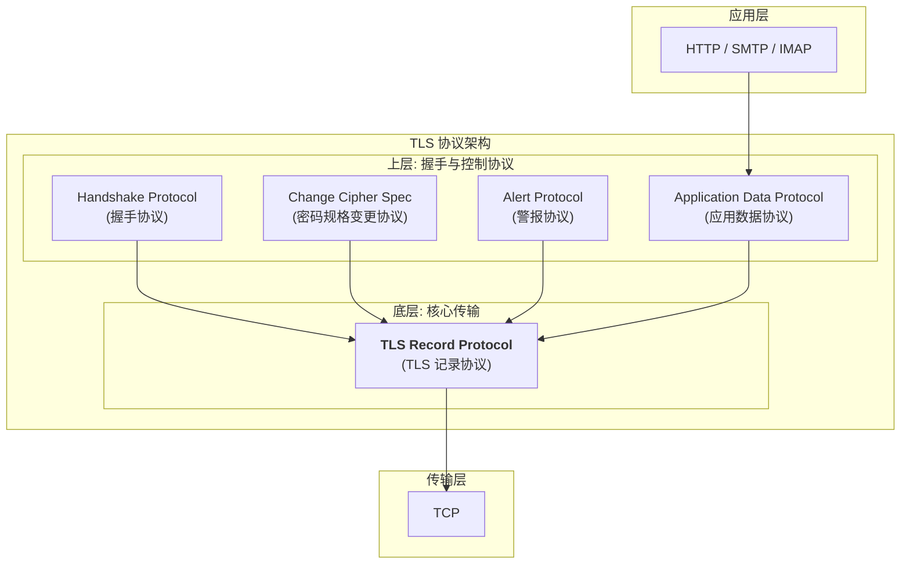
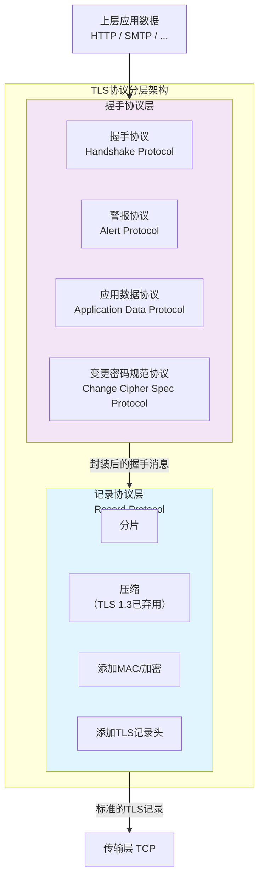

# SSL/TLS协议
SSL/TLS是一种安全协议，用于在Internet上进行安全通信。有时也称为“安全套接层”或“安全层”。
SSL/TLS仅作为通信框架使用，可以承载其他的应用层协议，为承载协议提供安全保障。现在很多协议都会与TLS/SSL一起使用，例如HTTP、SMTP、POP3、SSH……

SSL(Secure Sockets Layer)最初由Netscape（网景）公司在90年代开发。SSL1.0未发布，2.0和3.0均已被发现有严重漏洞，目前已被弃用。

TLS(Transport Layer Security)是SSL的升级版本，由IETF制定标准，是SSL3.1的后续版本。TLS1.0、1.1、1.2、1.3版本目前已被广泛使用。

现在所说的使用中的SSL其实几乎都是TLS，只不过SSL太出名了，人们习惯上仍统称为SSL。（浏览器想开真SSL都得去改设置）

在这里主要讲的协议是TLS。

TLS1.0由RFC-2246定义，TLS1.1由RFC-4346定义，TLS1.2由RFC-5246定义，TLS1.3由RFC-8446定义。

## TLS解决的问题
TLS使用加密(Encryption)解决了机密性问题，
使用消息认证码(Message Authentication Code, MAC)解决了完整性问题，
使用数字证书(Digital Certificate)解决了源认证性问题。

## TLS的架构



TLS协议的架构分为两层：底层为TLS记录协议，上层为TLS握手协议。TLS握手协议又可以分为握手协议，密码规格变更协议，警报协议，应用数据协议个协议。
### TLS记录协议
TLS记录协议关心“如何安全地传输一段数据”， 主要职责是封装，分片，压缩，添加MAC/加密，添加TLS记录头。
的所有协议都要经过TLS记录协议的封装才能发送给TCP。
- 分片：TLS的MTU为2^14字节，即16KB，大于该值的报文要分片成多个小的TLS消息。
- 压缩：由于 CRIME 和 BREACH 等安全漏洞的存在，现代 TLS 实现通常禁用压缩。
- 添加MAC/加密：这个MAC不是以太网的那个MAC，而是完整性保护(MAC)。用于对数据计算消息验证码 (HMAC)，确保数据未被篡改。
- 添加TLS记录头：加上 TLS Record Header（包含内容类型、版本号、长度）。

### TLS握手协议
TLS握手协议关心“如何建立安全参数”，
- 握手协议：Content-Type:22。用于在客户端和服务器之间协商版本、加密算法、验证身份（证书）以及生成密钥。
    TLS1.2中使用ECDHE密钥交换。
    在TLS1.3中，ECDHE密钥交换被改为使用P256或P384椭圆曲线。
    新增了1-RTT模式，这种省略了很多握手过程，直接使用之前协商好的密钥进行加密通信。
  - 握手协议交互过程：
    
    **ECDHE 模式**
    ```mermaid
    sequenceDiagram
    autonumber
    participant C as 客户端 (Client)
    participant S as 服务端 (Server)

    Note over C,S: === 第一阶段：Hello (协商) ===
    C->>S: "Client Hello<br/>(随机数 Random_C, 支持的套件列表)"
    S->>C: "Server Hello<br/>(随机数 Random_S, 选定套件 TLS_ECDHE_RSA...)"

    Note over C,S: === 第二阶段：身份验证与密钥交换 ===
    S->>C: "Certificate (服务端证书链)"
    Note right of S: ECDHE 特有步骤
    S->>C: "Server Key Exchange<br/>(服务端椭圆曲线参数 + 私钥签名)"
    S->>C: "Server Hello Done (我说完了)"

    Note left of C: 1. 验证证书合法性<br/>2. 验证签名完整性<br/>3. 生成客户端椭圆曲线参数
    C->>S: "Client Key Exchange<br/>(客户端椭圆曲线参数)"

    Note over C,S: === 第三阶段：生成密钥 & 验证 ===
    Note left of C: 此时双方都有了双发随机数 + ECDHE参数<br/>可以在本地算出 -> Pre-Master Secret -> Session Key
    
    C->>S: "Change Cipher Spec (准备切换加密)"
    C->>S: "Finished (前面所有握手消息的 Hash, 已加密)"

    Note right of S: 解密并验证 Hash<br/>验证成功说明密钥一致
    S->>C: "Change Cipher Spec (我也切换加密)"
    S->>C: "Finished (服务端握手消息 Hash, 已加密)"

    Note over C,S: === 第四阶段：应用数据传输 (HTTP) ===
    C->>S: "Application Data (HTTP Request, 对称加密)"
    S->>C: "Application Data (HTTP Response, 对称加密)"
    ```
    C：客户端
    
    S：服务端
    - 第一阶段（hello）:
    C：发送TLS版本号、一个生成32B的随机数``Random_C``,用于生产最终密钥,以及发送``Cipher Suites``列表，表明支持的加密算法。
    S：确认使用的TLS版本号，接收随机数``Random_C``。发送生成的随机数``Random_S``，选择一个加密算法，并返回证书链。
    - 第二阶段（密钥交换）：
    S：发送证书链，并使用私钥签名。
    C：验证证书链的合法性，并生成ECDHE参数。
    
    **1-RTT 模式**

    ```mermaid
    sequenceDiagram
    autonumber
    participant C as 客户端 (Client)
    participant S as 服务端 (Server)

    Note over C,S: === 极速握手 (1-RTT) ===
    
    Note left of C: 猜测服务端支持的算法(如X25519)<br/>直接生成 Key Share
    C->>S: "Client Hello + Key Share<br/>(Random_C + 客户端公钥参数)"

    Note right of S: 收到参数，直接算出 Session Key<br/>后续消息直接加密发送！
    S->>C: "Server Hello + Key Share<br/>(Random_S + 服务端公钥参数)"
    
    Note right of S: 以下消息全部被加密 {Encrypted}
    S-->>C: "{Encrypted Extensions}"
    S-->>C: "{CertificateRequest (可选)}"
    S-->>C: "{Certificate + CertificateVerify}"
    S-->>C: "{Finished}"
    
    Note left of C: 验证证书与签名<br/>握手结束
    C-->>S: "{Finished}"
    
    Note over C,S: === 数据传输 ===
    C->>S: "Application Data (HTTP Request)"
    S->>C: "Application Data (HTTP Response)"
    ```

- 密码规格变更协议：这个协议只包含1字节，感觉更像是一个位的存在。
  用于通知对端改变加密算法。即“从这条消息之后的下一条记录开始，我将使用刚才协商好的密钥和算法进行加密”。
  TLS1.3为了优化性能，弱化了这个协议的存在感，但在兼容模式下依然存在。
- 警报协议：用于通知对方连接出现了问题，或者用来正常关闭连接。
- 应用数据协议：
  

使用TLS加密通信的数据经过处理的过程：


## TLS的交互过程
### TLS握手

TLS握手是建立安全连接的第一步。
```mernaid
```

## 证书管理

## 密钥交换

## 证书链验证

## 安全套接层协议协商

## 应用层协议协商

## 安全套接层连接建立

## 数据传输

## 安全套接层连接终止


## TLS的数据包

## TLS1.1，1.2，1.3的区别
