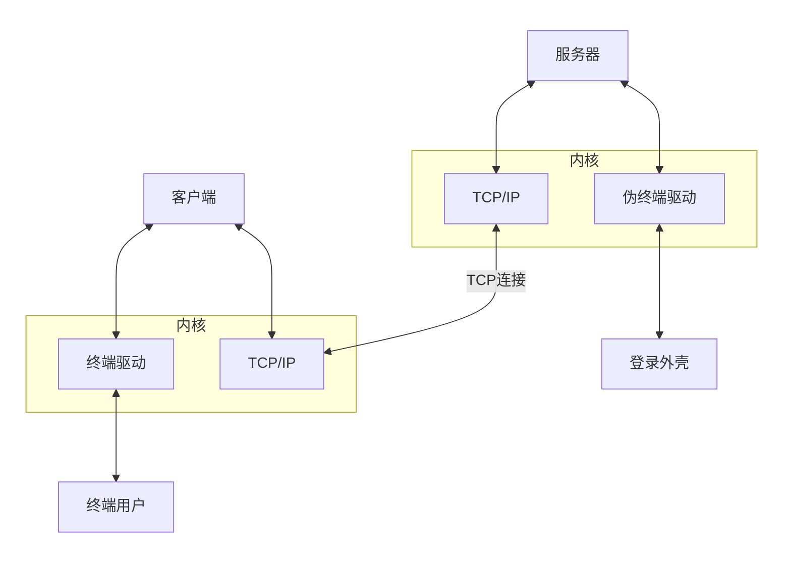

# **Telnet：终端网络**

**远程管理的主要协议**（网络设备，服务器，数据库等）是一个**通过创建[虚拟终端](https://baike.baidu.com/item/%E8%99%9A%E6%8B%9F%E7%BB%88%E7%AB%AF/0?fromModule=lemma_inlink)提供连接到远程[主机](https://baike.baidu.com/item/%E4%B8%BB%E6%9C%BA/455151?fromModule=lemma_inlink)[终端仿真](https://baike.baidu.com/item/%E7%BB%88%E7%AB%AF%E4%BB%BF%E7%9C%9F/0?fromModule=lemma_inlink)的[TCP/IP协议](https://baike.baidu.com/item/TCP/IP%E5%8D%8F%E8%AE%AE/212915?fromModule=lemma_inlink)**。协议需要通过用户名和口令进行认证，

常用终端工具：**SecureCRT，Putty，Xshell**

## **NVT：网络虚拟终端**

是一种双向的虚拟设备，连接的双方都必须把它们各自的物理终端同NVT之间进行转换。Telnet协议可以工作在任何主机（任何操作系统）或者任何终端之间就是由于使用了统一的NVT。

NVT是虚拟设备，对于连接的双方，即客户机和服务器，都必须把它们的物理终端和NVT进行相互转换。也就是说，不管客户进程终端是什么类型，操作系统都必须把它转换为NVT格式，同时，不管服务器进程的终端是什么类型，操作系统必须能够把NVT格式转换为终端所能够支持的格式。

ASCⅡ[字符集](https://baike.baidu.com/item/%E5%AD%97%E7%AC%A6%E9%9B%86/0?fromModule=lemma_inlink)包括95个可打印字符和33个控制码。当用户从本地键入普通字符时，NVT将按照其原始含义传送；当用户键入[**快捷键**](https://baike.baidu.com/item/%E5%BF%AB%E6%8D%B7%E9%94%AE/0?fromModule=lemma_inlink)（组合键）时，NVT将把它转化为特殊的**ASCⅡ字符**在网络上传送，并在其到达远地机器后转化为相应的控制命令。

## **telnet的C/S模式**

telnet采用**客户端/服务器模式**

。下图为telnet客户端和服务器连接图：

## **telnet的工作原理**

telnet协议可以在任何主机或者任何终端之间。无论客户终端是什么类型，操作系统也会将NVT格式转换成服务器终端所支持的类型。那么，可以屏蔽具体的客户端和终端类型，简单地认为telnet双方都连接在NVT上。

### **Telnet请求：**

telnet连接的两端，通过"WILL、WONT、DO、DONT"请求来进行选项协商，从而确定telnet服务费具体内容。这些选项包括回显、改变命令字符集、行方式等。

telnet连接的任何一方都可以主动发起请求。请求含义和用法如下所示

| 发送方发出请求 | 含义 | WILL | WONT | DO | DONT |
| :--- | :--- | :--- | :--- | :--- | :--- |
| **WILL** | 发送方想激活选项 | — | — | 接收方同意 | 接收方不同意 |
| **WONT** | 发送方想禁止选项 | — | — | — | 接收方必须同意 |
| **DO** | 发送方想让接收方激活选项 | 接收方同意 | 接收方不同意 | — | — |
| **DONT** | 发送方想让接收方禁止选项 | — | 接收方必须同意  | — | — |

发起方发送“选项失效”请求（WONT和DONT）时，接收方必须同意；

发起发发送一些“选项有效”的请求，接收方可以接受或者拒绝这些请求；

- 如果接受请求，则选项立即生效
- 如果拒绝请求，则选项不生效，而发送方仍然能保留NVT的特性。

### **子选项协商**

有些选项不是仅仅用“激活”或“禁止”就能够表达的。指定终端类型就是一个例子，客户进程必须发送用一个ASCII字符串来表示终端类型。为了处理这种选项，我们必须定义子选项协商机制。

在RFC 1091[VanBokkelen 1989]中定义了如何表示终端类型这样的子选项协商机制。首先连接的某一方（通常是客户进程）发送3个字节的字符序列来请求激活该选项。

<IAC,WILL,24>

这里的2 4（十进制）是终端类型选项的ID号。如果收端（通常是[服务器](https://baike.baidu.com/item/%E6%9C%8D%E5%8A%A1%E5%99%A8/100571?fromModule=lemma_inlink)进程）同意，那么响应数据是：

<IAC,DO,24>

然后[服务器](https://baike.baidu.com/item/%E6%9C%8D%E5%8A%A1%E5%99%A8/100571?fromModule=lemma_inlink)进程再发送如下的字符串：

<IAC,SB,24,1,IAC,SE>

该字符串询问客户进程的终端类型。其中S B是子选项协商的起始命令标志。下一个字节的“2 4”代表这是终端类型选项的子选项（通常S B后面的选项值就是子选项所要提交的内容）。下一个字节的“1”表示“发送你的终端类型”。子选项协商的结束命令标志也是IAC，就像S B是起始命令标志一样。如果终端类型是ibm pc，客户进程的响应命令将是：

第4个字节“0”代表“我的终端类型是”（在Assigned Numbers RFC文档中有正式的关于终端类型的数值定义，但是最起码在Unix系统之间，终端类型可以用任何对方可理解的数据进行表示。只要这些数据在termcap或terminfo数据库中有定义）。在Telnet子选项协商过程中，终端类型用大写表示，当[服务器](https://baike.baidu.com/item/%E6%9C%8D%E5%8A%A1%E5%99%A8/100571?fromModule=lemma_inlink)收到该字符串后会自动转换为小写字符。

### **交互过程**

当我们使用Telnet登录进入远程计算机系统时，事实上启动了两个程序：一个是Telnet客户程序，运行在本地主机上；另一个是Telnet服务器程序，它运行在要登录的远程计算机上。

本地主机上的Telnet客户程序主要完成以下功能：

- 建立与远程服务器的TCP联接。
- 从键盘上接收本地输入的字符。
- 将输入的字符串变成标准格式并传送给远程服务器。
- 从远程服务器接收输出的信息。
- 将该信息显示在本地主机屏幕上。

远程主机的“服务”程序通常被昵称为“精灵”，它平时不声不响地守候在远程主机上，一接到本地主机的请求，就会立马活跃起来，并完成以下功能：

- 通知本地主机，远程主机已经准备好了。
- 等候本地主机输入命令。
- 对本地主机的命令作出反应（如显示目录内容，或执行某个程序等）。
- 把执行命令的结果送回本地计算机显示。
- 重新等候本地主机的命令。

### **NTLM**

早期的[SMB协议](https://baike.baidu.com/item/SMB%E5%8D%8F%E8%AE%AE/3770892?fromModule=lemma_inlink)在网络上明文传输口令，后来出现了"LAN Manager Challenge/Response"验证机制，简称LM，它十分简单以至很容易被破解，[微软](https://baike.baidu.com/item/%E5%BE%AE%E8%BD%AF/0?fromModule=lemma_inlink)随后提出了WindowsNT挑战/响应验证机制，即NTLM。现在已经有了更新的NTLMv2以及Kerberos验证体系。

## **命令**

| **help** | 联机求助 |
| --- | --- |
| **open** | 后接IP地址或域名即可进行远程登录 |
| **close** | 正常结束远程会话，1 回到命令方式 |
| **display** | 显示工作参数 |
| **mode** | 进入行命令或字符方式 |
| **send** | 向远程主机传送特殊字符（键入send?可显示详细字符） |
| **set** | 设置工作参数（键入set?可显示详细参数） |
| **status** | 显示状态信息 |
| **toggle?** | 改变工作参数 （键入toggle?可显示详细参数 |
| **esc(Ctrl-])** | 在异常情况下退出会话，回到命令方式 |
| **quit** | 退出telnet,返回本地机 |
| **Z** | 使telnet进入暂停状态 |

[telnet 命令使用方法详解，telnet命令怎么用？ - 知乎 (zhihu.com)](https://zhuanlan.zhihu.com/p/652959496)

## **Telnet 不安全（明文传输）**

*Telnet* 仅以明文形式发送和接收数据，没有任何形式的加密。这意味着每当您连接到*Telnet*服务器时，您的个人数据（如用户名和密码）都将以明文形式传输。任何知道如何使用应用程序嗅探网络连接的人都会看到所有正在传输的数据。
