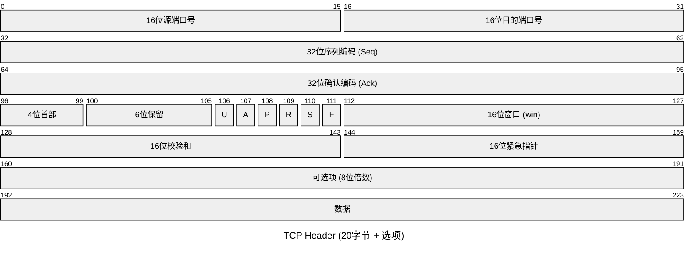

# **TCP协议：**

- TCP协议是为了**提供可靠的[端到端](https://baike.baidu.com/item/%E7%AB%AF%E5%88%B0%E7%AB%AF/8851783?fromModule=lemma_inlink)[字节流](https://baike.baidu.com/item/%E5%AD%97%E8%8A%82%E6%B5%81/3196772?fromModule=lemma_inlink)**而专门设计的一个[传输协议](https://baike.baidu.com/item/%E4%BC%A0%E8%BE%93%E5%8D%8F%E8%AE%AE/8048821?fromModule=lemma_inlink)。
- **面向连接**：TCP协议在通信之前，需要在发送端和接收端之间建立一个连接。这个连接是通过**三次握手**建立的。
- **可靠传输**：TCP协议通过一系列机制确保数据的可靠传输。
- **基于字节流**：TCP协议将数据看作是无结构的字节流，这种处理方式使得TCP可以
- 灵活地处理各种类型的数据。
- **流量控制和拥塞控制**：TCP协议具有流量控制和拥塞控制功能，以防止发送方发送数据的速度过快，导致接收方无法及时处理或网络拥塞。
- **全双工通信：**TCP协议支持全双工通信，即通信双方可以同时进行数据的发送和接收。这提高了数据传输的效率和灵活性。
- **传输效率低**

## **TCP数据报**

### sep与ack

- **32位序列号（seq）**

> 是可靠传输的关键，表示TCP源端向TCP目标端发送的数据字节流。tcp协议拼凑接收到的数据包时，根据seq来确定顺序，并且能够确定是否有数据包丢失。比如：一个报文段的序号为300，此报文段数据部分共有100字节，则下一个报文段的序号为401（seq+len）。
>
- **32位确认序号（ack）**

> 首先意味着已经收到对方了多少字节数据，其次告诉对方接下来的包的seq要从ack确定的数值继续接力。>

### 4位头部长度(数据偏移)

**标识该TCP报文段有多少个32bit（4Byte）。** 因为4位最大能标识15，所以 TCP头部最长是60Byte，前面固定长度是20Byte，所以 TCP头部最短是20Byte （tcp标准长度）。

### TCP标志位

- **FLAG紧急指针【URG】**：

> 用于将输入数据标识为“紧急”。这样的进入段不必等待直到先前段被接收端消耗，而是直接发送并立即处理。
>认位【ACK】：**
> 用于确认数据包的成功接收。

- **推送位【PSH】**：

> 存在推送标志，该数据包被对方接收后应立即交给上层应用，而不在缓冲区排队。

- **重置链接位【RST】：**

> 如果要向主机发送数据包以建立连接，并且没有这样的服务等待在远程主机上回答，则主机将自动拒绝您的请求，然后向您发送回复RST标志置1。这表示远程主机已重置连接。

- **同步位【SYN】**：

> 在建立两台主机之间的经典3次握手时，SYN标志是初始化的。

- **终止位【FIN】：**

> 代表“完成”一词。该标志用于拆除使用上一个标志（SYN）创建的虚拟连接。

### win流量控制

流量控制是一种TCP的可靠性传输机制，用于**控制发送方向接收方发送数据的速率**，以避免发送方发送的数据过多、过快而导致接收方无法及时处理和接收。

## **TCP三次握手**

- **第一次握手：**

    客户端将TCP报文标志位SYN置为1，随机产生一个序号值seq=J，保存在TCP首部的序列号(Sequence Number)字段里，指明客户端打算连接的服务器的端口，并将该数据包发送给服务器端，发送完毕后，客户端进入SYN_SENT状态，等待服务器端确认。

    （你是张三吗？）

- **第二次握手：**

    服务器端收到数据包后由标志位SYN=1知道客户端请求建立连接，服务器端将TCP报文标志位SYN和ACK都置为1，ack=J+1，随机产生一个序号值seq=K，并将该数据包发送给客户端以确认连接请求，服务器端进入SYN_RCVD状态。

    （我是张三，你是李四吗？）

- **第三次握手：**客户端收到确认后，检查ack是否为J+1，ACK是否为1，如果正确则将标志位ACK置为1，ack=K+1，并将该数据包发送给服务器端，服务器端检查ack是否为K+1，ACK是否为1，如果正确则连接建立成功，客户端和服务器端进入ESTABLISHED状态，完成三次握手，随后客户端与服务器端之间可以开始传输数据了。

    （我是李四）

**注意:我们上面写的ack和ACK，不是同一个概念：**

小写的ack代表的是头部的确认号Acknowledge number， 缩写ack，是对上一个包的序号进行确认的号，ack=seq+1。

大写的ACK，则是我们上面说的TCP首部的标志位，用于标志的TCP包是否对上一个包进行了确认操作，如果确认了，则把ACK标志位设置成1。

## **TCP四次挥手**

- **第一次挥手：** Client端发起挥手请求，向Server端发送标志位是FIN报文段，设置序列号seq，此时，Client端进入FIN_WAIT_1状态，这表示Client端没有数据要发送给Server端了。
- **第二次分手：**Server端收到了Client端发送的FIN报文段，向Client端返回一个标志位是ACK的报文段，ack设为seq加1，Client端进入FIN_WAIT_2状态，Server端告诉Client端，我确认并同意你的关闭请求。
- **第三次分手：** Server端向Client端发送标志位是FIN的报文段，请求关闭连接，同时Client端进入LAST_ACK状态。
- **第四次分手 ：** Client端收到Server端发送的FIN报文段，向Server端发送标志位是ACK的报文段，然后Client端进入TIME_WAIT状态。Server端收到Client端的ACK报文段以后，就关闭连接。此时，Client端等待2MSL的时间后依然没有收到回复，则证明Server端已正常关闭，那好，Client端也可以关闭连接了。

## **结合状态图**

## **TCP分段**

### **为什么要分段？**

**较大**的数据包可以**降低网络的开销**，

**较小**的数据包可以拥有**更低的延迟，丢包后可减少重传数据包大小，**中和考虑利弊，会选择一个合适的大小进行分段。

### **MTU（最大传输单元）**

MTU定义了**网络层数据单元**在数据链路层传输时所能达到的**最大长度**。数据包大小超过了MTU值，那么在网络层就需要对其进行**分片**处理。

### **MSS（最大报文段长）**

**TCP 提交给 IP 层[最大分段大小](https://zhida.zhihu.com/search?q=%E6%9C%80%E5%A4%A7%E5%88%86%E6%AE%B5%E5%A4%A7%E5%B0%8F&zhida_source=entity&is_preview=1)**，不包含 TCP Header（包头） 和 TCP Option（段头），只包含 TCP Payload ，

MSS是TCP用来限制应用层最大的发送字节数。当**TCP报文段的长度大于MSS**时，TCP会将其**分段**。

假设 MTU= 1500 byte，那么 MSS = 1500- 20(IP Header) -20 (TCP Header) = 1460 byte。

**为什么ip分片后依然需要TCP分段？**

假设有一份数据，较大，且在TCP层不分段，如果这份数据在发送的过程中出现**丢包**现象，TCP会发生重传，那么重传的就是这一大份数据（虽然IP层会把数据切分为MTU长度的N多个小包，但是TCP重传的单位却是那一大份数据）。

### **没啥用的冷知识（大抵吧）**

由于TCP报文段在加上IP头部和TCP头部后的总长度通常不会超过MTU值（特别是当MSS被设置为MTU减去两个头部大小后），因此TCP报文段很少会在网络层进行IP分片。然而，在某些特殊情况下（如MTU值较小或TCP报文段包含大量控制信息时），TCP报文段仍有可能需要进行IP分片处理。

## **套接字 Socket（暂定）**

套接字是通信的端点，是通信的两端点，通信的两端都要有套接字。

