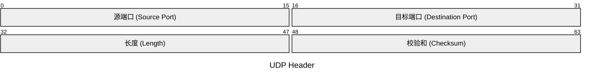
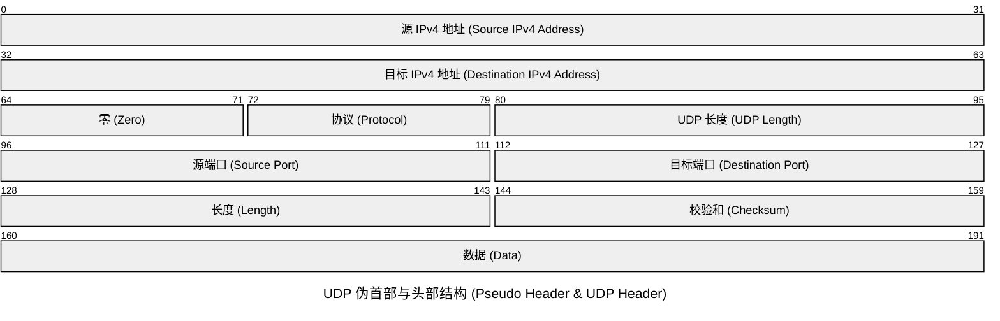

# **UDP协议：**

UDP是基于IP的简单的面向无连接的协议. 提供不可靠传输。

与TCP相比，UDP极为简单。它没有什么win机制，重传机制……,传输数据只会“尽力而为”。我发送了数据，但不保证对方一定能收到，也不保证送达顺序。但是换来的是速度快且省事。

UDP常用在不需要保证数据完整性但需要速度快的场景中，例如打视频电话。

## **UDP数据报**

UDP数据报主要由**用户数据**和**UDP首部**组成，其中UDP首部由**源端口、目的端口、UDP长度和UDP校验**和组成。其中UDP长度的最小值为8，表示只有UDP首部而没有数据部分。

源端口和目的端口，端口号理论上可以有2^16这么多。因为它的长度是16个bit。

**Length**:占用2个字节，标识UDP头的长度，包括首部长度和数据长度。

**Checksum（校验和）**:包含UDP头和数据部分。发送端应该计算检验和。UDP检验和覆盖UDP协议头和数据，这和IP的检验和是不同的，IP协议的检验和只是覆盖IP数据头，并不覆盖所有的数据。UDP和TCP都包含一个伪首部，这是为了计算检验和而设置的。

伪首部甚至还包含IP地址这样的IP协议里面都有的信息，目的是让UDP两次检查数据是否已经正确到达目的地。如果发送端没有打开检验和选项，而接收端计算检验和有差错，那么UDP数据将会被丢掉（不保证送达），而不产生任何差错报文。
