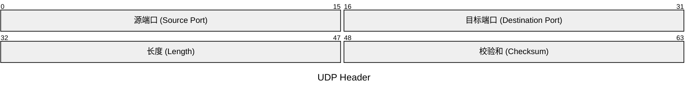
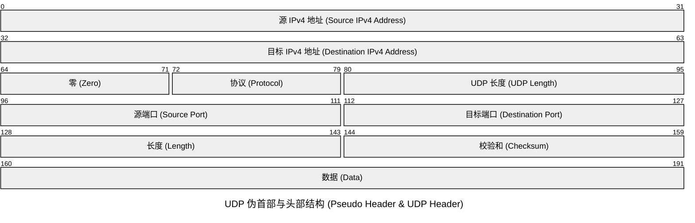

# **UDP协议**

UDP是基于IP的简单的面向无连接的协议，提供不可靠的传输服务。

与TCP相比，UDP极为简单。它没有滑动窗口机制、确认重传机制等，传输数据只会“尽力而为”。它只管发送数据，但不保证对方一定能收到，也不保证送达顺序，但换来的是更快的传输速度和更小的开销。

UDP常用在不需要保证数据绝对完整但需要速度快的实时场景中，例如音视频通话、在线游戏等。

## **UDP数据报**

UDP数据报主要由**用户数据**和**UDP首部**组成，其中UDP首部由**源端口、目的端口、UDP长度和UDP校验和**组成。其中UDP长度的最小值为8字节，表示只有UDP首部而没有数据部分。

```mermaid
packet-beta
title UDP Header
0-15: "源端口 (Source Port)"
16-31: "目标端口 (Destination Port)"
32-47: "长度 (Length)"
48-63: "校验和 (Checksum)"
```

源端口和目的端口号理论上可以有2^16（65536）个，因为其字段长度是16个bit。

**Length**: 占用2个字节，标识UDP数据报的长度，包括首部长度和数据长度。

**Checksum（校验和）**: 覆盖UDP首部和数据部分。发送端负责计算校验和。UDP校验和覆盖了UDP协议头和数据，这和IP首部校验和不同（IP首部校验和只校验IP头部，不校验数据）。UDP和TCP都包含一个虚拟的“伪首部”，这是为了在计算校验和时引入IP层信息而设置的。

```mermaid
packet-beta
title UDP 伪首部与头部结构 (Pseudo Header & UDP Header)
0-31: "源 IPv4 地址 (Source IPv4 Address)"
32-63: "目标 IPv4 地址 (Destination IPv4 Address)"
64-71: "零 (Zero)"
72-79: "协议 (Protocol)"
80-95: "UDP 长度 (UDP Length)"
96-111: "源端口 (Source Port)"
112-127: "目标端口 (Destination Port)"
128-143: "长度 (Length)"
144-159: "校验和 (Checksum)"
160-191: "数据 (Data)"
```

伪首部包含了源IP地址、目的IP地址和协议号等IP协议报头里的信息。目的是让UDP在传输层也能验证数据是否正确到达了目标IP和目标协议。如果发送端未开启校验和，或者接收端计算校验和发现有差错，那么该UDP数据包将会被静默丢弃，且不会产生任何差错报文。
