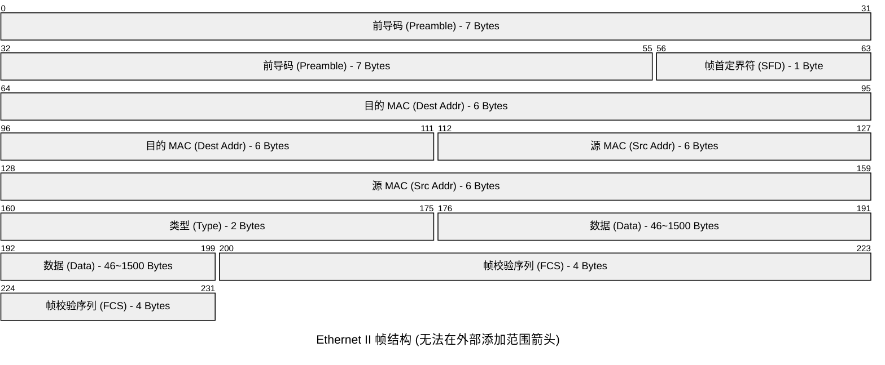
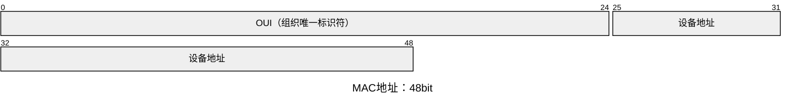

# Ethernet（以太网协议）

以太网是一种局域网技术标准，它工作在二层，定义了在局域网中设备之间如何进行数据通信的物理层和数据链路层规范。我们常说的MAC地址便是以太网协议中的，它是当今世界上应用最广泛、最基础的局域网技术。以太网由IEEE 802.3定义,以太网有两代，Ethernet I和Ethernet II。

## **IEEE 802**

IEEE 802委员会，它的任务是定制OSI中数据链路层和物理层的标准。常听到的802开头的标准都是它定的。百度百科上其他标准有详细的介绍。

[IEEE 802_百度百科 (baidu.com)](https://baike.baidu.com/item/IEEE%20802/6808672#:~:text=IEEE%20802%E5%8F%88%E7%A7%B0%E4%B8%BALMSC%EF%BC%88LAN%20%2FMAN,Standards%20Committee%EF%BC%8C%20%E5%B1%80%E5%9F%9F%E7%BD%91%2F%E5%9F%8E%E5%9F%9F%E7%BD%91%E6%A0%87%E5%87%86%E5%A7%94%E5%91%98%E4%BC%9A%EF%BC%89%EF%BC%8C%E8%87%B4%E5%8A%9B%E4%BA%8E%E7%A0%94%E7%A9%B6%E5%B1%80%E5%9F%9F%E7%BD%91%E5%92%8C%E5%9F%8E%E5%9F%9F%E7%BD%91%E7%9A%84%E7%89%A9%E7%90%86%E5%B1%82%E5%92%8CMAC%E5%B1%82%E4%B8%AD%E5%AE%9A%E4%B9%89%E7%9A%84%E6%9C%8D%E5%8A%A1%E5%92%8C%E5%8D%8F%E8%AE%AE%EF%BC%8C%E5%AF%B9%E5%BA%94OSI%E7%BD%91%E7%BB%9C%E5%8F%82%E8%80%83%E6%A8%A1%E5%9E%8B%E7%9A%84%E6%9C%80%E4%BD%8E%E4%B8%A4%E5%B1%82%EF%BC%88%E5%8D%B3%E7%89%A9%E7%90%86%E5%B1%82%E5%92%8C%E6%95%B0%E6%8D%AE%E9%93%BE%E8%B7%AF%E5%B1%82%EF%BC%89%E3%80%82)

- 谁**用工作组号给标准命令啊？

## **Ethernet I（以太网1代，802.3）**

Ethernet I是第一个公开的以太网标准,于1980年被定义，现在已经几乎不再使用了。唯一能看见Ethernet I的地方也就STP上了。值得注意的是Ethernet I的电气规范与Ethernet II不完全一致，两者是不兼容的。

## **Ethernet Ⅱ（以太网2代）**

### **以太网分类**

| DIX以太网 | 10Mbit/s以太网 | 使用CSMA/CD |
| --- | --- | --- |
| IEEE 802.3 |  |  |
| IEEE 802.3u | 100Mbit/s以太网 | 可以选择使用CSMA/CD |
| IEEE 802.3z | 1Gbit/s以太网 |  |
| IEEE 802.3ae | 10 Gbit/s以太网 | 不使用CSMA/CD |
| IEEE 802.3ba | 40/100 Gbit/s以太网 |  |

## **CSMA/CD（载波侦听多路访问／冲突检测）**

MA(多址接入)

多个站点连接在一条总线上，竞争使用总线。

### **CS(载波监听)**

每一个站点发送帧之前先要检查一下总线是是否有其他站点在发送帧（先听后说）。

若检查测到总线空闲96比特时间，则发送这个帧。

若检测到总线忙，则继续检测并等待总线转为空闲96比特时间，然后发送这个帧。

### **CD(碰撞检测）**

每个正在发送帧的站边边发送边检测碰撞（边说边听）

一旦发现总线上出现碰撞，则立即停止发送（一旦冲突，立即停说，等待时机，重新再说）。

## **以太网数据帧**

- **前导码(Preamble)**

这不是帧的内容，用于物理层同步，每8个字节一个周期，发送方每发送一个字节，就发送一个周期的前导码。

- **帧首定界符(SFD)**

10101011。告诉接收方，后面是真正的帧内容。

- **MAC地址**

代表一个网络接口的物理地址，全球唯一，MAC由两部分组成，前24Bit为厂商地址OUI（组织唯一标识符），由IEEE分配。后24Bit为设备地址，由厂商分配序列号。

MAC地址是焊死在主板是上的，正确手段是无法更改MAC地址的。

数据链路层基于MAC进行帧的传输，当主机接收到的数据帧所包含的目标MAC地址是自己时，会把以太网封装剥掉后送往上层协议。

- **协议类型(Type)**

代表上层的协议，0x0800为IPv4，0x86DD为IPv6，0x0806为ARP……

- **数据(Data)**

46 ~ 1500 字节。

- **帧校验对(RFC)**

通过一定的计算公式对数据包进行计算，如果接收方计算(更具接收帧内容进行计算的FCS与发送方FCS（包中）不一样，则视该帧无效并丢弃，

- **物理寻址**

在网络层上看数据的传输是从源IP发送到目标IP的过程，但实际上会经过多个物理接口的传输，这些物理接口都有一个物理地址，即MAC地址，接口通过MAC地址进行转发数据。即物理寻址。

>三层负责虚拟寻址，二层负责物理寻址。
