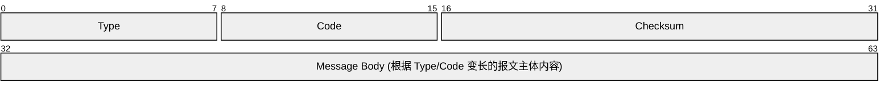
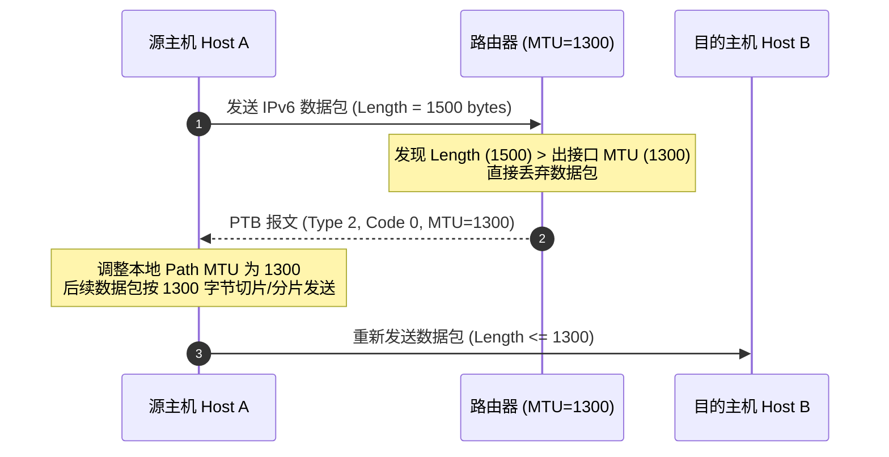
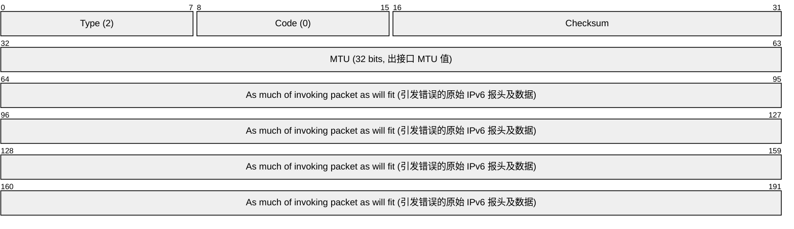
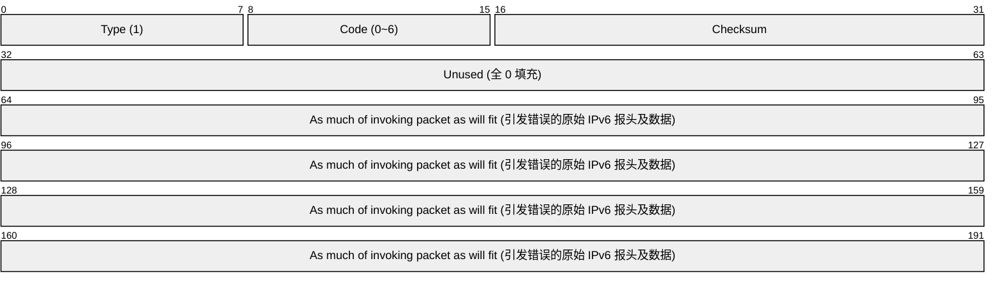
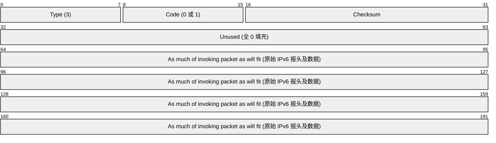
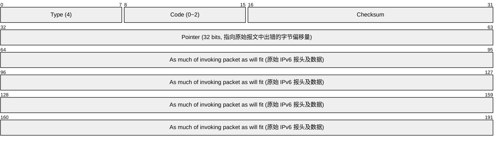
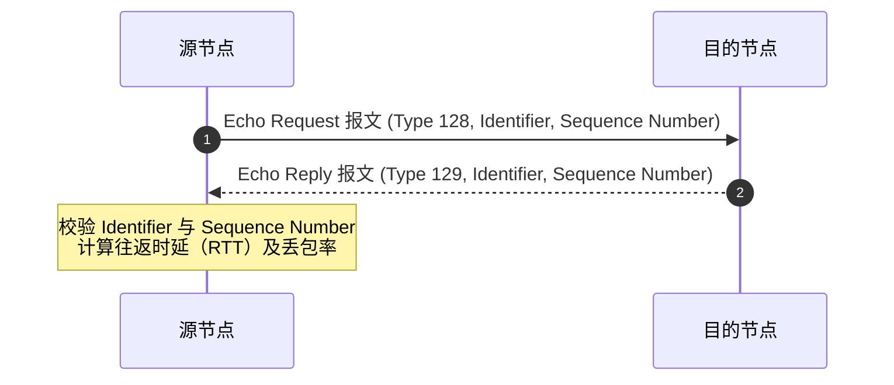
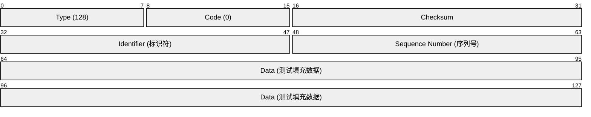
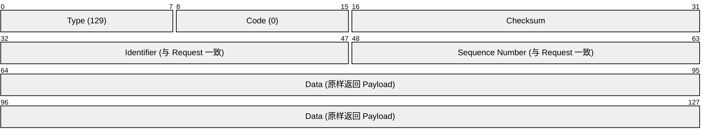
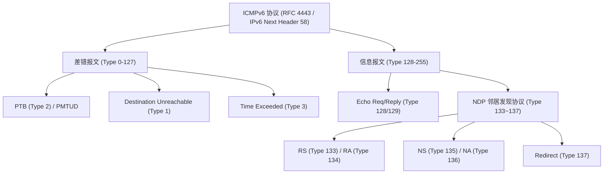

# ICMPv6

## ICMPv6（互联网控制报文协议 Version 6）
ICMPv6 是 IPv6 协议簇中的**基础性支撑协议**，定义于 RFC 4443。在 IPv6 中，ICMPv6 的 Next Header（下一报头）数值固定为 **58**。

相较于 IPv4 中的 ICMP，ICMPv6 承担了更为关键且广泛的职责。它不仅涵盖原 IPv4 ICMP 的网络差错报告与链路诊断功能，还作为 **NDP（邻居发现协议）** 与 **MLD（组播听众发现协议）** 的底层传输载体。

### ICMPv6 的核心功能分类
ICMPv6 报文根据功能主要划分为两大类：
- **差错报文（Error Messages）**：Type 类型值范围为 **0 ~ 127**。用于报告数据包在传输或处理过程中遇到的异常情况（如目标不可达、数据包过大、超时、参数错误等）。
- **信息报文（Informational Messages）**：Type 类型值范围为 **128 ~ 255**。用于网络诊断（如 Ping 工具对应的 Echo Request / Echo Reply）以及控制与管理功能（如 NDP 邻居交互、MLD 组播管理等）。

> **ICMPv6 报文校验和计算（Pseudo-Header）**
> 
> 在 IPv6 中，ICMPv6 校验和是**强制性**计算的。计算校验和时，必须引入 IPv6 伪头部（IPv6 Pseudo-Header，包含源 IPv6 地址、目的 IPv6 地址、ICMPv6 报文长度及 Next Header=58 字段），以确保 IP 头部与 ICMPv6 载荷的全局完整性。

### ICMPv6 通用头部格式

所有 ICMPv6 报文均封装在 IPv6 报头之后（Next Header = 58），并拥有统一的前 4 字节基础头部结构：

  - **Type (8 bits)**：标识 ICMPv6 消息的具体类型（0~127 为差错报文，128~255 为信息报文）。
  - **Code (8 bits)**：进一步区分同一种 Type 下的细分子类型或具体原因。
  - **Checksum (16 bits)**：校验和，覆盖包含 IPv6 伪头部在内的完整 ICMPv6 数据包。
  - **Message Body (变长)**：报文主体，具体格式取决于 Type 和 Code 的取值。

### ICMPv6 常见消息类型

ICMPv6 定义的常用消息类型如下表所示：

| 报文大类 | 报文名称 | 英文名称 | 英文缩写 | Type 类型值 | Code 子类型值 | 核心功能说明 |
| :--- | :--- | :--- | :--- | :---: | :---: | :--- |
| **差错报文** | **目标不可达** | Destination Unreachable | - | 1 | 0 ~ 6 | 路由不可达、拒绝访问或端口不可达 |
| (0 ~ 127) | **数据包过大** | Packet Too Big | PTB | 2 | 0 | 路径 MTU 发现（PMTUD）的关键支撑 |
| | **超时** | Time Exceeded | - | 3 | 0, 1 | Hop Limit 减至 0（Traceroute）或分片重组超时 |
| | **参数问题** | Parameter Problem | - | 4 | 0 ~ 2 | IPv6 报头字段错误或未知 Option 类型 |
| **信息报文** | **回显请求** | Echo Request | - | 128 | 0 | 网络连通性诊断请求（Ping 发送） |
| (128 ~ 255) | **回显应答** | Echo Reply | - | 129 | 0 | 网络连通性诊断响应（Ping 回复） |
| | **路由器请求** | Router Solicitation | RS | 133 | 0 | **NDP 报文**：主机主动请求路由器发送 RA 报文 |
| | **路由器通告** | Router Advertisement | RA | 134 | 0 | **NDP 报文**：路由器通告前缀、网关及 SLAAC 参数 |
| | **邻居请求** | Neighbor Solicitation | NS | 135 | 0 | **NDP 报文**：请求目标 MAC 地址或执行 DAD |
| | **邻居通告** | Neighbor Advertisement | NA | 136 | 0 | **NDP 报文**：响应 NS，回复 MAC 地址 |
| | **重定向** | Redirect | Redirect | 137 | 0 | **NDP 报文**：路由器通知更优的下一跳 |

### 差错报文（Error Messages）机制

ICMPv6 差错报文在数据包转发遇到异常时由路由器或目的节点自动生成。为了便于源主机定位故障，**所有的 ICMPv6 差错报文主体中均会截取引发该错误的原始 IPv6 数据包报头及部分载荷**。

> **ICMPv6 差错报文发送限制规则（防环与防风暴）**
> 
> 为避免网络中产生广播风暴或死循环，在以下情况下**严禁**发送 ICMPv6 差错报文：
> 1. 针对 ICMPv6 差错报文本身（防止递归生成差错报文）。
> 2. 目的地址为 IPv6 组播地址（仅 PTB 报文在特定例外下允许）或链路层广播地址。
> 3. 源地址为未指定地址 `::` 的数据包。

#### 1. 数据包过大（Packet Too Big, PTB）与 PMTUD 机制

IPv6 中中间路由器**不再对数据包进行分片**（分片仅能由源节点完成）。当路由器发现待转发数据包的长度大于出接口 MTU 时，会直接丢弃该数据包，并向源节点返回 Type 2 的 PTB 报文，其中明确告知出接口的 **MTU 值**。源主机据此实现 **PMTUD（Path MTU Discovery，路径 MTU 发现）**。

- **PTB 报文结构（Packet Too Big, Type 2）**

  - **Type (8 bits)**：固定为 `2`，标识数据包过大差错报文。
  - **Code (8 bits)**：固定为 `0`。
  - **Checksum (16 bits)**：ICMPv6 校验和。
  - **MTU (32 bits)**：出接口允许通过的最大传送单元（MTU）。
  - **Invoking Packet Content**：尽可能多地截取引发该错误的原始 IPv6 数据包内容。

#### 2. 目标不可达报文（Destination Unreachable, Type 1）

数据包无法送达目的地时由路由器或目的节点生成。根据 Code 值的不同指示具体原因：

- **常见 Code 取值**：
  - `Code 0`：**No route to destination**（无匹配路由）。
  - `Code 1`：**Communication with destination administratively prohibited**（ACL 或防火墙管理性过滤丢弃）。
  - `Code 3`：**Address unreachable**（地址不可达，如邻居解析失败）。
  - `Code 4`：**Port unreachable**（端口不可达，目的主机上对应的 UDP/TCP 端口未监听）。

- **目标不可达报文结构（Type 1）**

#### 3. 超时报文（Time Exceeded, Type 3）

用于防止数据包在环路中无限循环或检测重组超时：
- `Code 0`：**Hop Limit Exceeded in Transit**（传输过程中跳数限制减至 0）。路由器转发数据包时将 IPv6 报头的 Hop Limit 减 1，若减至 0 则丢弃数据包并回复 `Type 3, Code 0`（此机制是 IPv6 `traceroute` 工具实现的基础）。
- `Code 1`：**Fragment Reassembly Time Exceeded**（分片重组超时）。目的主机在规定时间内未集齐所有分片报文。

- **超时报文结构（Type 3）**

#### 4. 参数问题报文（Parameter Problem, Type 4）

当 IPv6 报头或扩展报头存在语法/格式错误，导致接收方无法正常解析时触发：
- `Code 0`：**Erroneous header field encountered**（遇到错误的报头字段）。
- `Code 1`：**Unrecognized Next Header type encountered**（遇到无法识别的下一报头类型）。
- `Code 2`：**Unrecognized IPv6 option encountered**（遇到无法识别的 IPv6 扩展选项）。

- **参数问题报文结构（Type 4）**

  - **Pointer (32 bits)**：给出发生错误处的具体字节位置（Offset），便于定位异常字段。

### 信息报文（Informational Messages）机制

信息报文主要用于双向交互与网络诊断。最典型的应用即为 Ping 工具所依赖的 **Echo Request / Echo Reply** 报文。

#### Ping（诊断连通性）工作机制

1. **发送 Echo Request**：源节点向目标地址发送 Type 128 报文，携带唯一的标识符（Identifier）和递增的序列号（Sequence Number），并在 Payload 中填充测试数据。
2. **回复 Echo Reply**：目的节点收到后，将数据原样返回，仅将 Type 字段更改为 129（Echo Reply）。
3. **计算 RTT**：源节点接收应答报文，匹配 Identifier 和 Sequence Number，计算连通性与时延。

#### Ping 相关报文结构

- **Echo Request 报文结构（Type 128）**

- **Echo Reply 报文结构（Type 129）**

  - **Identifier (16 bits)**：标识发起 Ping 进程的会话 ID。
  - **Sequence Number (16 bits)**：用于区分连续发送的多个 Ping 测量数据包。

### ICMPv6 与 NDP 的关系

在全面理解了 ICMPv6 报文结构及其两大分类后，便可顺利过渡到 IPv6 网络层最重要的核心支撑协议——**NDP（邻居发现协议）** 的学习。

NDP 协议**完全基于 ICMPv6 信息报文进行扩展与实现**。通过定义 ICMPv6 Type `133` ~ `137` 5 种特定的消息类型，NDP 承载了 IPv6 中最关键的局域网控制功能：
1. **地址解析**：利用 **NS（Type 135）** 与 **NA（Type 136）** 报文组合取代 IPv4 ARP。
2. **路由发现与 SLAAC**：利用 **RS（Type 133）** 与 **RA（Type 134）** 报文实现路由器定位、网络前缀通告以及无状态地址自动配置。
3. **地址冲突与检测**：利用 **NS/NA** 报文实现 **DAD（重复地址检测）** 与 **NUD（邻居不可达检测）**。
4. **重定向**：利用 **Redirect（Type 137）** 报文引导节点选择最优下一跳。

> **下一阶段学习指引**  
> ICMPv6 提供了报文格式与传输框架，而 NDP 则在 ICMPv6 的基础上实现了复杂的邻居发现与地址管理机制。关于 Type 133~137 报文的详细选项、交互流程、SLAAC 及 DAD/NUD 的完整实现细节，请深入学习下一章节：[NDP（邻居发现协议）](file:///home/qyc/Notes/hikari_Notes/Datacom/%E7%90%86%E8%AE%BA/TCP_IP/3.%E7%BD%91%E7%BB%9C%E5%B1%82/NDP.md)。
