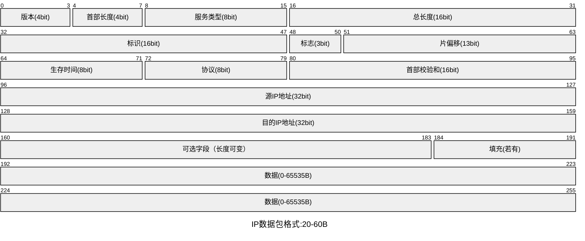
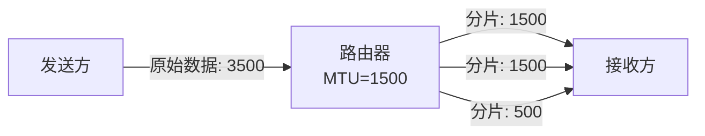
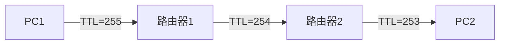

# **Ipv4（互联网协议第四代）**

IPv4地址的类型等已在HCIA基础路由知识中阐述过了，在这便不写了。

## **IPv4数据包**

### **版本**

IP协议的版本，版本必须一致，常用版本v4，v6。

### **首部长度**

标识IP报头的长度，单位是32位字（4字节）。这个字段的最小值是5（即5x4=20字节）（0101），最大值是15（即15x4=60字节）（1111）。

### **服务类型**

用于指示数据包的服务质量。这包括优先级（Precedence）和服务类型（如延迟、吞吐量、可靠性等）。这个字段在IPv4中被称为"服务类型"字段，但在现代网络中，它常被称为"流量类（Traffic Class）"字段，包含不同的优先级和性能需求

### **总长度**

整个IP数据包的长度，包括头部，以字节为单位。

最大长度为65535（216-1），最小长度为20，即仅头部。

### **标识**

用于唯一标识一个数据包的片段组。当一个IP数据包因为太大而需要分片时，所有分片都具有相同的标识号。当主机收到数据包时可以更具数据包的标识来重新合成分片后的数据包。

### **标志**

控制分片过程：

第0位：保留，必须为0。

第1位 (DF - Don't Fragment)：为1表示不允许分片，为0表示允许分片。

第2位 (MF - More Fragments)：为1表示后面还有分片，为0表示这是最后一个分片（或未分片）。

### **片偏移**

当数据包被分片时，此字段指示当前分片在原始数据包中的位置（相对于原始数据包数据部分的起始位置），单位是8字节。

### **首部校验和**

用于校验IP头部的完整性，以检测在传输过程中头部是否发生错误。只校验头部，不校验数据负载。每经过一个路由器，由于TTL等字段会改变，校验和需要重新计算。

### **其他**

选项**（Options (if IHL > 5)）**

### **可变长度**

可选字段，用于提供额外的控制功能，如记录路由、时间戳、安全限制等。如果存在，头部长度会增加。选项字段的长度必须是32位的整数倍，不足时通过填充（Padding）补齐。

### **填充（Padding）**

可变长度

如果选项字段存在且其长度不是32位的整数倍，则需要填充0以确保整个IP头部长度是32位的整数倍。

---

### **IP分片**

IP分片即把一个大的数据包分割成许多个小的数据包。这一个分割数码包就叫做一个分片。

### *MTU（最大传输单元）**

MTU定义了**网络层数据单元**在数据链路层传输时所能达到的**最大长度**。数据包大小超过了MTU值，那么在网络层就需要对其进行**分片**处理。MTU的最大值，包括IP头部的长度。

### **为什么需要ip分片**

如果不进行IP分片，IP数据报的最大长度可能远大于某些物理网络的MTU，通过分片，可以将较大的数据包拆分成多个较小的数据包，这些较小的数据包可以更容易地适应不同的网络环境和传输条件。

### **TTL（生存时间）**

防止IP数据包在网络内无休止地传输（环路）

每经过你一次路由TTL会减1

当TTL为0时丢弃数据包。并回复源IP，TTL 传输中过期。

利用这一特性，可以实现路由跟踪技术，排错的重要方法之一。

相关命令：

Ping -i

tracert -d

TTL传输过期回显。

---

### **SIP与DIP**

SIP即源IP地址，是发送该数据包的主机的IPv4地址。

DIP即目标IP地址，是接收该数据包的主机的IPv4地址。

---

### **Protocol（协议号）**

指示IP数据包的数据负载部分所使用的上层协议类型。类似TCP/IP的端口号，但不是用与为上层提供端口的，主要是用于区分协议，例如，TCP的值为6，UDP的值为17，ICMP的值为1。（天字一号）

---

### **其他（待写）**

- **分类与标记**

在网络入口处，网络设备根据数据包的内容或头部信息对数据包进行分类，并为其打上相应的标记（DS字段或DSCP值）。这些标记用于后续的网络节点对数据包进行不同的处理。

- **每跳行为（PHB）**

在网络内部节点上，根据数据包的标记（DSCP值）将其映射到相应的PHB上。PHB定义了数据包在节点上的转发行为，如优先级、队列管理策略等。

- **流量调节**

在网络边界处，还可以对流量进行调节，如整形、限速等，以确保网络资源的合理利用和避免拥塞。
