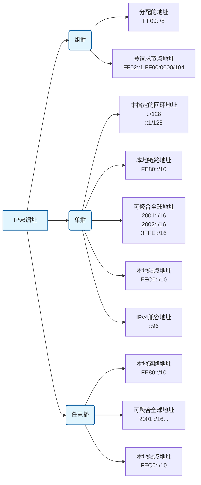
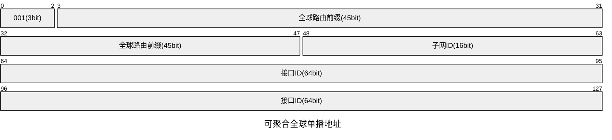
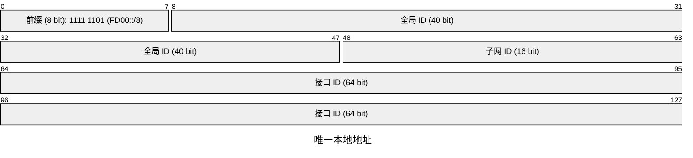
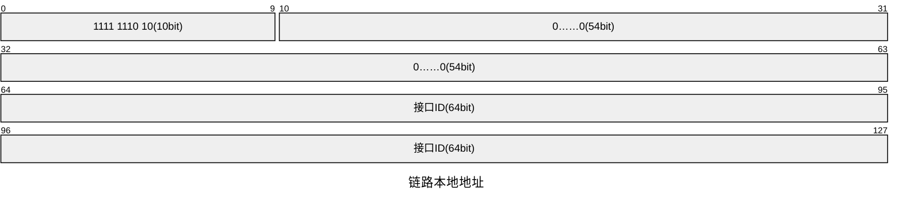
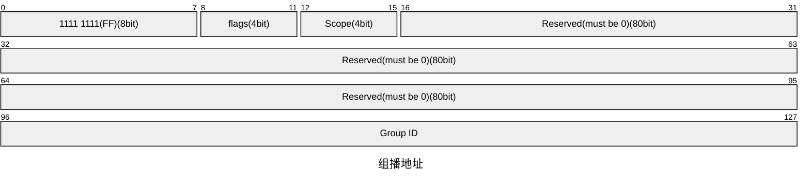
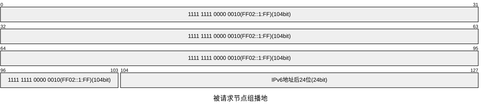
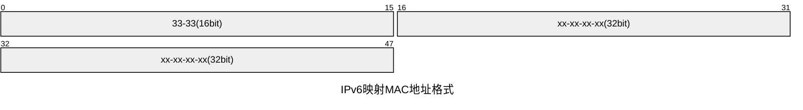

# **IPv6（互联网协议第6版）**

- 地址空间巨大
- 精简报文结构，提高效率
- 实现自动配置和重新编地址
- 支持层次化网络编址
- 支持端到端的安全
- 移动性高支持
- 更好的Qos

---

## **IPv6地址**

- ---“IPv6可以为每一粒沙子分配一个地址”。

IPv6地址总长度为128比特，分为8组，每组4个十六进制数的形式，每组十六进制数之间用冒号分隔。

列如：FC00:0000:130F:0000:0000:09C0:876A:130B


### **IPv6地址压缩**

可以把每组前导的“0”都省略掉。

例如：

FC00:`0000`:130F:`0000`:`0000`:09C0:876A:130B

↓压缩↓

FC00:`0`:130F:`0`:`0`:9C0:876A:130B

地址中出现连续两个及以上都为0的组，可以用双冒号“::”表示，进行二次简化，在一个IPv6地址中只能出现一次双冒号“::“，否则计算机将压缩后地址变为128位地址时将无法识别每个“::”代表几个0。

例如：

FC00:0:130F`:0:0:`9C0:876A:130B

↓压缩↓

FC00:0:130F`::`9C0:876A:130B

---

### **地址结构**

IPv6地址由网络前缀和接口标识两个部分组成。

网络前缀：

相当于IPv4的网络位，代表IP所属的网段。

接口标识：

相当于IPv4的主机位，代表网段上某个节点。

由子网掩码决定分界点，IPv6的掩码使用“/掩码长度“表示。

例如1001::1/64

---

### **IPv6地址的生成**

IPv6地址可以静态设定，DHCP设定。同时也可以随机生成。

---

### **eui64规范**

在IPV6中，无状态自动配置机制使用EUI-64格式来自动配置IPV6地址，由于以太网MAC地址全球唯一，eui根据设备的MAC地址来生成IPv6的ip，以保证地址的唯一性。

以太网的MAC地址为48位，而基于EUI-64 的地址是64位，所以需要在MAC的48位上添加字符到达64位。

因为以太网MAC地址中第7位为1代表本地管理为0代表全球管理，在IPv6地址中的第7位为1代表全球管理，为0代表本地管理。关于全局与本地的含义（用于公网还是用于私网）相反，所以要将第七位反转，详见rfc5342文档。


---

## **IPv6地址类型**



### **单播地址**

- **可聚合全球单播地址(Global Unicast Address ，GUA)**

类似于IPv4的公网地址，定义用于IPv6 Internet，全球唯一，全局可路由。全球单播地址由前缀，子网ID和接口标识组成。



- **全球路由前缀 (Global Routing Prefix)**

目前IANA分配的地址前缀为2000::/3，即地址以二进制001开头。

- **子网ID (Subnet ID)**

组织机构可以用自己的子网ID来构建自己的本地网络，与IPv4的子网号作用相似，子网ID最多分配64bit。

- **接口ID (Interface ID)**

标**识特定子网上的一个网络接口，类似IPv4的主机位地址。长度固定64bit。随机生成 (RFC 4941)，随机生成 (RFC 4941)。**

- **唯一本地地址（Unique Local Address** **Unique Local Address,ULA）**

类于IPv4的私网地址，不会在Internet上路由,出现在Internet上也不会被路由。

前缀：目前ULA前缀为FC00::/7，但实际使用前缀为FD00::/8，FC00::/8目前暂未定义

FD00::/8定义：



- **链路本地地址(Link-Local Address, LLA)**

LLA仅为同一物理链路设备有效，路由器不会将源或目的地址是 LLA 的数据包转发到其他链路，可以理解为TTL为1的IPv4地址。

LLA一般会自动配置生成。 每个启用了 IPv6 的网络接口都必须自动配置至少一个链路本地地址。这是 IPv6 协议栈实现的要求。

链路本地地址前缀为FE80::/10，即开头为1111 1110 10。



### **单播的特殊地址**

- **未指定地址**

::/128

与IPv4的0.0.0.0默认地址作用相同。用于默认路由，DHCPv6请求地址，特殊报文源地址（如重复地址检测）等

- **环回地址**

::1/128

与IPv4的环回地址作用相同，用于本地回环，可用于测试等。

- **IPv4兼容地址**

<IPv6地址>+<IPv4地址>

在IPv6过度时期使用，IPv6使用十六进制，IPv4使用十进制。现已很少使用。

---

### **组播地址**

地址范围为FF00::/8，即2进制前8位为1，16进制FF开头的地址。



- **flags（标志）**

由 |O|R|P|T| 四位组成

O

保留位，此位必须设置为0。

R

该位表示组播地址中是否嵌入了汇聚点（RP）的地址信息。与PIM相关。

0 = 否

1 = 是

P

该位表示组播地址是否基于单播地址前缀来构建，这允许网络根据其拥有的单播地址空间自动创建组播组，简化了组播地址的管理，P=1，T就需要=1

0 = 否

1 = 是

该为表示是否为永久分配地址还是临时动态地址。永久分配地址由IANA统一分配，用于特定的网络协议或服务。临时动态地址由应用程序或会话根据需要动态创建，用于一次特定的组播会话，地址可以被回收和重用。

0 = 永久分配地址

1 = 临时动态地址

- **scope（范围）**

scope可以控制组播范围

| 值 (Hex) | 值 (Dec) | 名称 | 描述和用途 |
| --- | --- | --- | --- |
| 0x0 | 0 | Reserved | 保留值，未使用。 |
| 0x1 | 1 | Interface-Local Scope | **接口本地范围**。组播流量仅限于单个网络接口，永远不会离开发送该报文的节点。主要用于节点内部的环回通信和诊断。 |
| 0x2 | 2 | Link-Local Scope | **链路本地范围**。这是**最常用**的范围。组播流量被限制在发送节点所连接的单个物理或逻辑链路上（例如一个以太网段），路由器绝不会将此范围的报文转发到其他链路。**邻居发现协议（NDP）**就工作在此范围。 |
| 0x3 | 3 | Reserved | 保留值，未使用。 |
| 0x4 | 4 | **Admin-Local Scope** | **管理本地范围**。这是必须由网络管理员手动配置的最小范围，其边界由管理员定义，通常用于将组播流量限制在一个特定的管理区域内。 |
| 0x5 | 5 | Site-Local Scope | **站点本地范围**。组播流量可以被路由器转发，但仅限于一个独立的“站点”或“园区”网络（例如一个大学校园或一个公司总部）。此范围的报文不应被转发到公共互联网。 |
| 0x8 | 8 | Organization-Local Scope | 组织本地范围。允许组播流量在属于同一组织的多个站点之间转发。例如，一个跨国公司可能使用此范围在其全球不同分部的私有广域网上传播组播数据。 |
| 0xE | 14 | Global Scope | **全球范围**。这是最大的范围，理论上组播流量可以被转发到整个公共IPv6互联网。适用于互联网范围的流媒体、内容分发等。 |
| 0xF | 15 | Reserved | 保留值，未使用。 |

- **Group ID(组ID)**

在指定的范围内唯一标识一个组播组。同一组ID设备为同有组播组。

- **被请求节点组播地址**

主要用于**邻居发现协议 (NDP)**，以替代 IPv4 中的ARP。在IPv4中，请求IP相对应的地址需要进行ARP泛洪，这就会造成其他设备也会收到ARP的数据包，这不仅会占用链路带宽，而且设备必须解封装来查看是否是自己的IP，也会增加设备的性能开销。使用组播便可以消除或减少这些弊端。

- **格式**

被请求节点组播地址前缀104位固定为FF02::1:FF，后缀由IPv6的最后24位组成。FF02即代表这个是链路本地地址，不会传播到其他网络中。



例如IPv6地址为2408:845D::1AAD:B971，后24位为AD:B971，那么对应的被请求组播地址为FF02::1:FFAD:B971。

- **工作原理**

1. 当在一个设备上配置IPv6单播地址后，会根据单播地址计算出相应的组播地址并监听。
2. 当设备A（...:1122:3344）想知道设备B（...:1234:5678）的MAC时，会先计算出设备B的组播地址FF02::1:FF34:5678，
3. 然后设备A会向组播地址发送邻居请求（NS）消息。
4. 由于网络中的交换机可能已经通过多播侦听（MLD Snooping）知道哪个物理端口连接了监听 ff02::1:ff34:5678 的设备（最后24bit为34:5678的设备网络中可能不只有一个），因此只向少数几个或一个端口发送。
5. 设备B收到NS消息后会以单播的形式向设备A回复令居通告（NA）消息，其中包含了设备B的MAC地址。

感觉写得好人机。

- **知名组播地址**

知名组播地址，是给知名的网络协议使用的组播地址或特殊用途的组播地址由，RFC-4291定义。

所有节点地址：FF01:0:0:0:0:0:0:1 FF02:0:0:0:0:0:0:1

所有路由器地址：FF01:0:0:0:0:0:0:2 FF02:0:0:0:0:0:0:2 FF05:0:0:0:0:0:0:2

请求节点地址：FF02:0:0:0:0:1:FFXX:XXXX

- **IPv6组播地址与MAC地址的映射。**

组播IPv6报文的目的IP地址是组播IPv6地址，而目的MAC地址则必须是组播MAC

地址，并且该地址必须与组播IPv6地址对应。

IPv6映射MAC地址格式

Pv6组播地址的最后32位直接映射到以太网MAC地址的最后32位，前面加上固定前缀33-33。



例如IPv6地址为FF02::1:FFAD:B971，后24bit为FFAD:B971，那么组播MAC为33-33-FF-AD-B9-71。

### **任意播地址(Anycast Address)**

任意播地址是IPv6特有的地址类型，任意播地址是没有独立的地址范围的，任意播地址是配置给多个设备接口的地址，当数据包发送到任意播地址时，它会被路由到"最近"的接口，这里的"最近"是根据路由协议的度量标准来确定的。

任意播地址的主要优势在于提供服务的**高可用性**和**负载均衡**。

## **IPv6的编址(待补全)**

## **IPv6数据包**

IPv6基本头


- Version(版本)

IP协议的版本，4=IPv4，6=IPv6.

- Traffic class(流量类型)

类似于IPv4中的服务类型(ToS)，用于标识数据包的优先级和服务质量需求。比如视频通话数据包可能需要更高的优先级。

- Flow Label(流标签)

用来标识这个数据包属于哪个流。可以用于ACL等技术。

- Payload length（有效载荷长度）

类似IPv4的MTU，指在IPv6基本包头后面的数据长度，最大值为65535字节。

- Next header（下一报头）

下一报头，该字段指明了跟随在IPv6基本报头后的扩展报头的信息类型，例如TCP，UDP，ICMPv6……

- Hop limit（跃点限制）

类似IPv4的TTL，每当数据包经过一个路由器，这个值就减1，防止数据包在网络中无限循环。

## IPv6扩展头（Extension Headers）

IPv6取消了 IPv4 报头中变长的“Options”字段。使用扩展头以减少数据包非必要数据的传输，不仅提高了路由器处理数据包的效率，还为后续的协议扩展留出了空间。

- Next Header(下一个报头)

``Next Header``类似IPv4的``Protocol``字段。``Next Header``数据可以组成一种链式结构。每一个数据包的``Next Header``字段会指向下一个数据包,最后一个数据包会指向上层协议。

IPv6 基本报头中有一个 ``Next Header`` 字段，指向第一个扩展头。

第一个扩展头中也有 ``Next Header`` 字段，指向第二个扩展头（或上层协议，如 TCP/UDP）。

直到最后一个 ``Next Header`` 指向上层协议（Payload）。

```txet
[ IPv6 基本报头 (Next Header = 43 Routing) ]
   |
   +---[ 路由扩展头 (Next Header = 44 Fragment) ]
        |
        +---[ 分片扩展头 (Next Header = 50 ESP) ]
            |
            +---[ ESP 报头 (Next Header = 6 TCP) ]
                    |
                    +---[ TCP 报头 ]
                            |
                            ( 传输层数据载荷... )
                            ( 链条结束 )---->IPv6 扩展头(NH=44)
```

常见的扩展报头

| 协议号 | 扩展报头名称 | 英文名称 | 谁处理？ | 作用简述 |
| :---: | :--- | :--- | :--- | :--- |
| **0** | **逐跳选项** | Hop-by-Hop Options | **路径上所有路由器** | 用于巨型帧(Jumbograms)或路由器报警(RSVP/MLD)。这是唯一一个途中路由器必须处理的头。 |
| **43** | **路由** | Routing | 指定的中间节点 | 强制数据包经过特定节点（源路由）。SRv6 (Segment Routing) 就是基于此头实现的。 |
| **44** | **分片** | Fragment | 目的节点 | IPv6 路由器不分片，只由源端分片。此头包含分片偏移量和 ID。 |
| **50** | **封装安全载荷** | ESP | 目的节点 | IPSec 的一部分，提供加密和隐私。 |
| **51** | **认证** | AH | 目的节点 | IPSec 的一部分，提供源认证和完整性校验。 |
| **60** | **目的选项** | Destination Options | 目的节点 | 仅携带给最终目的节点的信息（移动 IPv6常用）。 |

## IPv6与IPSec

IPv6 原生便支持 IPsec，在IPv6中IPsec通过**扩展头**的方式存在。
    - AH的``Next Header``值为 51.
    - ESP的``Next Header``值为 50.

这使得在IPv6中IPsec中的使用地更加的

在早期的RFC 2460标准中明确规定：凡是实现 IPv6 协议栈的设备，必须支持（MUST）IPsec。
后来的RFC版本中，为了适应低功耗物联网设备等原因，要求被更改为了应该（SHOULD）支持IPsec，可以理解为强制性改为了推荐性吧。

## IPv6的移动性支持

IPv6相较于IPv4，对移动端的支持有着大幅度的提升。IPv6原生集成了移动IP功能。而不是像IPv4一样，是一种扩展功能。（IPsec也是IPv4的扩展功能）

### 双地址解耦 (HoA 与 CoA)

IPv6 引入了双地址解耦的概念，当移动设备在不同网络间切换时，它拥有两个 IP 地址，分别为家乡地址，和转交地址。

- 家乡地址(HoA)

家乡地址是不变的，这个地址用于确认设备身份，上层协议只认这个地址，从而保证连接不中断。

- 转交地址(CoA)

转交地址是临时的。当移动到新网络时，它会获得一个临时的转交地址来标识当前位置。通过在家乡代理上绑定这两种地址，发往家乡地址的数据就能被透明地路由到转交地址，从而实现连接不中断。

RFC -3775

参考：

[RFC 7346：IPv6 多播地址范围](https://www.rfc-editor.org/rfc/rfc7346.html)

[RFC 4291：IP 版本 6 寻址体系结构](https://www.rfc-editor.org/rfc/rfc4291.html#section-2.6)

[IPv6报文格式 - IP 报文格式大全 - 华为](https://support.huawei.com/enterprise/zh/doc/EDOC1100174722/bba11cdd)

[IPv6组播技术白皮书-6W100-新华三集团-H3C](https://www.h3c.com/cn/Service/Document_Software/Document_Center/Home/Switches/00-Public/Learn_Technologies/White_Paper/IPv6_ZBJS_WP-6W100/#_Toc24988446)

[IPv6笔记-地址结构与分类 - fengf233 - 博客园](https://www.cnblogs.com/fengf233/p/10906444.html)

[IPv6的被请求节点的组播地址_被请求节点组播地址-CSDN博客](https://blog.csdn.net/bailyzheng/article/details/39609209)

[IPv6实验NDP地址解析和DAD_ipv6 nd na-parse-CSDN博客](https://blog.csdn.net/qq_38472635/article/details/107444474)
