# NDP

## NDP（邻居发现协议）
NDP 为 IPv 6 的**基础性支撑协议**，定义于 RFC 4861。NDP 在 IPv 6 中的替代了在 IPv 4 中的 ARP,DHCP,ICMP 的功能，也就是有着**地址解析、路由发现、自动配置、重定向**的功能。

### 关于功能的实现
- **地址解析（Address Resolution）**：取代 IPv4 ARP。节点通过发送 NS（邻居请求）报文请求目标 IP 地址对应的 MAC 地址，目标节点以 NA（邻居通告）报文进行响应。结合被请求节点组播地址（Solicited-Node Multicast Address），极大减少了广播风暴。
- **路由发现与前缀发现（Router Discovery & Prefix Discovery）**：取代 IPv4 ICMP 路由发现。节点通过 RS（路由器请求）和 RA（路由器通告）报文定位链路上的路由器，获取默认网关及网络前缀信息。
- **重定向（Redirect）**：当路由器发现数据包的最佳下一跳并非自己时，向源节点发送重定向报文，通知其将后续数据包直接发送给更优的下一跳路由器或目标节点。
- **无状态地址自动配置（SLAAC）**：节点利用 RA 报文携带的前缀信息与本地接口标识符（Interface ID）自动组合生成全局单播地址（GUA）。

> 下面是详细的实现机制

### NDP 的 ICMPv 6 报文

NDP 协议完全基于 ICMPv 6 报文实现。所有 NDP 报文均封装在 ICMPv 6 头部之后：

##### 通用 ICMPv 6 头部格式
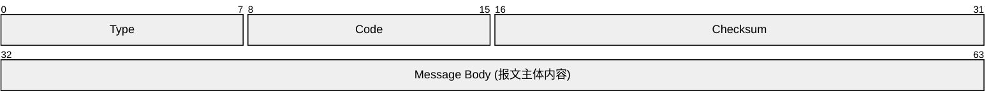
  - **Type (8 bits)**：ICMPv 6 消息类型。NDP 报文取值为 133（RS）、134（RA）、135（NS）、136（NA）、137（Redirect）。
  - **Code (8 bits)**：子类型标识，NDP 报文全固定为 `0`。
  - **Checksum (16 bits)**：校验和，覆盖包含 IPv 6 伪头部在内的完整 ICMPv 6 数据包。
### NDP 消息类型
NDP 定义了 5 种 ICMPv 6 消息类型：

| 报文名称      | 英文                     | 英文缩写     | Type 类型值 | 功能                 |
| :-------- | ---------------------- | :------- | :------- | ------------------ |
| **邻居请求**  | Neighbor Solicitation  | NS       | 135      | 请求目标 MAC 地址或执行 DAD |
| **邻居通告**  | Neighbor Advertisement | NA       | 136      | 响应 NS，回复 MAC 地址    |
| **路由器请求** | Router Solicitation    | RS       | 133      | 主机主动请求路由器发送 RA 报文  |
| **路由器通告** | Router Advertisement   | RA       | 134      | 路由器通告前缀、网关等信息      |
| **重定向**   | Redirect               | Redirect | 137      | 路由器通知更优的下一跳        |

### 地址解析工作机制

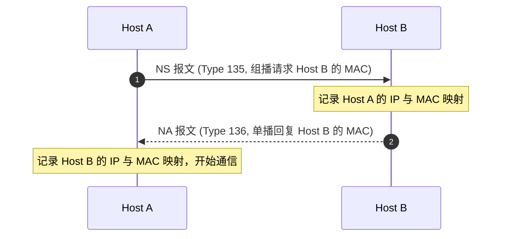

1. **发送 NS 报文**：节点 Host A 需要获取 Host B 的 MAC 地址时，向 Host B 的被请求节点组播地址`FF02::1:FFXX:XXXX`发送 NS 报文（Type 135），报文中携带 Host A 的 MAC 地址与请求的 Target IP。
2. **回复 NA 报文**：Host B 收到 NS 报文后，向 Host A 单播回复 NA 报文（Type 136），报文中携带 Host B 的 MAC 地址。
3. **建立映射**：Host A 收到 NA 报文，将 Host B 的 IPv6 地址与 MAC 地址映射加入本地邻居缓存（Neighbor Cache）。

> **被请求节点组播地址（Solicited-Node Multicast Address）**
> 
>    - **生成规则**：固定前缀 `FF02::1:FF00:0/104` + 节点 IPv6 地址的最后 24 位，即后 6 位十六进制数。例如：IPv6 地址为 `2001:DB8::1234:5678` $\rightarrow$ 被请求节点组播地址为 `FF02::1:FF34:5678`。
>  - **组播 MAC 地址映射**：固定前缀 `33-33-FF-` + 被请求节点组播地址后 24 位。例如 `33-33-FF-34-56-78`。

#### 地址解析报文

- **NS 报文结构（Neighbor Solicitation, Type 135）**
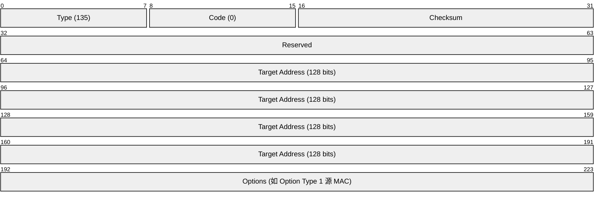
  - **Type (8 bits)**：固定为 `135`，标识邻居请求报文。
  - **Code (8 bits)**：固定为 `0`。
  - **Checksum (16 bits)**：ICMPv6 校验和，覆盖 IPv6 伪头部及 ICMPv6 报文全内容。
  - **Reserved (32 bits)**：保留字段，发送时全 `0` 填充。
  - **Target Address (128 bits)**：要查询其 MAC 地址的目标节点的 IPv6 地址（不可为组播地址）。
  - **Options**：通常包含 **源链路层地址选项 (Option Type 1)**，携带发送节点 Host A 的 MAC 地址，供接收方更新邻居缓存。

- **NA 报文结构（Neighbor Advertisement, Type 136）**
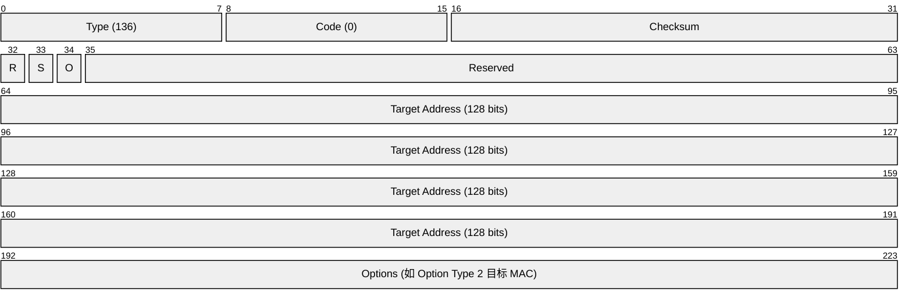
  - **Type (8 bits)**：固定为 `136`，标识邻居通告报文。
  - **Code (8 bits)**：固定为 `0`。
  - **Checksum (16 bits)**：ICMPv6 校验和。
  - **R 标志 (Router, 1 bit)**：`R=1` 表示发送节点为路由器，`R=0` 表示为主机。
  - **S 标志 (Solicited, 1 bit)**：`S=1` 表示该 NA 是对单播/组播 NS 报文的响应；`S=0` 表示未被请求的主动通告（如 MAC 地址变更时向 `FF02::1` 组播）。
  - **O 标志 (Override, 1 bit)**：`O=1` 表示通告中的信息应覆盖接收方邻居缓存中已有的映射；`O=0` 表示不覆盖。
  - **Target Address (128 bits)**：响应 NS 时填入被请求的 IPv6 地址；主动宣告时填入发生地址变更的节点 IPv6 地址。
  - **Options**：通常包含 **目标链路层地址选项 (Option Type 2)**，携带通告节点 Host B 的 MAC 地址。

### 路由发现与前缀发现机制

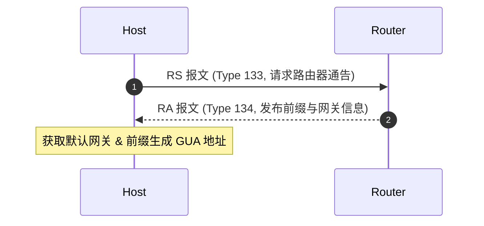

1. **RS 请求**：新接入节点向所有路由器组播地址（`FF02::2`）发送 RS 报文（Type 133），请求路由器立即响应。
2. **RA 通告**：路由器周期性或针对 RS 报文回复 RA 报文（Type 134），发送至所有节点组播地址（`FF02::1`）。RA 报文包含网络前缀信息（PIO）、路由器生存时间、MTU 及 M/O/A 标志位。

#### 路由发现与前缀发现相关报文结构

- **RS 报文结构（Router Solicitation, Type 133）**
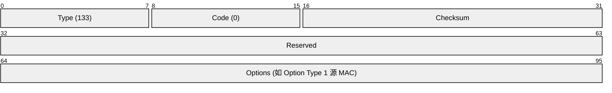
  - **Type (8 bits)**：固定为 `133`，标识路由器请求报文。
  - **Code (8 bits)**：固定为 `0`。
  - **Checksum (16 bits)**：ICMPv6 校验和。
  - **Reserved (32 bits)**：保留字段，全 `0` 填充。
  - **Options**：若主机已有有效源 IPv6 地址，通常包含 **源链路层地址选项 (Option Type 1)**，携带主机的 MAC 地址。

- **RA 报文结构（Router Advertisement, Type 134）**
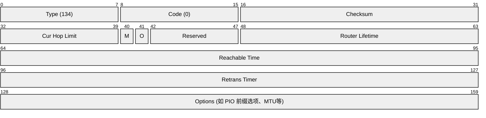
  - **Type (8 bits)**：固定为 `134`，标识路由器通告报文。
  - **Code (8 bits)**：固定为 `0`。
  - **Cur Hop Limit (8 bits)**：发布该链路的默认跳数限制（如 `64`）。
  - **M 标志 (1 bit)**：`M=1` 表示使用有状态 DHCPv6 服务器获取 IPv6 地址；`M=0` 表示使用 SLAAC。
  - **O 标志 (1 bit)**：`O=1` 表示使用 DHCPv6 服务器获取地址外的其他网络参数（如 DNS 地址等）。
  - **Router Lifetime (16 bits)**：作为默认网关的生存时间（秒）。`0` 表示该路由器不可作为默认网关。
  - **Reachable Time (32 bits)**：节点在 NUD 中确认邻居为 `REACHABLE` 状态的持续保持时间（毫秒）。
  - **Retrans Timer (32 bits)**：节点在 NUD 中重发 NS 报文的时间间隔（毫秒）。
  - **Options**：常见包含前缀信息选项 (PIO, Type 3)、MTU 选项 (Type 5) 及源链路层地址选项 (Type 1)。

- **前缀信息选项（Prefix Information Option - PIO, Option Type = 3）**
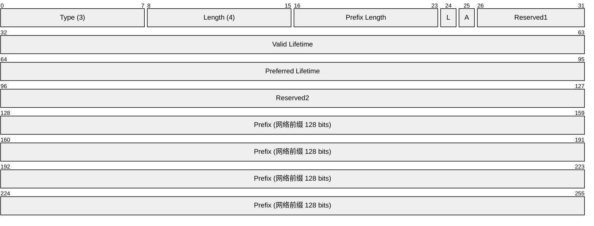
  - **Type (8 bits)**：选项类型，固定为 `3`。
  - **Length (8 bits)**：选项总长度，单位为 8 字节，固定为 `4`（即 32 字节）。
  - **Prefix Length (8 bits)**：网络前缀长度（通常为 `64`）。
  - **L 标志 (On-Link, 1 bit)**：`L=1` 表示该前缀在本地链路直连。
  - **A 标志 (Autonomous, 1 bit)**：`A=1` 表示允许节点使用该前缀通过 SLAAC 规则自动配置 IPv6 地址。
  - **Valid Lifetime (32 bits)**：由该前缀生成的地址的有效生存时间（秒）。
  - **Preferred Lifetime (32 bits)**：由该前缀生成的地址的首选生存时间（秒）。
  - **Prefix (128 bits)**：被宣告的 IPv6 网络前缀。

### 重定向机制

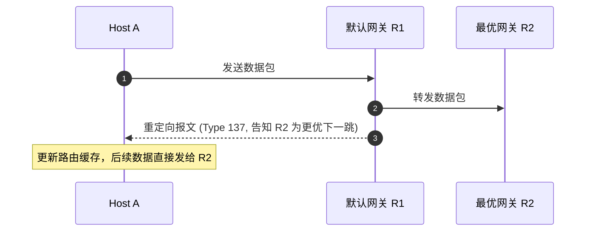

1. Host A 将数据包发送给默认网关路由器 R1。
2. R1 检查路由发现数据包的出接口与入接口相同，且同网段的 R2 是更佳下一跳。
3. R1 转发数据包的同时向 Host A 发送重定向报文（Type 137），告知 Host A 后续直接发往 R2。

#### 重定向相关报文结构

- **重定向报文结构（Redirect, Type 137）**
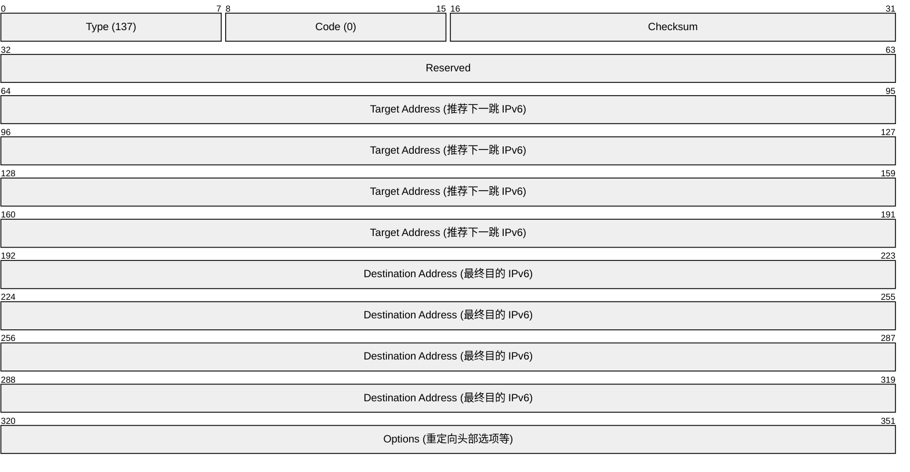
  - **Type (8 bits)**：固定为 `137`，标识重定向报文。
  - **Code (8 bits)**：固定为 `0`。
  - **Checksum (16 bits)**：ICMPv6 校验和。
  - **Reserved (32 bits)**：保留字段。
  - **Target Address (128 bits)**：推荐源节点使用的更优下一跳节点的 IPv6 地址。若目标节点在同链路直连，则为此目标节点的 IPv6 地址；若在异网段，则为更优下一跳路由器的 IPv6 地址。
  - **Destination Address (128 bits)**：触发重定向的原始数据包的最终目的 IPv6 地址。
  - **Options**：包含 **重定向头部选项 (Redirected Header Option, Option Type 4)**，截取包含触发重定向的原始 IPv6 数据包头及部分载荷，供源节点匹配本地连接状态。
## SLAAC

SLAAC（Stateless Address Autoconfiguration，无状态地址自动配置）定义于 RFC 4862，允许节点无需 DHCPv6 服务器干预即可自动获取网络层地址。

#### SLAAC 配置流程：
1. **生成链路本地地址（Link-Local Address）**：节点首先在前缀 `FE80::/10` 后拼接由 EUI-64 或随机算法生成的接口标识符（Interface ID），形成 Link-Local 地址。
2. **链路本地地址 DAD 检测**：针对该 Link-Local 地址运行 DAD 检测，确认无冲突后该地址生效。
3. **路由器发现**：节点发送 RS 报文，获取路由器回复的 RA 报文，解析其中携带的网络前缀及 `A/M/O` 标志位。
4. **生成全局单播地址（GUA）**：若 `A=1` 且 `M=0`，节点将获取到的网络前缀（如 `2001:db8:1::/64`）与自身的接口标识符组合，生成 GUA 地址。
5. **全局单播地址 DAD 检测**：节点对新生成的 GUA 地址再次运行 DAD 检测，检测通过后该 GUA 地址即可正常通信。

#### SLAAC 与 DHCPv6 组合模式（M / O 标志位矩阵）

| M 标志  | O 标志  | 地址获取方式                       | 其他网络参数 (DNS/NTP) 获取方式         | 典型应用场景                      |
| :---: | :---: | :--------------------------- | :---------------------------- | :-------------------------- |
| **0** | **0** | 纯 SLAAC (前缀 + 接口 ID)         | 无 (或通过 RA 携带的 RDNSS 选项)       | 即插即用的家庭网络、小型 LAN            |
| **0** | **1** | SLAAC 自动生成                   | 无状态 DHCPv6 (Stateless DHCPv6) | 主机自建地址，集中管理 DNS/域名          |
| **1** | **1** | 有状态 DHCPv6 (Stateful DHCPv6) | 有状态 DHCPv6 (Stateful DHCPv6)  | 类似于 IPv4 DHCP，集中管控 IP 分配与审计 |
| **1** | **0** | 有状态 DHCPv6 (Stateful DHCPv6) | 无                             | 极少使用                        |

## DAD（重复地址检测）

DAD是NDP中的一个强制性功能，定义于RFC 4862，用于确保分配给设备的IPv6地址没有被其他设备使用。

#### 1. DAD 的工作原理

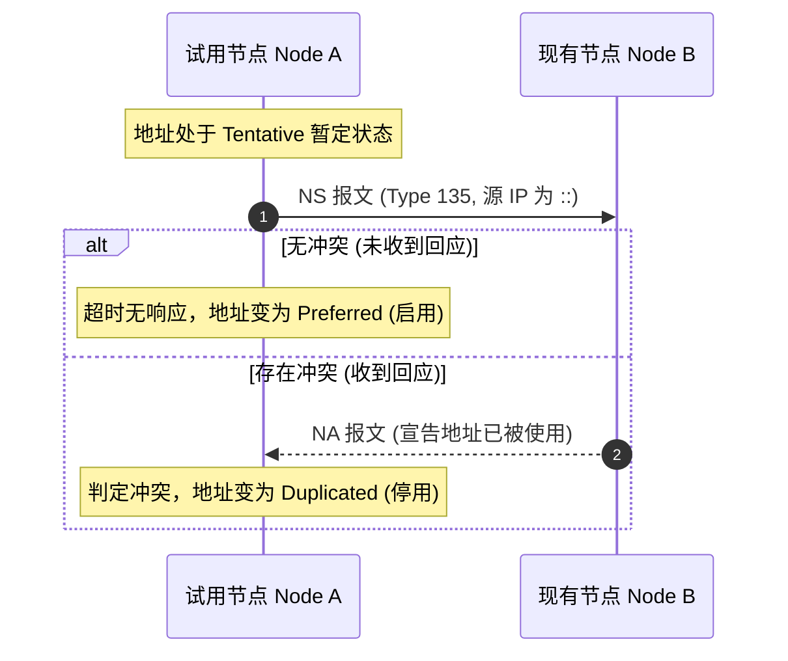

- **试用状态（Tentative State）**：任何 IPv6 地址（无论 SLAAC、手工配置还是 DHCPv6）在正式生效前，均处于 **Tentative（暂定/试用）** 状态。在此状态下，该地址不能用于收发业务数据包。
- **发送检测 NS 报文**：
  - **源 IP 地址**：`::`（未指定地址，因为当前暂定地址尚未证实唯一性）。
  - **目的 IP 地址**：待检测地址对应的 **被请求节点组播地址**（`FF02::1:FFXX:XXXX`）。
  - **Target Address**：待检测的 IPv6 地址。
- **检测结果处理**：
  - **冲突处理（Duplicated）**：若节点收到回应此地址的 NA 报文，或者收到源地址为 `::` 且 Target 相同的 NS 报文，说明链路上存在相同的地址。节点将该地址标记为 `Duplicated` 并停用。
  - **通过处理（Preferred）**：若在等待定时器超时后未收到任何冲突响应，地址解除 Tentative 状态，转为 `Preferred` 状态，开始正常通信。

#### 2. DAD 报文结构示例

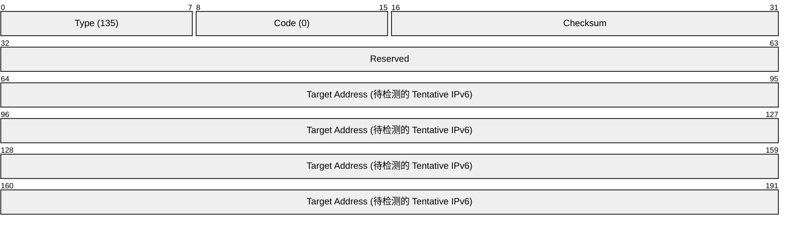
- **IPv6 头部关键字段**：
  - **源 IP**：`::`（未指定地址，表明在试用阶段）
  - **目的 IP**：`FF02::1:FFXX:XXXX`（被请求节点组播地址）

## NUD

NUD（Neighbor Unreachability Detection，邻居不可达检测）用于持续监测邻居节点在链路层上的双向可达性。当链路故障或邻居设备宕机时，NUD 能够及时清理或刷新邻居缓存条目。

#### 邻居缓存的 5 种状态迁移

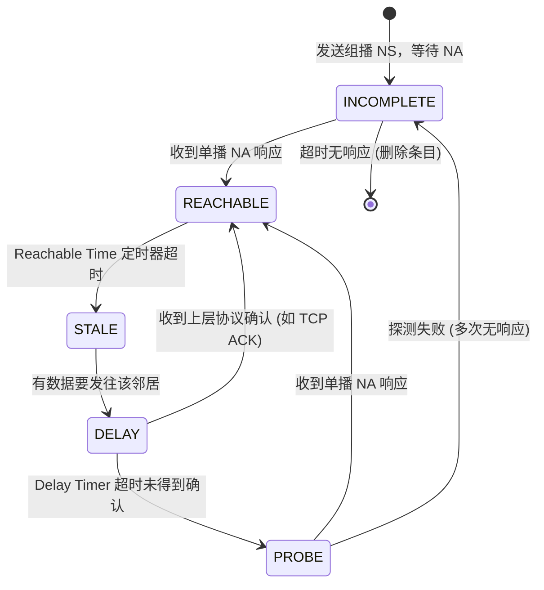

1. **INCOMPLETE（未完成）**：地址解析进行中，已发送组播 NS 报文，等待 NA 回复。
2. **REACHABLE（可达）**：收到单播 NA 或上层协议（如 TCP ACK）确认，确定邻居双向可达（默认维持 30 秒）。
3. **STALE（陈旧）**：可达定时器超时，条目进入陈旧状态。若无需向该邻居发包，系统不会主动发送探测。
4. **DELAY（延迟）**：STALE 状态下有发包需求，进入 5 秒延迟期，等待上层协议返回可达确认。
5. **PROBE（探测）**：延迟期满仍未收到上层确认，系统定期发送单播 NS 报文（如 3 次）显式探测。收到响应返回 REACHABLE；多次探测无响应则判定不可达，删除该条目。
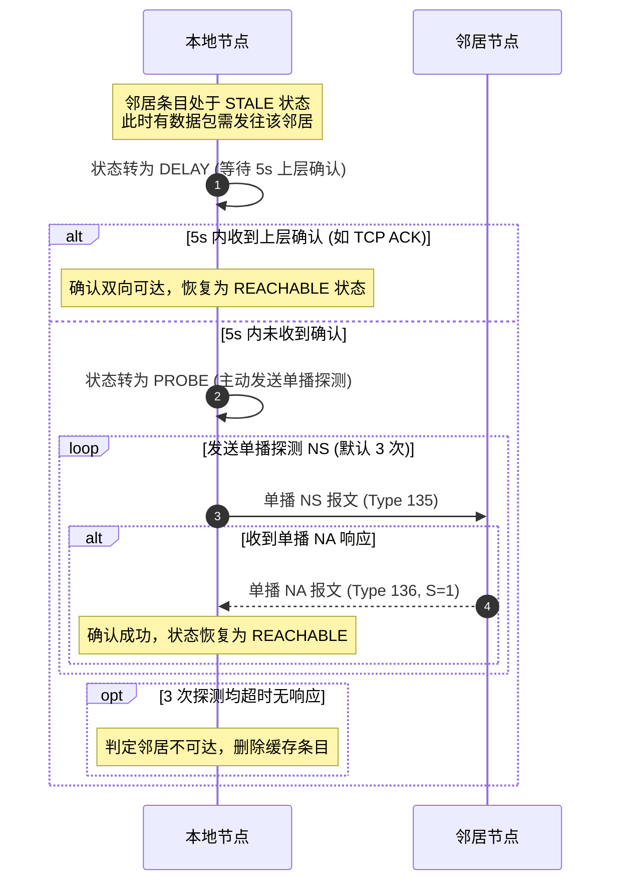

## NDP 安全与防护机制

由于标准 NDP 协议缺乏内置的身份验证机制，在局域网中容易面临安全攻击风险：

#### 1. 常见安全威胁
- **RA 仿冒攻击（RA Spoofing）**：攻击者伪造 RA 报文发布错误的默认网关或网络前缀，实施中间人攻击（MITM）或造成拒绝服务（DoS）。
- **ND 欺骗攻击（ND Spoofing）**：攻击者发送伪造的 NA/NS 报文篡改其他节点的邻居缓存映射（类似于 IPv4 中的 ARP 欺骗）。
- **DAD 拒绝服务攻击**：攻击者监听链路上 DAD 的 NS 报文，恶意回复 NA 报文，导致新接入节点始终判定地址冲突，无法获取 IPv6 地址。

#### 2. 主要防御手段
- **RA Guard（RFC 6105）**：接入交换机检查端口传入的 RA 报文，只允许信任端口（连接合法路由器）通过 RA，阻塞非信任端口发出的 RA。
- **ND Snooping（邻居发现监听）**：交换机监听 NDP 报文建立 `IPv6 - MAC - Port - VLAN` 绑定表，并校验后续 NS/NA 报文的合法性。
- **SEND（Secure Neighbor Discovery, RFC 3971）**：利用密码生成地址（CGA）与数字签名对 NDP 报文进行身份验证，防止报文被伪造和篡改。
