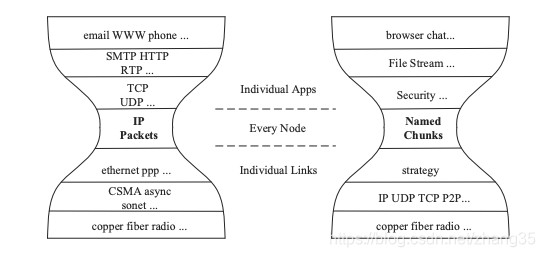

# TCP_IP分层的相关知识

## 数据在每层的名称

```text
+-+-+-+-+-+-+-+-+

|     应用层     | 消息（message）

+-+-+-+-+-+-+-+-+-+

|      传输层      | 段（Segment）

+-+-+-+-+-+-+-+-+-+-+-+

|       网络层        | 包（packet）报（Datagram）

+-+-+-+-+-+-+-+-+-+-+-+-+-+-+

|        数据链路层         | 帧(Frame) 元素（cell）

+-+-+-+-+-+-+-+-+-+-+-+-+-+-+-+-+-+

|             物理层             | 比特（Bit）

+-+-+-+-+-+-+-+-+-+-+-+-+-+-+-+-+-+
```

**数据报（Datagram）：**通常是指起始点和目的地都使用无连接网络服务的的**网络层**的信息单元。

**元素（cell）：**是一种固定长度的信息，它的起始点和目的地都是**数据链路层**。

**包(Packet)：**是TCP/IP协议通信传输中的数据单位，一般也称“数据包”

## 数据包的封装

```text
+-+-+-+-+

| 应用层 |

+-+-+-+-+-+-+-+-+ ↓

|     传输层     |

+-+-+-+-+-+-+-+-+-+-+ ↓

|      网络层        |

+-+-+-+-+-+-+-+-+-+-+-+-+ ↓

|       数据链路层       |

+-+-+-+-+-+-+-+-+-+-+-+-+-+-+ ↓

|           物理层           | Transmit Bits

+-+-+-+-+-+-+-+-+-+-+-+-+-+-+
```

向下逐层传输数据为封装

反之向上逐层传输数据为解封装

## TCP_IP的瘦腰结构



上图可以看到网络模型的封装十分像一个“瘦腰“或者说一个”沙漏“ ，这保证了任何基于 TCP 或 UDP并在其之上运行的应用层协议，都可以通过 IP 协议在不同的网络上进行通信。任何能够处理 IP 数据包的底层网络技术（沙漏底部）都可以接入互联网这种结构即保证了扩展性，又以IP协议为中心，以保证了统一性。
