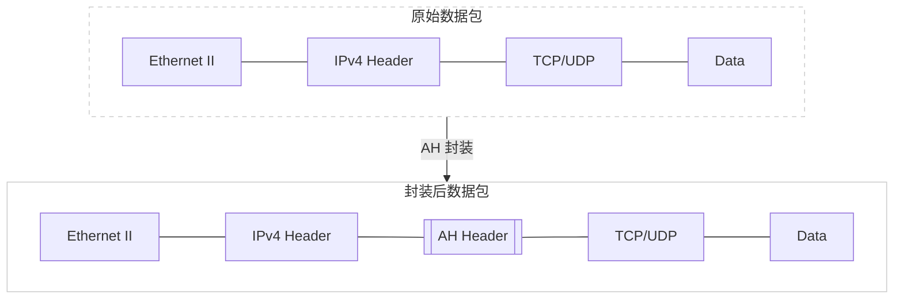
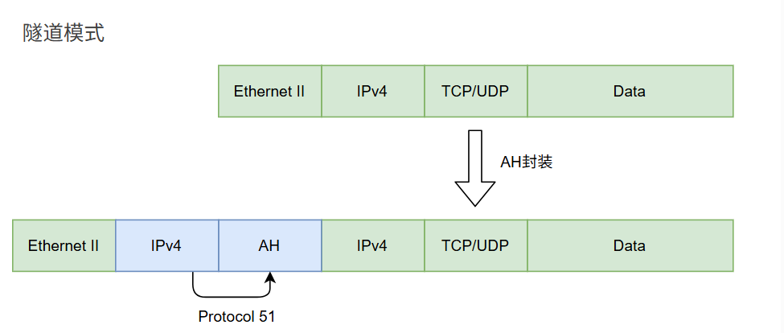
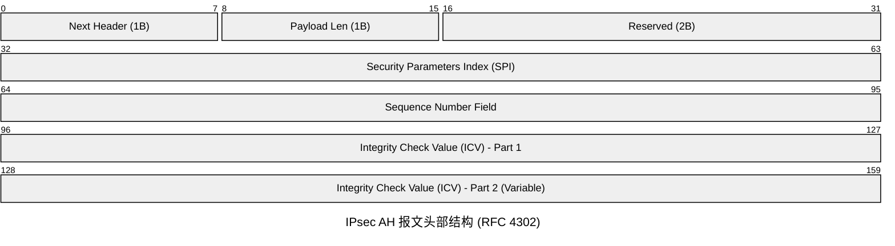
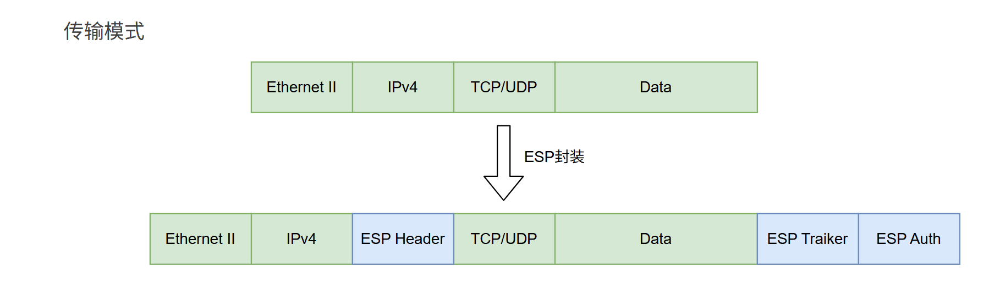
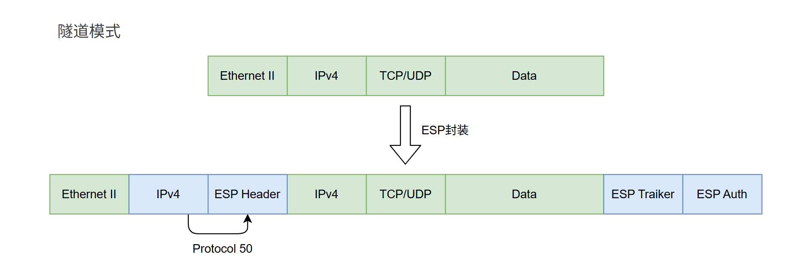
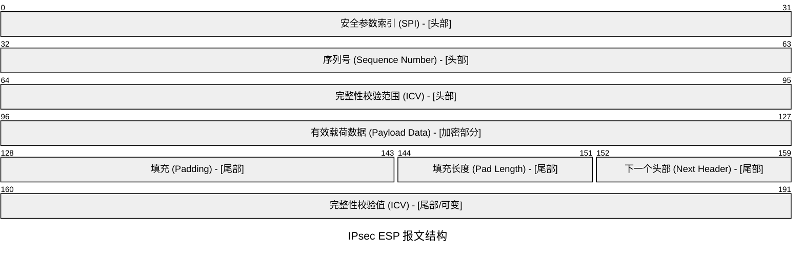
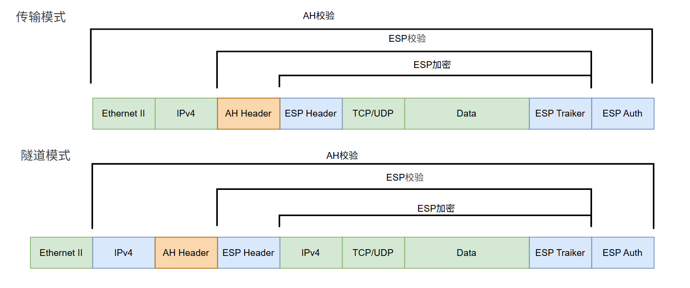

# AH和ESP

---

# AH（认证头 ）

AH是一个安全协议，用来为IP数据报提供 数据源认证、数据完整性保护 和抗重放攻击的机制。但没有提供加密保护。AH可以单独使用，也可以和其他协议一同使用。描述AH的RFC文档为RFC-4302和RFC-4303。

- 不提供加密保护
- 使用ICV保障数据完整性
- 源认证
- 抗重放性：AH会用独一无二的序列号标记数据包，确保每个数据包只被处理一次。
- 使用IP协议号51

---

## AH的封装

AH有传输模式和隧道模式两种封装模式。

### 传输模式封装

在传输模式下AH报文会封装在IP报头之后，但在所有传输层协议之前。

单纯的传输模式下只对 IP 数据包的有效载荷进行保护，原始IP报头保持不变，因此私有地址无法通过AH封装在公网上路由。

经过NAT时，因为NAT会修改IP报头，导致接收方计算出的ICV与发送方的不一致，数据包因此被丢弃，所以在传输模式下几乎无法实行NAT穿透。(后面会讲NAT-T技术，这个技术就是解决NAT穿透问题的)

传输模式常用于两台主机之间，保护传输层协议头，实现端到端的安全性。同时传输模式相较于隧道模式只封装了一个AH头，封装效率较高。

### 隧道模式封装

在隧道模式下AH报文会封装在IP报头之前，并在AH报文之前重新封装一个IP报头。

单纯的隧道模式会重新封装一个IP报头，外层IP用于路由。但由于ICV的检测，数据包不一致，因此还是会被丢弃。无法完成NAT穿透。

隧道模式相较于传输模式，需要额外封装一个IP报头，所以封装效率会低一些。

隧道模式常用于网络到网络和主机到网络之间。并且对 整个IP 数据包都进行保护。

---

## AH的ICV（完整性校验范围）

ICV是IPsec中完整性校验的范围，根据使用的协议与模式的不同而不同。

### 校验范围

传输模式校验范围：原始IP头（排除可变字段）+ AH头部 + TCP/UDP头部 + Data

隧道模式校验范围：新的外部IP头（排除可变字段）+ AH头部 + 原始IP头 +  TCP/UDP头部 + Data

可以看到IP头的括号里写有“排除可变字段”，可变字段就包括：TTL，IP头部校验和，Options字段。

### ICV计算过程

1. 首先根据使用的协议和模式，确定哪些数据需要被保护。
2. 将保护与校验范围内的数据提取出来，形成一个连续的数据块。
3. 对数据块进行HMAC算法计算哈希。HMAC算法由SA指定，`ICV = HMAC(共享密钥, 数据块)` ，最终得到ICV。

---

## AH报文（Transport Mode）

- Next Header （下一个头部）：

表示认证头部之后的下一个负载。传输模式下是6（TCP）或17（UDP），隧道模式下是5 （TCP）或41（UDP）。

- Pad Length（载荷长度）：

表示AH报文头长度，4字节（32bit）为1单位。计数方法为：AH长度(bit)/32 - 2，例如报文长度为128bit，那么128/32-2=2，这个字段就是2。对于IPv6，头部总长度必须为8字节的倍数。

- RESERVED（保留）：

保留字段，全部置0。

- Security Parameters Index（SPI，安全参数索引）：

表示IPsec安全参数索引，用于给报文接收端识别SA。

- Sequence Number Field（序列号）：

表示序列号，每发送一个报文，计数加1，例如每发一个SA报文序列号增加1。

- Integrity Check Value-ICV（ICV，完整性校验范围）：

报文的ICV。

---

# ESP（封装安全载荷）

同AH一样，ESP是一个安全协议，ESP提供对数据的加密保护。描述ESP的RFC文档为RFC-2406和RFC-4303。

- 提供加密保护
- 使用ICV保障数据完整性
- 源认证
- 抗重放性
- 使用IP协议号50

---

## ESP的封装

ESP的封装与AH的过程几乎无异，也分为传输模式，隧道模式。但不同的是ESP拥有尾部和验证尾部。

### 传输模式封装

在传输模式下ESP报文会封装在IP报头之后，但在所有传输层协议之前。在尾部会封装ESP尾部和ESP验证尾部。

### 隧道模式封装

在隧道模式下AH报文会封装在IP报头之前，并在AH报文之前重新封装一个IP报头。在尾部会封装ESP尾部和ESP验证尾部。

---

## Q：为什么ESP需要尾部

ESP 尾部主要包含三个字段：填充项、填充长度、下一个头。

有的加密算法要求明文是某个字节数的倍数，形成一个“块”。则会使用明文填充字段来填充明文。

同时可以使用填充来隐藏有效载荷的实际长度，以支持（部分）流量流保密性。

发送者可以添加 0-255 字节的填充。在 ESP 数据包中包含填充字段是可选的，但所有实现都必须支持填充的生成和消耗。

---

## ESP的加密

ESP 协议本身不规定特定的加密算法，它是一个框架，具体算法由选择SA提议决定。ESP是先加密，后认证的，接收方先验证 ICV，验证成功后再解密。

### 加密范围

ESP的认证范围与加密范围是有差别的。

传输模式：TCP/UDP头 + Data

隧道模式：原始IP头 +  TCP/UDP头 + Data

可以看出来。ESP加密的范围是ESP头部与ESP尾部之内的数据，不包括ESP头部和ESP尾部。

---

## ESP的ICV（完整性校验范围）

ICV是IPsec中完整性校验的范围，根据使用的协议与模式的不同而不同。

### 校验范围

传输模式校验范围： ESP头部 + TCP/UDP头部 + Data + ESP尾部 + ESP ICV

隧道模式校验范围：ESP头部 + 新的外部IP头（排除可变字段）+ TCP/UDP头部 + Data + ESP尾部 + ESP ICV

其实可以看出 ESP的ICV校验的是ESP头部到ESP尾部的范围。

由于ESP不校验外部的IP头，所以ESP相较于AH，使得更容易做NAT穿越。

### ICV的计算过程

ESP的ICV计算过程与AH类似，只不过没有使用共享密钥进行计算，其计算公式为`ICV = HMAC(数据块)` 。

---

## ESP报文

- Security Parameters Index（SPI，安全参数索引）：

表示IPsec安全参数索引，用于给报文接收端识别SA。

- Sequence Number Field（序列号）：

表示序列号，每发送一个报文，计数加1，例如每发一个SA报文序列号增加1。

- Payload Data*（有效载荷数据*）：

ESP的有效载荷数据，即上层的TCP/UDP……

- Padding（填充）：

用于增加ESP报文头的位数，使之达到加密要求。

- Pad Length（载荷长度）：

表示ESP报文头长度，接收方根据该字段长度去除填充字段中的扩展位，置0时表示没有填充。

- Next Header （下一个头部）：

表示认证头部之后的下一个负载。传输模式下是6（TCP）或17（UDP），隧道模式下是5 （TCP）或41（UDP）。

- Integrity Check Value-ICV（ICV，完整性校验范围）：

报文的ICV。

---

# AH与ESP

AH与ESP可以结合使用，结合后既能加密数据，又能验证外层 IP 头没有被篡改。但这种结合使得数据封装认证过程十分冗杂，一般情况下不会使用这种方案。

---

参考：

[support.huawei.com](https://support.huawei.com/enterprise/zh/doc/EDOC1100174722/fc8c0524)

[RFC 4302: IP Authentication Header](https://www.rfc-editor.org/rfc/rfc4302.html#section-1)

[AH协议](https://baike.baidu.com/item/AH%E5%8D%8F%E8%AE%AE/2566196)

[TCP-IP详解：AH(Authentication Header)-CSDN博客](https://blog.csdn.net/wdscq1234/article/details/52677419)

[详解IP安全：IPSec协议簇 | AH协议 | ESP协议 | IKE协议-CSDN博客](https://blog.csdn.net/m0_69519887/article/details/134383369)

---

[RFC 2406:  IP Encapsulating Security Payload (ESP)](https://www.rfc-editor.org/rfc/rfc2406#section-2.5)

[support.huawei.com](https://support.huawei.com/enterprise/zh/doc/EDOC1100174722/10c79523)

[TCP-IP详解：ESP(IPSec Encapsulating Security Payload)_esp数据-CSDN博客](https://blog.csdn.net/wdscq1234/article/details/52705458)

[ESP协议详解-CSDN博客](https://blog.csdn.net/eyucham/article/details/80429401)

[IPSec Encapsulating Security Payload (ESP) - hugingface - 博客园](https://www.cnblogs.com/tryst/p/18802445)

---

使用AI：

Gemini 2.5 Pro

ChatGPT-5

Claude 4

DeepSeek R1
