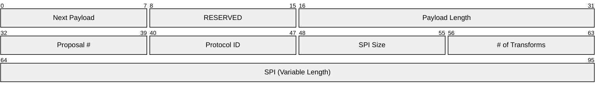
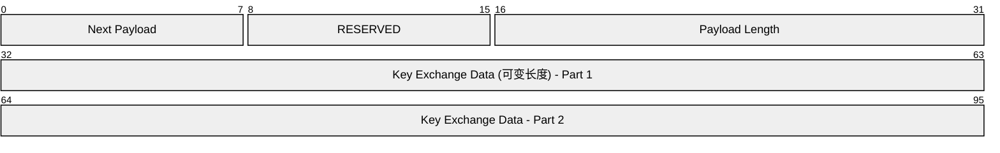
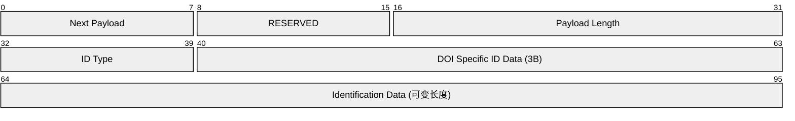
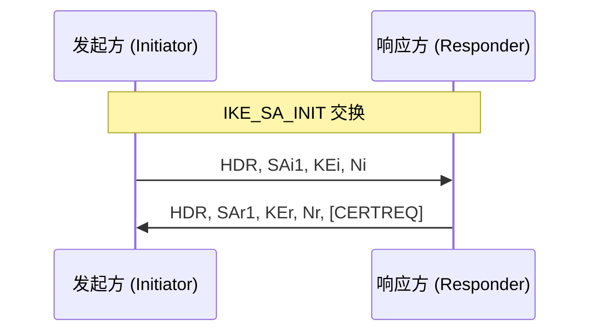
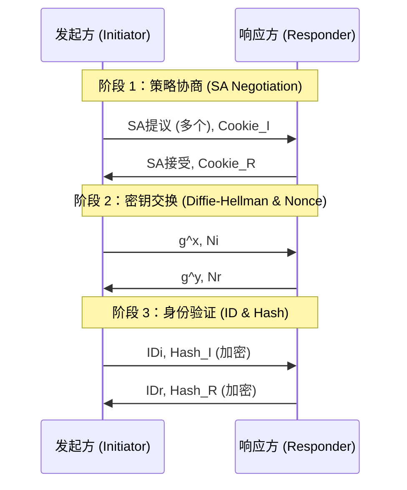
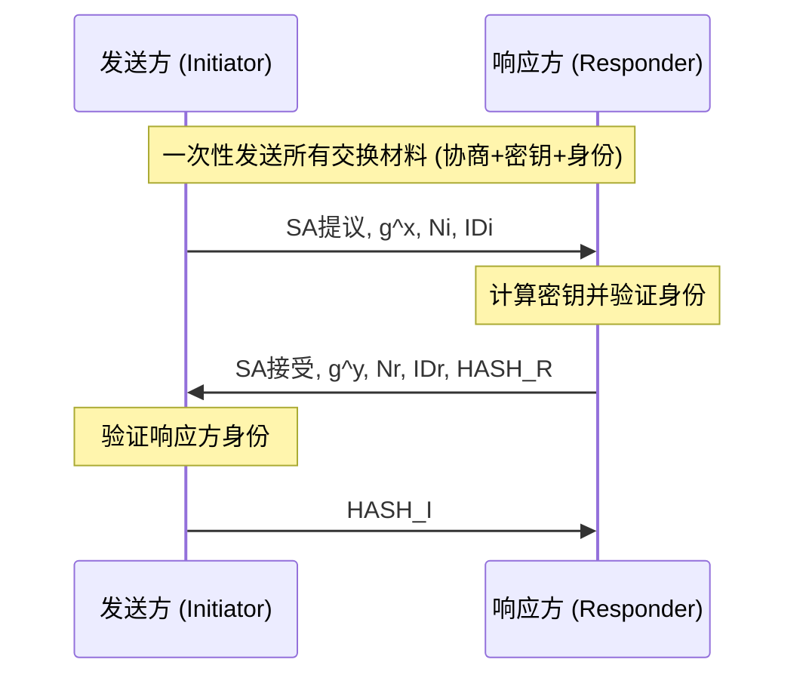
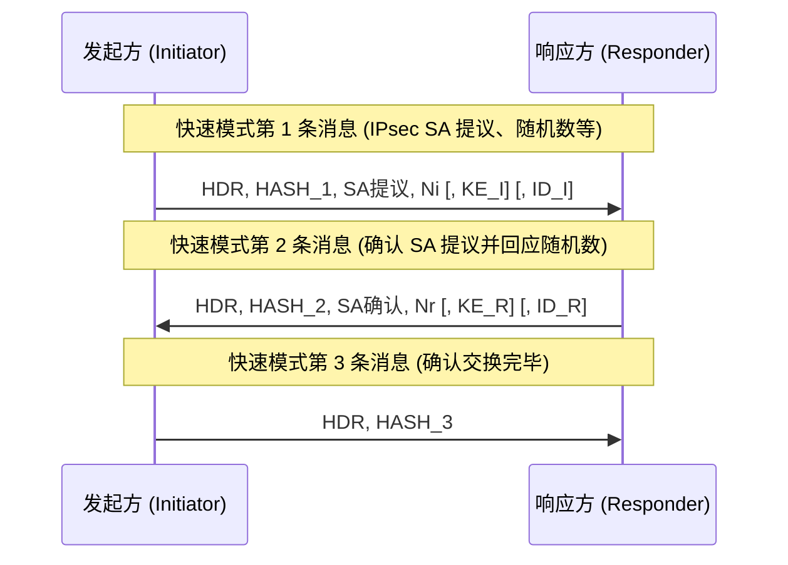
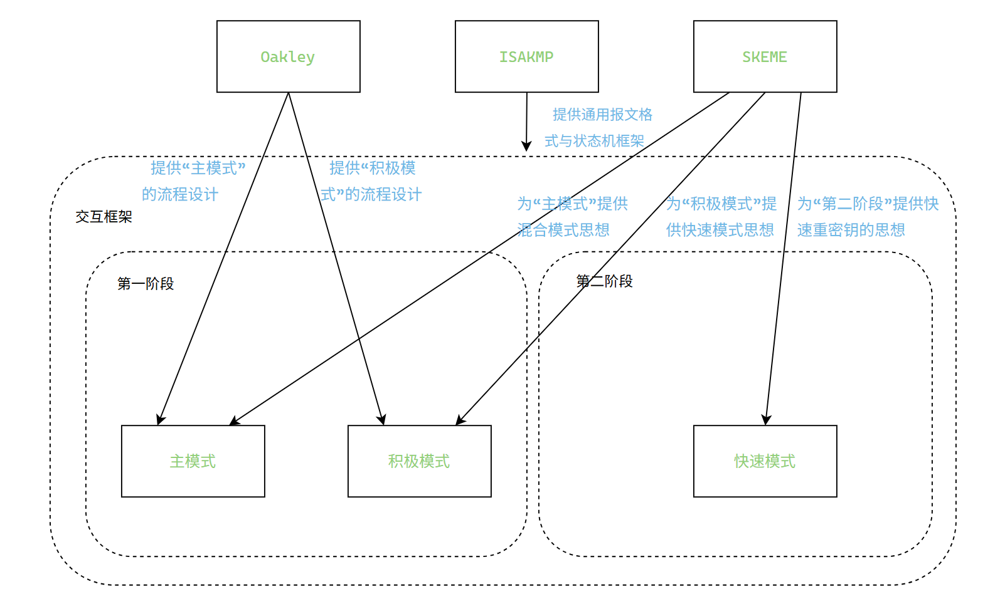

# IKE（Internet Key Exchange，因特网密钥交换）

IKE 是一个密钥协商协议，用于在不可信网络中安全协商、建立与维护 SA（Security Association），并完成身份认证与密钥派生。IKE 最初由 RFC 2409 定义，现行推荐版本为 IKEv2（RFC 7296），IKEv2大大地简化了IKEv1中的握手过程。此篇主要讲述IKEv1。

- IKE是基于UDP的一种应用层混合协议，常用端口 500（协商）与 4500（NAT-T）。由 ISAKMP、Oakley、SKEME 三种协议构成：
  - ISAKMP 定义交换框架与报文结构

  - Oakley 定义骨干的密钥协商思想（基于 DH，抗重放、抗 DoS 的机制）
  
  - SKEME 提供多样的密钥交换与认证模式（公钥、对称、混合）

在IKE中，并不是完全引用这三个协议的全部机制内容，而是选择性地采用。

---

## IKE 版本概览

- IKEv1：主模式（Main）与积极模式（Aggressive）两套 Phase 1，Phase 2 用快速模式（Quick）协商 IPSec SA。
- IKEv2：用更精简的 4 报文（含重传与 Cookie 防御）完成等价的建立过程，内建更强的错误处理与扩展性（如 MOBIKE）。

---

## IKE SA与IPSec SA

- IKE SA

IKE SA在IKE第一阶段建立。IKE SA用于认证对方设备身份并准备协商IPsec SA。IKE SA的建立是IPsec SA的大前提，类似于管理通道。

- IPSec SA

IPsec SA在IKE第二阶段建立，IPsec SA用于实际的传输信息，保护实际的用户数据，例如用户访问Web的流量等。类似传输隧道。

---

## ISAKMP（Internet Security Association and Key Management Protocol，因特网安全关联和密钥管理协议）

ISAKMP定义了协商、建立、修改和删除SA的过程和包格式。用于让IPsec路由器知道该如何“说话”。一般使用UDP 500端口进行通信。

注意！ISAKMP只作为IKE的一个框架，为后续SA的建立做准备，并没有SA相关的信息，ISAKMP由RFC 2408定义。

### **载荷**

ISAKMP的有效载荷由载荷头和载荷组成，双方交换的信息被称为载荷，ISAKMP目前定义了13种载荷。

由于本人才疏学浅（懒）在此只写出几种较为重要的载荷。详见[RFC 2408：互联网安全协会和密钥管理协议 （ISAKMP）](https://www.rfc-editor.org/rfc/rfc2408#section-3.1)。

### **安全关联载荷（SA Payload）**

SA Payload是整个协商的开始，它用于协商希望后续通信建立哪种类型的安全关联（SA）。

一个SA Payload可以包含多个提案载荷（Proposal Payload）。携带SA加密和认证算法的提议，发起方可以发送多个算法组合，响应方只需要接受一个即可。


- **Next Payload（下一个载荷）**

标明下一个载荷，详见[载荷链式结构](https://www.notion.so/IKE-2796557acc6c80a9bf5dfe8a211cd743?pvs=21)。

- **Payload Length（有效载荷长度）**

定义了SA载荷自身的长度。

- **DOI（解释域）**

它定义了ISAKMP载荷中各种标识符和参数的具体含义，用于不同场景的ISAKMP的数据有不同的含义，例如，相同的“转换 ID”值在不同 DOI 中可能代表不同的加密算法。DOI即告诉对方该用什么“字典”去翻译这些数据。

范围：

| 值的范围 | 用途 |
| --- | --- |
| 0 | 保留 |
| 1 | IPsec |
| 2-15359 | 保留给 IANA 以供未来使用 |
| 15360-16383 | 永久保留供相互同意的私有使用 |

值相对应的用途：

| 值 | 用途 |
| --- | --- |
| 0 | 该值用于指定一个“通用”的 ISAKMP 协商，不与任何特定的安全协议（如IPsec）绑定。 |
| 1 | IPsec建立SA（联盟）使用 |
| 2 | GDOI（组密钥管理协议），它扩展了 IKE。 |

别问为什么这么少，在IANA那就看见3个。

- **Situation（情景）**

提供了关于该安全关联用途的上下文信息。

### **提案载荷（Proposal Payload）**

提案载荷包含在协商期间使用的具体信息，提案包括用于保护通信信道的安全机制或转换。发起方通常会发送多个提案载荷，供响应方选择。



- **Proposal（提案编号）**

用于标识当前载荷的提议编号，在一个SA载荷中唯一标识一个提案。

- **Protocol ID（协议标识符）**

指定该提案适用于哪种安全协议，例如IPsec、ESP、AH等。

- **SPI Size（安全参数索引长度）**

SPI的大小，以字节为单位。

- **# of Transforms（转换数量）**

标识该提案中包含多少个“转换载荷”。

- **SPI（安全参数索引）**

发送方的SPI，SPI用于唯一标识安全关联（SA），接收方可以根据SPI快速确定SA和解密验证参数。

完整的SA由以下三元组唯一确定：

- 目标IP地址
- 安全协议类型（ESP/AH）
- SPI值

### **密钥交换载荷（KE Payload）**



- **Key Exchange Data（密钥交换数据）**

生成会话密钥所需的数据。该数据的解释由 DOI 和相关密钥交换算法指定。此字段还可能包含预置的密钥指示符。

### **身份标识载荷（ID Payload）**

身份标识载荷用于交换身份信息，以验证真实性。
（身份标识以下简称ID）



- **ID Type（ID类型）**

ID的类型，ID载荷支持多种不同的身份标识，这使得IPSec可以适应更复杂的环境。

| 标识 | 类型 |
| --- | --- |
| 1 | IPv4地址 |
| 2 | 完全限制域名 |
| 3 | 用户完全限制域名 |
| 4 | IPv4地址/子网掩码 |
| 5 | IPv6地址 |
| 6 | IPv6地址/前缀长度 |
| 7 | IPv4地址范围 |
| 8 | IPv6地址范围 |
| 9 | X.500 Distinguished Name (DN) |
| 10 | General Name |
| 11 | 不透明Key ID |

- **DOI Specific ID Data（DOI特定ID数据）**

在IPsec DOI中未使用，所以通常为0。

- **Identification Data（ID数据）**

实际的ID信息，内容由ID Type决定。

### **载荷链式结构**

在固定的ISAKMP消息头部中有着Next Payload(下一个载荷)这一字段, 用于指出紧跟在当前载荷后面的下一个载荷的类型。这个过程像链条一样，一环扣一环，直到最后一个载荷，其 “下一个载荷” 字段的值为 0（或 "None"），表示链条结束。

这种设计可以提高协议的灵活性和扩展性。主要还是服务于IKE不同模式的切换，载荷链式结构可以将不同载荷拼接在一起，不用像其他协议一样搞得那么复杂，当需要添加新的协议内容时，可以新增加载荷类型而不改变协议本身。

### **未写载荷**

转换载荷（**Transform Payload**）

证书载荷（**Certificate Payload**）

证书请求有效载荷(Certificate Request Payload)

哈希有效载荷(**Hash Payload**)

签名载荷（**Signature Payload**）

随机数载荷（**Nonce Payload**）

通知有效载荷（Notification Payload）

删除有效载（Delete Payload）

设备 ID 载荷(Vendor ID Payload)

---

## **SKEME**

SKEME也是应该密钥协商协议，它不仅支持DH算法还支持对称加密和公钥加密……。在IKE中，算在速度方面和算法方面上对Oakley的一种补全，主要的RFC文档是IKE的RFC-2409，RFC-2412。

### 公钥加密

与Oakley类似，SKEME也使用了Nonce（随机数）进行公钥加密，但不同的是Oakley的Nonce用于防重放与保证密钥新鲜度以保证DH协商，而SKEME则直接用于公钥加密认证。两者在Nonce的交换过程也有不同。

在SKEME中，协商双方利用各自的长期公钥/私钥对来保护交换的nonce。因此不需要证书签名验证每个消息，只需要对方能解密出正确的 nonce，就证明其持有相应私钥。

- 公钥加密认证过程

发起方=A，响应方=B

- A会随机生成一个nonce（Ni），用公钥加密Ni并发送给B。
- B收到数据后，使用自己的私钥进行解密，证明自己持有公钥，并随机生成一个nonce（Nr），使用A的公钥加密Ni和Nr并发送给A。
- A收到数据后，使用自己的私钥进行解密，验证Ni是否相同，以确定对方身份。
- 双方共享Ni和Nr，可作为会话密钥材料或进一步输入 PRF。

SKEME除了公钥加密还支持数字签名，对称密钥，混合等加密方式，但在IKE中主要还是使用公钥加密。

### SKEME的快速模式和混合模式

Oakley的模式则是注重传输交互层面的，SKEME的模式是注重算法层面的，现如今IKE中已经没有了单独的SKEME的模式。而是以思想继承的方式融入到IKE的模式的主模式与积极模式之中，**`了解即可`**。

- 快速模式

这个快速模式并不是IKE中第二阶段的快速模式，他主要是作为思想与IKE的积极模式结合的。他们都追求用最少的数据交互次数，实现协商认证。（貌似在早期IKEv1支持公钥加密+积极模式）。

- 混合模式

混合模式是由IKE描述的，他作为思想与IKE的主模式结合的。使用DH算法和公钥认证等，提供前向保密和身份保护。

---

## **Oakley Key Determination Protocol，奥克利协议）**

Oalley是一个密钥协商协议，它的核心功能是让通信双方能够在一个不安全的网络环境中，安全地协商并生成一个共享的、加密的密钥。Oalley可以用于长生命周期的加密数据传输。RFC文档为RFC-2412。

Oalley是基于DH加密算法进行设计的，（又是DH😭），由于DH算法已经单独写了一篇在此就不再详细赘述了。DH算法仅是防止了中间人无法拿到密钥，但没有对DoSS，重放等攻击有没有应的应对，在实际过程中，只使用DH算法还不是最安全的，因此需要增加其他机制以保证安全。

### **cookie弱地址验证机制**

Cooki机制是用来对抗伪造IP的DoSS攻击的。由于DH算法的计算量较大，就很适合用于DoSS攻击了。

Cookie是一个64位的伪随机数，一般由源 IP 地址和目标 IP 地址，UDP 源端口和目标端口……组成。通常为cookie = HASH( local_secret || src_IP || src_port || dst_IP || dst_port || timestamp )。

RFC 2412建议采用一种快速的哈希算法来生成 Cookie，例如 MD5。同时不要求响应方保存每个请求的状态。

- **协商过程**

  - 协议首先回由发起方生成一个本地唯一的 Cookie，称为 Cookie-I，随后将Cookie-I发送给响应方。这个Coolie-I会周期性的更新。

  - 响应方必须回复Cookie才能进行DH计算。

  - 响应方检查发现本地没有Cookie-I，便会生成一个Coolie-R，并将Coolie-R和Coolie-l一同发送给发起方。

  - 发起方收到响应方的消息后，会检查其中是否包含了自己之前发送的 Cookie-I。如果 Cookie-I 匹配，则证明响应方确实收到了自己的初始请求，并且响应方所在的 IP 地址是可达的。

  - 如果发起方为伪造IP，由于中间过程需要路由，Cookie不会到达发起方，便不能进行后续DH的协商。而务器服务器可以随时计算Cookie-R，也就不需要保存Cookie，从而避免了占用过多资源导致服务器崩溃。

（可以看出，Cookie机制对使用肉机进行的DoSS是无效的）

Q：为什么响应方要发送Cookie-R，而不直接Cookie-I？

A：如果响应方发送Cookie-I，相当于复制粘贴，哈希便没有了作用，发起方无法证明响应方为真。这个会话也就由发起方单方面决定了。由于响应方不能计算Cookie-I，为了确认后续步骤，只能保存Cookie，这违反了不要求响应方保存每个请求的状态。

### **Nonce防重放攻击**

每次会话时会生成一个一次性的随机元素Nonce，即使消息被截获，攻击者也无法在另一次会话中重用它。在公钥加密传输 DH 的临时指数……情况下，Nonce 还可以和 DH 值结合，用于派生会话密钥。

- **Nonce的生成与交换**

  - 首先发起会会生成一个随机数Ni，Ni会被包含在它发送给响应方的关键消息中。
  - 响应方收到Ni后也会生成随机数Nr，Nr会被包含在它回复给发起方的消息中。

至此交换完成😅。

- **Nonce认证**

因为Nonce有抗重放的特性，把他加入到认证机制中也可以为认证增加抗重放性。

发起方会对自己的一些身份信息、协商的参数以及双方的Nonce (Ni和Nr)等关键数据进行哈希计算，然后用自己的私钥对这个哈希值进行签名。得到Signature_I并发送给响应方。

响应方也进行类似的操作。然后发送Signature_R给发起方。

例如：

Signature_I = sign(private_key_I, hash(Ni | Nr |……))

Signature_R = sign(private_key_R, hash(Nr | Ni |……))

响应方收到发起方的签名Signature_I后，用公钥进行解密，得到哈希值。使用同样的计算方式计算得出Signature_I，则证明发起方为真。

发起方也同理。

过程图：



### Oakley组

Oakley组是一系列被标准化的、用于Diffie-Hellman密钥交换算法的数学参数集合。通信双方在协商时可以直接选择使用哪一套规则来生成共享密钥。

例如IKE中，首个 Oakley 默认组为：
```2^768 - 2 ^704 - 1 + 2^64 * { [2^638 pi] + 149686 }```

常见**Oakley组**

| 组编号 | 类型 | **描述** | 强度 | ---------------------------------- |
| --- | --- | --- | --- | --- |
| **Group 1** | MODP | 768位的素数 p | ~90位 | **已废弃**。强度太低，不安全。 |
| **Group 2** | MODP | 1024位的素数 p | ~90位 | **已过时**。目前多数设备仍支持，但不推荐使用。 |
| **Group 5** | MODP | 1536位的素数 p | ~112位 | 曾是企业级标准，但目前认为强度逐渐不足。 |
| **Group 14** | MODP | 2048位的素数 p | ~112位 | **当前最常用、最推荐的标准**，在安全性和性能间取得良好平衡。 |
| **Group 19** | ECP | 256位椭圆曲线 | ~128位 | 基于椭圆曲线，安全性高，计算效率优于同安全级别的MODP组。 |
| **Group 20** | ECP | 384位椭圆曲线 | ~192位 | 更高安全需求的椭圆曲线组。 |
| **Group 21** | ECP | 521位椭圆曲线 | ~256位 | 最高安全级别的椭圆曲线组。 |
| **Group 24** | MODP | 带有2048位子群的素数 p | ---- | --- |

---

## IKE一阶段交互（主模式和积极模式）

IKE第一阶段的主要任务是建立IKE SA，在IKE第一阶中的主动模式与积极模式正是继承了Oakley标准的模式。这两种模式的核心区别在于身份保护和交换轮数。

如果想查看数据报交互过程的：

[RFC2049_7.1](https://www.rfc-editor.org/rfc/rfc2409#section-7.1)
（已经定位了位置）

### 主模式 （Main Mode）

主动模式是一种身份保护模式。需要3次，6条消息进行协商。速度较慢，但较于安全。

- 协商交互过程

一次：

1. 发起方向响应方发送多个自己支持的SA提议还有cookie_I。
2. 响应方接收到SA提议后，查找自己支持的SA提议和优先级，选择发送方发送的一个SA提议和cookie_R一起发送给发送方。如果响应方不支持发起方的任何提议，它会回复一条拒绝消息，协商失败。

二次：

1. 发起方生成自己的DH私钥X，计算出 DH 公共值 g^x，并生成一个大的随机数 Ni。随后将 g^x 和 Ni 发送给响应方。
2. 响应方也生成自己的 DH 私钥 y，计算出 DH 公共值 g^y，并生成一个大的随机数 Nr。它将 g^y 和 Nr 发送给发起方。

当双方都收到对方的共公值后便会开始DH密钥的计算，完成后双方便拥有了共享密钥。（双方还有可能计算其他的派生密钥）

三次：

1. 发送方将自己的IDi（IP地址，域名……）使用派生密钥进行哈希，生成hash_i，随后将IDi和hash_i发送给对方。
2. 响应方收到数据后，会先对其进行解密，并计算出一个期望hash_i与收到的值进行对比，如果一致，则认定对方为真。

随后响应方也用同样的方式，将自己的身份 IDr 和认证哈希 HASH_R 加密后发送给发起方。

- 过程图：



一次确定SA提议，二次确定共享密钥，三次确认身份。

### 积极模式（Aggressive Mode，激进模式）

积极模式的协商过程只有3条消息。用“身份保护”换取“协商速度”。

- 协商过程
    1. 发送方会将`SA 提议`，`g^x`，`Ni`，`IDi` 一起打包发送给响应方。
    2. 响应方收到消息后，便拥有了计算共享密钥的材料，此时会选择支持的SA策略。进行DH共享密钥计算，计算出自己的认证哈希。随后将`SA 接受` ，`g^y` ， `Nr` ， **`IDr`** ， `HASH_R` 打包发送给发送方。
    3. 发起方收到消息后，也经过与响应方相同的身份认证过程，随后发送自己的`HASH_I` 给响应方。响应方收到后完成对身份的认证。
- 过程图：



由于发送ID前没有完成DH协商，ID是以明文方式进行传输的，网络上的任何窃听者都可以看到是谁在尝试发起VPN连接。

---

## IKE二阶段交互

IKE第二阶段的主要任务是建立IPSec SA，第二阶段只有快速模式一个模式，由SKEME提供快速重密钥的思想，第二阶段由3个数据包完成。

第二阶段需要完成共识：

1. 决定使用认证头（AH）还是封装安全载荷（ESP）来保护数据。
2. 协商IPsec SA提议。具体的加密算法、认证算法和封装模式。
3. 协商感兴趣流。
4. IPSec的生命周期
5. 完美前向保密（PFS）（非必要）

### 协商过程

1. 发起方向响应方发送一条消息，包含`哈希负载HDR`，`IPsec SA提议`，`Ni`和`感兴趣流`。如果启用PFS则会包含新的DH公共值`g^x`。
2. 响应方收到第一条消息后会：解密并验证HDR的正确性。从发起方的SA提议列表中，选择一个SA。检查发起方定义的感兴趣流是否与本地策略匹配。此时，如果启用了PFS，会进行DH计算。
检查无误后会发送自己的`HDR`，`IPsec SA确认`，`Nr`和`感兴趣流` ，同样的，如果启用PFS则会包含新的DH公共值`g^y`。
3. 发送方收到第二条消息后，会进行与响应方相同的操作。检查无误后会计算出一个`最终哈希值`并发送给响应方，作为对整个快速模式交换的确认。

过程图：



---

## 三种协议的关系



---

## IKEv2

---

参考：

[Internet 密钥交换 （IKE） 属性](https://www.iana.org/assignments/ipsec-registry/ipsec-registry.xhtml)

[ISAKMP_百度百科](https://baike.baidu.com/item/ISAKMP/10001245)

[IPsec ISAKMP协议-CSDN博客](https://blog.csdn.net/bytxl/article/details/36016141)

[RFC 2408：互联网安全协会和密钥管理协议 （ISAKMP）](https://www.rfc-editor.org/rfc/rfc2408)

[RFC 2412: OAKLEY 密钥确定协议 --- RFC 2412: The OAKLEY Key Determination Protocol](https://www.rfc-editor.org/rfc/rfc2412)

[RFC 2409：互联网密钥交换 （IKE）](https://www.rfc-editor.org/rfc/rfc2409#section-6.1)

使用AI：

Gemini 2.5 Pro

ChatGPT-5

Claude 4

DeepSeek R1
