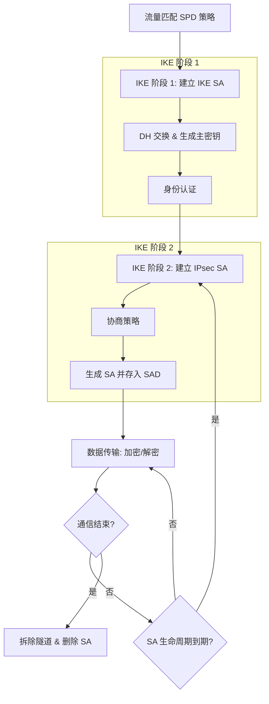

# **IPsec（Internet Protocol Security，互联网协议安全）**

IPsec不是一个具体的协议，而是一组协议族，由多个协议一同完成功能。它工作在网络层。能够对 IP 数据包进行加密和认证，从而保证数据的机密性、完整性和真实性。

---

## SA（安全联盟）

SA是一个单项的安全通道，他约定了通信的双方使用的加密算法，认证算法（hash），密钥，生存时间，SPI。即约定了双方应该如何通话，如何加密……。

只有协商好这些参数才能建立SA，那么这些参数算是“盟约”？

### 三元组唯一标识

一条 SA 可以由三元组唯一标识：

SPI

目的 IP 地址

安全协议号（HA和ESP）

### 单项性

SA是单项的，即如果项建立一个隧道需要建立2个SA。

- 一个用于 **出站** 流量，从本地到远端。
- 一个用于 **入站** 流量，从远端到本地。

单项性的SA使得更适合密钥管理。每个SA的密钥可以独立管理。

从IKE协商的主密钥中，会分别派生出：

- A到B方向的加密密钥
- A到B方向的认证密钥
- B到A方向的加密密钥
- B到A方向的认证密钥

一个SA内只有一个加密密钥和认证密钥，当处理数据时，便可以缩小判断范围。以减少访问开销。

如果同一使用同样SA进行管理，那么对数据进行处理时变要面临更多的判断，使得增加访问开销。

同时单项性的SA也会更安全，如果一个SA既负责加密发出的数据，又负责解密接收的数据，那么这个SA就需要同时持有两套密钥信息。一旦这个SA被攻破，攻击者就能同时获得双向通信的所有密钥材料。单项性的SA至少可以保障一个SA被攻破时，攻击者也只能获得一个方向的通信。

---

## SAD与SPD与PAD

### SAD（安全关联数据库）

一个 IPsec中至少有一个SPD，SAD存放着当前活跃的SA的详细数据，参数包含SPI， 序列号计数器，目的端IP、AH 算法、AH 加密密钥、ESP 验证算法、ESP 加密密钥……

### SPD（安全策略数据库）

一个 IPsec可以有多个SPD，但最少必须至少有一个SPD。SPD内存放着许多条规则，这些规则用于匹配流量以及该如何处理流量，类似ACL。

当一个数据包被SPD检查时，系统会将其包头字段与策略条目中的选择器进行比对。SPD条目有优先级顺序，数据包会匹配第一个符合条件的策略。一旦数据包匹配上了某个条目，SPD就会执行该条目对应的动作。

动作：

- PROTECT：使用IPsec保护该流量。这是VPN流量的核心动作。
- BYPASS：绕过IPsec，允许流量以明文形式通过。
- DISCARD：直接丢弃该流量，不允许通过。

逻辑上SPD可以分为SPD-S，SPD-I，SPD-O。

- SPD-S：所有受 IPsec 保护流量的条目
- SPD-I：所有需要被绕过或丢弃的出站流量的条目
- SPD-O：所有需要被绕过或丢弃的入站流量的条目

### PAD（对等体授权数据库）

PAD是应该授权策略库。用来管理和验证连接对等体的身份，他里面存放着例如对等体的身份，以及身份的验证凭据，对等体身份例如IP 地址，域名……，身份的验证凭据例如数字证书，预共享密钥……。

---

## IPsec工作原理

1. 触发流量检测：当有流量经过SPD时，数据包匹配到需要IPsec的规则，时开始建立IPsec。（对的，这个东西要触发!）
2. IKE第一阶段，开始建立IKE SA。
3. IKE第二阶段，开始建立IPsec SA。
4. 数据传输。

---

## NAT-T

在AH和ESP中有提到，由于ICV的检测机制会导致无法实现NAT穿透。而NAT-T允许那些原本无法通过网络地址转换能够正常地在 NAT 环境下工作。

NAT-T即NAT穿越，它会在AH或者ESP封装之上再次封装一个UDP头，将原有的IPsec数据包隐藏在一个标准的 UDP 数据包内部。NAT-T的默认端口号是4500。

这里拿ESP举例：

启动NAT-T后IPsec会通过IKE向第一阶段1-2个包交换，来得知对方是否支持或开启NAT-T，如果双方都开启NAT-T才能使用NAT-T。

---

## DPD（Dead Peer Detection, 死对等检测）

在标准的 IPsec 连接中，如果一个对等体突然掉线，它不会向对端发送任何通知。这会导致对端设备仍然认为对等体仍然是活动的，它仍会向这个对等体发送数据，形成“僵尸隧道”，直到SA生命结束。在站点到站点的IPsecVPN中，SA生命周期又会特别的长，这会造成资源大量的浪费。DPD正是为了解决这个问题。RPD由RFC 3706定义。

DPD 通过 IKE 交换R-U-THERE （DPD请求）和R-U-THERE-ACK（DPD确认）来工作。

- **DPD间隔**：发送探测包的间隔时间
- **DPD超时**：等待响应的最大时间
- **重试次数**：连续失败多少次后判定死亡

DBD可以选择按需触发（On-Demand）或者周期触发（Periodic），也可以混合两种触发。

- 按需触发：当IPsec本地设备准备向对等体发送数据时，会检测一定时间内有没有收到过对等体的数据包，如果没有便会发送DBD请求。
- 周期触发：论是否有数据传输，发起方都会以固定的时间间隔发送DBD请求。

当发送DBD请求后，如果对等体回复DBD响应则正常进行传输，如果DBD超时，会在一个失败计数器上累加+1，当达到阈值时则会拆除隧道。如果配置了自动重连，它会尝试重新发起 IKE 协商，以建立一条新的 VPN 隧道。

## **参考**

[RFC 4301: Security Architecture for the Internet Protocol](https://www.rfc-editor.org/rfc/rfc4301#section-4.4.2)

[IPsec VPN](https://baike.baidu.com/item/IPsec%20VPN/8489623)

[SPD、SAD、Traffic Selector和IKE收发数据包的处理过程_安全策略数据库spd-CSDN博客](https://blog.csdn.net/lanmolei814/article/details/37966295)

[Ipsec 的SPD和SAD详解_ipsec spd sad-CSDN博客](https://blog.csdn.net/bytxl/article/details/49615371)

[什么是IPsec？IPsec是如何工作的？ - 华为](https://info.support.huawei.com/info-finder/encyclopedia/zh/IPsec.html)

[IPSEC VPN——IKE详解（大学生易读版）-CSDN博客](https://blog.csdn.net/qq_74338624/article/details/134079567)

[IPSEC VPN-详解原理_ipsec传输模式-CSDN博客](https://blog.csdn.net/m0_72210904/article/details/136637980)

[NAT穿越(NAT-T)原理-CSDN博客](https://blog.csdn.net/qq_38265137/article/details/89423809)

使用AI：

deepSeek R1

Gemini 5 pro

Claude 4

Chat-5
