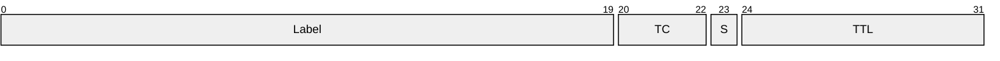
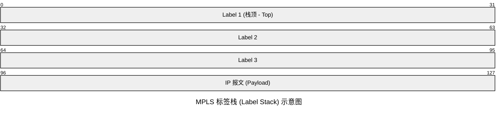
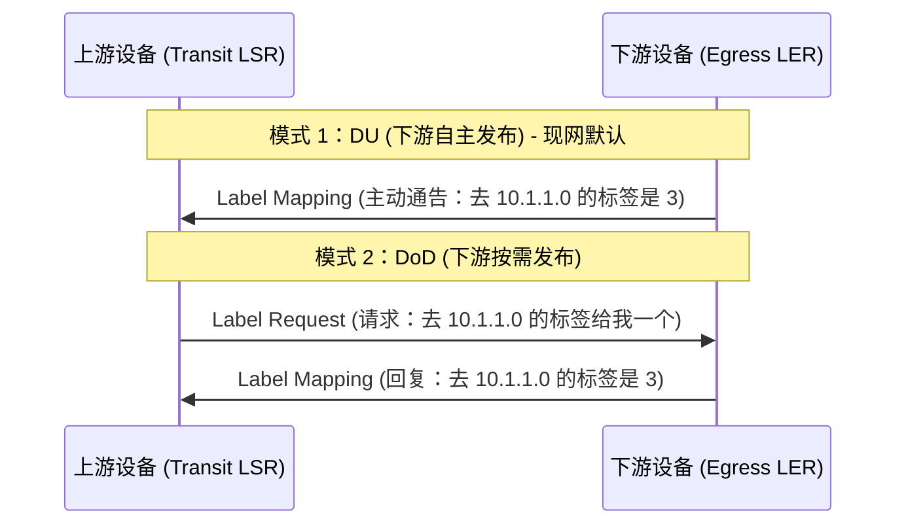
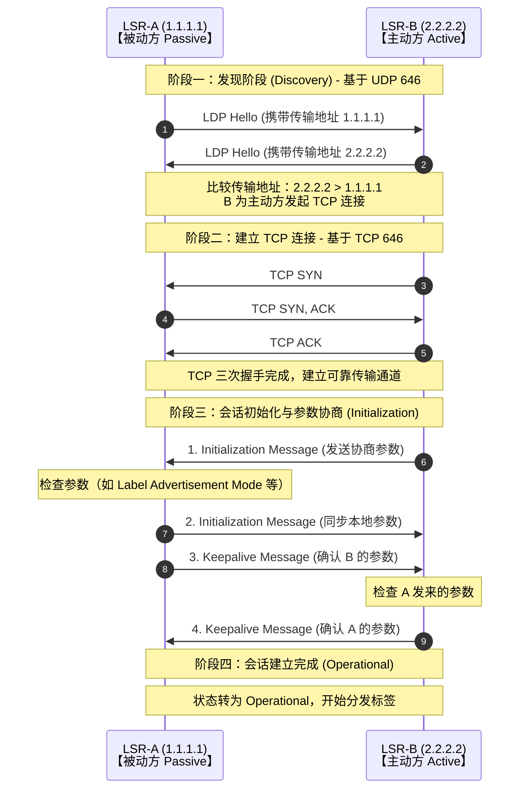
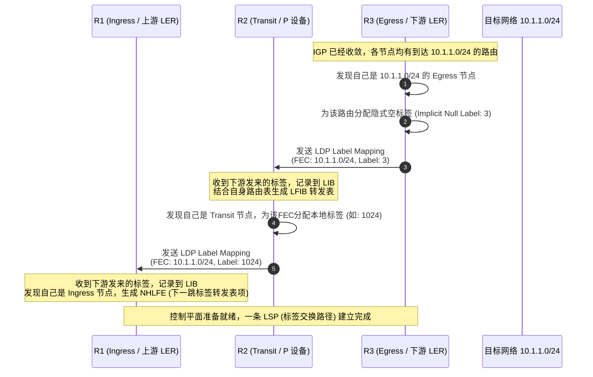

# MPLS （Multiprotocol Label Switching，多协议标签交换）

MPLS是一种结合二层交换效率与三层路由灵活性的转发技术，它通过标签来对数据包进行转发。带来的好处是，路由器在进行数据转发时不再需要遍历复杂的IP路由表，而可以直接根据标签表（通过索引）快速查找到对应的下一跳和出接口信息。

后来，随着ASIC（专用集成电路）技术的迅速发展，IP路由表查找逐步改用硬件方法，处理速度大大提高，这使得MPLS在提高IP网络转发速率方面不再具备明显的优势。但它仍在QoS、VPN、流量工程（TE）等方面发挥着非常重要的作用。

---

## MPLS的设备类型

- CE (Customer Edge，用户边缘设备)

位于用户网络的边缘，与PE（提供商边缘设备）直接相连。CE不会意识到MPLS的存在，它依然使用普通的IP路由表进行寻址和转发，仅负责将用户数据包发送到PE。

- PE (Provider Edge，提供商边缘设备) / LER (Label Edge Router，标签边缘路由器)

位于提供商网络的边缘，与CE相连。PE是MPLS网络的入口和出口，负责将CE发送来的IP数据包封装上标签后发送到P设备，同时也负责将从P设备接收到的标签数据包剥离标签，还原成IP数据包发送到CE。

- P(Provider,提供商设备)/LSR (Label Switching Router)

位于提供商网络的核心，不与任何客户网络直接相连。直接参与MPLS标签交换的转发过程，负责根据标签进行数据包的转发。

---

## MPLS的标签(Label)

MPLS的标签是个转发索引，用来匹配下一跳信息。大小为4字节。其结构如下：



- Label (标签值)：20bit，表示一个整数，范围为0~1048575。其中0~15为预留标签，16~1048575为可用标签。

- TC（Traffic Class，流量类别）：3bit，用于区分数据包的优先级，在QoS等机制中使用。

- S（Bottom of Stack，栈底标志）：1bit，用于判断当前标签是否是标签栈的最后一层。当S=1时，表示这是标签栈中的最后一个标签（即最底层标签）；当S=0时，表示后面还有其他标签。

- TTL（Time to Live，生存时间）：8bit，与IP报头中的TTL功能相同。每经过一台LSR转发，TTL值减1，当TTL减为0时数据包被丢弃，防止在网络中无限循环。

值得一提的是，MPLS标签并没有放在IP报文里面，也没有放在二层帧头里面，而是插入在二层帧头和IP报文头之间。因此，MPLS 在网络模型中经常放入**2.5 层**当中。

### 标签栈

MPLS支持标签的叠加，也就是标签栈。当数据包需要经过多个MPLS网络时，可以在数据包上叠加多个标签，每个标签对应一个MPLS网络。



MPLS路由器在处理标签时只处理最外层标签，内层标签保持不变

### 特殊标签

| 值 | 名称 | 作用 |
| - | ------------------ | ----- |
| 0 | IPv4 Explicit NULL | 显式空标签，用于保留QoS优先级信息并传递给出口PE。 |
| 1 | Router Alert | 路由器警示标签，指示报文需要本地CPU处理（如OAM、RSVP）。 |
| 2 | IPv6 Explicit NULL | IPv6显式空标签。 |
| 3 | Implicit NULL | 隐式空标签，用于触发PHP（倒数第二跳弹出）。 |

### PHP（Penultimate Hop Popping，倒数第二跳弹出标签）

字面意思，在倒数第二跳P设备上就把标签弹出，以减轻出口PE在处理数据包时的查表负担，提高转发效率。

---

## LDP标签分发协议

MPLS在运营商网络中的部署都是大批量的，此时若使用人工手动分发标签、建立映射关系，是非常不现实的。因此，需要自动化的标签分发协议。

LDP（Label Distribution Protocol，标签分发协议）是MPLS的控制协议之一，用于在MPLS网络中自动分配和分发标签。

> LDP使用TCP/UDP的646端口。TCP端口用于建立会话并交换LDP消息，UDP端口用于邻居发现和建立LDP邻接体。
> LDP发现报文使用组播地址224.0.0.2。

### FEC（Forwarding Equivalence Class，转发等价类）

FEC是一组具有相同转发行为的IP数据包（官话）。

可以这么理解：去往同一个目的地、要求相同服务质量的IP数据包，会被归类到同一个FEC当中。

LDP会将FEC与标签进行绑定，并告知网络中的其他邻居。

### LDP邻接体，对等体和会话

- **LDP邻接体(Adjacency)**

当一台LSR接收到对端发送过来的Hello消息后LDP邻接体建立。

LDP邻接体分为两种类型：

- 本地邻接体（Local Adjacency）：通过链路Hello消息发现的邻接体，通常建立在直连的物理设备之间。

- 远端邻接体（Remote Adjacency）：通过Targeted Hello消息发现的邻接体，通常建立在非直连的逻辑对等体之间。

- **对等体(Peer)**

当设备通过Hello报文获取到对方的Transport Address（传输地址，即LSR ID）后，会向其发起TCP三次握手连接，连接成功后对等体建立。

- **会话 (Session)**

会话是指对等体之间建立的TCP连接。两个LDP对等体之间只会建立一个LDP会话。

### LDP的数据包类型

在此只做简单的介绍（懒）：

- **Hello Message**

  用于邻居发现和保持邻接体关系。在 LDP 中只有 "Hello Message" 是基于 UDP 的，其他都是基于 TCP 的。

  Hello 包又分为两种：
  
  * **Link Hello**：通过链路发现邻居，携带的Transport Address通常是接口IP地址。TTL一般为1，用于直连邻居。

  * **Targeted Hello**：通过目标地址发现邻居，携带的 Transport Address 是 LSR ID。TTL一般大于1，用于远程邻居。

- **Initialization Message**

用于会话建立时的参数协商。

- **Keepalive Message**

周期性发送，用于监控TCP会话状态,如果一段时间内没有收到对方的Keepalive消息，就认为会话已经失效了。

- **Notification Message**

  用于通知对等体发生了异常情况。如果收到的为Advisory（建议）类型Notification Message，则表示出现非致命性错误，会话仍会保持；如果收到的为Fatal（致命）类型Notification Message，会话将被关闭。

- **公告类消息**
  
  这类消息主要用于创建、改变和删除标签与 FEC 的映射关系。

  * **Address Message**:

     告知邻居自己的接口IP地址，用于构建后续的标签转发表。

  * **Address Withdraw Message**

    撤回之前宣告的接口地址。

  * **Label Mapping Message**

    用于向邻居通告FEC与标签的绑定关系。

  * **Label Request Message**

    请求邻居为某个特定FEC分配标签，通常用于下游按需分发DoD模式。

  * **Label Withdraw Message**

    撤销标签绑定关系。

  * **Label Release Message**

    确认收到撤销消息，或主动释放不再需要的标签。

  * **Label Abort Request Message**

    取消之前的标签请求。

```text
LDP Message Types
│
├── Discovery
│   └── Hello
│         ├──Link Hello
│         └──Targeted Hello
│
├── Session
│   ├── Initialization
│   └── KeepAlive
│
├── Advertisement
│   ├── Address Message
│   ├── Address Withdraw Message
│   ├── Label Mapping
│   ├── Label Mapping
│   ├── Label Request
│   ├── Label Withdraw
│   ├── Label Release
│   └── Label Abort Request
│
└── Notification
    └── Notification
```

### 两种LDP的发布方式

- **DU（Downstream Unsolicited，下游自主发布）**

此模式下的下游设备十分主动，只要它为某个FEC分配了本地标签，不需要上游请求，就可以直接向上游发送Label Mapping报文。

- **DoD（Downstream on Demand，下游按需发布）**

下游设备比较被动。它为FEC分配标签后会先存储到本地，直到上游设备发来 Label Request 报文索要，它才会回复 Label Mapping 报文。



### LDP的工作流程

- **邻居发现**

设备开启LDP后，会向组播地址``224.0.0.2``周期性发送端口为 UDP 646的LDP Hello报文。

LDP路由器互相收到Hello报文后，建立LDP邻接体。此时，设备知道了对方的存在，以及接下来该用哪个IP去建立TCP连接。

- **会话建立**

双方开始进行TCP握手，传输地址大的一方会发起TCP SYN。

TCP连接建立后，传输地址大的一方会发送Initialization报文，协商LDP版本、Keepalive时间、标签发布方式等参数。被动方收到后，如果接受这些参数，就回复Initialization报文和Keepalive报文。主动方再回复Keepalive。

至此，LDP会话Session正式建立，状态机进入Operational状态。

> LDP路由器在建立对等体关系后，会周期性地发送Hello包保持对等体关系。



- **标签分发**

  这里的例子使用的标签分发方式是DU+Ordered模式，这是标签的分发一般也是默认使用的模式。其他模式详见下文。

  - 触发

    LER（PE）发现一条新的直连IGP路由后，会为其生成一个新的FEC。

  - 分配标签

    LER会为该FEC分配一个标签，例如3。

  - 通告

    LER向上游LSR（P）发送Label Mapping报文，告知对方发送该网段的路由数据给自己时，打上标签3。

  - 传输

    上游LSR收到报文后，将这个标签装入自己的标签库（LIB），同时它也会为这个 FEC 生成一个新的本地标签，然后继续向它的上游发送 Label Mapping 报文。一直传递到入口路由器。



- 关于``上游``和``下游``：

下游：靠近数据目的地的一端。

上游：靠近数据源头的一端。

标签的流向：标签是由下游分配，并由下游发送给上游的。

数据的流向：实际的用户数据报文，是由上游发送给下游的。

### 标签分配控制方式

这个问题发生在中转设备(LSR/P)上。当它收到上游的请求，或者准备向上游通告标签时，它需要遵循什么规矩？

- **Ordered (有序控制)**

有序控制一般是LDP路由器的默认模式。一台中转设备必须先收到其下一跳（下游）发来的标签映射，它才能为这个 FEC 分配自己的本地标签，并向上游通告。如果是 Egress 节点（终点），则可以直接分配。它保证了如果一条 LSP 没有首尾贯通，就不会向上游瞎发标签，以避免流量黑洞。

- **Independent (独立控制)**

只要本地路由表里有这个 FEC 的路由，不管下游路由器有没有把标签传过来，立刻为它分配标签并向上游通告。独立控制的好处是建立速度快，但容易在网络震荡时造成短暂的流量黑洞。

### 标签保留方式

- Liberal (自由保留，LL)

LDP路由器的默认模式。只要是邻居发来的标签，统统保存在标签信息库（LIB）里备用。但是，只有来自最优IGP下一跳的标签，才会被真正下发到转发平面的LFIB表中用于指导数据转发。

- Conservative (保守保留，CL)

只保留最优IGP下一跳发来的标签。其余直接丢弃（发送 Label Release 释放掉）。

### 大前提

首先，MPLS和VPN等协议一样，都是依赖于下层的路由协议的，所以在建立标签转发路径（LSP）之前，底层路由必须先通。

### 标签的转发

- 压入（Push）

  通常发生在入节点（Ingress），路由器收到一个普通的IP报文，根据目的IP地址查表后，为其打上一个或多个MPLS标签。

- 交换（Swap）

  当一个MPLS标签数据包经过一个中转节点（Transit）时，路由器根据标签查表，将最外层标签替换成由下游分配的新标签。

- 弹出（Pop）

  通常发生在出节点（Egress），路由器收到一个MPLS标签数据包，弹出标签后将其还原成普通数据包进行转发。

## 流量工程（TE）概述

流量工程（Traffic Engineering，TE）是指在网络中对流量进行优化和管理的技术和方法。它的目标是提高网络资源的利用率，减少拥塞，提升网络性能和用户体验。

通常的流量工程可以根据带宽，延迟，服务优先级，QoS等多个属性来进行流量的优化和管理。

显然MPLS的标签交换可以用于流量工程，现在还兴起了SR-TE这一技术。
