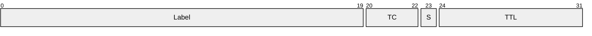
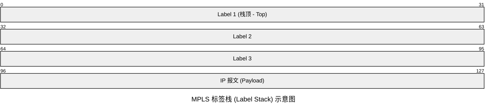

# MPLS （Multiprotocol Label Switching，多协议标签交换）

MPLS是一种结合二层交换效率与三层路由灵活性的转发技术，它通过标签来对数据包进行转发。带来的好处便是路由器进行转发时不再需要遍历IP路由表。查找标签表时可以直接使用索引查找到标签对应的下一跳信息。

后来，随着ASIC（专用集成电路）技术的迅速发展，IP路由表查找逐步改用硬件方法，处理速度大大提高，这使得MPLS在提高IP网络转发速率方面不再具备明显的优势。但仍在Qos,VPN,流量工程等方面发挥着作用。

## MPLS的设备类型

- CE(Customer Edge,用户边缘设备)

位于用户网络的边缘，与PE(提供商边缘设备)直接相连，CE是不会意识到MPLS的存在的，也就是说CE还是在使用路由表进行路由。只是负责将用户数据包发送到PE。

- PE(Provider Edge,提供商边缘设备)/LER(Label Edge Router,标签边缘路由器)

位于提供商网络的边缘，与CE相连，PE是MPLS网络的入口和出口，

负责将CE发送来的数据包进行标签封装，并将数据包发送到P(提供商设备)设备，

同时也负责将从P接收到的数据包进行标签剥离，并将数据包发送到CE。

- P(Provider,提供商设备)/LSR (Label Switching Router)

位于提供商网络的核心，不与任何客户网络直接相连。直接参与MPLS标签交换的转发过程，负责根据标签进行数据包的转发。

## MPLS的标签(Label)

MPLS的标签是个转发索引，用来匹配下一跳信息。大小为4字节。其结构如下：

- Label(标签值，)：20bit，表示一个整数，范围为0~1048575。标签值为0~15为预留标签，16~1048575为可用标签。

- TC（Traffic Class，流量类别）：3bit，用于区分数据包的优先级，在QoS……中使用。

- S（Bottom of Stack，栈底标志）：1bit，用于判断标签是否是标签栈的最后一层。当S=1时，表示这是标签栈中的最后一个标签；当S=0时，表示后面还有标签。

- TTL（Time to Live，生存时间）：8bit，和IP中的TTL一样。每经过一台路由器转发，TTL值减1，当TTL值减为0时，数据包将被丢弃，以防止在网络中无限循环。

值得一提的是，MPLS标签并没有放在IP报文里面，也没有放在二层帧头里面，而是插入在二层帧头和IP报文头之间。因此，MPLS 在网络模型中经常放入**2.5 层**当中。

### 标签栈

MPLS支持标签的叠加，也就是标签栈。当数据包需要经过多个MPLS网络时，可以在数据包上叠加多个标签，每个标签对应一个MPLS网络。

MPLS路由器在处理标签时只处理最外层标签，内层标签保持不变

### 特殊标签

| 值 | 名称                 | 作用    |
| - | ------------------ | ----- |
| 0 | IPv4 Explicit NULL | 保留QoS |
| 1 | Router Alert       | 控制报文  |
| 2 | IPv6 Explicit NULL | IPv6  |
| 3 | Implicit NULL      | PHP   |

### PHP（Penultimate Hop Popping，倒数第二跳弹标签）

字面意思，倒数第二个P就把标签去掉,以减轻出口PE负担，方便PE进行转发。提高效率。

## MP-BGP/BGP-4+

MP-BPG是BGP-4的一种扩展，使其支持IPv6在内的其他非IPv4协议的网络层协议。RFC-2858和RFC-4760定义了MP-BGP协议。

## MPLS的路由

## LDP标签分发协议

## 流量工程概述
