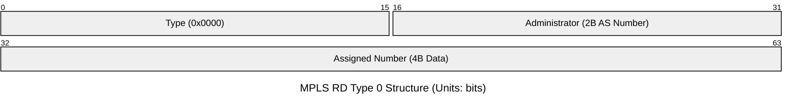
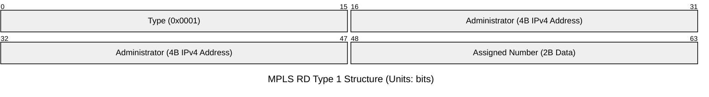
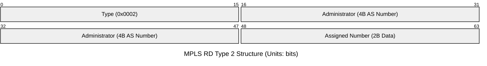

# RD(Route Distinguisher, 路由区分符)

>RD使得“重复IPv4前缀变成唯一VPNv4路由。”

> RD只存在于PE与PE之间，就像MPLS标签一样，CE是不知道RD的存在的。

> RD是全局唯一的

运营商需要服务多个客户，这些客户可能使用的是相同的IPv4网段，这便需要RD来区分不同的IP以便BGP选路。相同RD的数据为同一VPN的数据，RD不控制VPN成员关系，不控制路由导入导出，不决定谁和谁通信。它只是用于标识唯一VPNv4路由，仅此而已。

## VPNv4 NLRI

很简单，``VPNv4 NLRI = RD + IPv4 Prefix``

## 结构

RD有3种格式，总长度总是为8Bytes，于RFC4364中被定义。

- **Type 0**

格式为AS:nn。适用于 2 字节自治系统号。

- **Type 1**

格式为IP:nn。适用于以 IP 地址作为管理边界。

- **Type 2**

格式：AS:nn。适用于扩展的 4 字节自治系统号。

## BGP选路机制与RD

RD是参与的是控制平面的路由分发。

MPLS VPN依赖于MP-BGP来进行跨越骨干网传递私网路由，然而BGP的收敛是不考虑标签的，假设两个客户的网段相同。即使标签不同，对BGP来说，依然是两个目的地相同的路由。BGP便会根据选路原则选路，最终只保留最优的一条，一条则被丢弃了。

而在IP前加上不同RD后，这两串字符便有了不同，使得BGP认定它们是两个完全不同的目的地，将其保留。

MPLS标签不参与BGP路由唯一化，RD也不参与数据的转发。

### RD与MPLS标签的不同

| MPLS标签 | RD |
| -------- | -- |
| 数据平面 | 控制平面 |
| 链路本地有效 | 全局唯一 |
