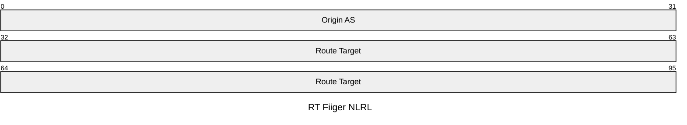

# RT(Route Target,路由目标)

RT是一种BGP扩展团体属性，决定了VPN路由该在哪些VRF之间流动。

在MPLS VPN中，PE为了隔离不同客户的路由，会为每个客户创建独立的VRF,在传递客户的路由时，便需要对路由路由条目进行区分，以可以分辨那条路由条目是哪给VRF的。

## ERT与IRT

### ERT(Export RT)

当本端PE发送某个VRF的路由时，会给这些路由打上特定的 ExportRT标签。

ERT 是一个需要发送出去的 Tag 。

### IRT(Import RT)

当对端PE收到MP-BGP路由时，会检查路由携带的RT。如果该 RT与对端某个VRF配置的Import RT完全匹配，该路由才会被允许注入到该VRF的路由表中；否则直接丢弃。在此过程中不传递 IRT,也就是说 IRT 是一个本地的 Tag ，他不会被发送出去。

那么便有了问题，IRT 是如何产生的？（感觉好 AI）

IRT 是手动配置的，当需要大规模配置 IRT 的时候便只能使用 Ansible、Salt 这类自动化工具去配置或者使用 SD-WAN 控制器去配置了。（很难想象）

AI 说的，有待查证：

> - **Hub-Spoke 拓扑**中，Spoke 希望接收 Hub 的路由（Import RT = Hub 的 Export RT），但**不希望接收其他 Spoke 的路由**（即使那些 Spoke 的 Export RT 与自己 Import RT 相同也不行，因为没配置）。如果自动学习所有看到的 Export RT，就会意外引入其他分支的路由，破坏隔离。
>     
> - **Extranet 场景**中，只有特定伙伴的 Export RT 才被允许导入，而不是所有
## RT Tag

RT Tag的格式通常由“自治系统号(ASN):用户自定义数字”或“IP地址:用户自定义数字”等构成。例如 ``65000：100``，``192.168.1.1：100``。

## RTC（RT Constrained , RT 约束路由分发）

RTC是一种BGP增强功能，用于优化MPLS VPN网络中路由的分发效率，减少不必要的路由更新和资源消耗。RTC 由 RFC－4684 定义。

传统的 MP－BGP 当中，无论有没有 RR（虽然一般都会配置 RR），路由器都会将合法的 VPNv4/v6 路由发送给所有的 MP－BGP 的邻居。即使一些邻居根本不需要的 VPN 路由，仍然会被发送，随后这些不需要的 VPN 路由会经过再通过 Import RT 规则进行过滤然后丢弃掉。这显然是十分浪费资源的。

> 举个例子吧：PE 1 路由器可能只承载了全网 100 个 VPN 实例中的 2 个。但 RR 依然会把这 100 个 VPN 的海量路由全部发给这台 PE 1。

RTC 的作用便是让 PE 告诉 RR 感兴趣的 RT Tag ， RR 则会对收到的 VPN 路由进行筛选过滤，只发送感兴趣 RT Tag 的 VPN 路由。为此，在 BGP 中引入了一个全新的地址族－－RT Filter (AFI 1, SAFI 132)(路由目标过滤地址族)。

### RTC 的工作过程

开启 RTC 后，路由器会检查 Import RT 列表 ，找出感兴趣的 RT Tag ，随后 RT 会将这个 RT Tag ，封装到 RT Filter 当中并发给 RR 。

RR 收到 PE 发送的 RT Filter 后，会在本地构建一张 RT 过滤表，表中记录里什么 PE 对应（需要）什么 RT。

当 RR 收到路由时便可以实现按需分发。

### RT Filter(路由目标过滤地址族)

RT Filter 是 BGP 中 RTC 传播 RT Tag 所用的地址族，AFI/SAFI 为：AFI 1, SAFI 132。

其格式为：

- **Origin AS (4 Bytes / 32 bits)：** 发出这条兴趣 RT 的自治系统号。如果网络使用的是 2 字节 AS 号，高位补零。
    
- **Route Target (8 Bytes / 64 bits)：** 这就是你配置在 VRF 里的真实 RT 值。由于 BGP 扩展团体属性本身就是 8 字节，这里直接原样填入。

当 RT Filter 为全空时，为 RT Filter 默认路由，表达对所有的 RT Tag 都感兴趣。通常用在通常是 RR 与 RR，ASBR 当中。

### RTC 与 RT

RT 是标签，RTC 是控制标签按需分发的协议。没有 RT，RTC 就失去了控制和过滤的目标，完全失去了意义。

