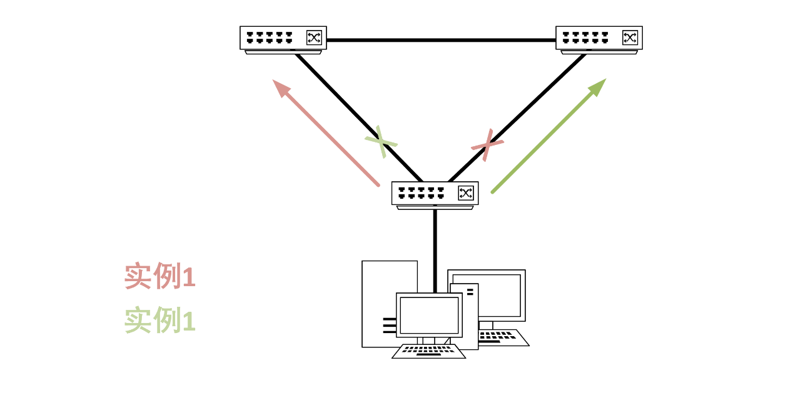
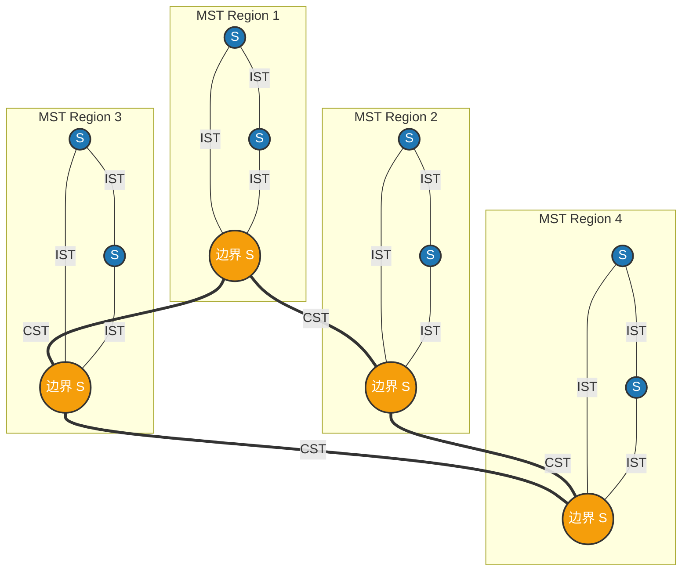

# MSTP（多生成树，Multiple Spanning Tree Protocol）

802.1s定义了MSTP协议，MSTP允许多个生成树的实例，解决了STP和RSSTP中，阻塞链路正常情况没不转发数据这一点。

在MSTP中，通过把整个互联的二层网络划分成若干个域。在域内，把其中的vlan分成若干组，每组具有相同的拓扑结构，然后定义若干个MSTI，并把这些生成树实例和不同的vlan映射起来。

## MSTI(MST实例)

在MSTP中，一个MSTI是一个单独的计算单元，每给MSTI都有自己的根桥，端口角色……

通俗点说，一个MSTI就是一颗独立的生成树，MSTP通过构建多个MSTI来实现不同VLAN的负载均衡和冗余。

MSTI由Instance ID标识，范围为0-4096，实例0为默认实例，所有未映射的VLAN均关联到此实例。虽然标准定义了很高的理论上限，但实际可用的实例数通常由交换机的硬件和软件决定。

一个VLAN只能映射到一个实例当中。

## MST Region（MST区域）

MST区域是由一组具有相同MST配置的交换机组成以及它们之间的网段的集合。通过Region Name，Revision Level，VLAN-to-Instance Mapping Table三个参数标识。三个参数相同的交换机才能属于同一个MST区域：

- **Region Name（域名）**

字符串标识，最大为32个字符，区分大小写，比如``Region_Core``。

- **Revision Level（修订级别）**

必须为整数，范围为0-65535，用于标识MST配置的版本。

- **VLAN-to-Instance Mapping Table（VLAN-实例映射表）**

将VLAN映射到特定的MSTI的表。通常交换机在互相发送BPDU校验时，并不会把几千个VLAN的映射关系全发过去。而是通过一个哈希算法把映射关系压缩成一个16位的值再发出，值叫做**Configuration Digest**。

一个MST区域包含一个或多个MSTI。

## IST，CST与CIST

### IST(内部生成树)

即MSTI 0，是域内的生成树片段

### CST（公共生成树）

连接所有MST域的单树，将每个域视为虚拟交换机

### CIST（公共内部生成树）

由IST和CST组合构成的全网唯一生成树，根桥为**总根（CIST Root）**（全网BID最小的交换机）

参考：

https://blog.csdn.net/lvjianzhaoa/article/details/98259199

[MSTP_百度百科](https://baike.baidu.com/item/MSTP/10768902)

使用AI：

Gemini 2.5 Pro

DeepSeek R1
