# **STP（Spanning Tree Protocol，生成树）**

STP协议由IEEE 802.1D标准定义，主要是用于解决二层网络中的环路问题，STP可以通过阻断部分链路，将一个环形的网络修剪成一个树形网络，从而消除环路问题。

由于STP收敛时间巨长(50s),并且阻断的链路没有流量经过，一般情况下这些链路毫无用处，所以现在已经很少使用STP了，更多的是RSTP，MSTP或者直接使用无环网络。

华为体系设备默认开启STP

华为体系：华为，华三（H3C）……

思科体系设备默认默认不开启STP

思科体系：思科（cisco），锐捷，神州数码(DCN)……

## **广播与泛洪**

- **广播**

数据帧或数据包被发送到同一广播域内的**所有设备**。

- **泛洪**

交换机在**未知目标MAC**地址时，将数据帧复制除接收端口外的到所有端口。

## **二层环路的形成**

PC向AR-1发送了一个目前地址为不存在此网络中的IP的ARP数据包。

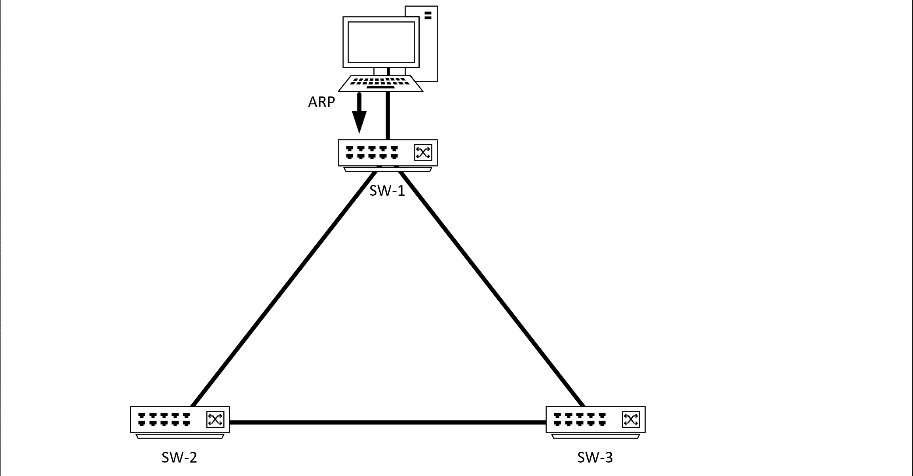

当AR-1收到ARP包后，向非入接口的接口进行泛洪，也就是向AR-2与AR-3进行泛洪。此时ARP包被复制了2份。

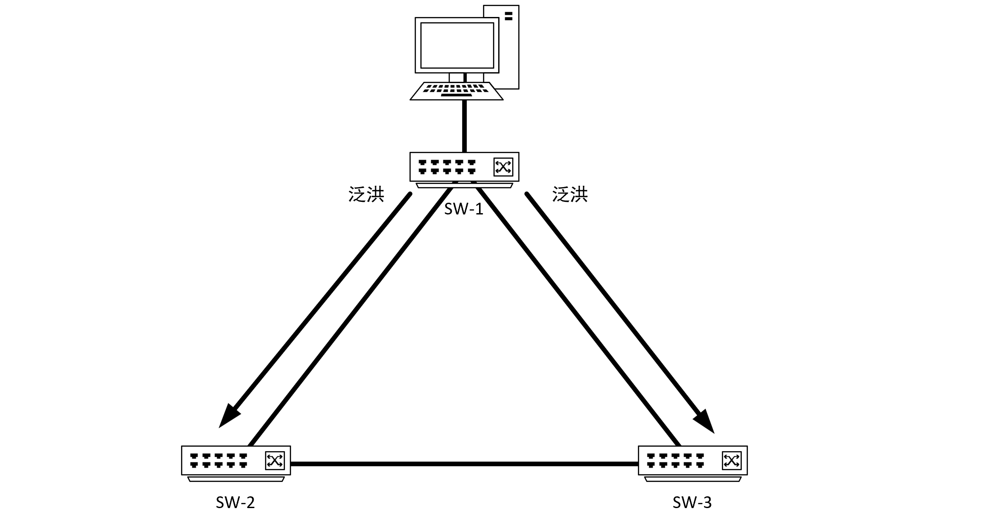

当AR-2与AR-3收到ARP包后，又会向非入接口的接口进行泛洪，可以看见ARP包又回到了AR-1，ARP包循环发送。

SW1—》SW2—》SW3—》SW1

SW1—》SW3—》SW2—》SW1

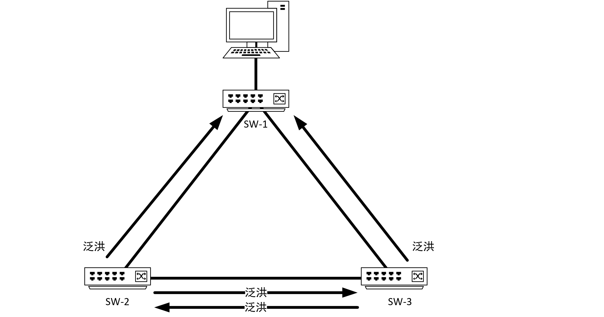

交换机更具型号而定每秒可以转发数百万，数千万个数据包，（这个参数较包转发率）如此不过多久带宽便被环路数据包占满，老的交换机甚至可以死机。

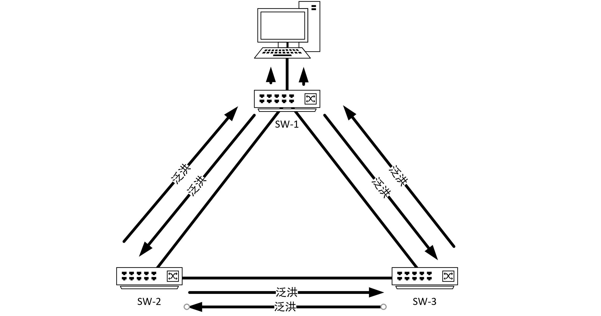

无论几台交换机，拓扑层面形成环的，便是环路。

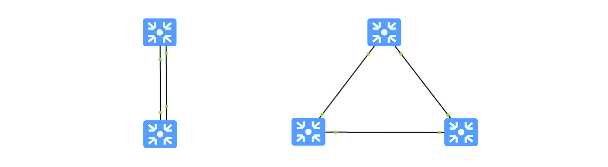

## **STP的工作过程**

### **BID（桥ID）**

都有自己的桥ID，由桥的优先级+MAC地址组成。优先级默认32768，可手动调整，范围为0-61440，步长4096（所有优先级都需要是4096的倍数，包括0），MAC为交换机的VLAN MAC，一台交换机所有的VLAN MAC都相同。桥ID全网唯一。

例如：32768.4c1f-cc84-730a

|<-------2B------>||<--------------------------6B------------------------>|

| 优先级 | MAC地址 |
| --- | --- |

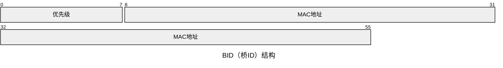

### **桥的选举**

- **选举RB（root bridge，根桥）**

桥id最小的交换机会选举成为根桥，简称RB。一个STP网络中根桥只有一个。

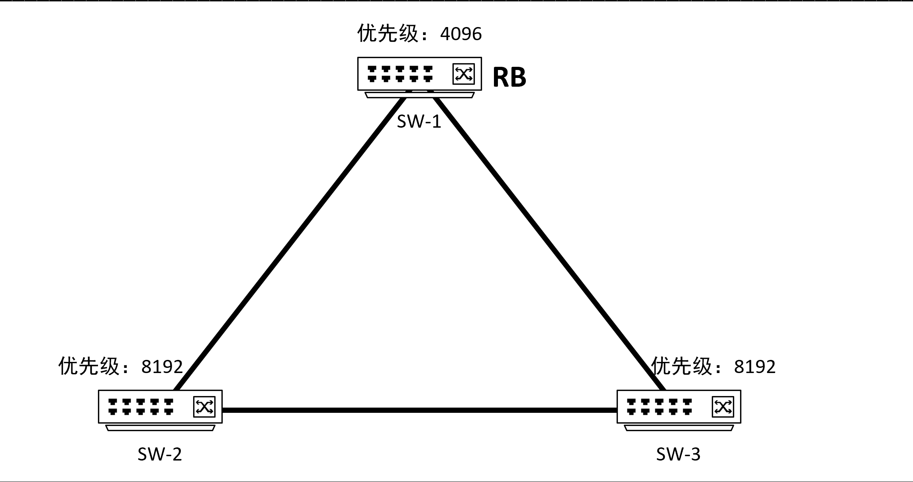

- **选举RP（root port，根端口）**

根端口是去往根桥的端口开销最小的端口，所以只在非根桥的交换机上选举，所有非根桥需要依据根路径开销计算到根桥的最短路径，每个非根桥上只有一个根端口。

每台非根桥，各个接口都会接收到BPDU，其中收到BPDU最优的端口为根端口。

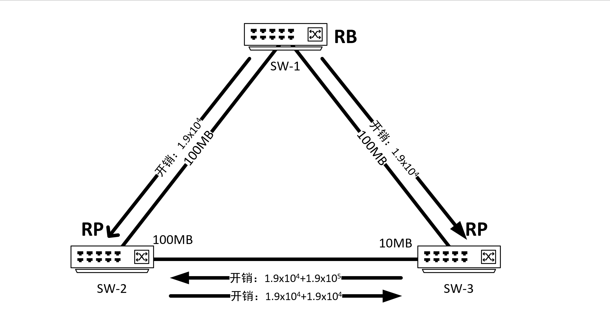

- **选举DP（Designated Port，指定端口）**

如果一个端口发出的BPDU，优于接收到的BPDU，这个接口就是指定接口。

| **分类** | **指定桥** | **指定端口** |
| --- | --- | --- |
| 对于一台设备而言 | 与本机直接相连并且负责向本机转发配置消息的设备 | 指定桥向本机转发配置消息的端口 |
| 对于一个局域网而言 | 负责向本网段转发配置消息的设备 | 指定桥向本网段转发配置消息的端口 |

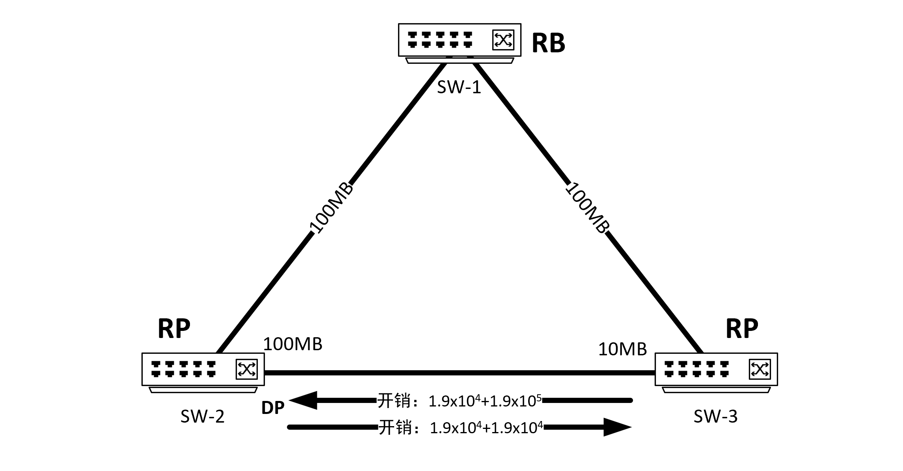

- **阻塞端口**

剩下的没有身份的端口将被阻塞。

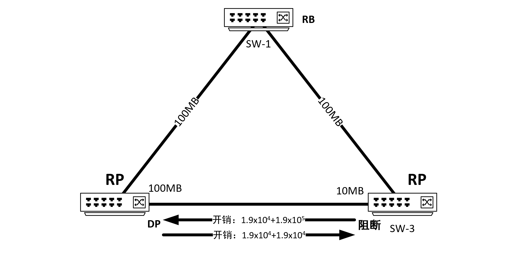

## **根路径开销**

本机到根的路径开销，标准有802.1D与802.1T现在主流使用802.1T。根桥的根路径开销为0，发送BPDU时保持该值，当非根交换机收到BPDU时，会提取其中的根路径开销值，转发时会加上出端口的根路径开销，（802.1D为入端口）。

802.1D

| 端口速率 | 10M | 10M AP | 100M | 100M AP | 1000M | 1000M AP | 10G | 10G |
| --- | --- | --- | --- | --- | --- | --- | --- | --- |
| Cost | 100 | 100 | 19 | 19 | 4 | 4 | 2 | 2 |

802.1T

| 端口速率 | 10M | 10M AP | 100M | 100M AP | 1G | 1G AP | 10 G | 10G AP |
| --- | --- | --- | --- | --- | --- | --- | --- | --- |
| Cost | 2x106 | 1.9x106 | 2x105 | 1.9x105 | 2x104 | 1.9x104 | 2x103 | 1.9x103 |

## **BPDU（桥接协议数据单元）**

- **BPDU是STP的核心报文，包含**

Root Bridge ID（根桥ID）

Sender Bridge ID（发送者桥ID）

Path Cost（路径开销）

Port ID（发送端口ID）

Message Age（BPDU存活时间）

懒得写了

## **BPDU优选**

按重上到下顺序进行BPDI优选

1. 先比较根网桥ID，越小越好
2. 比较根路径开销，越小越好
3. 发送网桥ID越小越好
4. 发送端口ID越小越好

## **STP的收敛与STP的五种状态**

### **STP状态**

STP有五种状态：Disabled，Blocking，Listening，Learning，Forwarding，交换机处于Listening和Learning状态的时间由Forward Delay计时器控制。

- **Disabled(禁用状态)**

管理员手动禁止，未开启生成树，或带端口故障时的状态，此时不转发数据，不处理BPDU。

- **Blocking（阻塞状态）**

端口刚被激活时，首先进入阻塞状态，由MAX Age决定，缺省时间为20s，交换机STP刚开启时，都认为自己是RB，经过选举，最后没有身份的人，会退回Blocking状态。此状态下不转发数据，不学习MAC。

- **Listening（监听状态）**

开始发送并接受BPDU，比较BPDU的优劣，如选举完成后仍有身份则，进入Learning状态，如没有身份，则退回Blocking状态。此状态下不转发数据，不学习MAC。

- **Learning（学习状态）**

开始学习MAC地址，构建MAC地址表，为转发做准备。此状态下不转发数据，学习MAC。

- **Forwarding（转发状态）**

学习完MAC后，正式开始转发数据。

| 端口状态 | 地址学习 | 转发/接收报文 | 接收BPDU | 发送BPDU |
| --- | --- | --- | --- | --- |
| Disabled | 否 | 否 | 否 | 否 |
| Blocking | 否 | 否 | 是 | 否 |
| Listening | 否 | 否 | 是 | 是 |
| Learning | 是 | 否 | 是 | 是 |
| Forwardin | 是 | 是 | 是 | 是 |

### **STP收敛**

当STP交换机检测到链路断开，会“直接变化“，如果交换机之间有设备连接链路断开，但端口正常up，则会等到BPDU超过MAX Age未收到时（缺省MAX Age为20s），

阻断端口会从Blocking状态 变为Listening状态，在Listening状态下保持15s，

15s过后端口会从Listening状态变为Learning状态，开始学习MAC地址，但仍不转发数据 。在Learning状态下继续保持15s。

15s过后端口从Learning状态变为Forwarding状态，开始转发数据。

状态变化：

阻塞（Blocking）🡪侦听（Listening）🡪学习（Learning）🡪转发（Forwarding）

直接变化：15+15=30s

间接收敛时间为：20+15+15=50s

MAC地址更新过程：

交换机感知到拓扑变化时会生成 TCN BPDU从根端口向上游发送，逐级传递至根桥，向根桥请求TC置位，只有根桥有权限进行TC置为。

根桥收到TCN BPDU后会在 Configuration BPDU 中置位 TC，当非根桥交换机收到TC置为的BPDU后将MAC地址表的老化时间缩短为 Forward Delay（缺省为15秒），加速过期条目清除。

## **为什么要重新学习（MAC）地址**

正常情况

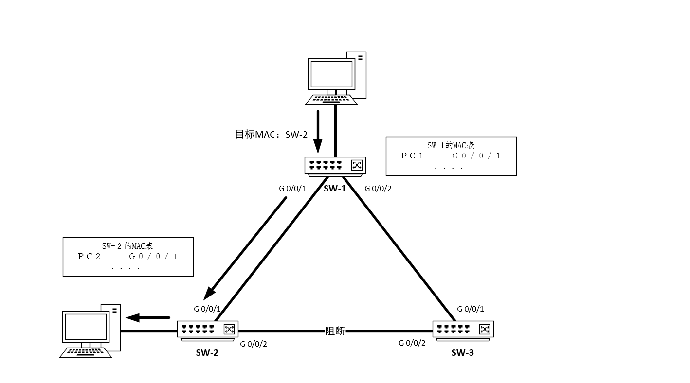

当链路故障时未更新MAC表

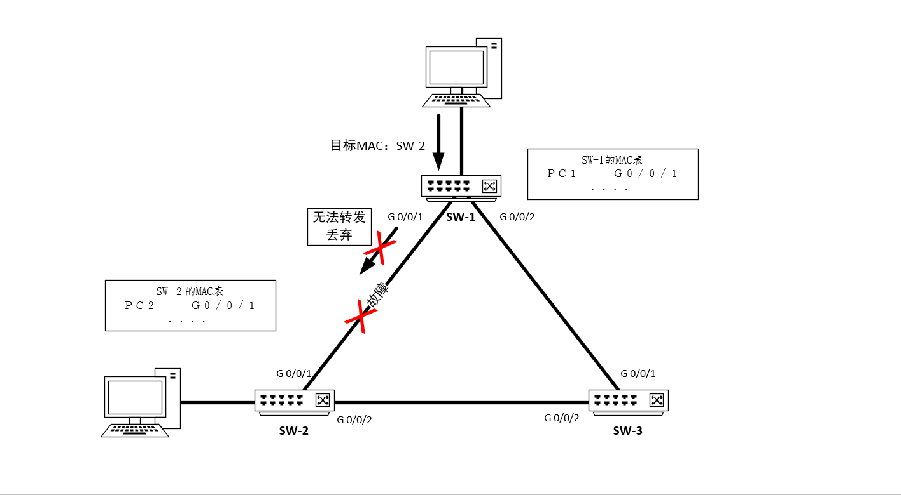

MAC表更新后

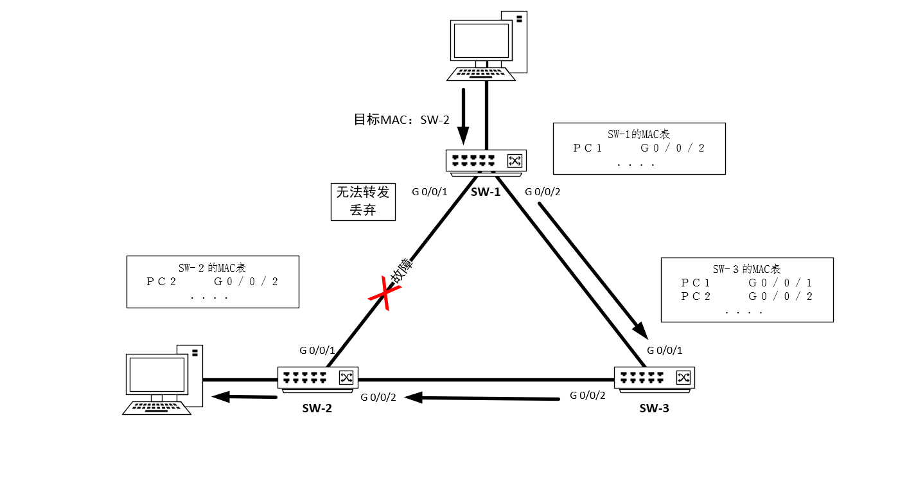

# **RSTP（快速生成树）**

RSTP是STP的升级版，基于802.1w标准，可以将收敛时间减少到几秒，但仍未解决阻塞链路不走数据，平时无用这一痛点。

## **新增端口角色**

RSTP相较STP，新增了AP和BP两个备份端口,同时增加了EP来连接终端设备。

- **AP（替代端口，Alternate Port）**

RP（根端口）的备份，被对端交换机发出的更优的BPDU阻塞的端口，平时RP正常时，AP阻塞，当RP故障时快速切换为RP。

- **BP（备份端口，Backup Port）**

DP（指定端口）的本地备份，被本季交换机发出的更优的BPDU阻塞的端口，防止同一交换机多端口连接同一网段导致环路。

- **EP (边缘接口, Edge Port)**

旧STP当拓扑中加入新的终端设备时，接口up，就会进行重新计算STP，且链路进入转发状态需要2个Forward时间，事实上，终端设备不转发数据，所以不会形成环路。

RSTP中引入了RP，绕过STP计算，当接口up后可以立即进了转状态。

## **端口状态简化**

RSTP将端口简化到了Discarding，Learning，Forwarding三种状态**。**

| **Discarding** | **不转发数据，不学习MAC地址，仅接收BPDU。** |
| --- | --- |
| **Learning** | **构建MAC地址表，但仍不转发数据。** |
| **Forwarding** | **正常转发数据并学习MAC地址。** |

## **BPDU机制**

旧STP中只有RB可以发送TC置位BPDU，RSTP所有的交换机都可以发送TC置为的BPDU。

## **检测时间加快**

STP因为早期网络质量差说要启动时需要等待30s，保证所有交换机收敛完成，实现无环。

直接拓扑变化收敛时间小于1s，间接拓扑变化时间为3倍的hello时间，6s，华为设备会再乘以一个时间因子（timer-factor），可以设置时间因子，以减少检测时间过短带来的链路震荡。

例如：时间因子为2，则6x2=12，收敛时间为12。

## **P/A机制（Proposal/Agreement）**

P/A机制的本质便是通握手允许DP（指定端口）快速进入转状态，不需等待计时器，快速完成端口角色切换。

一开始每个交换机都认为自己是RB，各个接口都是DP，发送发出P置位的BPDU。

交换机发送P置位的Proposal BPDU，对端交换机与其他接口收到的BPDU相比较。确认为最优BPDU时会回复Agreement BPDU，则可以立即打开0。

如果收到的BPDU不是最优，但比自己优，则自己停止发送P请求。

如果收到的BPDU没有自己高，但不比自己优，则会一直发送P请求，直达30s后，仍然未发现有比自己优的，本地的端口则变成DP，对端的端口变为AP。

旧STP当RP口断开时，交换机收不到DP信息，交换机便会认为自己是根桥向其他交换机发送BPDU，其他交换机收到BPDU后发现是次优BPDU，则不做处理，等待MAX Age超时才处理。实际收敛时间到了50s。

RSTP中，当交换机收到次优BPDU后，会自己判定为链路故障，立即发送更优的BPDU，使用P/A机制完成收敛。

## **保护功能**

- **BPDU保护**

边缘端口连接着终端设备，一般不会发出BPDU，如果收到说明，要么受到攻击，要么自环（单端口）了，若边缘端口意外收到BPDU，立即关闭端口防止网络震荡，需手动或自动恢复。

- **根保护（Root Guard）**

阻止非根桥通过高优先级BPDU抢占根桥地位，保护端口进入Discarding状态直至威胁消失。

- **环路保护（Loop Guard）**

检测单向链路故障，防止根端口或替代端口因BPDU丢失而错误转发数据。

- **TC泛洪保护（Topology Change Protection）**

限制单位时间内处理拓扑变更的次数，避免频繁刷新MAC表导致CPU过载。
