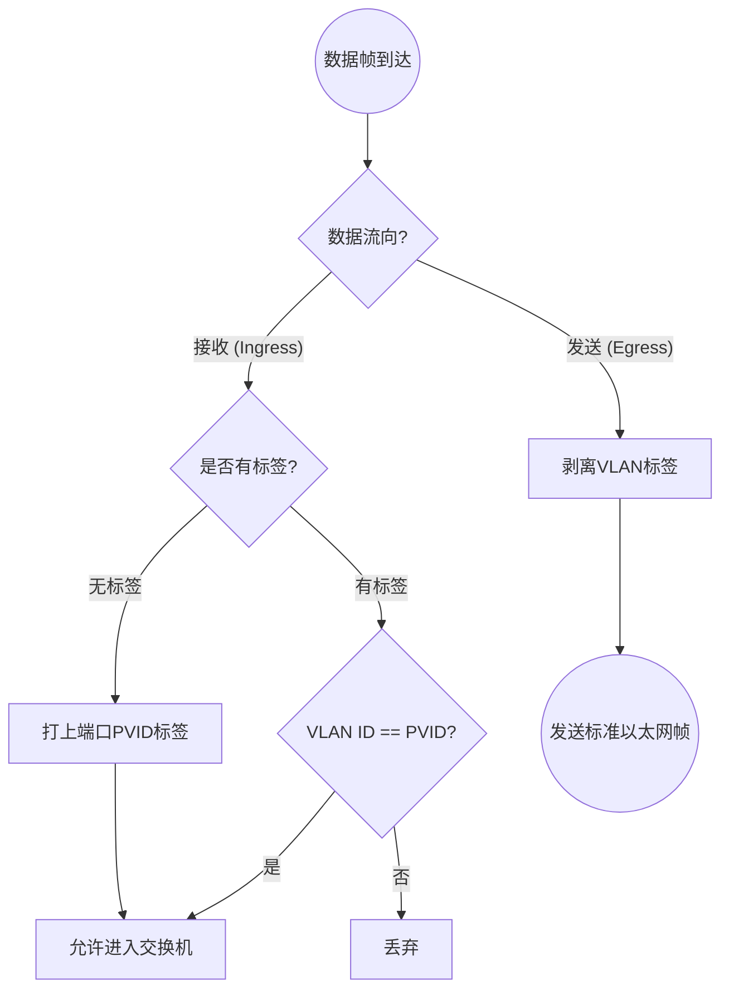
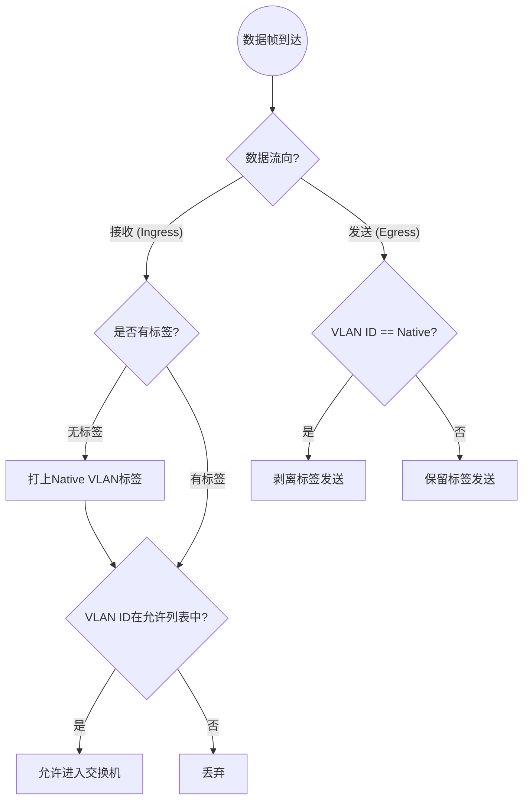
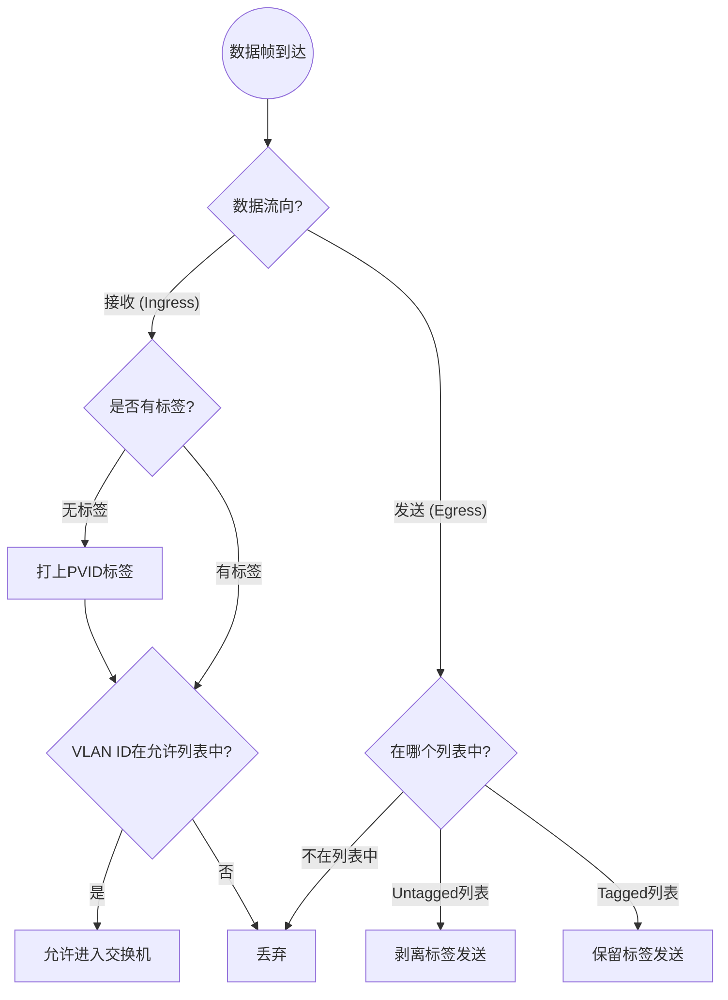

# **VLAN（Virtual Local Area Network，虚拟局域网）**

VLAN可以将一个LAN划分为多个VLAN，每个VLAN是一个广播域， VLAN内的主机间通信就和在一个LAN内一样，而VLAN间则不能直接互通，广播报文就被限制在一个VLAN内。

用于二层划分

最多可划分4094个VLAN（可以去了解一下VXLAN）

## **VLAN Tag（VLAN标签）**

IEEE 802.1Q定义了VLAN Tag，配置VLAN后，交换机在以太网的头部的S address和length/Type之间插入4字节的VLAN标签标识帧所属的VLAN。接收端交换机根据标签决定如何处理帧。

封装过VLAN Tag的数据帧

|<----------6B--------->|<----------6B--------->|<------4B----->|<--2B-->|

| D address |  | S address | VLAN Tag | Length/Type |
| --- | --- | --- | --- | --- |
| Data |  |  |  |  |
| FCS |  |  |  |  |

|<------4B----->|

Vlan Tag

|<-------------- TPID--------------->|<----------------CFI---------------->|

| TPID | PRI | CFI | VID |
| --- | --- | --- | --- |

16bit 3bit 1bit 12bit

**TPID**

用于标识数据帧类型，取值为0x8100时表示IEEE 802.1Q的VLAN数据帧。如果不支持802.1Q的设备收到这样的帧，会将其丢弃，各设备厂商可以自定义该字段的值。当邻居设备将TPID值配置为非0x8100时， 为了能够识别这样的报文，实现互通，必须在本设备上修改TPID值，确保和邻居设备的TPID值配置一致。

**CFI （Canonical Format Indicator，标准格式指示位）**

表示MAC地址在不同的传输介质中是否以标准格式进行封装，用于兼容以太网和令牌环网。CFI取值为0表示MAC地址以标准格式进行封装，为1表示以非标准格式封装。

## **VLAN ID（VID）**

VLAN ID是VLAN Tag中最关键的一部分，它标识了这个数据帧所属的VLAN，理论上限为122=4096个，但实际可用范围是VLAN1—4094。缺省情况下所以接口属于VLAN 1。

特殊VLAN

VLAN 0 : 用于标识优先级帧，但不指定任何 VLAN。

VLAN 4095 ：保留值，不可用

## **Priority（PRI， VLAN优先级）**

Priority可以让交换机对优先级更高的数据帧进行优先转发，从而保证QoS。更高的优先级值代表更高的传输优先级。例如，优先级为 7 的网络控制流量比优先级为 0 的普通数据流量具有更高的传输优先权。

目前802.1p定义了 8 个优先级别，每个级别对应不同类型的流量：

| **优先级值** | **流量类型** | **说明** |
| --- | --- | --- |
| 0 (000) | 最佳努力 (Best Effort) | 默认值，普通数据流量 |
| 1 (001) | 背景 (Background) | 批量传输，如备份等不重要的后台任务 |
| 2 (010) | 备用 (Spare) | 普通用户数据的备用优先级 |
| 3 (011) | 优质努力 (Excellent Effort) | 重要的商业应用 |
| 4 (100) | 控制负载 (Controlled Load) | 视频会议等对延迟敏感的应用 |
| 5 (101) | 视频 (Video) | 视频流，小于 100ms 延迟和抖动 |
| 6 (110) | 语音 (Voice) | 语音流，小于 10ms 延迟和抖动 |
| 7 (111) | 网络控制 (Network Control) | 网络控制流量，如路由协议 |

**配置**

// 创建类映射以匹配特定流量

Switch(config)# class-map match-all VOICE-TRAFFIC

Switch(config-cmap)# match ip dscp ef

Switch(config-cmap)# exit

// 创建策略映射并设置优先级

Switch(config)# policy-map QOS-POLICY

Switch(config-pmap)# class VOICE-TRAFFIC

Switch(config-pmap-c)# priority

Switch(config-pmap-c)# exit

// 应用策略到接口

Switch(config)# interface gigabitethernet 0/1

Switch(config-if)# service-policy input QOS-POLICY

## **接口模式与对VLAN Tag的处理**

### **Access**

收到数据帧时：

如果为无标签帧则为其添加该端口的VLAN Tag，

如果为带标签帧，则判断VLAN ID是否与端口VLAN ID相同，相同则放行，不相同则丢弃。

发送数据帧时：

交换机总是会移除VLAN标签后再将数据帧发送出去，终端不处理VLAN Tag终端设备收到的永远是不带VLAN Tag的标准以太网帧。

一个Access端口只能属于一个VLAN

### **Trunk**

收到数据帧时：

如果为无标签帧则为其添加Trunk端口的原生VLAN（Native VLAN）

如果收到带标签帧则判断VLAN ID是否在允许通了列表中，是则放行，不是则丢弃。

发送数据帧时：

于非原生VLAN的帧，保留VLAN标签并发送，对于原生VLAN帧缺省情况下，移除VLAN标签后发送。

一个Trunk端口可以属于多个VLAN，（感觉不严谨）可以让多个VLAN的流量通。

### **Hybrid**

Hybrid端口是一种混合型端口，整合了Access端口和Trunk端口的特性。这种端口类型主要在华为、H3C等设备上提供，思科设备通常不使用Hybrid这个术语。

接收数据帧时：

如果为无标签帧则为该帧归入Hybrid端口的PVID。

如果收到带标签帧则判断VLAN ID是否在允许通了列表中，是则放行，不是则丢弃。

发送数据帧时：

对于需要不带标签传输的VLAN，移除VLAN标签后发送对

于需要带标签传输的VLAN，保留VLAN标签并发送

### **三种端口类型的对比**

| 特性 | Access端口 | Trunk端口 | Hybrid端口 |
| --- | --- | --- | --- |
| 主要用途 | 连接终端设备 | 交换机互连 | 多功能场景 |
| 可属于的VLAN数量 | 1个 | 多个 | 多个 |
| 接收无标签帧处理 | 归入指定VLAN | 归入原生VLAN | 归入PVID |
| 发送帧是否去标签 | 全部去标签 | 原生VLAN去标签，其他保留 | 可配置哪些VLAN去标签 |
| 灵活性 | 低 | 中 | 高 |
| 配置复杂度 | 简单 | 中等 | 较复杂 |

实验

## **参考**

https://support.huawei.com/enterprise/zh/doc/EDOC1100088136