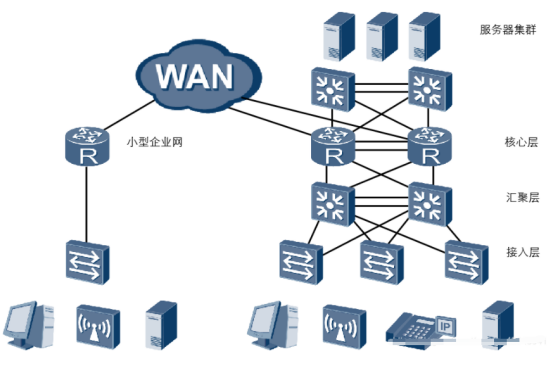

# 企业网络架构基础

**小型企业：**

一般采用**扁平网络结构**进行组网，

**优点：**能够满足用户对资源访问的需求，并有较强的灵活性，同时又能大大减少部署和维护成本，

**缺点：**网络通常缺少冗余机制，可靠性不高，容易发生业务中断

**中大型企业：**

一般采用**三层网络架构**进行组网，

**优点：**冗余备份

**缺点：**设备复杂，成本高

**扁平网络结构：**

扁平网络旨在尽量缩短延迟，提高可用带宽，同时提供虚拟化环境下所需的众多网络路径。由于其将传统的接入、汇聚、核心三层网络架构进行了简化，因此人们形象地将其冠以“扁平”的称号。

**三层网络架构：**

**接入层**：主要设备为二层交换机（没有路由功能）

作用：将大量用户接入网络

特点：提供大量的接口，较少地考虑冗余性

**汇聚层**：主要设备为三层交换机（接口多，把路由器和交换机的特点结合起来）

作用：将用户接入进行汇聚和流量汇总

特点：提供基于策略的连接，下发大量的复杂策略，较多地考虑冗余性

**核心层：**主要设备为路由器

作用：高速的数据交换

特点：一定要保证核心层的高可靠性，较少地考虑策略的下发，让核心层专心进行高速转发。如果核心层效率降低，会导致公司整体网络性能降低。

**WAN：**（百度，谷歌，阿里，腾讯，运营商网）

**ISP运营商网络：**电信、联通、移动

**服务器集群：**连接在核心层上面，对外提供服务，区别于接入层交换机下的服务器（不对外开放的）

## SLA

SLA（Service-Level Agreement），即服务等级协议。这个协议并非网络通信协议，而是类似于保密协议这样现实中的商业合同。
它是**服务提供方**（如云服务商、网络运营商、运维团队等）与**客户或使用方**之间就**服务质量、性能指标和责任义务**达成的正式协议。
