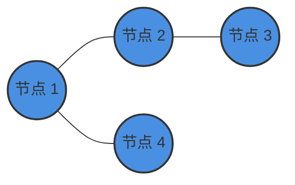
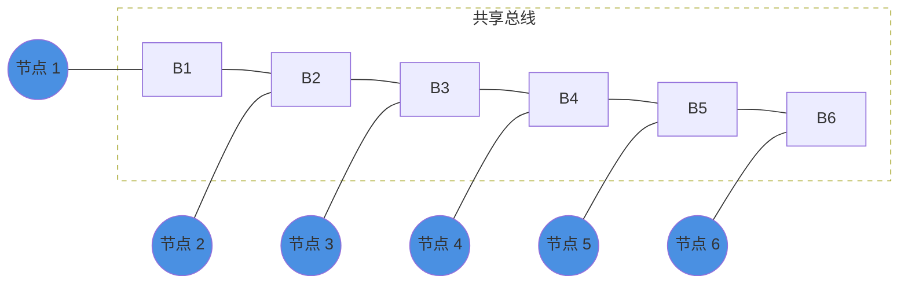
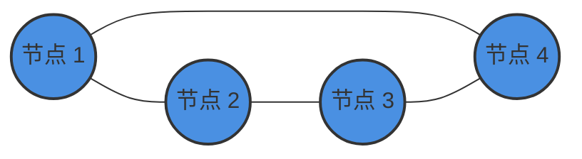
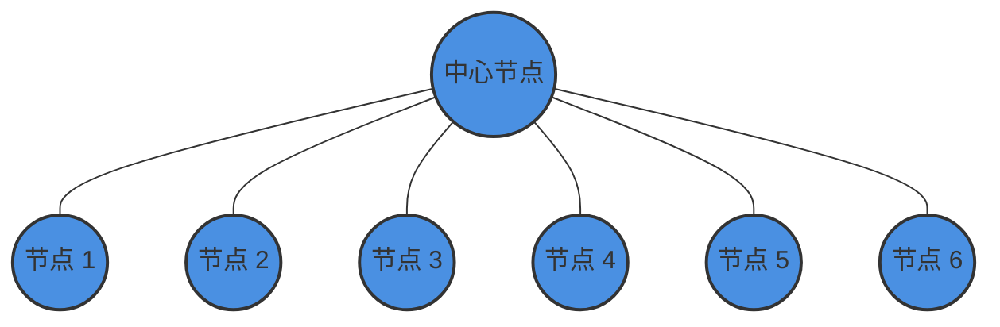
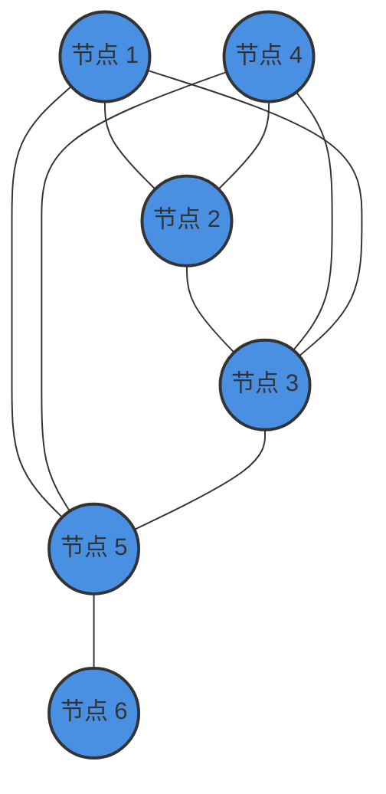
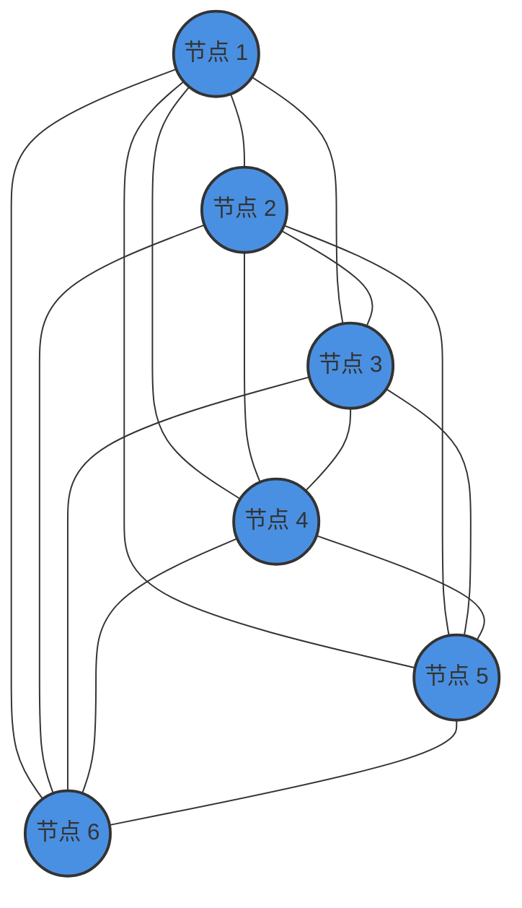
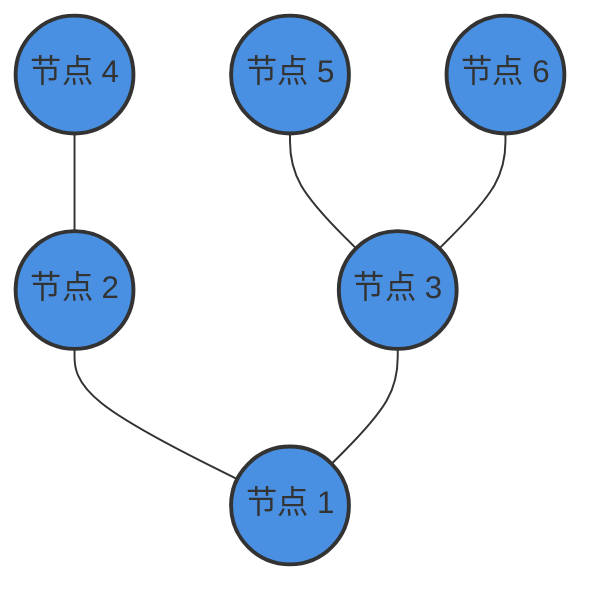
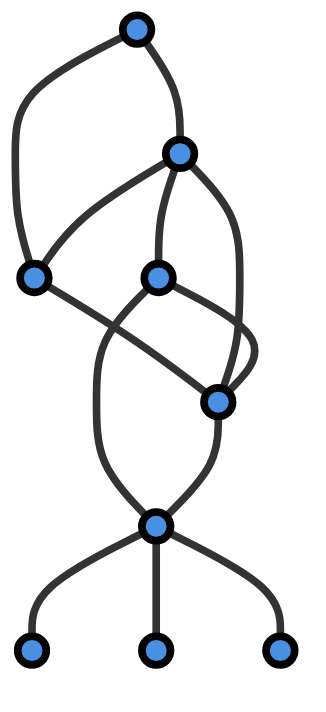

# **网络拓扑：**

用来描绘网络结构的示意图

## 拓扑类型

根据接口，线缆，封装判断

## P2P拓扑

点对点拓扑是所有网络拓扑中**最简单**的，这种拓扑中的网络由两台计算机**点对点**直接连接。

### 优点

- 连接更快、更可靠，因为是直接连接。
- 不需要网络操作系统。
- 不需要昂贵的服务器，因为使用单个工作站就可以访问文件。
- 不需要任何专门的网络技术人员，因为每个用户都设置了自己的权限。

### 缺点

- 只适用于计算机距离很近的小区域，这是最大的缺点。
- 不能集中备份文件和文件夹。
- 除了权限之外，没有任何安全性

## 总线拓扑

总线拓扑使用一根电缆连接所有的节点，主缆充当整个网络的主干，网络中的一台计算机充当计算机服务器，当它有两个端点时，称为**线性总线拓扑**。

B1-B6仅是总线上的连接点，所有计算机都连接到总线上。

### 优点

- 电缆的成本非常低，因此被广泛用于构建小型网络。
- 既便宜又易于安装。
- 广泛适用于规模较小、简单或临时的网络。
- 总线上的计算机只监听正在发送的数据，而不负责将数据从一台计算机移动到另一台计算机。

### 缺点

- 链路上一台设备发生故障，则整个系统将崩溃。
- 当网络流量很大时，很容易在网络中产生冲突。
- 当网络流量较大或节点过多时，网络的性能会显著降低。
- 电缆的长度总是有限的，所以不利于扩展。

## 环形拓扑

在这种拓扑中，每台设备正好有两台相邻设备用于通信，之所以被称为环形拓扑，因为它的形成类似于环。

在此拓扑中，每台计算机都连接到另一台计算机，都是最后一个节点与第一个节点组合在一起。

此拓扑使用**令牌**将信息从一台计算机传递到另一台计算机，所有消息都以相同的方向通过环。

### 优点

- 易于安装和重新配置。
- 添加或删除环内设备拓扑只需要移动两个连接。
- 所有计算机都是平等访问的。
- 更快的错误检查和确认。

### 缺点

- 单向流量。
- 单环中断可能会导致整个网络中断。
- 在环中，拓扑信号一直在循环，这会产生不必要的功耗。
- 故障排除非常困难。
- 添加或删除计算机可能会干扰网络活动。

## 星型拓扑

在星型拓扑中，所有计算机都在集线器的帮助下连接，中心的机器被称为**中心节点**，所有其他节点都使用此中心节点连接，它在局域网上最受欢迎，因为它们既便宜又易于安装。

### 优点：

- 易于故障排除、设置和修改。
- 某些节点即使发生故障，其他节点仍可正常工作。
- 性能快，节点少，网络流量极低。
- 添加、删除和移动设备很容易。

### 缺点：

- 集线器或集中器出现故障，连接的节点将被禁用。
- 安装星型拓扑的成本很高。
- 繁忙的网络流量有时会显著降低总线速度。
- 性能取决于集线器的容量。
- 电缆损坏或端接不正确可能会导致网络瘫痪。

## 网状拓扑

在网状拓扑中，网络上的每台计算机相互连接，所有设备之间建立**点对点**连接，提供高级别的**冗余**，因此即使一条链路出现故障，数据也可以通过另一条路径到达目的地。

### 网状拓扑类型

- 部分网状拓扑：

在这种类型的拓扑中，大多数设备的连接方式几乎与全网状拓扑相似,唯一的区别是，很少有设备只连接两到三个设备。

- 全网状拓扑：

在此拓扑中，每个节点或设备都直接相互连接。

### 优点

- 可以在不中断当前用户的情况下扩展网络。
- 由于节点有专用链路，因此没有流量问题。
- 专用链路可帮助您消除流量问题。
- 网状拓扑是健壮的。
- 它有多条链路，因此如果任何一条路由被阻塞，还可以使用其他路由进行数据通信。
- P2P链路使得故障识别和隔离过程变得容易。
- 通过将所有系统连接到一个中心节点来帮助您避免网络故障。
- 每个系统都有其私密性和安全性。

### 缺点

- 安装很复杂，因为每个节点都连接到每个节点。
- 由于使用了更多的电缆，所以价格昂贵。
- 复杂的实现。
- 它需要更多空间用于专用链路。
- 由于布线的数量和输入输出的数量，它的实施成本很高。
- 需要很大的空间来铺设电缆。

## 树形网络

树形拓扑有一个根节点，所有其他节点都连接在一起，形成一个层次结构，因此，它也称为**分层拓扑**。

此拓扑将各种星形拓扑集成到一条总线中，因此称为**星形总线拓扑**。

树型拓扑是一种非常常见的网络，类似于**总线**和**星型**拓扑。

### 优点

- 一个节点的故障永远不会影响网络的其余部分。
- 节点扩展既快捷又简单。
- 很容易错误检测。
- 易于管理和维护。

### 缺点

- 布线密集扑。
- 如果添加更多的节点，则其维护困难。

## 混合拓扑

**组合了两个或多个拓扑**，如下图所示，该网络不能以一个标准拓扑来衡量。

~~ 为什么这么混乱？你要问微软的mermaid渲染去。 ~~

**例如，您可以在上图中看到，在一个部门的办公室中，使用的是星型拓扑和P2P拓扑，当两个不同的基本网络拓扑连接时，就会产生混合拓扑。**

### 优点

- 提供最简单的错误检测和故障排除方法。
- 高效灵活的网络拓扑。
- 可扩展的。

### 缺点

- 混合拓扑结构的设计比较复杂。
- 成本最高
- 如果集线器或集中器出现故障，连接的节点也会被禁用。