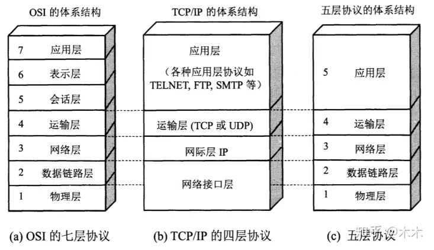

# 网络模型

## OSI

### 1.物理层

定义电压、接口、线缆标准、传输距离等

**物理层介质**:

- 同轴电缆:细缆和粗缆
- 双绞线：UTP.STP
- 光纤：单模、多模
- 无线：红外线、蓝牙Blue Tooth、WLAN技术

### 2.数据链路层

**数据链路层的功能**:

- 编帧和识别帧
- 数据链路的建立、维持和释放
- 传输资源控制
- 差错验证
- 流量控制
- 寻址
- 标识上层数据

局域网数据链路层分为LLC子层和MAC子层

### 3.网络层

**网络层功能**:

- 编址
- 路由
- 拥塞控制
- 异种网络互连

### 4.传输层

**传输层功能**:

- 分段上层数据
- 建立端到端连接
- 透明、可靠传输
- 流量控制

**传输层协议**:

主要有TCP/IP协议族的TCP协议和UDP协议，以及IPX/SPX协议组的SPX协议等。

### 5.会话层

**会话层功能**:

- 主机间通信
- 建立、维护、终结应用程序之间的会话
- 文字处理、邮件、电子表格等

### 6.表示层

**表示层功能**:

- 定义数据格式与结构
- 协商上层数据格式

**表示层协议**:

ASCII、MPEG、JPEG等

### 7.应用层

**应用层功能**:

为应用程序进程（比如文字处理、邮件、电子表格）提供网络服务

**应用层协议**:

SQL.NFS、RPC、HTTP等

## TCP/IP 4层

### 什么是TCP/IP协议

TCP/IP（传输控制协议/网际协议）是指能够在多个不同网络间实现信息传输的协议簇。TCP/IP协议不仅仅指的是TCP 和IP两个协议，而是指一个由FTP、SMTP、TCP、UDP、IP等协议构成的协议簇， 只是因为在TCP/IP协议中TCP协议和IP协议最具代表性，所以被称为TCP/IP协议。

### 1.网络接口层

**负责将数据包送达正确的目的**。

- 物理线路和接口
- 链路层通信

**主要协议**：

以太网，FDDI，令牌环，SLIP，HDLC，PPP，X.25，帧中继，ATM

### 2.网络层

**负责将数据包送达正确的目的**。

- 数据包的路由
- 路由的维护

**主要协议**：

- IP
- ICMP
- IGMP

### 3.传输层

**负责提供端到端通信**。

- 数据完整性校验
- 差错重传
- 数据的重新排序

**主要协议**：

- TCP
- UDP

## 4.应用层

**负责处理特定的应用程序细节**。

- 远程访问
- 资源共享

**主要协议**：

- Telnet-FTP
- TFTP-SMTP
- POP3-SNMP
- HTTP

## OSI与TCP/IP4层与TCP/IP5层关系

## 数据的封装和解封

- 应用数据需要经过**每一层处理**之后才能通过网络传输到达目标端
- OSI把每一层数据称为**PDU（协议数据单元）**
- TCP/IP根据不同分层使用了**段，包，帧，比特**
- **逐层向下**传递数据，并添加报头和报尾的过程称为**封装（打包）**
- 反之，接收方需要**逐层向上**传递数据，成为**解封（拆包)**。
