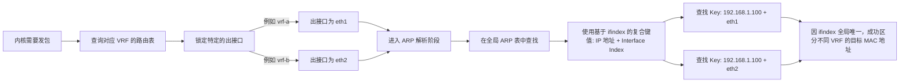

# VRF(虚拟路由转发)

VRF技术将一个物理上单一的网络设备虚拟成多个虚拟网络设备。这些设备有独立的路由表、接口和转发决策。

VRF并不是像VM那样再虚拟出一个操作系统，而是将网络设备的转发功能进行虚拟化。当接口被绑定到特定的VRF时，该接口接收到的所有数据包都将仅在该 VRF 的独立路由表中进行查找和转发。全局路由表对此流量毫无感知。

---

## 网络设备物理中的实现

- **VRF_ID**

当创建一个VRF时，系统会为它分配一个硬件级的全局唯一``VRF_ID``。

数据包从物理端口进入交换芯片。芯片的端口逻辑模块发现该端口绑定了VRF-A，于是会在数据包的内部报文头中打上VRF-A的``VRF_ID``元数据标签。

芯片查找TCAM时，使用的 Key 为``[VRF_ID=10] + [10.1.1.1]``。由于TCAM中烧录的表项也都带有对应的VRF_ID前缀，芯片在纳秒级时间内就能命中属于VRF-A的硬件表项。

---

## OS中的实现

### **独立的路由表**

Linux内核本身有能力维护多张独立的RIB和FIB，只需要将每张表分配一个唯一的ID，便可以将这些表分隔开，一般的，这个ID长度为32位，范围为0~4294967295。

### **RPDB（Routing Policy Database，路由策略数据库）**

内核需要知道什么数据包该查找哪张表，RPDB它负责管理和维护路由策略。当一个数据包到达网络接口时，RPDB会根据预定义的规则来决定应该使用哪个路由表进行路由决策。

### **NEWNET Namespaces（网络命名空间）**

RPDB和多路由表只对网络层进行了隔离，但套接字Socket、ARP表等网络资源还是全局共享的。Namespaces便用与此的隔离。

Namespace是由linux内核所提供的资源隔离机制，它可以将不同的资源放入同一个Namespace当中对其进行隔离，并且可以对一些运行需要的系统资源实现虚拟化，Namespace与其他Namespace之间的资源互不干扰。

内核通过``clone()`` 系统调用创建进程时，传入``CLONE_NEWNET``标志,为VRF创建一个网络命名空间。

---

## OS中的原生VRF

### **L3 Master Device**

在Linux 4.3中引入了轻量级的原生VRF支持--VRF Netdev，在这里VRF在内核中被抽象成了一个虚拟的网络接口（L3 Master Device）。可以把物理接口作为Slave挂载到这个VRF接口下。

在L3 Master Device下，所有的VRF都运行在同一个全局网络命名空间下。这便又出现了之前的问题:套接字Socket、ARP表该如何隔离？

在Linux内核的sock结构体中，有一个字段叫``sk_bound_dev_if(Socket 绑定设备索引)``。它是Linux内核源码struct sock里的一个整数型字段，它存储的是一个 ifindex（接口索引号）。当它的值为0时，代表全局可用；当它大于0时，表示他与某个网络接口绑定。后续的隔离，验证中都会使用到这个值或者继承这个值的值。



### **Socket的隔离**

>在全局命名空间下，所有的TCP/UDP Socket都挂在同一棵内核哈希树上。

当一个属于VRF-A的应用程序创建Socket时，必须调用``setsockopt``使用 ``SO_BINDTODEVICE``参数，将这个Socket强行绑定到VRF-A的VRF Master接口上。内核Socket结构体中的``sk_bound_dev_if``字段上就会被设置为VRF-A接口的索引号。(类似为这个Socket打上了Tag以方便辨别)

引入VRF功能后，内核的负责在收到数据包时寻找对应Socket的函数``inet_lookup``逻辑被重写了，旧的逻辑为只检测``源IP、目的IP、源端口、目的端口``四元组。

重写后逻辑：

```text
收到数据包后，内核不仅匹配IP和端口，还会检查这个包是从哪个VRF Master进来的，
并比对Socket的sk_bound_dev_if。

如果包从vrf-a进来，即使vrf-b中有一个监听0.0.0.0:80的Socket，内核也会认为
“未找到 Socket”并拒绝连接。
```

即在原本的四元组上增加了``sk_bound_dev_if``,变成了五元组。

Socket 发包路径:

```text
tcp_v4_connect()
  └─ sk->sk_bound_dev_if = vrf-a ifindex
       └─ ip_route_output_flow()
            └─ l3mdev_master_ifindex_by_index(sk_bound_dev_if)
                 → 强制使用 tb_id=100，绝不查主路由表
```

Socket 收包路径:

```text
ip_rcv_finish()
  └─ ip_route_input_noref(skb, dst, src, tos, dev=eth0)
       └─ l3mdev_fib_table(eth0->master)  → 返回 tb_id=100
            └─ fib_lookup(net, fl4, res, tb_id)
                 只在 table 100 查找，table 200 不可见
```

### **eBPF(Extended Berkeley Packet Filter)**

BPF的介入是为了解决老旧程序的兼容性问题。

当执行``ip vrf exec vrf-a ping 1.1.1.1``时，系统会创建一个临时的Cgroup，并挂载一个eBPF钩子程序到这个Cgroup的cgroup/sock_create挂载点。

在这个Cgroup下启动的任何进程，只要调用系统调用创建Socket，eBPF程序就会在内核态静默拦截，并强行将其sk_bound_dev_if字段修改为vrf-a的接口索引号。应用程序在无察觉的情况下，就被绑定在了特定的VRF中。

```text
执行命令: ip vrf exec vrf-a ping 1.1.1.1
    └─系统创建临时 Cgroup
        └─系统挂载 eBPF 钩子程序到 Cgroup 的 cgroup/sock_create 挂载点
            └─进程在临时 Cgroup 下启动
                └─进程调用系统调用创建 Socket
                    └─eBPF 程序在内核态静默拦截
                        └─强行修改 sk_bound_dev_if 字段为 vrf-a 的接口索引号
                            └─应用程序在无察觉情况下被绑定在特定的 VRF 中
```

### **基于ifindex的复合键值**

在L3 Master Device架构下，整个Namespace依然只有一张全局的邻居表。在此使用了基于ifindex的复合键值对其进行隔离。（类似MPLS VPN的RD）

在Linux内核的邻居表中，一个ARP表项的Key改为了``IP 地址 + Interface Index``。

假设eth1属于vrf-a，eth2属于vrf-b，它们对端连接的设备IP都是192.168.1.100。

当内核需要发包时，路由表查询会锁定出接口。vrf-a的路由表指出下一跳必须从eth1 出去。随后进入ARP解析阶段，内核会在全局ARP表中查找[192.168.1.100 + eth1]的 MAC地址。同理，vrf-b发出的包会去查找[192.168.1.100 + eth2]。

因为eth1和eth2的ifindex绝对不可能相同，所以在同一张全局ARP表中，便可以区分出两个不同的条目。



### **限制广播域与ARP回应**

为了防止eth1收到的ARP请求被eth2回应，内核在引入VRF时强化了L3 Domain（三层域）的概念，在处理收到ARP请求的内核的函数``arp_process``中加入了VRF校验钩子。

当系统从eth1收到请求目标为10.0.0.1的ARP Request时，内核会检查eth1的Master是谁，发现是vrf-a，然后只在vrf-a的路由表中查找该IP是否属于本机。只有在这个特定的VRF域内验证通过，内核才会发送ARP Reply。

ARP 隔离路径：

```text
arp_rcv()
  └─ arp_process(dev=eth0)
       └─ l3mdev_master_ifindex(eth0)  → 返回 VRF-A ifindex
            └─ __neigh_lookup(tbl, &ip, dev)
                 ARP 条目与 dev 绑定，不跨 VRF 查找
```

### **sk_buff**

sk_buff (Socket Buffer) 代表了一个游走在协议栈中的数据包。L3 Master Device 通过劫持sk_buff的解析路径来实现隔离

- **Ingress (入方向)**：

物理网卡eth1收到包，生成sk_buff。在进入网络层之前，内核的 l3mdev钩子会触发。它发现eth1是一个Slave设备，于是它将这个sk_buff的L3域指针强行切换为 Master 设备（vrf-a）。接下来的 ip_route_input 就会乖乖去查 vrf-a 绑定的那张独立路由表。

- **Egress (出方向)**：

Socket层面已经被sk_bound_dev_if锁死了出接口域，生成的sk_buff天生就带着vrf-a的标记，直接被送入对应的独立路由表查找出接口和下一跳。

### **路由泄露**

> 路由泄露（Route Leaking）是指让不同 VRF 之间有选择地共享路由，而不是完全隔离



- **FIB静态路由泄露**

从Linux 4.8内核开始，L3 Master Device原生支持将下一跳指向另一个VRF的Master设备。

必须开启内核转发，否则跨接口的数据包会被静默丢弃。

```bash
sysctl -w net.ipv4.ip_forward=1
```

```bash
# 让 VRF-A 能找到 VRF-B 的网段
ip route add 10.2.2.0/24 dev vrf-b table 10

# 回程路由：让 VRF-B 能找到 VRF-A 的网段（路由泄露必须是双向的）
ip route add 10.1.1.0/24 dev vrf-a table 20
```

当vrf-a里的进程向10.2.2.0发包时，内核查表10，发现出接口是 vrf-b。此时，L3 Master Device 机制会被触发，内核会原地修改这个sk_buff的sk_bound_dev_if属性，将其L3域从vrf-a切换到vrf-b，然后协议栈会拿着这个包继续去查vrf-b对应的路由表20，最终找到真实的物理出接口并发送出去。

- **ip rule**

内核在处理sk_buff准备查路由表之前，会先过一遍ip rule。这种方式相当于在包进入具体VRF的FIB之前，就被修改进入了对端的FIB树里。

```bash
# 当流量从 vrf-a 进入，且目的是 10.2.2.0/24 时，直接去查表 20 (VRF-B)
ip rule add iif vrf-a to 10.2.2.0/24 lookup 20

# 回程流量策略
ip rule add iif vrf-b to 10.1.1.0/24 lookup 10
```

- **FRR 路由引入**

如果你在 Linux 上部署了白盒交换机架构\或使用 FRRouting (FRR) 作为控制面,可以利用 BGP/OSPF 守护进程在不同 VRF 实例之间动态泄露路由。

FRR的zebra守护进程会自动将这种高级别的``import``意图，转换为Linux内核底层的``ip route``和``Netlink``调用。它会自动监听vrf-b路由表的变化，并动态地在 vrf-a的路由表中写入带有dev vrf-b的内核路由条目。

```bash
# 进入 VRF-A 的 BGP 实例
router bgp 65000 vrf vrf-a
 address-family ipv4 unicast
  # 核心指令：直接从 VRF-B 导入所有路由
  import vrf vrf-b
 exit-address-family
!
# 进入 VRF-B 的 BGP 实例
router bgp 65000 vrf vrf-b
 address-family ipv4 unicast
  import vrf vrf-a
 exit-address-family
```
