# **BGP（边界网关协议）(Border Gateway Protocol）**

由于网络的不断扩大，整个网络使用IGP路由便会产出大量的路由信息，并且链路状态路由协议也会透露网络的拓扑信息，对企业带来一定风险。为方便管理网络被分成了不同的AS（自治系统）。早期，EGP（外部网关协议）被用于实现在AS之间动态交换路由信息。但是EGP设计得比较简单，只发布网络可达的路由信息。BGP是为取代最初的EGP而设计的另一种外部网关协议，现在BGP已经成为唯一主流的EGP协议。

- EGP
- 基于TCP（端口号179）
- 应用层协议
- 只传递路由信息，不暴露AS内的拓扑信息
- 触发式更新
- 没有周期性更新
- 矢量性协议
- 支持 MPLS/VPN
- 提供路由聚合和路由衰减
- 需要指定邻居

---

## **AS（自治系统）**

一组互联的IP地址集合，AS用自治系统号（ASN）标识。在互联网中ASN受互联网地址分配机构（IANA）统一管理。ASN范围1-65535，其中1-64511是注册的因特网编号（公网），64512-65535是私有网络编号。

每个AS通常由一个或多个路由器和与之相连的子网组成，这些路由器共同遵循同一套路由协议，形成一个统一管理和控制的网络单元。AS可以使一个网络管理员全部控制该网络的路由策略和流量分发。

AS之间需要直连路由，通过VPN协议构造逻辑直连进行邻居建立。

AS之间可能是不同机构，公式，相互之间无法完全信任，使用IGP可能存在暴露AS内部的网络信息的风险。

AS之间通常使用EGP进行邻居的建立。

### **IXP（互联网交换点）**

IXP又称IXes，IXPs和IX，互连网的基础设施之一，用于将多个不同的AS之间连接的集中交换平台。

典型的IX具备以下特点：

1）中立性：一般由非电信运营商控制的第三方建立并运营；

2）对等：接入IX平台的各家运营商之间交换流量时，一般采用免费对等互联策略（Peering);

3）微利或非盈利性：IX平台本身只提供接入平台，不参与成员间的流量交换，在收费模式上只收取端口占用费，无论是科研机构建立的IX（如香港HKIX）还是商业性质的IX（如AMS-IX）都是如此。

---

## **BGP版本**

- **早期BGP版本**

1. **BGP-1**
    - **时间**：1989年 **RFC文档**：RFC 1105

2. **BGP-2**
    - **时间**：1990年 **RFC文档**：RFC 1163

3. **BGP-3**
    - **时间**：1991年 **RFC文档**：RFC 1267

- **BGP-4（现在主流）**

1994年开始使用BGP-4（RFC 4271）。2006年后单播IPv4网络使用的版本为BGP-4，现在所说的BGP一般都指BGP-4。

其他网络使用MP-BGP（RFC4760）（多协议BGP）。

IPv6网络使用BGP-4+，BGP-4+属于MP-BGP。

---

## **BGP对等体**

- **BGP发言者**

运行BGP的路由器被称为BGP发言者（BGP Speaker），或BGP路由器。

- **BGP对等体**

两个建立BGP会话的路由器互为BGP对等体（Peer），BGP对等体之间交换路由表

---

## **路径矢量协议**

路径矢量协议相较于链路状态协议，不会发送拓扑信息，相较于距离矢量有不只直接传输路由表，而是直接发送路由条目，每个路由条目携带**完整路径信息，**如经过的自治系统列表，从而判别路由信息。

---

## **BGP类型**

- **IBGP**

运行在同一AS内部的BGP，由于BGP为路径矢量协议，IBGP传播路由具有水平分割，一个AS内的对等体要建立全连接关系（Full-Mesh），需要用联盟或借助路由反射器（Route Reflector）进行路由传播。

（若网络中有 N个节点，全连接的总链路数为 N(N−1)/2。）

- **EBGP**

运行在不同AS之间的BGP。通过AS_Path属性记录路径，丢弃包含本地AS的路由，实现防环。

---

## **BGP联盟**

BGP联盟就是将一个大的AS分割为多个子AS**（Sub-AS）**，被分割的AS本身将成为联盟，子AS也叫成员AS。每个子AS内部运行独立的iBGP，子AS之间通过**联盟内eBGP**（类似eBGP但保留iBGP特性）交换路由。

通过联盟，网络管理员可以在保持对外呈现单一AS的同时，简化内部路由管理。

- 1. 在联盟内部将会保留联盟外部的next_hop属性。
- 2．通告给联盟内的路由的MED属性在整个联盟范围内保留。
- 3．Local Preference属性在整个联盟范围内保留，而不只是在通告的成员AS内。
- 4．在联盟内将成员的AS号加入AS_PATH中，但不会将联盟内的AS号通告到联盟之外。在联盟中，AS_ PATH属性又添加了两种类型AS-CONFED-SEQUENCE、AS-CONFED-SET,默认联盟将成员的AS号以AS-CONFED-SEQUENCE的形式在AS_ PATH当中列出，如果在联盟内配置了聚合，AS号将以AS-CONFED-SET形式列出。
- 5．AS_PATH中的联盟AS号用于避免环路，但是在联盟选择最短的AS_ PATH路径时不会比较联盟AS号。
- 6．联盟内相关的属性传出联盟时将会被自动删除，无需过滤子AS号等信息操作。

---

## **RR路由反射器**

RR可以把从IBGP对等体学到的路由反射（从新发送）到其他IBGP对等体的BGP设备中，类似OSPF网络中的DR。可以简化IBGP的连接，也可以通过RR传播路由使得对等体建立全连接关系。

### **角色**

- **RR（路由反射器）**

负责接收、处理并反射路由更新的中心节点。

- **Client（客户端）**

与 RR 直接连接的 BGP 路由器，仅需与 RR 建立 iBGP 会话。

- **Non-Client（非客户端）**

未与 RR 直接连接的 iBGP 路由器

- **originator（始发者）ID**

是被路由反射器创建，这个属性带有本AS内部路由始发者的路由ID。

- **集群**

路由反射器及其客户集合（cluster id）。

- **路由反射器集群表**

路由经过的集群ID序列（cluster list）。

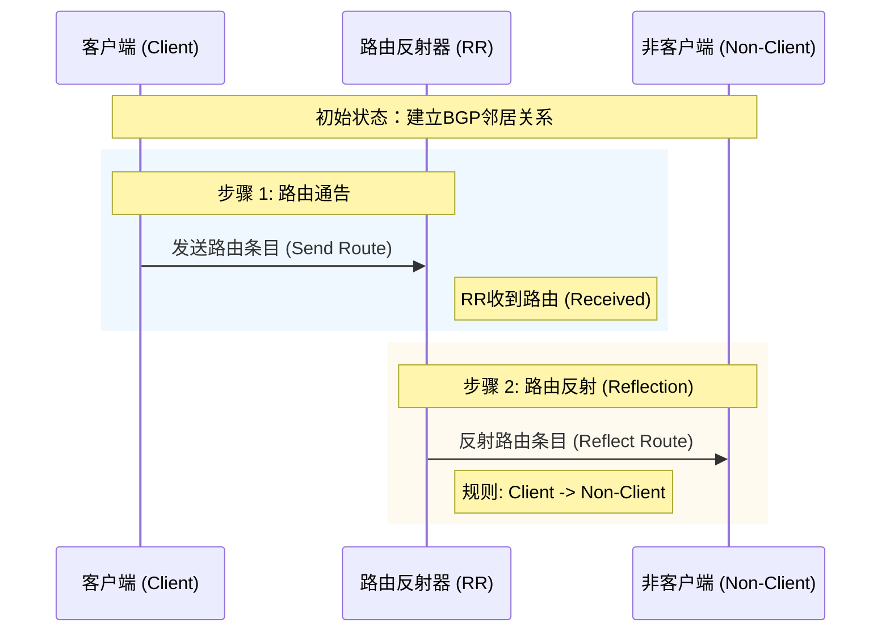

## **BGP报文**

### **BGP报文类型**

| 报文 | 类型 | 用处 |
| --- | --- | --- |
| **Open** | **Type=1** | 用于协商参数、建立BGP对等体，TCP三次握手正常建立之后，才会发送Open报文。 |
| **Update** | **Type=2** | 用于更新传递路由信息。 |
| **Notification** | **Type=3** | 当BGP检测到错误时，会用Notification报文报告错误信息，断开邻居关系。 |
| **Keepalive** | **Type=4** | 定期发送，用于维持BGP对等体关系，Keepalive报文格式中只包含报文头，没有附加其他任何字段。 |
| **Route-Refresh（可选）** | **Type=5** | 路由刷新报文，让对方主动给我发送最新的，我所需要的路由信息,需双方支持Route Refresh能力。 |

### **BGP报头**

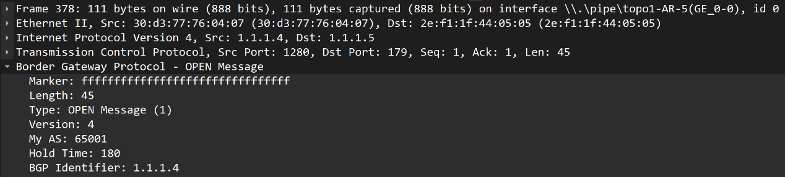

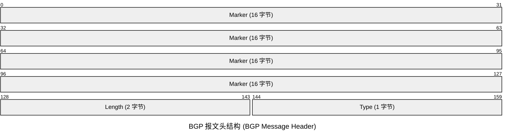

- **Marker（标记）**

16字节，用于检测同步或身份验证，早期版本使用全1填充，BGP可能忽略此字段，因此全F。（所有比特全为1）。

- **Length（长度）**

表示整个BGP报文的总长度，包括头部，以字节为单位，长度范围为19~4096。

- **Type（类型）**

标识报文类型，

### **Open报文**

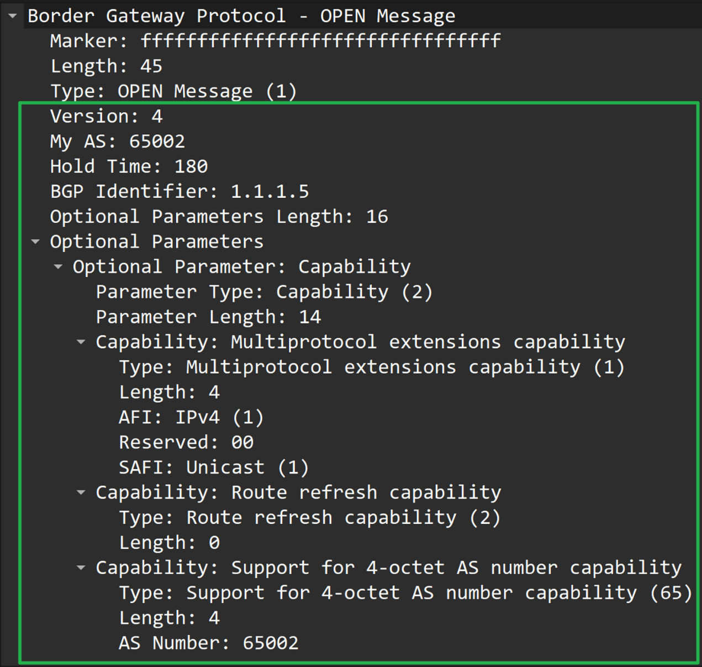

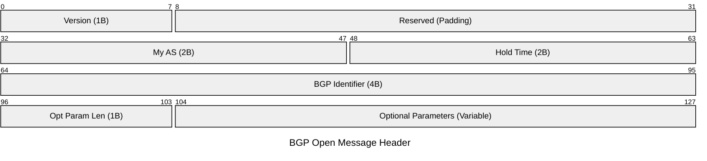

- **Version**

BGP版本信息，BGP4便为4，一般默认为BGP4。

- **My AS**

发送此报文的路由器的AS号，通过比较MyAS可以判断对等体是否属于同于AS。

- **Hold Time**

保持时间，建立对等体需要Hold Time一致，如果超过此时间未收到Keepalive报文或Update报文，则认定对等体死亡。

- **BGP Identifier**

BGP标识符，以IP地址形式发送，用于识别确定BGP路由器，类似ospf的R ID。

### **Update报文**

用于发送路由的update报文

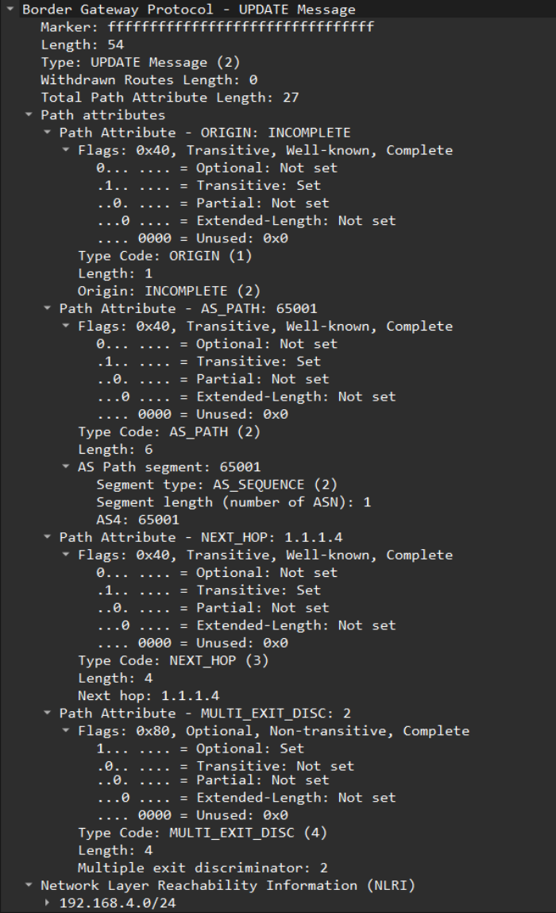

用于撤回路由的update报文。

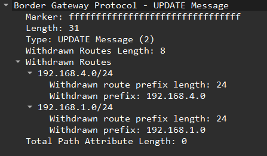

- **Withdrawn Routes Lenth**

撤销路由长度。

- **Withdrawn Routes**

撤回的路由。如果该值为0，表示该Update报文用于传递BGP路由。如果该值为4，表示撤消一条BGP路由（WRL=4 表示撤销4字节的路由，因为IP地址就是32bit=4字节，故表示撤销了一条路由）

编码格式为 <长度+前缀>

> 长度（1字节）：前缀的掩码位数（0-32）。

> 前缀（变长）：按前缀位数对齐到字节，不足补零。

> 例如192.168.1.0/24，长度为24，前缀为192.168.1。

- **Total Path Attribute Length**

路径属性长度

- **Path Attributes**

路径属性包含路由的路径属性。每个属性由TLV三元组———类型（Type）、长度（Length）和值（Value）组成，详见BGP路径属性。

- **NLRI**

网络层可达性信息，编码方式同撤销路由，每个前缀以 <长度, 前缀> 表示。

### **Notification报文**

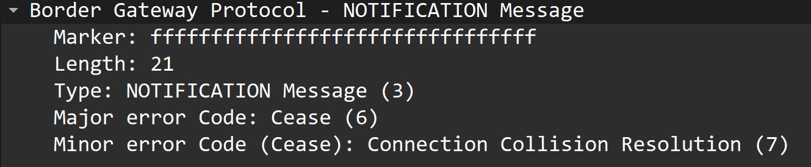

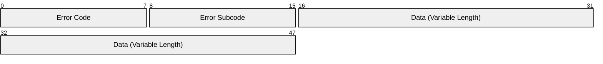

- **Error Code**

错误错误代码，定义错误的类型，非特定的错误类型用零表示。

BGP错误码：[关于BGP的notification错误码的解释](https://zhiliao.h3c.com/topic/huati/3617)1

- **Data**

详细的错误信息，指定错误细节编号，非特定的错误细节编号用零表示。

### **Keepalive报文**

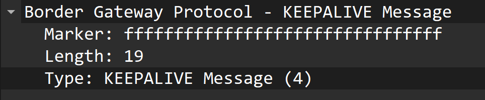

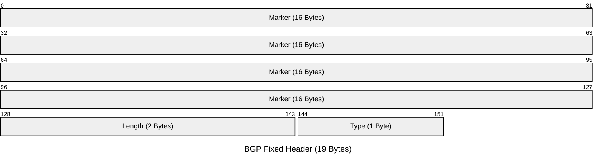

和BGP报头一样，但type类型标记为4，用于建立和维护对等体关系，类似ospf的holle包。

Marker：标记

Length：长度

Type：类型

### **Route-Refresh报文**

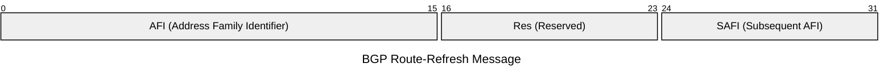

- **AFI**

**地址族标识，标识需要传递的路由类型，默认是IPv4，还可以设置IPv6、VPNv4等。**

**Res：**

- **SAFI**

**子地址族标识，针对NLRI网络层可达信息就分为 单播 NLRI（SAFI 1）和多播 NLRI（SAFI 2），默认为单播。**

## **六种BGP状态机**

### **ldle**

**Idle状态**是BGP初始状态。在Idle状态下，BGP拒绝对等体发送的连接请求。只有在收到本设备的Start事件后，BGP才开始尝试和其它BGP对等体进行TCP连接，并转至Connect状态。

- Start事件是由一个操作者配置一个BGP过程，或者重置一个已经存在的过程或者路由器软件重置BGP过程引起的。
- 任何状态中收到Notification报文或TCP拆除链路通知等Error事件后，BGP都会转至Idle状态。

### **Connect**

在**Connect状态**下，BGP启动连接重传定时器（Connect Retry，默认值为32秒），等待TCP完成连接。

- 如果TCP连接成功，那么BGP向对等体发送Open报文，并转至OpenSent状态；
- 如果TCP连接失败，那么BGP转至Active状态；
- 如果连接重传定时器超时，BGP仍没有收到BGP对等体的响应，那么BGP继续尝试和其它BGP对等体进行TCP连接，停留在Connect状态。
- 如果发生其他事件（由系统或者操作人员启动的），则退回到Idle状态。

### **Active**

在**Active状态**下，BGP总是在试图建立TCP连接。

- 如果TCP连接成功，那么BGP向对等体发送Open报文，关闭连接重传定时器，并转至OpenSent状态；
- 如果TCP连接失败，那么BGP停留在Active状态；
- 如果连接重传定时器超时，BGP仍没有收到BGP对等体的响应，那么BGP转至Connect状态。

### **OpenSent**

在**OpenSent状态**下，BGP等待对等体的Open报文，并对收到的Open报文中的AS号、版本号、认证码等进行检查。

- 如果收到的Open报文正确，那么BGP发送Keepalive报文，并转至OpenConfirm状态；
- 如果发现收到的Open报文有错误，那么BGP发送Notificatio报文给对等体，并转至Idle状态。

### **OpenConfirm**

在**OpenConfirm状态**下，BGP等待Keepalive或Notification报文。如果收到Keepalive报文，则转至Established状态，如果收到Notification报文，则转至Idle状态。

### **Established**

在**Established状态**下，BGP可以和对等体交换Update、Keepalive、Route-refresh报文和Notification报文。

- 如果收到正确的Update或Keepalive报文，那么BGP就认为对端处于正常运行状态，将保持BGP连接。
- 如果收到错误的Update或Keepalive报文，那么BGP发送Notification报文通知对端，并转至Idle状态。
- Route-refresh报文不会改变BGP状态。 如果收到Notification报文，那么BGP转至Idle状态。
- 如果收到TCP拆链通知，那么BGP断开连接，转至Idle状态。

### **汇总**

| **Ldle** | **开始准备TCP的连接并监视远程对等体，启用BGP时，要准备足够的资源** |
| --- | --- |
| **Connect** | **正在进行TCP连接，等待完成中，认证都是在TCP建立期间完成的。如果TCP连接建立失败则进入Active状态，反复尝试连接** |
| **Active** | **TCP连接没建立成功，反复尝试TCP连接** |
| **OpenSent** | **TCP连接已经建立成功，开始发送Open包，Open包携带参数协商对等体的建立** |
| **OpenConfirm** | **参数、能力特性协商成功，自己发送Keepalive包，等待对方的Keepalive包** |
| **Established** | **已经收到对方的Keepalive包，双方能力特性经协商发现一致，开始使用Update通告路由信息** |

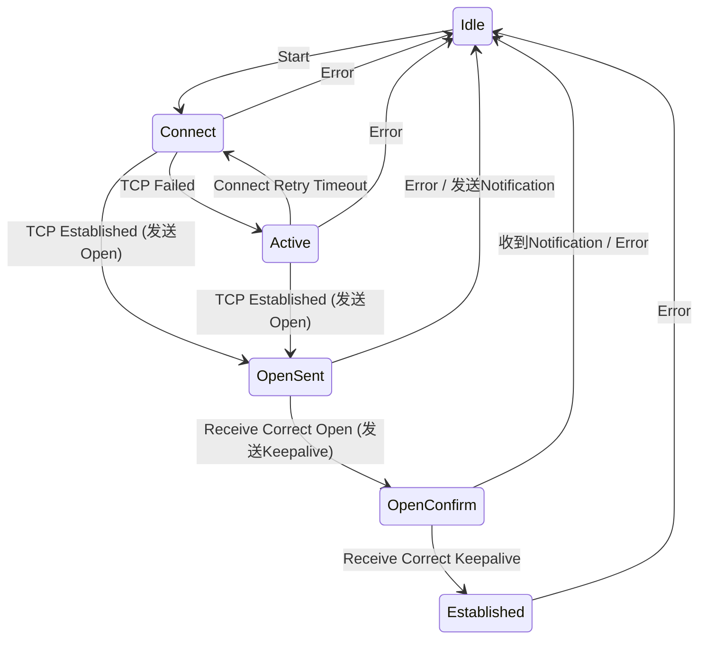

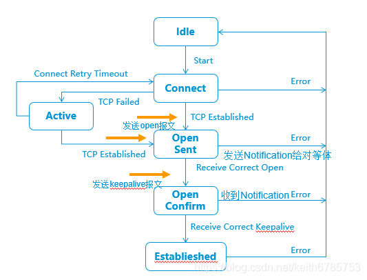

这里的6种状态与上面BGP5种消息结合好好理解一下，这是BGP对等体（peer）之间建立连接的主要过程

## **BGP工作原理**

### **1,建立BGP对等体**

BGP使用TCP端口**179**建立可靠连接，先启动的BGP的一端会先发起TCP链接

如图R1先启动BGP，所以R1发起TCP链接。

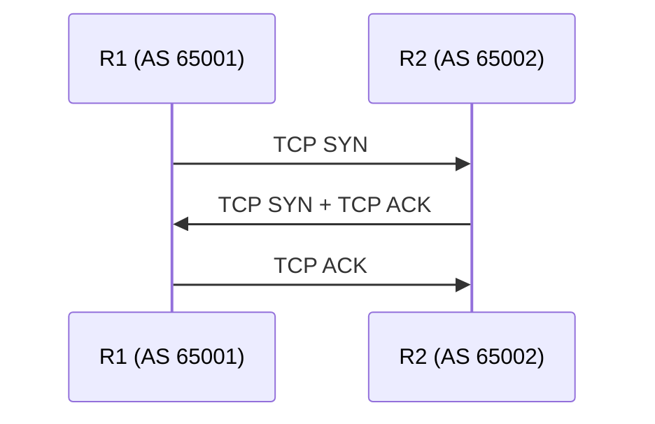

TCP链接建立成功后，R1与R2开始互相发送OPEN报文，协商参数

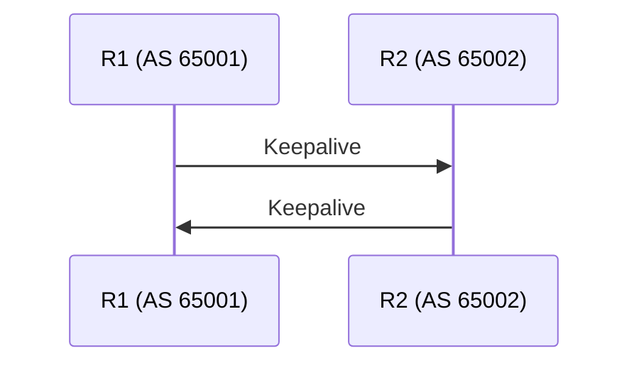

参数协商正常后，双方互相发送Keepalive报文后对等体建立成功。

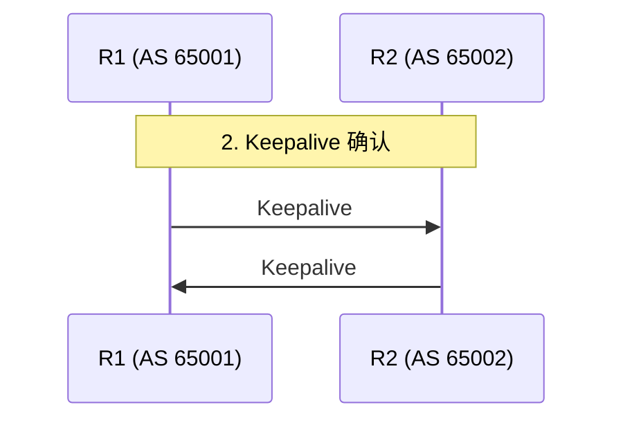

正式建立BGP对等体关系后，双方可以互相发送Update报文通告路由。

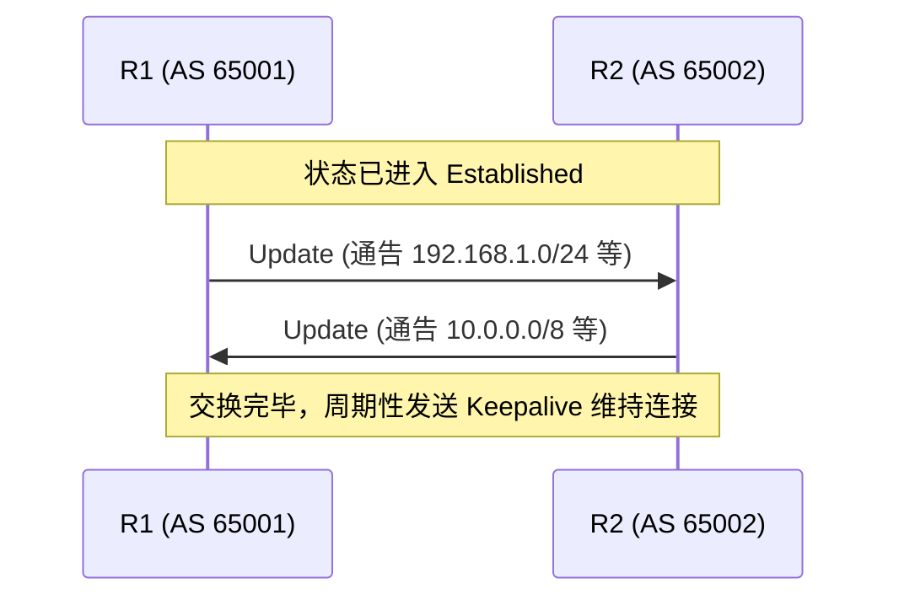

### **BGP对等体关系维护**

BGP对等体关系建立后，BGP路由器发送BGP Update （更新）报文通告路由到对等体。

平时使用Keepalive报文维持对等体关系，默认60秒。

---

## **TCP连接源地址**

默认情况下，BGP使用报文出接口作为TCP连接的本地接口，当链路因为故障断开时，出接口便会down掉，BGP会话便会断掉，如果此时还有备用链路，但BGP无法使用备用链路建立对等体关系，所有部署iBGP对等体关系时，一般指定使用回环口进行TCP的连接的本地地址来提高冗余性。

在部署eBGP对等体关系时，如果使用回环口作为TCP连接的本地接口，则需要注意eBGP的多跳问题。

---

## **BGP路由通告原则**

BGP通过network、import-route、aggregate聚合方式生成BGP路由后，通过Update报文将BGP路由传递给对等体。

BGP通告遵循以下原则：

1. **只发布最优且有效路由。**

在BGP路由表中

\- ：代表有效

\>：代表最优

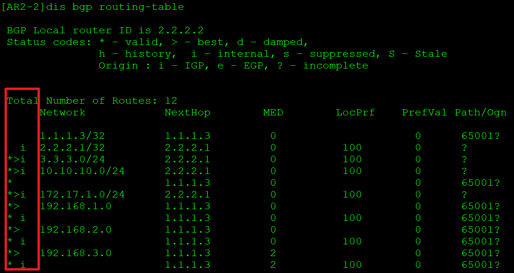

1. **从EBGP对等体获取的路由，会发布给所有对等体。**

- a会发布给EBGP对等体

- b会发布给IBGP对等体

1. **IBGP拥有水平分割特性**

从IBGP对等体获取的路由，不会发送给IBGP对等体。

- a不会发布给IBGP对等体

- b是否发布给EBGP对等体，要看是否开启BGP同步

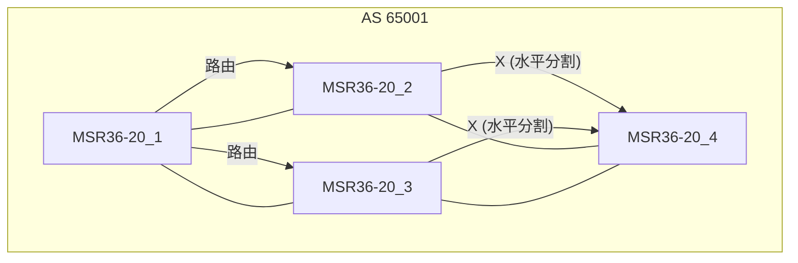

1. **BGP同步规则**

IBGP与IGP同步，当一台路由器从自己的IBGP对等体学习到一条BGP路由时（这类路由被称为IBGP路由），它将不能使用该条路由或把这条路由通告给自己的EBGP对等体，除非它又从IGP协议（例如OSPF等，此处也包含静态路由）学习到这条路由，也就是要求IBGP路由与IGP路由同步。同步规则主要用于规避BGP路由黑洞问题。

---

## **BGP路径属性**

### **路径属性分类**

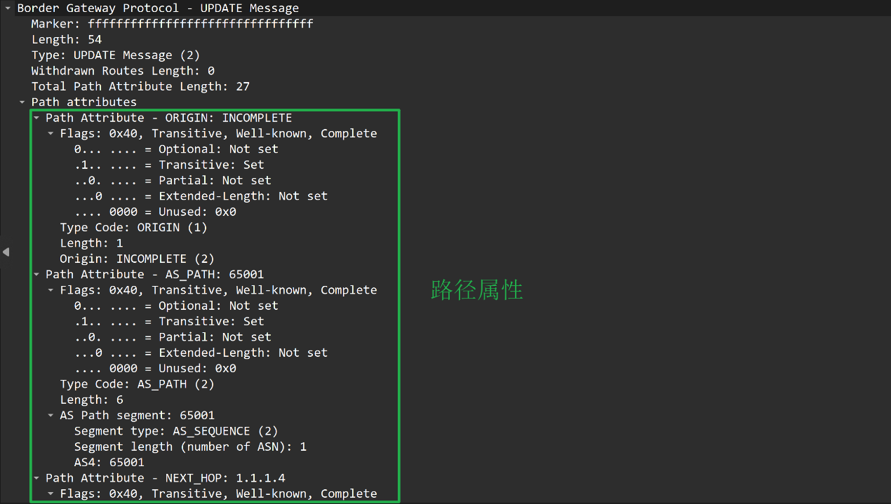

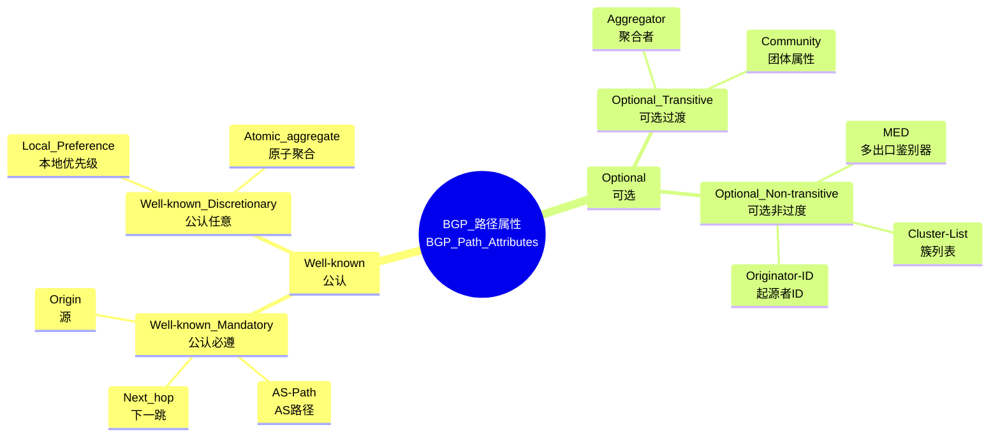

- **公认必遵（Well-known Mandatory）**

BGP路由器必须能够识别属性，必须包括在每一个Update消息内（必须）。

- **公认任意（Well-known Discretionary）**

BGP路由器必须能够识别属性，可能包括在某些Update消息内（不必须）。

- **可选过度（Optional Transitive）**

BGP设备可以不识别属性，但仍然会接收并通告给其他BGP对等体。

- **可选非过度（Optional Non-transitive）**

BGP设备可以不识别属性，也可以不接收通告，并且不传输其他BGP对等体。

### **公认必遵**

- **Origih**

标识路由的起源的类型，

| 起源类型 | 标记 | 描述 |
| --- | --- | --- |
| IGP | I | 如果路由是由始发的BGP路由器使用network命令注入到BGP的，那么该BGP路由的origin属性为IGP |
| EGP | E | 如果路由是通过EGP学习到的，那么该BGP路由的origin属性为EGP,由于现在其他EGP很少用到，所以不常见。 |
| Incomplete | ？ | 如果路由是通过其他方式学习到的，则origin属性为Incomplete（不完整的）。例如通过import-route命令引入到BGP的路由 |

优先级：IGP>EGP>Incomplete

- **AS_Path**
- 记录路由经过的AS序列，用于防止路由回灌产生的环路和路径选择，自己AS发出的路由不会接收，，路由优选优先选AS_PATH最短的路由。
- 路由在被通告给EBGP对等体时，路由器会在该路由的AS_Path中追加上本地的AS号；路由被通告给IBGP对等体时，AS_Path不会发生改变。
- AS_Path又可分为AS_SEQENCE和AS_SET两种路由，
- **Next_Hop**

用于指明到达目标网络的下一跳IP地址。

当路由器学习到BGP路由后，需要对BGP路由的Next_Hop属性进行检查，该属性值（IP地址）必须在本地路由可达，如果吧可达，这条路由不可用。

在不同的场景中，设备对BGP路由的默认Next_Hop属性值的设置规则如下：

- 路由器将BGP路由通告给自己的EBGP对等体时，将该路由的Next_Hop设置为自己的更新源IP地址。路由器在收到EBGP对等体所通告的BGP路由后，在将路由传递给自己的IBGP对等体时，会保持路由的Next_Hop属性值不变。
- 如果路由器收到某条BGP路由，该路由的Next_Hop属性值与EBGP对等体（更新对象）同属一个网段，那
- 么该条路由的Next_Hop地址将保持不变并传递给它的BGP对等体。

### **公认任意**

- **Local_prefernce**
- 除非做了策略，否则Local_preference只会在同一AS内传递，在AS内所有路由器共享。如果EBGP对等体之间收到的路由路径属性携带了Local_preference，则会进行错误处理。
- 但是可以在AS边界路由器上使用Import方向（入方向）的策略来修改Local_Preference属性值。也就是在收到路由之后在本地为路由赋予Local_Preference。
- 值越高优先级越高，用于选择离开AS的最佳出口，默认值为100。
- 路由器在向其EBGP对等体发送路由更新时，不能携带Local_Preference属性，但是对方接收路由之后，会在本地为这条路由赋一个默认Local_Preference值（100），然后再将路由传递给自己的IBGP对等体。
- 本地使用network命令及import-route命令引入的路由，Local_Preference默认值100，并能在AS内向其他IBGP对等体传递，传递过程中除非受路由策略影响，否则Local_Preference不变。
- **Atomic_aggregate**

标记因路由聚合导致丢失的AS_PATH细节，提示下游AS可能存在更精确的路由。

### **可选过度**

- **Aggregator**

记录执行路由聚合的路由器的AS号和IP地址。

- **Community**

团体属性，通过自定义标签（如**no-export**、**local-as**或私有值）可以标记一类路由，实现灵活的路由策略控制。类似IBG的tag。Community长32bit，即4Byte（字节）。

Community写法：

十进制整数格式，例如（125345）十进制难以计算。

AA：NN格式，AA表示AS号，NN为自定义编号

公认Community属性：

| 团体属性名称 | 团体属性号 | 说明 |
| --- | --- | --- |
| Internet | 0（0x00000000) | 设备在收到具有此属性的路由后，可以向任何BGP对等体发送该路由。默认情况下，所有的路由都属于Internet团体 |
| No_Advertise | 4294967042( OxFFFFFF02) | 设备收到具有此属性的路由后，将不向任何BGP对等体发送该路由 |
| No_Export | 4294967041(OxFFFFFF01) | 设备收到具有此属性的路由后，将不向AS外发送该路由 |
| No_Export_Subconfed | 4294967043( OxFFFFFF03) | 设备收到具有此属性的路由后，将不向AS外发送该路由，也不向AS内其他子AS发布此路由 |

RFC1997

《BGP Communities Attribute）定义了几个公认的Community属性值，如上表所示。

### **可选非过度**

- **MED**
- 与Local_preference属性相反，用于向外部AS建议进入本AS的优选路径，值越小越优，仅在来自同一AS的路由间比较。
- MED主要用于在AS之间影响BGP的选路。MED被传递给EBGP对等体后，对等体在其AS内传递路由时，携带该MED值，但将路由再次传递给其EBGP对等体时，默认不会携带MED属性（MED不会跨越AS传递）。可使用defaukt med命令进行修改，此命令仅对import-route引入和BGP聚合路由有效。
- 使用network和import-route方式引入路由到BGP中，产生的路由的MED值会继承IBG的metric。例如一条ospf发路由cost值为100，将他引入BGP中时，这条路由的MED便继承为100。
- **Cluster_list**

在路由反射器（RR）场景中标识路由的原始发起者，若路由被反射回原始发起者，即发起者的Router ID与**Originator_ID**相同，发起者会**丢弃该路由**，防止同一集群内路由环路。

- **Orignator_ID**

记录路由经过的路由反射器集群ID，若RR收到的路由的**Cluster_list**中已包含**自身Cluster ID**，则丢弃该路由，用于防止跨集群环路。

---

## **BGP路由优选规则**

当到达同一个目的网段存在多条路由时，BGP路由器会丢弃下一跳不可达的路由，随后通过不同的路由来源进行优选。

### **优先级从高到低排列**

1. **厂商私有属性**

- **最高权重（Weight）-----思科私有**

仅在本地路由器生效，用于本机路由优先级控制，不会通过BGP报文传递给其他路由器。

优先级取值范围为0-65535，默认值为0，本地生成的路由值32768，值大优先。

- **首选值 (Preferred-Value) -----华为私有**

与最高权重（Weight）相似，但是默认优先级值都为0。

2. **最高本地优先级（Local Preference，Local Pref）**

在同一AS内部生效，不会传递到AS外部，用于全局路由优先级决策。

AS内所有路由器优先选择Local Pref值更大的出口路由。一般用作AS 内路由器选择一个最优出口去往外部。

取值范围为232。默认值为100，可手动修改，值大优先。

3. **本地生成的路由（Locally Originated）**

本地生成的路由，优先于从对等体学到的路由。

优选手动聚合>自动聚合>network>import>从对等体学到的

4. **最短AS路径（Shortest AS_Path）**

AS_Path属性记录了路由经过的AS列表，路径越短越优先（防环机制）。

若配置了bgp bestpath as-path ignore，则跳过此规则。

5. **最低源类型（Origin Type）**

**优先级顺序**：

- IGP（通过network命令通告，标记为i）
- EGP（已废弃，标记为e）
- Incomplete（通过重分发引入，标记为?）

6. **最小MED值（Multi-Exit Discriminator）**

MED值是用来向相邻AS“建议”入站流量路径，MED值越小越优先。

仅比较来自同一相邻AS的路由，不同AS的MED不直接比较，MED仅在相邻AS之间传递，不会通过BGP传播到其他AS。

如果未配置bgp always-compare-med，仅比较同一AS的路由。

7. **优选外部路由（EBGP > IBGP）**

从EBGP对等体学到的路由优先于从IBGP对等体学到的路由。

8. **到下一跳的IGP度量最小（Lowest IGP Metric）**

如果多条路由的下一跳相同，选择到下一跳IGP开销最小的路径（Next_Hop的IGP度量值最小的路由）。

9. **负载均衡**

如果配置负载均衡，且所有路径的负载均衡优先级以上属性一致。才使用负载均衡。

10. **最旧的路由（Oldest Route）**

若多条路由属性完全一致，优先选择最早接收的路由（稳定性优先）。

11. **最低路由器ID（Lowest Router ID）**

若所有属性相同，选择来自BGP Router ID最小的对等体的路由。

若配置了**bgp bestpath compare-routerid**，则跳过此规则。

13. **最短邻居地址（最低IP地址）**

若Router ID相同（如使用环回接口），选择对等体IP地址较小的路径。

**汇总**:

| 顺序 | 属性名称 | 中文名称 |
| :---: | :--- | :--- |
| 1 | Weight (Cisco) / Preferred-Value (Huawei) | 权重 / 首选值 |
| 2 | Local Preference | 本地优先级 |
| 3 | Locally Originated | 本地生成的路由 |
| 4 | AS_Path | AS 路径长度 |
| 5 | Origin Type | 起源类型 |
| 6 | MED (Multi-Exit Discriminator) | 多出口鉴别器 |
| 7 | EBGP > IBGP | EBGP 优于 IBGP |
| 8 | IGP Metric (to Next Hop) | 下一跳 IGP 度量值 |
| 9 | Load Balancing (Multipath) | 负载均衡 |
| 10 | Oldest Route | 最旧路由 |
| 11 | Router ID | 路由器 ID |
| 12 | Neighbor IP | 邻居 IP 地址 |

## **路由衰减**

路由不稳定常表现为路由振荡，即路由表中某条路由反复消失和重现，当发生路由振荡时，路由协议会向邻居发布路由更新，收到更新报文的路由器会重新计算路由，频繁的路由振荡会消耗大量的带宽资源和CPU资源，严重影响正常工作。

路由衰减（BGP Route Flapping Dampening）便是一种用于抑制不稳定BGP路由的机制。

- **惩罚值**

每当路由发生一次状态变化，从可用到不可用，或相反。系统会为该路由增加一个惩罚值，每次+1000。惩罚值会随时间按**指数衰减**，衰减速度由**半衰期（Half-life）**控制，默认15分钟。例如，半衰期为15分钟意味着每过15分钟，惩罚值减半。

- **抑制阈值**

当惩罚值大于抑制阈值时，路由将被抑制**（Suppress Limit）**，不再参与路由优选。抑制默认阈值为2000。

- **重用阈值**

当惩罚值重用阈值（Reuse Limit）时，路由将重新启用。默认重用阈值为750。

- **最大抑制时间**

即使路由持续抖动，抑制时间也不会超过**最大抑制时间（Max Suppress Time，默认60分钟）**。
  