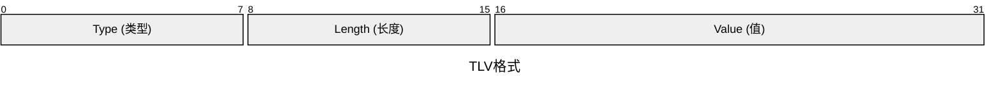
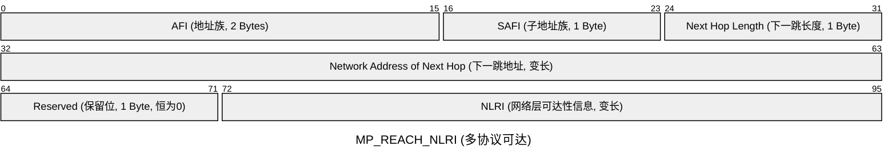
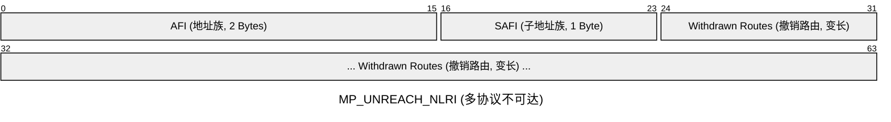

# MP-BGP/BGP-4+

BGP-4的设计主要是针对IPv4的。MP-BPG是BGP-4的一种扩展，使其支持IPv6在内的其他非IPv4协议的网络层协议。RFC-2858和RFC-4760定义了BGP4+协议。

## TLV（Type-Length-Value）

TLV 是一种编码格式，在ISIS,LLDP,OSPFv3，BGP4+……有应用。具有极强的扩展性和灵活性,BGP4+的极强的扩展便是来源于此。

TLV没有明确的大小，具体大小取决于协议及TLV的类型。

TLV格式的消息由三部分组成：

- Type (类型)：

一般为1-2字节，用于标识TLV的类型。例如IPv6路由，MPLS标签，优先级……。

TLV并没有规定传输的内容，如果需要扩展新的功能，只需要IETF（RFC）分配一个新的 Type 编号，而不用修改协议。并且这种传输内容与协议的解耦，也使得协议的更加灵活。

- Length (长度)：

一般为1-2字节，用于标识Value字段的大小。

假设路由器 A 收到一个带有新Type的 TLV。虽然它查字典发现自己不支持这个Type，但它能读取紧跟在后面的Length。于是，路由器A会直接向后跳过10个字节，继续解析下一个它认识的 TLV。这就保证了哪怕存在不认识的属性，BGP 邻居关系也不会断开。

## BGP新增的属性

BGP-4 中NLRI 被硬编码固定字段里，导致BGP-4只能传输IPv4路由。

BGP-4+想要解决这一问题便需要把NLRI从固定字段里移出来，放到一个新的属性里。于是在BGP4+中便新引入了两个全新的不可变可选报文：

### MP_REACH_NLRI (Type 14，多协议可达路由信息)

用于发布可达路由信息以及对应的下一跳信息。

- AFI (Address Family Identifier，地址族标识符): 2 字节。定义了传输内容的类型，例如 2 代表 IPv6。

- SAFI (Subsequent AFI，子地址族标识符): 1 字节。在AFI之下，定义具体的“业务子类型”例如 1 代表单播。

- Next Hop Address Length: 1 字节。指明后面下一跳地址的长度（如果是 IPv6，通常是 16 或 32 字节）。

- Network Address of Next Hop: 变长。实际的下一跳 IP 地址。

- Reserved: 1 字节，固定为 0。

- NLRI (Network Layer Reachability Information): 变长。这部分就是实际的路由条目（前缀 + 掩码长度）。

### MP_UNREACH_NLRI (Type 15，多协议不可达路由信息)

用于撤销之前发布过的不可达路由。

