# **HCIA与HCIP基础路由知识**

## **IP地址（IP Address）**

以点分十进制表示（x.x.x.x），由32位二进制组成

分为网络位和主机位

- 网络位：代表IP所属的网段
- 主机位：代表网段上某个节点

由子网掩码决定分界点

### 网段（network segment）

指一个计算机网络中使用同一物理层设备（传输介质，中继器，集线器等）能够直接通讯的那一部分。

### 网关（Gateway）

一个网段的出口,实现不同网段之间的通讯。

通常是一台三层网络设备（路由器，三层交换机，防火墙，服务器……）

位于不同网段的主机想要实现通讯，就必须把数据包发送给网关。（二层MAC指向网关，3层IP指向目标地址）

发送数据包给非本网段IP时，主机会默认将数据包发给网关。

### 子网掩码（Subnet Mask）

用于区分网络部分和主机部分

1代表网络位，0代表主机位。（连续的0和1），可以用/子网掩码长度表示。

例：

IP 地址：

|<—8位—>|<—8位—>|<—8位—>|<—8位—>|
|  ---  |  ---  |  ---  |  ---  |
|  192  |  168  |   1   |   1   |

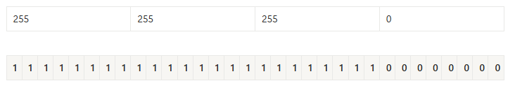

子网掩码：

可表示为：192.168.1.1/24

幂:

| 2^7 | 2^6 | 2^5 | 2^4 | 2^3 | 2^2 | 2^1 | 2^0 |
| --- | --- | --- | --- | --- | --- | --- | --- |
| 128 | 64 | 32 | 16 | 8 | 4 | 2 | 1 |

### 公网与私网

- 公网地址

用于Internet，向ISP付费，全球唯一。

- 私有地址

用于内部网络，不能用于Internet，泄露到公网其余设备也不理会，免费使用，可重复。

使用私网地址想要访问Internet，必须用NAT将私有地址转化为公网地址。

### 网络地址和广播地址

- 网络地址

代表整个网段，一般为网段上第一个IP,如192.168.1.0/24网段网络地址为192.168.1.0。

- 广播地址

> 代表网络中的所有IP，一般为网段上最后一个IP，如192.168.1.0/24网段广播地址为192.168.1.255

### A/B/C/D/E类地址（有类地址）

- **分类图**

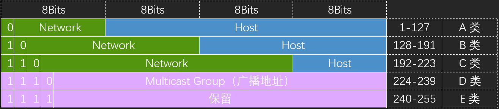

| 0 | Reserved |
| --- | --- |
| 1-126 | Class A Unicast |
| 127 | Reserved |
| 128-191 | Class B Unicast |
| 192-223 | Class C Unicast |
| 224-239 | ClassD Multicast |
| 240-255 | Class E Experimental |

- **A类地址**
- 范围：

**1.0.0.0-127.0.0.0**，可用的A类网络有127个，每个网络能容纳16777214个主机，无类掩码为/8。

- 排除地址：

**0.0.0.0**，通常用于指代所以的IP地址，或者没有地址。

**127.0.0.0**，为回环地址测试用，地址块的所有地址都指向本机，操作系统会将数据包环回给本机。

- **B类地址**
- 范围：

**128.0.0.0-191.255.255.255**，可用的B类网络有16382个，每个网络能容纳6万多个主机， 无类掩码为/16。

- 排除地址：

**128.0.0.0，**被保留用于路由和网络管理目的**191.255.0.0**

- **C类地址**
- 范围：

**192.0.1.0-223.255.254.0**，C类网络可达209万余个，每个网络能容纳254个主机。无类掩码为/24

- 排除地址：

**192.0.0.0**，

**223.255.255.0**，

- **D类地址**
- 范围：

**224.0.0.0-239.255.255.255**，用途比较特殊，D类地址称为广播地址，供特殊协议向选定的节点发送信息时用。

- **E类地址**
- 范围：

**240.0.0.0-225.255.255.254**，为未来使用保留。

- 排除地址：

**225.225.225.225**，是当前子网的广播地址。

- **保留私有地址**

A类地址：10.0.0.0/8～10.255.255.255/8

B类地址：172.16.0.0/12～172.31.255.255/12

D类地址：192.168.0.0/16～192.168.255.255/16

## **冲突域与广播域**

- **冲突（Collision）**

多个设备如果同时连接在一个传输信道上，发生的冲撞会导致信号破环，只发生在早期使用集线器连接的各项式网络中

- **冲突域（Collision Domain）**

能产出冲突的设备的集合

- **广播（Broadcast）**

发送给所有目标

- **广播域（Broadcast Domain）**

网络中所有能接收到同样广播消息的设备的集合

- **集线器（Hub）**

早期网络设备，无法隔离冲突域，无法隔离广播域。

- **网桥（Birdge）**

集线器到交换机的过度设备，可以隔离冲突域，无法隔离广播域。

- **交换机（Switch）**

二层交换机可以隔离广播域，不可以隔离冲突域，三层交换机可以隔离冲突域和广播域。

- **路由器（Router）**

路由器可以隔离冲突域和广播域。

## **单播，广播与组播**

- **单播（Unicast）**

发送给单个目标

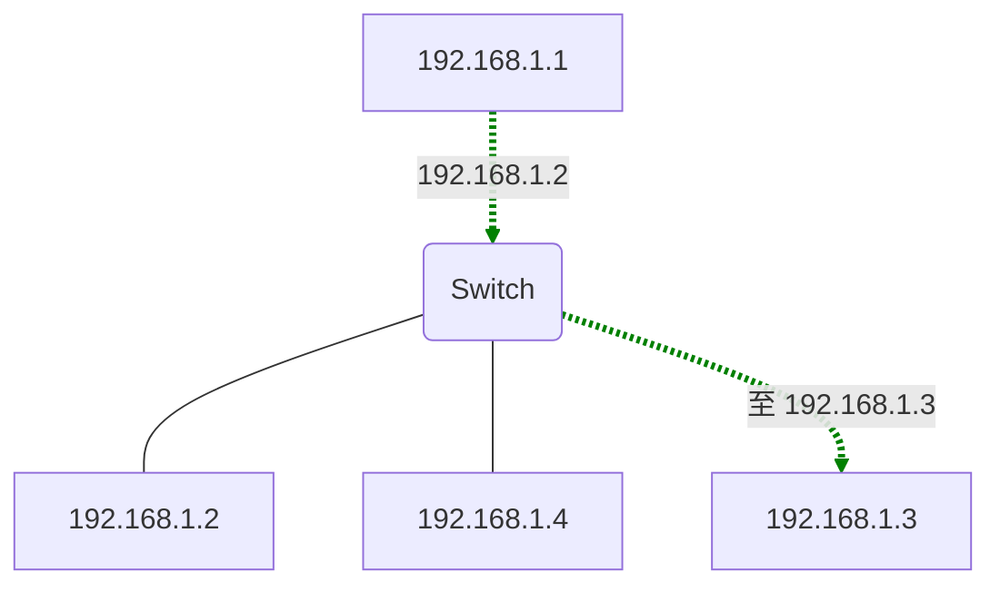

- **广播（Broadvast）**

发送给所属广播域内的所有目标，属于这个广播域的所有节点都能收到。

MAC地址=FFFF-FFFF-FFFF

IP地址=该网段的广播地址

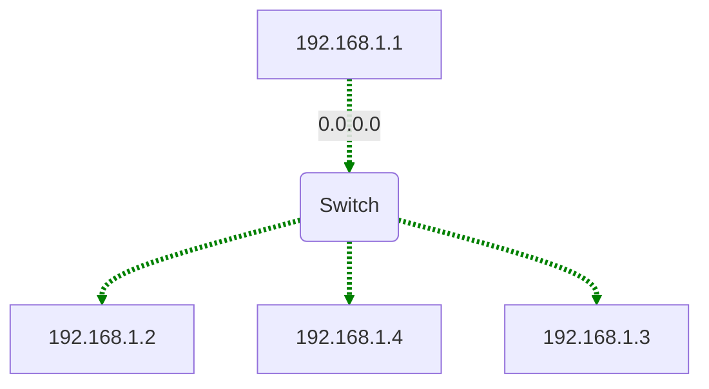

- **组播（Multicast）**

发送给一组目标

MAC地址=01-00-5E开头

IP地址=D类组播地址（224.0.0.0-239.255.255.255）

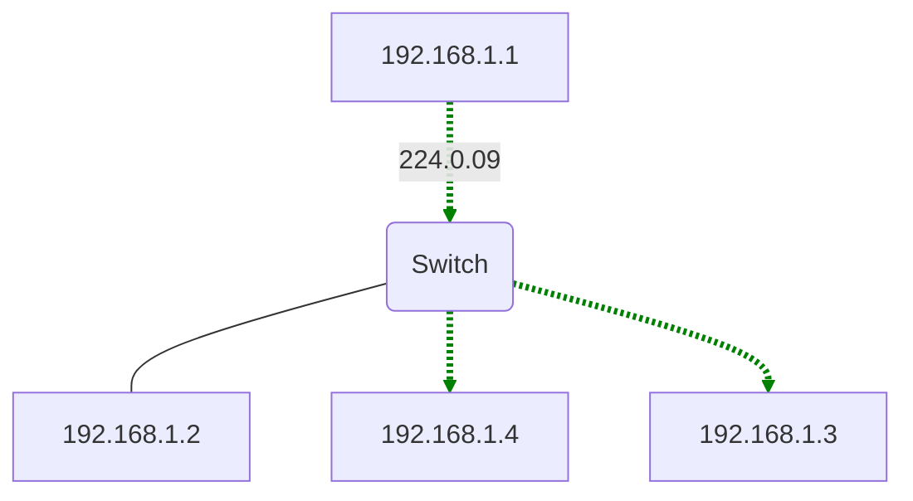

## **数据包的封装与解封装**

+-+-+-+-+-+-+

| 应用层 |

+-+-+-+-+-+-+ ↓

| 传输层 |

+-+-+-+-+-+-+ ↓

| 网络层 |

+-+-+-+-+-+-+ ↓

| 数据链路层 |

+-+-+-+-+-+-+ ↓

| 物理层 | Transmit Bits

+-+-+-+-+-+-+

向下逐层传输数据为封装

反之向上逐层传输数据为解封装

- **传输层封装**

| TCP Header | Data |
| --- | --- |

↓

| Source Port：1027 | Destination Port：80 | …… |
| --- | --- | --- |

封装端口等信息

- **网络层（IP）封装**

| IP Header | TCP Header | Data |
| --- | --- | --- |

↓

| Protecol：0X06 | Source IP Addres：1.1.1.1 | Destination IP Addres：1.1.1.2 | …… |
| --- | --- | --- | --- |

封装协议号，源ip和目标ip等信息

- **数据链路层（以太网）封装**

| Enternet Header | IP Header | TCP Header | Data | FCS |
| --- | --- | --- | --- | --- |

↓

| D.MAC | S.MAC | Type | …… |
| --- | --- | --- | --- |

封装源IP，目标IP等信息（目标MAC可是网关MAC）

- **物理层**

000100010010001000111011011……

---

以比特流传输。

## **MAC地址**

代表一个网络接口的物理地址，全球唯一，通常用6位十六进制数字表示，MAC由两部分组成，前24Bit为厂商地址OUI（组织唯一标识符），由IEEE分配。后24Bit为设备地址，由厂商分配序列号。

注意：MAC地址的书写并没有规范，推荐查看产品帮助。

|<--------2B-------->|<--------2B-------->|
| --- | --- |
| 24bit（OUI） | 24biti（由厂商分配） |

数据链路层基于MAC进行帧的传输，当主机接收到的数据帧所包含的目标MAC地址是自己时，会把以太网封装剥掉后送往上层协议。

关于MAC可详见TCP_IP数据链路层。

## **ARP获取MAC**

网络层地址（如IP地址）用于虚拟寻址，数据链路层（如MAC地址）用于物理寻址，每个节点的MAC地址都是固定的，IP地址不固定，所以需要进行MAC的物理寻址来确定物理主机的位置。ARP（地址解析协议）正是用于寻找MAC地址的。

主机在对同网段IP的数据包进行二层封装时，发现没有目标IP对应的目标MAC地址时，会发送一个ARP请求包，请求目标MAC。ARP数据包以广播形式发送。

非同网段IP的数据包，默认会向网关发送，没有网关MAC时也会发送ARP包向网关请求MAC。此时ARP包内的目标指向网关。

ARP请求包：

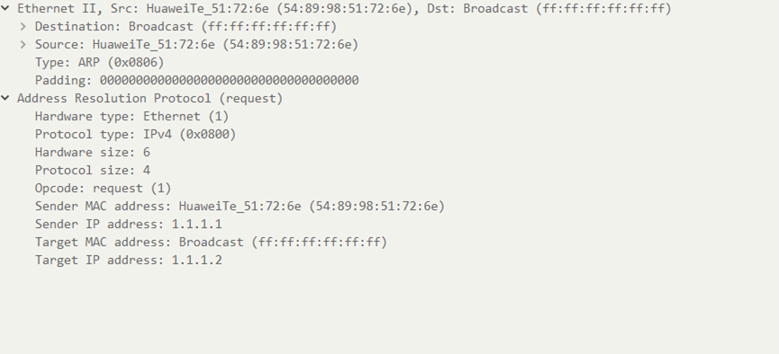

包内会标识源MAC（Sender MAC addres），源IP（Sender IP addres），目标IP（Target IP address）和目标MAC（Tarhet MAC address），

目标MAC会标记为全F（或者是全0），以表示未知。

同网段内设备发现数据包后会查看APR数据包的目标IP，目标IP为自己则接受，不是自己则丢弃。

当目标设备发现数据包后，会发送一个ARP包进行回应，把自己IP与MAC写入源IP与源MAC中，请求设备MAC与IP写入目标IP与目标MAC中，请求设备接受到数据包解封装后便获得了目标设备的MAC。

ARP回应包：

Window可在cmd中输入arp -a命令查看本机的arp缓存。

关于ARP详见TCP_IP数据链路层

## **数据包转发过程**

同网段内设备通信不需要网关，跨网段设备通信会将数据包发送给网关。

网关发现二层MAC为自己则接收，继续解封装，发现三层IP为他者，会检查是否具有达到目的网络的路由条目，如果有路由条目则会将源有二层数据帧头和帧尾剥离，根据路由条目重新封装二层数据帧头和帧尾，并继续转发。三层IP为网关自己则继续解封装。

## **关于Ping的回显：**

| 回显 | 表示 |
| --- | --- |
| 来自x.x.x.x的回复：字节=xx 时间=xxms TTL=xx | 证明成功。 |
| PING:传输失败。General failure. | 当主机尝试去访问其它网络内的主机，而本身没有配置网关 |
| 请求超时 | 对方不在线，或者屏蔽等 |
| x.x.x.x的回复;无法访问目标主机 | 网关没有路由，没有获取到MAC地址 |

# **HCIP路由知识**

## **路由转发规则**

当路由器收到一个ip数据包，路由器会根据数据包的ip地址查找FIB（转发表）找到最匹配的路由条目，将数据包根据路由条目所指示的出接口或下一跳转发。在路由转发中，网络层被分为了两个平面，分别是控制平面和转发平面。

### 控制平面

控制平面决定了使用哪一条路径对数据包，帧进行转发，负责路由决策和网络管理，像是GPS，决定了怎么走。

**主要功能：**

**主要功能是随便写的，看到IP的题有考，相关的资料又挺杂的**。

- 路由协议处理

> 运行路由协议（如OSPF、BGP、RIP、EIGRP等），与邻居路由器交换路由信息，学习网络拓扑。

- 路由表生成

根据路由协议计算最优路径，生成并维护**路由表**（Routing Table）。

- 路径选择

> 通过算法（最短路径算法、路径成本计算等）对路由条目进行优选，确定数据包的转发路径。

- 管理网络状态

处理路由更新、链路状态变化、故障恢复（如快速收敛）等动态事件。

- 策略控制

实施路由策略（如路由过滤、优先级调整、策略路由）和安全策略（如ACL规则下发）。

- 控制报文处理

处理ICMP、ARP、BGP Keepalive等控制类报文。

- 流量统计

### 数据平面

数据平面会根据控制平面将数据包，帧从一个接口转发到另一个接口中。负责实际的数据包处理和转发，执行控制平面下发的策略。负责实际的走。

**主要功能：**

**主要功能是随便写的，看到IP的题有考，相关的资料又挺杂的**。

- 数据包转发

根据路由表或转发表（FIB, Forwarding Information Base）快速转发数据包。

- 流量处理

执行数据包封装/解封装、TTL递减、校验和计算等操作。

- 策略执行

> 应用ACL（访问控制列表）、QoS（服务质量标记）、NAT（网络地址转换）、负载均衡等策略。

- 硬件加速

> 通过ASIC（专用集成电路）、NPU（网络处理器）或TCAM（三态内容寻址存储器）实现高速转发。

### 路由优先级

每一个路由条目都有优先级，各路由协议默认优先级不同，可以手动设置优先级。

- **华为设备默认优先级**

| 路由协议的类型 | 路由协议的外部优先级 | 路由协议的内部优先级 |
| --- | --- | --- |
| 直连路由（Direct) | 0 | 0 |
| OSPF 内部路由 | 10 | 10 |
| IS-IS 路由 | 15 | 15（level-1）18（level-2） |
| 静态路由（Static） | 60 | 60 |
| RIP 路由 | 100 | 100 |
| OSPF ASE 路由 | 150 | 150 |
| OSPF NSSA 路由 | 150 | 150 |
| IBGP 路由 | 255 | 200 |
| EBGP 路由 | 255 | 20 |

- **思科设备默认优先级**

| 路由协议的类型 | 默认距离值（优先级） |
| --- | --- |
| 直连路由（Direct) | 0 |
| 静态路由（Static） | 1 |
| 增强型内部网关路由协议 (EIGRP) 汇总路由 | 5 |
| 外部边界网关协议 (BGP) | 20 |
| 内部 EIGRP | 90 |
| IGRP | 100 |
| OSPF | 110 |
| IS-IS（中间系统到中间系统） | 115 |
| 路由信息协议 (RIP) | 120 |
| Exterior Gateway Protocol (EGP) | 140 |
| 按需路由 (ODR) | 160 |
| 外部 EIGRP | 170 |
| 内部 BGP | 200 |
| 未知* | 255 |

### RIB（路由表）

控制平面，每一个路由器中都有路由表，路由表又分为本地核心路由表和协议路由表。

- **协议路由表（ospf为例）**

协议路由表中以存放着各路由协议中的路由条目。

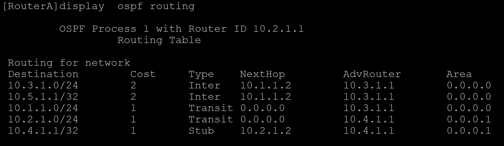

- **本地核心路由表**

路由器对各个协议路由表进行路由优先级筛选并且汇众后得到本地核心路由表。一台路由器只有一个本地核心路由表，FIB根据本地核心路由表进行选举。

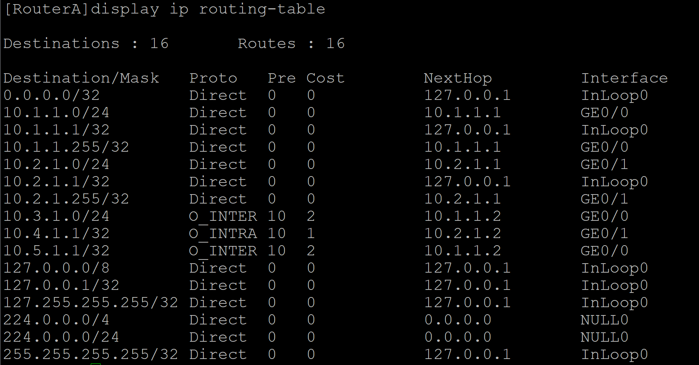

- **最长掩码匹配原则**

路由器会进行与运算，根基“最长掩码匹配原则”选取出子网掩码最长的路由条目，进行转发。

（例：192.168.1.0/24 192.168.1.1/32 会优先选择192.168.1.1/32进行转发。）

### FIB（转发表）

数据平面，如果路由表每次转发都要进行选取，则会消耗大量资源，所以路由器会将已经选取后的条目下载到FIB中，路由器转发芯片根据FIB进行转发。

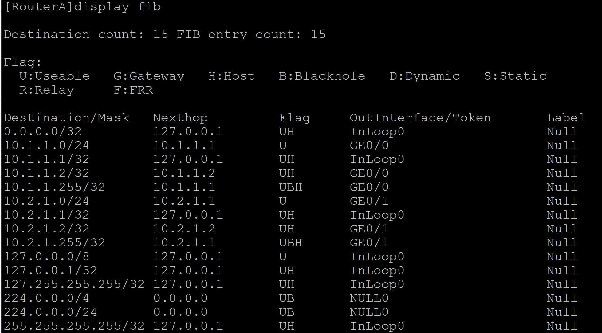

### 迭代路由

路由必须有直连的下一跳才能够指导转发，静态路由或BGP路由的下一跳可能不是直连的邻居，因此需要计算出一个直连的下一跳，这个过程就叫做路由迭代。

例：

+--------------------------------------+

| ip route-static 192.168.1.0 24 192.168.2.1 |

| ip route-static 192.168.2.0 24 192.168.3.1 |

+--------------------------------------+

当需要与192.168.1.0通讯时由由迭代路由可得

+--------------------------------------+

| ip route-static 192.168.1.0 24 192.168.3.1 |

+--------------------------------------+

则向192.168.3.1转发。

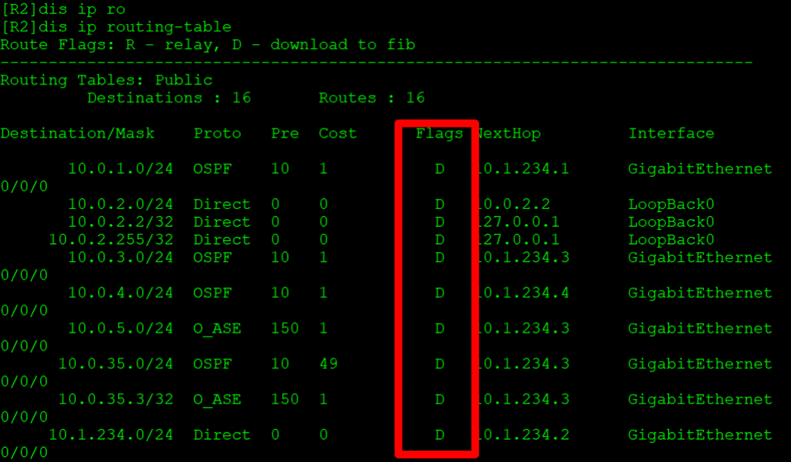

flags例，D表示没有迭代路由，RD表示需要迭代路由

## **无类与有类**

### 有类路由

早期网络使用，将其分为A、、B、C、D、E，总共5类，HCIA已讲过，无法进一步划分子网，不支持VLMS和CIDR，无法汇总，简单但僵化。

例：IP地址172.16.1.0默认属于B类，掩码为255.255.0.0，网络部分为172.16.0.0。

### 无类路由

为解决有类地址的缺陷，1993年引入**CIDR技术**，支持灵活的子网划分。发送路由更新包的时候携带自己的子网掩码。

- **CIDR（无类别域间路由）**

CIDR使用斜线法，**IP+掩码**的方式表示网络地址，替代传统的A/B/C类网络划分支持VLSM和和路由聚合。

例：192.168.1.0/24

- **VLMS（可变长子网掩码）**

子网掩码可**自由定义长度**，可以把一个网分成多个子网，提高网络地址利用率。

例：192.168.1.0/26（掩码255.255.255.192）。

- **子网**

通过VLMS将一个大的IP网络划分为多个较小的网络。每个子网拥有独立的网络地址和主机地址范围。

- **Supernetting（超网，路由聚合）**

与子网相反，**将多个连续的子网聚合成一个更大的网络**，路由汇总，聚合是对超网的应用。

例：192.168.0.0/24到192.168.3.0/24可以合并为192.168.0.0/22。

注：查找资料时有人说超网，地址聚合，路由汇总是同个东西，有人意见则相反（超网为技术，汇总为策略），此点还有争议。

### 反子网掩码

反子网掩码也叫通配符掩码，与子网掩码按位取反形式。主要用于网络设备配置中匹配特定范围的IP地址。

例：192.168.1.0/24 子网掩码为255.255.255.0，反子网掩码为0.0.0.255。

### 路由来源

直连路由(Direct)

设备自动生成指向本地直连网络的路由

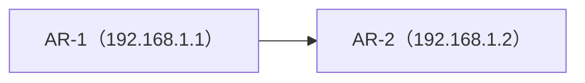

AR-1

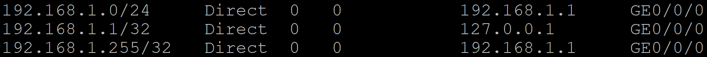

静态路由(Static)

网络管理员手工配置的路由

动态路由(Dynamic)

路由器运行动态路由协议学习到的路由

## **按工作区域分类路由协议**

- **IGP（内部网关协议）**

AS内使用的路由协议，负责内部的详细的路由。（城市内道路）

协议：

OSPF，IS-IS……

- **EGP（外部网关协议）**

运行在不同AS之间的协议，负责大规模的路由传递，BGP是唯一广泛使用的EGP协议。（跨国高速公路）

## **按工作机制分类路由协议**

- **距离矢量协议**

直接向邻居发送自己的路由表，不需要计算。所以资源消耗较低，一台网络设备发送的路由错误，则会导致其他网络设备的路由也会出错。（直接抄作业）

主要协议：

RIP，IGRP

- **链路状态协议**

向邻居描述描述自己的路由表，如延迟，带宽等。收到描述信息的数据包后，网络设备进行计算，使用SPF算法进行计算。每台设备都计算出以直接为根的无环的最短路径的树，需要计算，所以路由不会出错，但资源消耗较高。（自己算作业）

主要协议：

IS-IS，OSPF
