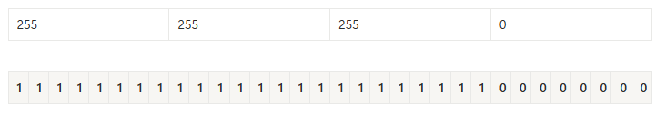
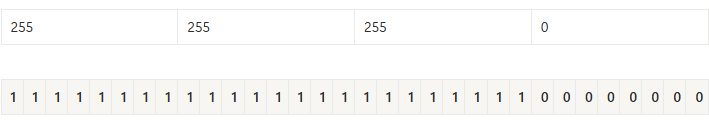
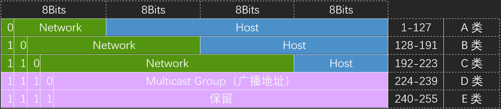
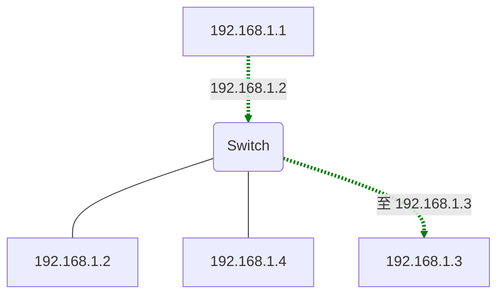
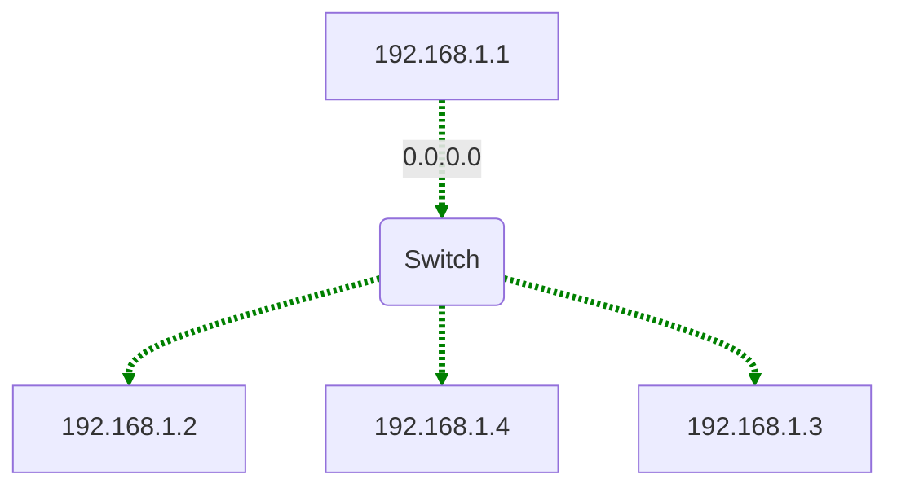
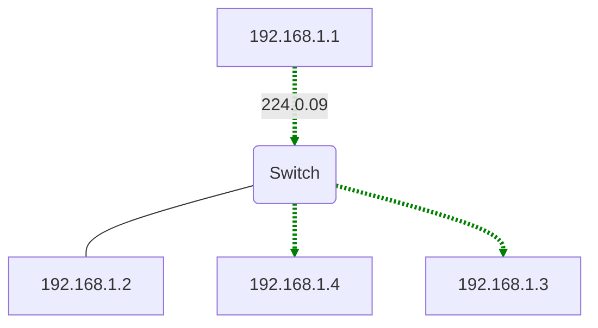
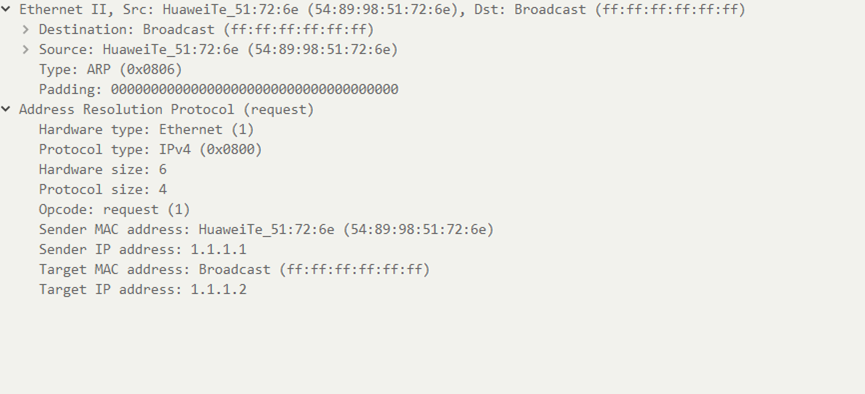

# **HCIA与HCIP基础路由知识**

## **IP地址（IP Address）**

以点分十进制表示（x.x.x.x），由32位二进制组成

分为网络位和主机位

- 网络位：代表IP所属的网段
- 主机位：代表网段上某个节点

由子网掩码决定分界点

### 网段（network segment）

指一个计算机网络中使用同一物理层设备（传输介质、中继器、集线器等）能够直接通信的那一部分。

### 网关（Gateway）

一个网段的出口，实现不同网段之间的通信。

通常是一台三层网络设备（路由器、三层交换机、防火墙、服务器……）

位于不同网段的主机想要实现通信，就必须把数据包发送给网关。（二层MAC指向网关，3层IP指向目标地址）

发送数据包给非本网段IP时，主机会默认将数据包发给网关。

### 子网掩码（Subnet Mask）

用于区分网络部分和主机部分

1代表网络位，0代表主机位（由连续的1和0组成），可以用/子网掩码长度表示。

例：

IP 地址：

|<—8位—>|<—8位—>|<—8位—>|<—8位—>|
|  ---  |  ---  |  ---  |  ---  |
|  192  |  168  |   1   |   1   |

子网掩码：

可表示为：192.168.1.1/24

幂:

| 2^7 | 2^6 | 2^5 | 2^4 | 2^3 | 2^2 | 2^1 | 2^0 |
| --- | --- | --- | --- | --- | --- | --- | --- |
| 128 | 64 | 32 | 16 | 8 | 4 | 2 | 1 |

### 公网与私网

- 公网地址

用于Internet，向ISP付费，全球唯一。

- 私有地址

用于内部网络，不能用于Internet，泄露到公网其余设备也不理会，免费使用，可重复。

使用私网地址想要访问Internet，必须用NAT将私有地址转化为公网地址。

### 网络地址和广播地址

- 网络地址

代表整个网段，一般为网段上第一个IP,如192.168.1.0/24网段网络地址为192.168.1.0。

- 广播地址

> 代表网络中的所有IP，一般为网段上最后一个IP，如192.168.1.0/24网段广播地址为192.168.1.255

### A/B/C/D/E类地址（有类地址）

- **分类图**

| 0 | Reserved |
| --- | --- |
| 1-126 | Class A Unicast |
| 127 | Reserved |
| 128-191 | Class B Unicast |
| 192-223 | Class C Unicast |
| 224-239 | Class D Multicast |
| 240-255 | Class E Experimental |

- **A类地址**
- 范围：

**1.0.0.0-126.255.255.255**，可用的A类网络有126个，每个网络能容纳16777214个主机，默认掩码为/8。

- 排除地址：

**0.0.0.0**，通常用于指代所有的IP地址，或者没有地址。

**127.0.0.0**，为回环地址测试用，地址块的所有地址都指向本机，操作系统会将数据包环回给本机。

- **B类地址**
- 范围：

**128.0.0.0-191.255.255.255**，可用的B类网络有16382个，每个网络能容纳6万多个主机，默认掩码为/16。

- 排除地址：

**128.0.0.0和191.255.0.0**被保留用于某些特定的网络目的。

- **C类地址**
- 范围：

**192.0.0.0-223.255.255.255**，C类网络可达209万余个，每个网络能容纳254个主机。默认掩码为/24。

- 排除地址：

**192.0.0.0和223.255.255.255**已被保留用作特殊用途。

- **D类地址**
- 范围：

**224.0.0.0-239.255.255.255**，用途比较特殊，D类地址称为组播地址，供特殊协议向选定的节点发送信息时用。

- **E类地址**
- 范围：

**240.0.0.0-255.255.255.254**，为未来使用保留。

- 排除地址：

**255.255.255.255**，是当前子网的广播地址。

- **保留私有地址**

A类地址：10.0.0.0/8～10.255.255.255/8

B类地址：172.16.0.0/12～172.31.255.255/12

C类地址：192.168.0.0/16～192.168.255.255/16

## **冲突域与广播域**

- **冲突（Collision）**

多个设备如果同时连接在一个传输信道上，发生的冲撞会导致信号破坏，只发生在早期使用集线器连接的共享式网络中

- **冲突域（Collision Domain）**

能产生冲突的设备的集合

- **广播（Broadcast）**

发送给所有目标

- **广播域（Broadcast Domain）**

网络中所有能接收到同样广播消息的设备的集合

- **集线器（Hub）**

早期网络设备，无法隔离冲突域，无法隔离广播域。

- **网桥（Bridge）**

集线器到交换机的过渡设备，可以隔离冲突域，无法隔离广播域。

- **交换机（Switch）**

二层交换机可以隔离广播域，不可以隔离冲突域，三层交换机可以隔离冲突域和广播域。

- **路由器（Router）**

路由器可以隔离冲突域和广播域。

## **单播，广播与组播**

- **单播（Unicast）**

发送给单个目标

- **广播（Broadcast）**

发送给所属广播域内的所有目标，属于这个广播域的所有节点都能收到。

MAC地址=FFFF-FFFF-FFFF

IP地址=该网段的广播地址

- **组播（Multicast）**

发送给一组目标

MAC地址=01-00-5E开头

IP地址=D类组播地址（224.0.0.0-239.255.255.255）

## **数据包的封装与解封装**

+-+-+-+-+-+-+

| 应用层 |

+-+-+-+-+-+-+ ↓

| 传输层 |

+-+-+-+-+-+-+ ↓

| 网络层 |

+-+-+-+-+-+-+ ↓

| 数据链路层 |

+-+-+-+-+-+-+ ↓

| 物理层 | Transmit Bits

+-+-+-+-+-+-+

向下逐层传输数据为封装

反之向上逐层传输数据为解封装

- **传输层封装**

| TCP Header | Data |
| --- | --- |

↓

| Source Port：1027 | Destination Port：80 | …… |
| --- | --- | --- |

封装端口等信息

- **网络层（IP）封装**

| IP Header | TCP Header | Data |
| --- | --- | --- |

↓

| Protocol：0X06 | Source IP Address：1.1.1.1 | Destination IP Address：1.1.1.2 | …… |
| --- | --- | --- | --- |

封装协议号，源ip和目标ip等信息

- **数据链路层（以太网）封装**

| Ethernet Header | IP Header | TCP Header | Data | FCS |
| --- | --- | --- | --- | --- |

↓

| D.MAC | S.MAC | Type | …… |
| --- | --- | --- | --- |

封装源IP，目标IP等信息（目标MAC可是网关MAC）

- **物理层**

000100010010001000111011011……

---

以比特流传输。

## **MAC地址**

代表一个网络接口的物理地址，全球唯一，通常用6位十六进制数字表示，MAC由两部分组成，前24Bit为厂商地址OUI（组织唯一标识符），由IEEE分配。后24Bit为设备地址，由厂商分配序列号。

注意：MAC地址的书写并没有规范，推荐查看产品帮助。

|<--------2B-------->|<--------2B-------->|
|---|---|
|24bit（OUI）|24bit（由厂商分配）|

数据链路层基于MAC进行帧的传输，当主机接收到的数据帧所包含的目标MAC地址是自己时，会把以太网封装剥掉后送往上层协议。

关于MAC可详见TCP_IP数据链路层。

## **ARP获取MAC**

网络层地址（如IP地址）用于虚拟寻址，数据链路层（如MAC地址）用于物理寻址，每个节点的MAC地址都是固定的，IP地址不固定，所以需要进行MAC的物理寻址来确定物理主机的位置。ARP（地址解析协议）正是用于寻找MAC地址的。

主机在对同网段IP的数据包进行二层封装时，发现没有目标IP对应的目标MAC地址时，会发送一个ARP请求包，请求目标MAC。ARP数据包以广播形式发送。

非同网段IP的数据包，默认会向网关发送，没有网关MAC时也会发送ARP包向网关请求MAC。此时ARP包内的目标指向网关。

ARP请求包：

包内会标识源MAC（Sender MAC address），源IP（Sender IP address），目标IP（Target IP address）和目标MAC（Target MAC address），

目标MAC会标记为全F（或者是全0），以表示未知。

同网段内设备发现数据包后会查看ARP数据包的目标IP，目标IP为自己则接收，不是自己则丢弃。

当目标设备发现数据包后，会发送一个ARP包进行回应，把自己IP与MAC写入源IP与源MAC中，请求设备MAC与IP写入目标IP与目标MAC中，请求设备接收到数据包解封装后便获得了目标设备的MAC。

ARP回应包：

Window可在cmd中输入arp -a命令查看本机的arp缓存。

关于ARP详见TCP_IP数据链路层

## **数据包转发过程**

同网段内设备通信不需要网关，跨网段设备通信会将数据包发送给网关。

网关发现二层MAC为自己则接收，继续解封装，发现三层IP为他者，会检查是否具有达到目的网络的路由条目，如果有路由条目则会将源有二层数据帧头和帧尾剥离，根据路由条目重新封装二层数据帧头和帧尾，并继续转发。三层IP为网关自己则继续解封装。

## **关于Ping的回显：**

| 回显 | 表示 |
| --- | --- |
| 来自x.x.x.x的回复：字节=xx 时间=xxms TTL=xx | 证明成功。 |
| PING:传输失败。General failure. | 当主机尝试去访问其它网络内的主机，而本身没有配置网关 |
| 请求超时 | 对方不在线，或者屏蔽等 |
| x.x.x.x的回复;无法访问目标主机 | 网关没有路由，没有获取到MAC地址 |
