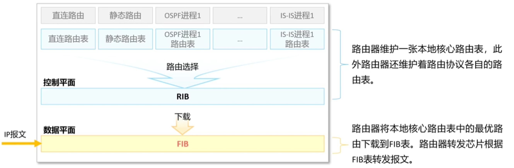
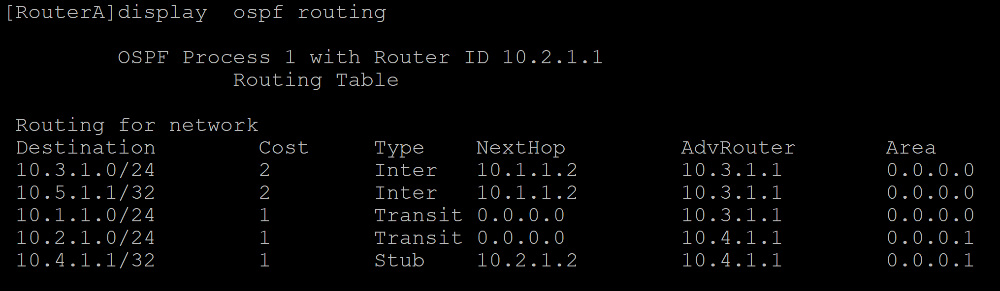
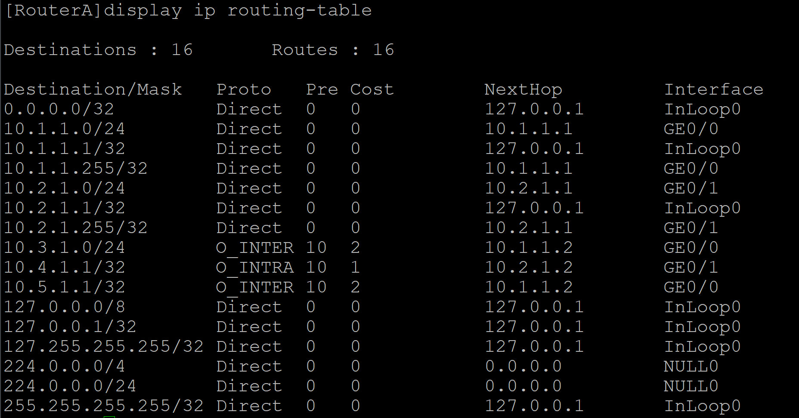
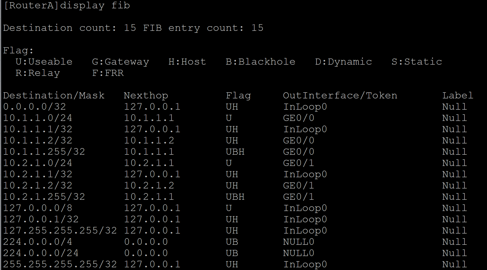
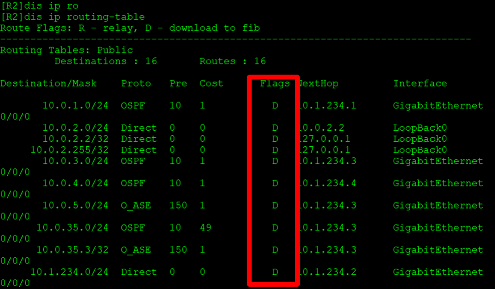
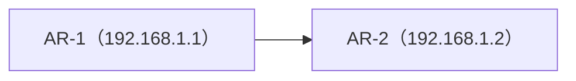
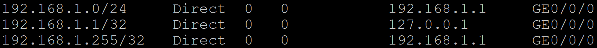

# **HCIP路由知识**

## **路由转发规则**

当路由器收到一个ip数据包，路由器会根据数据包的ip地址查找FIB（转发表）找到最匹配的路由条目，将数据包根据路由条目所指示的出接口或下一跳转发。在路由转发中，网络层被分为了两个平面，分别是控制平面和转发平面。

### 控制平面

控制平面决定了使用哪一条路径对数据包，帧进行转发，负责路由决策和网络管理，像是GPS，决定了怎么走。

**主要功能：**

**主要功能是随便写的，看到IP的题有考，相关的资料又挺杂的**。

- 路由协议处理

> 运行路由协议（如OSPF、BGP、RIP、EIGRP等），与邻居路由器交换路由信息，学习网络拓扑。

- 路由表生成

根据路由协议计算最优路径，生成并维护**路由表**（Routing Table）。

- 路径选择

> 通过算法（最短路径算法、路径成本计算等）对路由条目进行优选，确定数据包的转发路径。

- 管理网络状态

处理路由更新、链路状态变化、故障恢复（如快速收敛）等动态事件。

- 策略控制

实施路由策略（如路由过滤、优先级调整、策略路由）和安全策略（如ACL规则下发）。

- 控制报文处理

处理ICMP、ARP、BGP Keepalive等控制类报文。

- 流量统计

### 数据平面

数据平面会根据控制平面将数据包，帧从一个接口转发到另一个接口中。负责实际的数据包处理和转发，执行控制平面下发的策略。负责实际的走。

**主要功能：**

**主要功能是随便写的，看到IP的题有考，相关的资料又挺杂的**。

- 数据包转发

根据路由表或转发表（FIB, Forwarding Information Base）快速转发数据包。

- 流量处理

执行数据包封装/解封装、TTL递减、校验和计算等操作。

- 策略执行

> 应用ACL（访问控制列表）、QoS（服务质量标记）、NAT（网络地址转换）、负载均衡等策略。

- 硬件加速

> 通过ASIC（专用集成电路）、NPU（网络处理器）或TCAM（三态内容寻址存储器）实现高速转发。

### 路由优先级

每一个路由条目都有优先级，各路由协议默认优先级不同，可以手动设置优先级。

- **华为设备默认优先级**

| 路由协议的类型 | 路由协议的外部优先级 | 路由协议的内部优先级 |
| --- | --- | --- |
| 直连路由（Direct) | 0 | 0 |
| OSPF 内部路由 | 10 | 10 |
| IS-IS 路由 | 15 | 15（level-1）18（level-2） |
| 静态路由（Static） | 60 | 60 |
| RIP 路由 | 100 | 100 |
| OSPF ASE 路由 | 150 | 150 |
| OSPF NSSA 路由 | 150 | 150 |
| IBGP 路由 | 255 | 200 |
| EBGP 路由 | 255 | 20 |

- **思科设备默认优先级**

| 路由协议的类型 | 默认距离值（优先级） |
| --- | --- |
| 直连路由（Direct) | 0 |
| 静态路由（Static） | 1 |
| 增强型内部网关路由协议 (EIGRP) 汇总路由 | 5 |
| 外部边界网关协议 (BGP) | 20 |
| 内部 EIGRP | 90 |
| IGRP | 100 |
| OSPF | 110 |
| IS-IS（中间系统到中间系统） | 115 |
| 路由信息协议 (RIP) | 120 |
| Exterior Gateway Protocol (EGP) | 140 |
| 按需路由 (ODR) | 160 |
| 外部 EIGRP | 170 |
| 内部 BGP | 200 |
| 未知* | 255 |

### RIB（路由表）

控制平面，每一个路由器中都有路由表，路由表又分为本地核心路由表和协议路由表。

- **协议路由表（ospf为例）**

协议路由表中以存放着各路由协议中的路由条目。

- **本地核心路由表**

路由器对各个协议路由表进行路由优先级筛选并且汇众后得到本地核心路由表。一台路由器只有一个本地核心路由表，FIB根据本地核心路由表进行选举。

- **最长掩码匹配原则**

路由器会进行与运算，根基“最长掩码匹配原则”选取出子网掩码最长的路由条目，进行转发。

（例：192.168.1.0/24 192.168.1.1/32 会优先选择192.168.1.1/32进行转发。）

### FIB（转发表）

数据平面，如果路由表每次转发都要进行选取，则会消耗大量资源，所以路由器会将已经选取后的条目下载到FIB中，路由器转发芯片根据FIB进行转发。

### 迭代路由

路由必须有直连的下一跳才能够指导转发，静态路由或BGP路由的下一跳可能不是直连的邻居，因此需要计算出一个直连的下一跳，这个过程就叫做路由迭代。

例：

+--------------------------------------+

| ip route-static 192.168.1.0 24 192.168.2.1 |

| ip route-static 192.168.2.0 24 192.168.3.1 |

+--------------------------------------+

当需要与192.168.1.0通讯时由由迭代路由可得

+--------------------------------------+

| ip route-static 192.168.1.0 24 192.168.3.1 |

+--------------------------------------+

则向192.168.3.1转发。

flags例，D表示没有迭代路由，RD表示需要迭代路由

## **无类与有类**

### 有类路由

早期网络使用，将其分为A、、B、C、D、E，总共5类，HCIA已讲过，无法进一步划分子网，不支持VLMS和CIDR，无法汇总，简单但僵化。

例：IP地址172.16.1.0默认属于B类，掩码为255.255.0.0，网络部分为172.16.0.0。

### 无类路由

为解决有类地址的缺陷，1993年引入**CIDR技术**，支持灵活的子网划分。发送路由更新包的时候携带自己的子网掩码。

- **CIDR（无类别域间路由）**

CIDR使用斜线法，**IP+掩码**的方式表示网络地址，替代传统的A/B/C类网络划分支持VLSM和和路由聚合。

例：192.168.1.0/24

- **VLMS（可变长子网掩码）**

子网掩码可**自由定义长度**，可以把一个网分成多个子网，提高网络地址利用率。

例：192.168.1.0/26（掩码255.255.255.192）。

- **子网**

通过VLMS将一个大的IP网络划分为多个较小的网络。每个子网拥有独立的网络地址和主机地址范围。

- **Supernetting（超网，路由聚合）**

与子网相反，**将多个连续的子网聚合成一个更大的网络**，路由汇总，聚合是对超网的应用。

例：192.168.0.0/24到192.168.3.0/24可以合并为192.168.0.0/22。

注：查找资料时有人说超网，地址聚合，路由汇总是同个东西，有人意见则相反（超网为技术，汇总为策略），此点还有争议。

### 反子网掩码

反子网掩码也叫通配符掩码，与子网掩码按位取反形式。主要用于网络设备配置中匹配特定范围的IP地址。

例：192.168.1.0/24 子网掩码为255.255.255.0，反子网掩码为0.0.0.255。

### 路由来源

直连路由(Direct)

设备自动生成指向本地直连网络的路由

AR-1

静态路由(Static)

网络管理员手工配置的路由

动态路由(Dynamic)

路由器运行动态路由协议学习到的路由

## **按工作区域分类路由协议**

- **IGP（内部网关协议）**

AS内使用的路由协议，负责内部的详细的路由。（城市内道路）

协议：

OSPF，IS-IS……

- **EGP（外部网关协议）**

运行在不同AS之间的协议，负责大规模的路由传递，BGP是唯一广泛使用的EGP协议。（跨国高速公路）

## **按工作机制分类路由协议**

- **距离矢量协议**

直接向邻居发送自己的路由表，不需要计算。所以资源消耗较低，一台网络设备发送的路由错误，则会导致其他网络设备的路由也会出错。（直接抄作业）

主要协议：

RIP，IGRP

- **链路状态协议**

向邻居描述描述自己的路由表，如延迟，带宽等。收到描述信息的数据包后，网络设备进行计算，使用SPF算法进行计算。每台设备都计算出以直接为根的无环的最短路径的树，需要计算，所以路由不会出错，但资源消耗较高。（自己算作业）

主要协议：

IS-IS，OSPF
