# **is-is（中间系统到中间系统协议，Intermediate system to intermediate system）**

**人话：路由器到路由器。**

学习is-is之前，推荐先学习ospf

---

is-is是一种内部网关协议，最初为CLNP设计，支持多种网络层协议，相较于OSPF，支持更多网络协议，扩展性更强，多用于ISP（运营商）。但是对路由复杂选路策略没有OSPF强。

- 距离矢量协议
- IGP
- 可tlv扩展，支持多种协议
- 收敛更快
- 路由承载能力更强
- 比OSPF简单，面向复杂选路策略，没有OSPF控制精确。
- 支持无类

---

## **IS-IS与OSPF相近的概念**

| IS-IS术语 | OSPF术语 |
| --- | --- |
| IS | Router |
| ES | HOST |
| DIR | DR |
| SysID | Routrt ID |
| LSP | LSA |
| IIH | LSA |
| PSNP | LSR与LSAck |
| CSNP | DD（DBD） |

---

## **CLNP（无连接网络协议）**

网络层（IP同一层）的一种无连接的网络协议。提供无需预先建立连接的数据包传输，每个数据包独立路由。不保证可靠性，依赖上层进行纠错和控流，最初IS-IS便是基于CLNP设计的。

- **CLNS（无连接网络服务）**

由CLNP实现的无连接网络服务，定义如何通过CLNP传递数据。

### NSAP地址

CLNP中用于唯一标识网络中节点的地址，可变长度，范围8-20字节，作用类似于OSPF的Router ID，在扩展支持IP（RFC 1195）后，NSAP地址的配置被大幅简化。

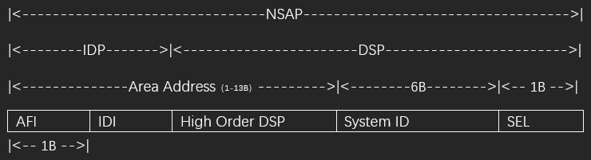

### **IDP**

NSAP地址的前半部分，用于标识网络的管理域和地址格式，类似IP中网络位。

- **AFI (授权与格式标识符)**

定义地址的格式（如二进制、十进制）和分配机构（如ISO、私有网络等）。

- **IDI （初始域标识符）**

标识网络所属的管理域（如国家、组织或运营商）。

### **DSP**

- **High Order DSP （高位域特定部分）**

High Order DSP的值决定了设备所属的IS-IS区域。同一区域内的路由器必须具有相同的High Order DSP。

- **System ID**

System ID用于在区域内唯一标识主机或路由器，类似OSPF的Router ID。

- **SEL**

用于标识网络服务类型，类似于IP的协议号，TCP/IP的端口号。

---

### IP的NSAP格式

- **NET**

仅需配置NET，（SEL=00）的NSAP地址叫NET，配置IP的IS-IS时只需要考虑NET即可。

- **Area Address（区域地址）**

IDP和DSP中的High Order DSP组成既能够标识路由域，也能够标识路由域中的区域。因此，它们一起被称为区域地址，**相当于OSPF中的区域编号。**

L1区域中的所有路由器都必须有相同的区域地址，L2区域内路由器可以有不同的区域地址。

- **System ID**

将IP地址168.10.1.1的每个十进制数都扩展为3位，长度固定为48bit（6字节）

- **例：**

| Area ID | System ID | N-SEL |
| --- | --- | --- |
| 49.0010 | 1921.6800.1001 | 00 |

49表示私有地址，区域标识符为0010。

## **L2与L1区域，路由器**

- **区域分类**

| L2区域 | Level-2区域，相当于OSPF的骨干区域 |
| --- | --- |
| L1区域 | Level-1区域，相当于OSPF的非骨干区域 |

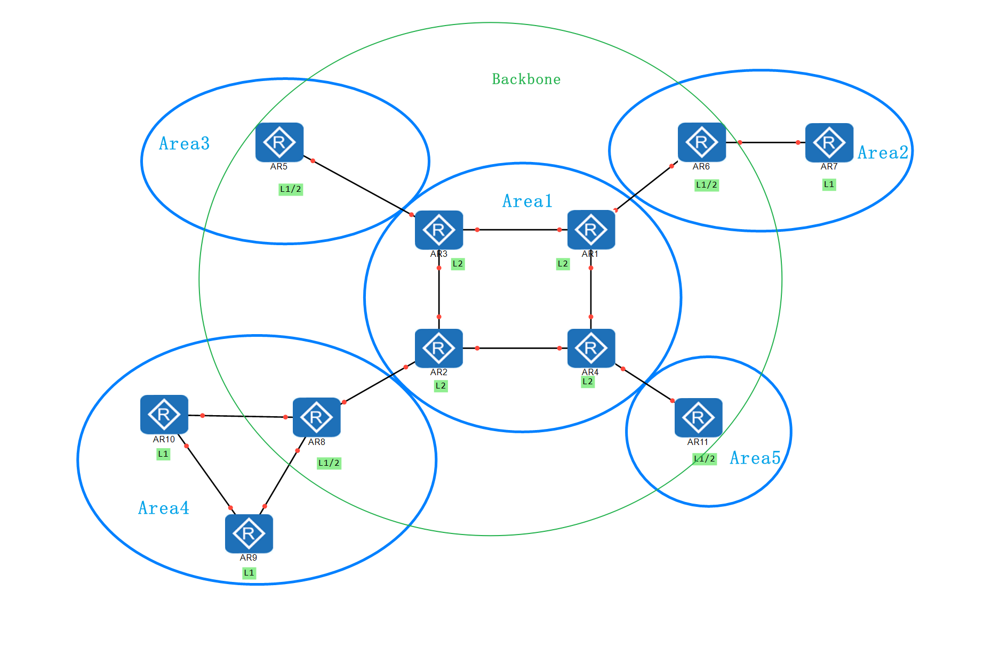

- **路由器分类**

| L1路由器 | L1区域内的路由器，只能创建Level-1 LSDB。 |
| --- | --- |
| L2路由器 | L2区域内的路由器，只能创建Level-2 LSDB。 |
| L1/2路由器 | L1区域和L2区域边界连接的路由器，可以创建L1和L2的LSDB（OSPF的ABR） |

邻接关系的建立，区域ID必须一致。

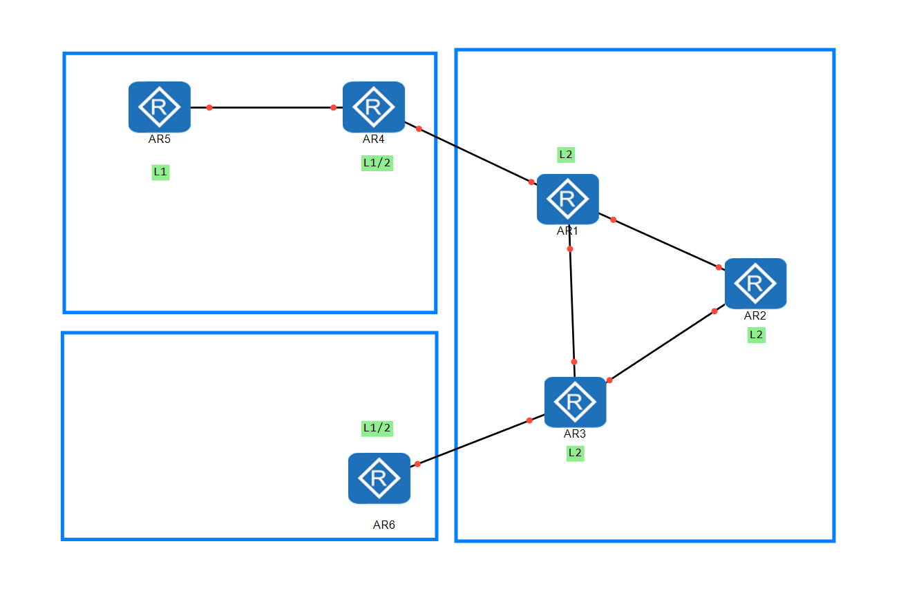

## **DIS**

类似OSPF中的DR。

| --- | DIS | DR |
| --- | --- | --- |
| 选举优先级 | 所有优先级都参与选举 | 0优先级不参与选举40s |
| 选举等待时间 | 2个Hello报文间隔 | 40s |
| 备份 | 无 | BDR |
| 邻接关系 | 所有路由器互相都是邻接关系 | DRother之间是2-way关系 |
| 抢占性 | 会抢占 | 非抢占 |
| 作用 | 周期发送CSNP，保障MA网络LSDB同步 | 主要为了减少LSA泛洪 |

## **IS-IS网络类型**

目前IS-IS只支持P2P和MA网络。同样，P2P网络没有DIS，MA网络有DIS。

## **TLV扩展**

TLV也称为CLV（Code-Length-Value），LV通过**类型（Type）**、**长度（Length）**、**值（Value）** 三元组，将不同信息模块化封装，使IS-IS能够动态支持新功能（如IPv6、流量工程）而无需修改协议框架。新增功能只需定义新TLV类型，旧版本设备可忽略未知类型，确保向后兼容性。

- **常见的TLV**

| **TLV Type** | **名称** |
| --- | --- |
| 1 | 区域 |
| 2 | IS邻居（LSP） |
| 8 | 填充（确保报文达到最小长度） |
| 9 | LSP 条目 |
| 10 | 认证信息 |
| 14 | LSP缓冲区大小 |
| 22 | 扩展的IP可达性信息（32位度量） |
| 128 | IP 内部可达性信息 |
| 129 | 支持的协议 |
| 130 | IP 外部可达性信息 |
| 131 | 域间路由协议信息 |
| 132 | IP 接口地址 |
| 135 | 扩展IPv6可达性 |
| 138 | TE路由器ID |
| 139 | 扩展管理组 |
| 141 | SRLG |
| 222 | 链路带宽 |
| 229 | MT-IS |
| 232 | IPv6接口地址 |
| 235 | MT可达IPv4前缀 |
| 237 | MT可达IPv6前缀 |
| 236 | IPv6可达性信息 |

绿色：关于IP 白色：IS-IS基础的TLV 紫色：TE 蓝色：MT

部分参考思科文章：[中间系统到中间系统(IS-IS) TLV - Cisco](https://www.cisco.com/c/zh_cn/support/docs/ip/integrated-intermediate-system-to-intermediate-system-is-is/5739-tlvs-5739.html#:~:text=%E6%9C%AC%E6%96%87%E6%A1%A3%E4%BB%8B%E7%BB%8D%E4%B8%AD%E9%97%B4%E7%B3%BB%E7%BB%9F%E5%88%B0%E4%B8%AD%E9%97%B4%E7%B3%BB%E7%BB%9F%20%28IS-IS%29%E7%B1%BB%E5%9E%8B%E9%95%BF%E5%BA%A6%E5%80%BC%20%28TLV%29%E5%8F%8A%E5%85%B6%E4%BD%BF%E7%94%A8%E3%80%82%20%E6%9C%AC%E6%96%87%E6%A1%A3%E6%B2%A1%E6%9C%89%E4%BB%BB%E4%BD%95%E7%89%B9%E5%AE%9A%E7%9A%84%E8%A6%81%E6%B1%82%E3%80%82%20%E6%9C%AC%E6%96%87%E6%A1%A3%E4%B8%8D%E9%99%90%E4%BA%8E%E7%89%B9%E5%AE%9A%E7%9A%84%E8%BD%AF%E4%BB%B6%E5%92%8C%E7%A1%AC%E4%BB%B6%E7%89%88%E6%9C%AC%E3%80%82%20%E6%9C%89%E5%85%B3%E6%96%87%E6%A1%A3%E8%A7%84%E5%88%99%E7%9A%84%E8%AF%A6%E7%BB%86%E4%BF%A1%E6%81%AF%EF%BC%8C%E8%AF%B7%E5%8F%82%E9%98%85,Cisco%20%E6%8A%80%E6%9C%AF%E6%8F%90%E7%A4%BA%E8%A7%84%E5%88%99%E3%80%82%20IS-IS%E6%9C%80%E5%88%9D%E8%AE%BE%E8%AE%A1%E7%94%A8%E4%BA%8E%E5%BC%80%E6%94%BE%E5%BC%8F%E7%B3%BB%E7%BB%9F%E4%BA%92%E8%81%94%20%28OSI%29%E8%B7%AF%E7%94%B1%EF%BC%8C%E5%AE%83%E4%BD%BF%E7%94%A8TLV%E5%8F%82%E6%95%B0%E5%9C%A8%E9%93%BE%E8%B7%AF%E7%8A%B6%E6%80%81%E6%95%B0%E6%8D%AE%E5%8C%85%20%28LSP%29%E4%B8%AD%E4%BC%A0%E8%BE%93%E4%BF%A1%E6%81%AF%E3%80%82%20TLV%E4%BD%BFIS-IS%E5%8F%AF%E6%89%A9%E5%B1%95%E3%80%82%20%E5%9B%A0%E6%AD%A4%EF%BC%8CIS-IS%E5%8F%AF%E4%BB%A5%E5%9C%A8LSP%E4%B8%AD%E4%BC%A0%E8%BE%93%E4%B8%8D%E5%90%8C%E7%B1%BB%E5%9E%8B%E7%9A%84%E4%BF%A1%E6%81%AF%E3%80%82)

## **IS-IS报文**

参考连接[IS-IS协议报文详解-CSDN博客](https://blog.csdn.net/qq_38265137/article/details/80438222)，在此仅讨论IP协议广播网络中的IS-IS（懒）。

### 报文类型

- **Hello PDU**

发现，建立与维护邻居关系，也称为LLH。

- **LSP（链路状态报文）**

用于交换链路状态信息，分为两种，Level-1 LSP，Level-2 LSP。 Level-1 LSP由L-1 IS-IS传送，Level-2 LSP由L-2 IS-IS传送，L-1-2 1S-IS则可传送以上两种LSP。（相当于ospf的LSU）

- **SNP（序列号报文）**

SNP包括CSNP和PSNP。

CSNP用于描述链路状态信息库的LSP。（向当于ospf的DBD）

PSNP用于确认或请求重新发送LSP。（相当于ospf的LSAck）

### IS-IS报头

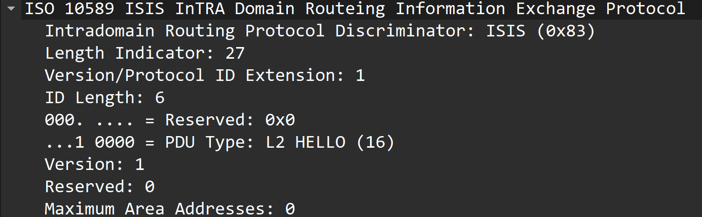

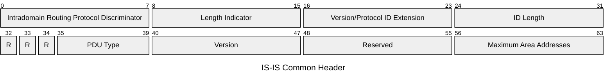

- **Intradomain Routing Protocol Discriminator**

域内路由选择协议鉴别符

- **Length Indicator**

ISIS PDU报头的长度，以字节为单位。

- **Version/Protocol ID Extension**

版本/协议标识扩展，设置为1（0x01）。

- **ID Length**

NSAP地址或NET中System ID区域的长度。值为0时，表示System ID区域的长度为6字节。值为255时，表示System ID区域为空（即长度为0）。

- **R（Reserved）**

保留，设置为0。

- **PDU Type**

PDU的类型。IS-IS PDU共有9种类型，详细信息请参考下表。

- **Version**

设置为1（0x01）。

- **Maximum Area Address**

支持的最大区域个数。设置为1～254的整数，表示该IS-IS进程实际所允许的最大区域地址数；设置为0，表示该IS-IS进程最大只支持3个区域地址数。

### Hello PDU

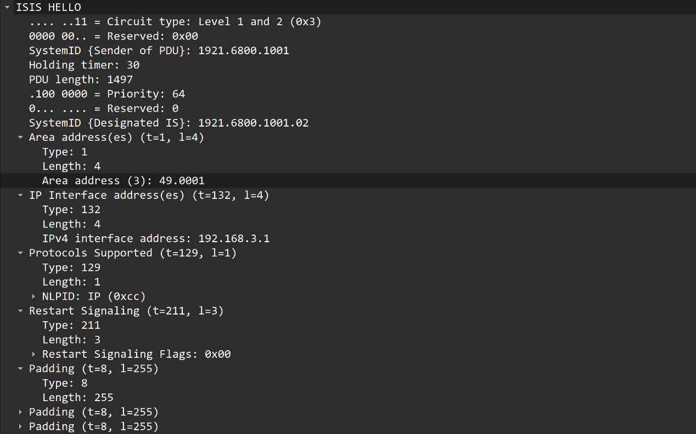

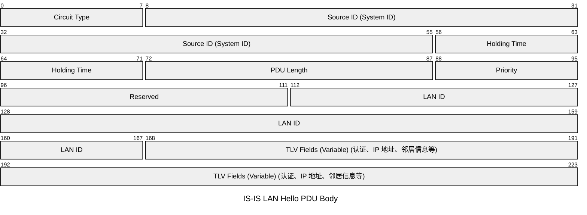

- **Circuit Type**

高位的6比特保留，值为0。低位的2比特表示路由器的类型（01表示L1，10表示L2，11表示L1/L2）。

- **Source ID**

发出Hello报文的路由器的System ID。

- **Holding Time**

保持时间。在此时间内如果没有收到邻居发来的Hello报文，则中止已建立的邻居关系。

- **PDU Length**

PDU的总长度，单位是字节。

- **Priority**

选举DIS的优先级，取值范围为0～127。数值越大，优先级越高，保留前1bit为0。

- **LAN ID**

包括DIS的System ID和一字节的伪节点ID。

### LSP

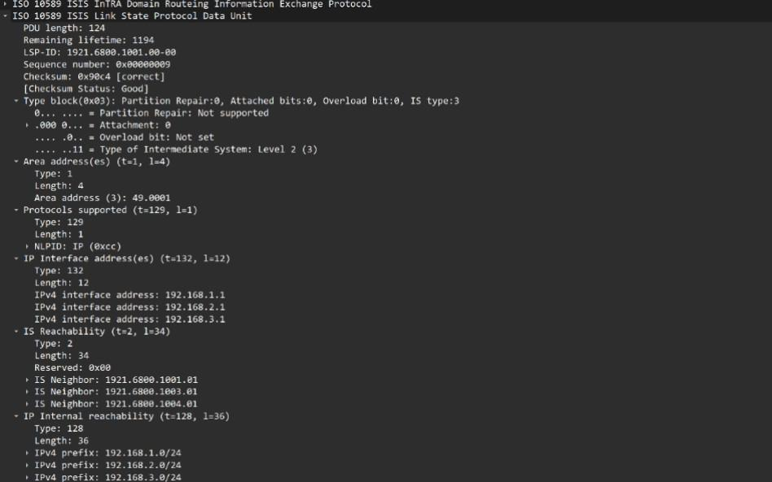

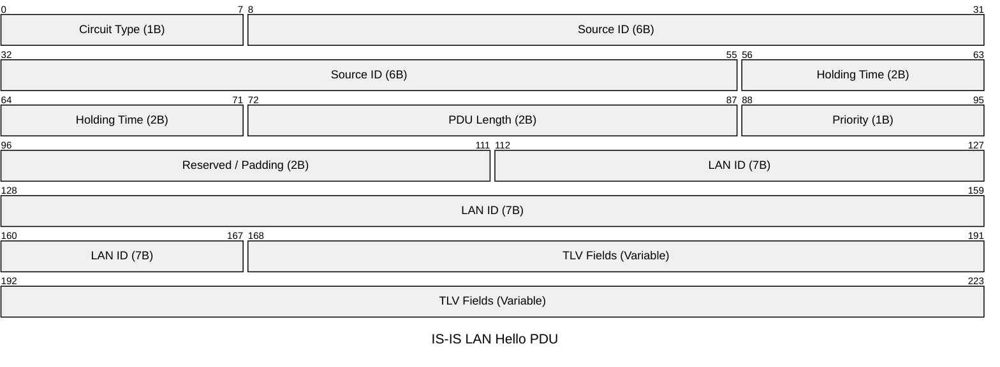

- **PDU Length**

PDU的总长度，以字节为单位。

- **Remaining Lifetime**

ISP的生存时间，以秒为单位。

- **LSP ID**

由三部分组成，System ID、伪节点ID（一字节）和LSP分片后的编号（一字节）。

(System ID(6) + Pseudonode ID(1) + LSP Number(1), e.g. 1921.6800.1001.00-00

- **Sequency Number**

LSP的序列号。

- **Checksum**

LSP的校验和。

- **P（Partition Repair）**

仅与L2 LSP有关，表示路由器是否支持自动修复区域分割。

- **ATT（Attachment）**

由Level-1-2路由器产生，用来指明始发路由器是否与其它区域相连。虽然此标志位也存在于Level-1和Level-2的LSP中，但实际上此字段只和Level-1-2路由器始发的L1 LSP有关。此字段有4bit，用来表明相连的区域所使用的度量方式。

从右至左这4位依次表示如下所示：

第4位：缺省度量；

第5位：时延度量；

第6位：代价度量；

第7位：差错度量。

- **OL（LSDB Overload）**

过载标志位。设置了过载标志位的LSP虽然还会在网络中扩散，但是在计算通过超载路由器的路由时不会被采用。即，对路由器设置过载位后，其它路由器在进行SPF计算时不会考虑这台路由器。当路由器内存不足时，系统自动在发送的LSP报文中设置过载标志位。

- **IS Type**

生成LSP的路由器的类型。用来指明是Level-1还是Level-2路由器（01表示Level-1，11表示Level-2）。

### *SNP：*

- ***CSNP***

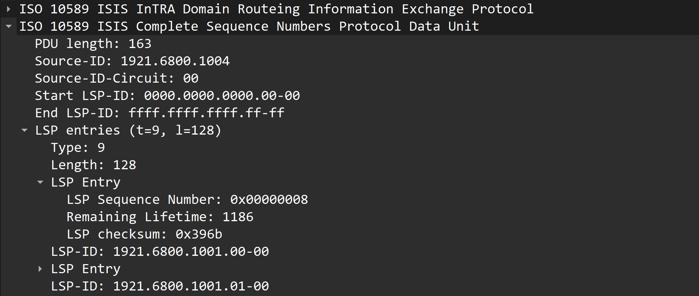

- **Source ID**

发出SNP报文的路由器的System ID。

- **Start LSP ID**

CSNP报文中第一个LSP的ID值。

- **End LSP ID**

CSNP报文中最后一个LSP的ID值。

- ***PSNP***

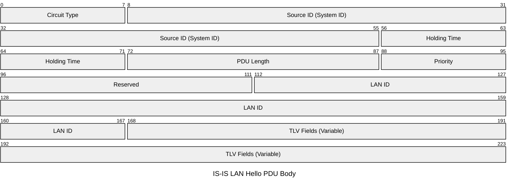

---

## **IS-IS工作过程**

### 建立邻居关系（握手）

ISO10589使用两次握手，RFC3373定义了P2P三次握手机制，

- **P2P网络**

当收到对方发来的HELLO包中有自己的system-id则up。

TLV240包含：邻居状态、邻居的链路ID、邻居的sys-id、自己的链路ID。

P2P握手可进行两次握手和三次握手。

- **MA网络**

MA网络必须进行三次握手。

- **两次握手机制：**

只要路由器收到对端发来的hello报文，就单方面宣布邻居为UP状态，建立邻居关系

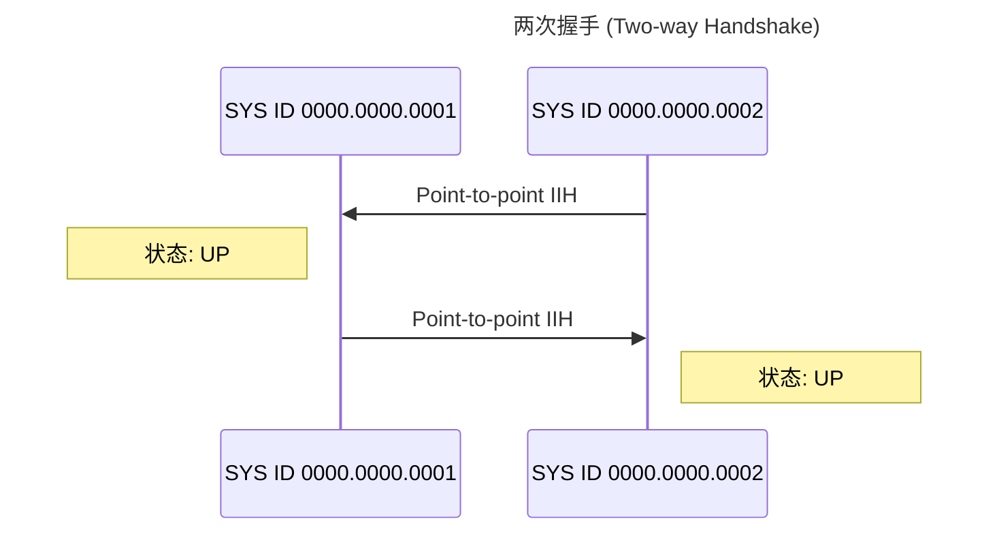

- **三次握手机制：**

此方式通过三次发送P2P的ISIS HELLO PDU最终建立起邻居关系，类似广播邻居关系的建立

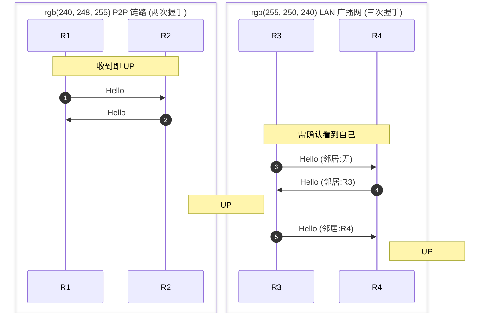

RTA广播LAN IIH，RTB收到后将自己和RouterA的邻居状态标识为**Initial**，并发送带有RTA邻居的LAN IIH。

RTA收到后将自己与RTB的状态表示为UP，然后RTA发送带有RTB邻居的LAN IIH。

RTB收到后将自己与RTA的状态表示为UP。

### 链路信息交互

- **P2P网络**

P2P网络建立邻居后会立即发送CSNP给对端，对端进行判别如果对端的LSDB与CSNP没有同步，则发送PSNP请求索取相应的LSP，收到LSP后用PSNP进行确定。

LSDB同步后用SPF算法进行路由计算。

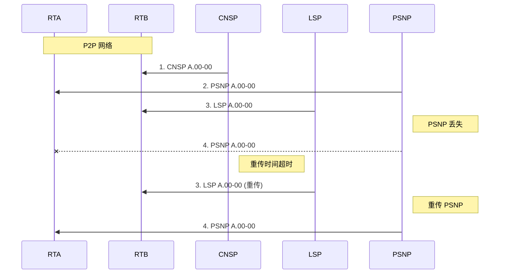

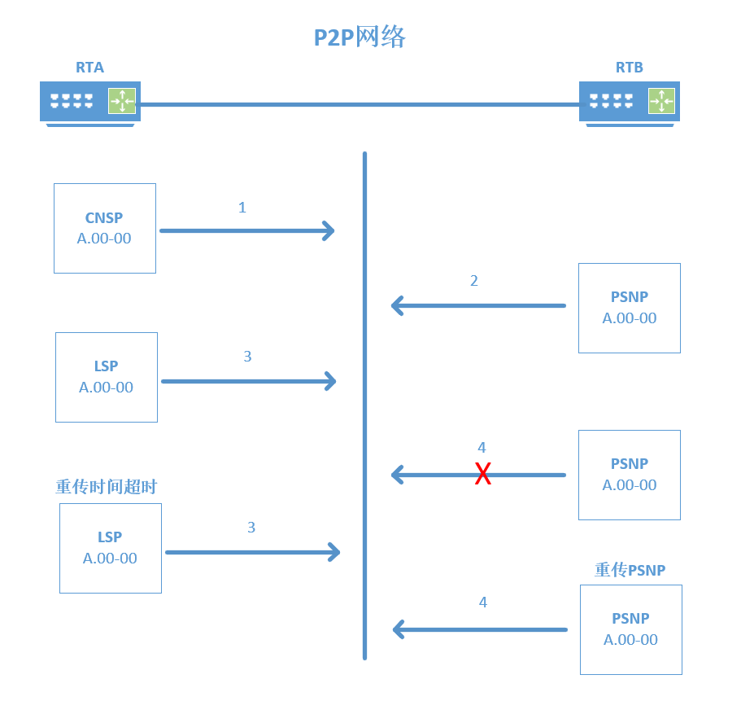

- **MA网络**

MA网络中路由器会等待两个HELLO报文间隔，再进行DIS选举。hello报文中包含Priority字段，**Priority值最大的将被选举为该广播网的DIS**。**若优先级相同，接口MAC地址较大的被选举为DIS。**

选举完成后每台设备都直接把自己的Isp发给DIS, DIS收集到了所有的LSP，形成完整的LSDB，CSNP周期发送。

ISIS路由器收到LSP，不回确认包。

DIS会周期性（默认10s）发送CSNP，如果刚才的LSP没收到，下一次CNSP过来，发现自己还是缺少其中的LSP，再用PSNP请求。

LSDB同步后用SPF算法进行路由计算。

## **LSU**

懒