# OSPF(开放最短路径优先协议)

> OSPF是被最广泛使用的一种动态路由协议，是一种链路状态协议。通过传播LSA来描述自身LSDB，实现动态路由。

- 链路状态协议
- 无类
- 使用组播（224.0.0.5和224.0.0.6）
- 收敛快
- 以开销作为度量值
- 采用SPF算法避免环路
- 触发更新（以较低频率（30分钟）发送定期更新，被称为链路状态泛红）
- 区域的设计使得OSPF可以支持更大规模的网络
- 通过LSA的形式发布路由
- 不支持自动汇总，支持手动汇总。
- 基于接口
- 网络层协议。（协议号89）
- IGP（内部网关协议）

---

## **区域（Area）**

每个区域的路由器**只保留本区域的链路状态信息**（LSDB），这样可以使得路由器的链**路状态数据库不会过大**，拓扑变化仅影响本区域。让ospf能很好应用于大型网络，区域是以接口为单位的。

### **区域ID（Area ID）**

用于标识一个区域，每个OSPF区域都有一个唯一的区域ID。

可以表示成十进制数字，最大限制为65535 ( 2**32)

可以表示成一个ip字段，如0.0.0.1

### **骨干区域（Area0）**

核心区域，也叫传输区域（所有的区域间路由必须通过Area 0中转）**必须要有**，**且只能有一个**，每个非骨干区域都要与骨干区域相邻。一般，骨干区域为区域0。

区域之间靠纯路由传输。没有路由算法加持，容易出现环路，所以需要一个区域作为骨干区域，所有区域必须与骨干区域相连，不同区域需要通过骨干区域进行中转，通过拓扑成面避免了环路。这种有一个中心节点（Hbu）和多个边缘节点（Spokes）的架构叫**Hub-Spoke架构**（中心辐射型架构）。

### **非骨干区域（Area1~65535）**

也叫普通区域，除骨干区域的其他区域，必须与骨干区域相连。

### **其他**

以下详见[**OSPF 4种末梢区域**]

- **Stub（存根区域）**

- **Totally stubby（完全存根区域）**

- **nsaa（不完全存根区域）**

- **Totally nsaa（非纯完全末梢区域）**

---

## **AS自治系统**

一组互联的IP地址集合，由一个或多个自治系统号（ASN）标识。每个AS通常由一个或多个路由器和与之相连的子网组成，这些路由器共同遵循同一套路由协议，形成一个统一管理和控制的网络单元。AS可以使一个网络管理员全部控制该网络的路由策略和流量分发。

详见BGP知识点 挖坑啦。

---

## **Rothers ID**

运行OSPF协议前，必须确定一个RID，RID**具有唯一性**，**用来唯一标识一台OSPF路由器**，RID可以手动配置，也可自动生成，推荐手动配置。

### **RID选取规律：**

1. 手动配置
2. 活动回环口上选取IP地址最高的
3. 活动物理口上选取IP地址最高的

### **注意：**

- RID**具有非抢占性**，（一旦选举出RID，将不会轻易更改）除非重启OSPF进程。
- 非活动端口不参与选举

---

## **DR与BDR选举**

### **邻居关系：**

只交换了Hello包，LSDB未同步。

### **邻接关系：**

需要先建立邻居关系，交换了LSA，LSDB互相同步。

邻接关系一定是邻居关系，邻居关系不一定是邻接关系。

| **DR** | 指定路由，收集和发送区域内的链路状态更新（类似班长） |
| --- | --- |
| **BDR** | 备用指定路由，备份DR，并在当前DR发生故障时接替其角色(类似副班长) |
| **DRothers** | 非DR和BDR的路由器(类似普通学生) |

在一个区域（这指同一网段的路由器）内如果路由器过多，建立和维护邻接关系就会造成大量的开销。而DRothers将DR和BDR作为区域的中心建立邻接关系，由DR与BDR统一收集数据，和分发。DRothers之间保持邻居关系，则可以节省大量开销，降低路由压力。

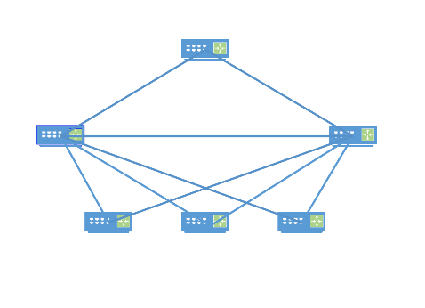

|&emsp;&emsp;&emsp;&emsp;&emsp;&emsp;|

|DR与BDR选举|

v&emsp;&emsp;&emsp;&emsp;&emsp;&emsp;v

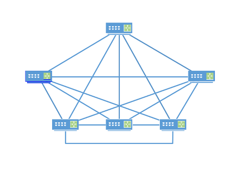

### **组播IP特点：**

- 用**224.0.0.6**向**DR和BDR**发送链路状态更新。（只有DR与BDR监听224.0.0.6）
- 用**224.0.0.5**向**所有ospf设备**发送数据包。（所有OSP路由器都监听224.0.0.5）

### **注意**

- DR，BDR，DRothers之间保持邻接关系（Full），DRothers之间保持邻居关系（Two-Way）。
- 以端口为单位。
- 只要是多路访问BMA和NBMA网络中都要选举DR与BDR，P2P，P2MP不需要进行选举。
- 推荐手动配置DR与BDR。

### 选举规则

1. **先比较Hello报文中的优先级**

- 优先级范围0—255，默认为1
- 优先级为0不参与选举
- 优先级最大被选举为DR，次大被选举为BDR（1和10，10会成为DR）

2. **优先级相同则会比较Router ID**

- Router ID的数值越大，其优先级就越高。

选举有非抢占性，选举完DR与BDR后，路由器将保持这个角色，再次添加路由器将不进行选举，除非DR与BDR失效或重置ospf进程。（先到先得）。

注意：当接口启用OSPF之后，超过等待时间（wait time），仍然没有其他路由器声称自己是DR和BDR，我自己就把该接口设置为DR。

---

## **OSPF路由器类型**

| **内部路由器（IR)** | 所有接口都属于同一区域 |
| --- | --- |
| **骨干路由器（BR）** | 至少有一个接口属于骨干区域 |
| **区域边界路由器（ABR）** | 连接一个或者多个区域到骨干区域，至少有一个接口属于骨干区域 |
| **自治系统边界路由器（ASBR）** | 把从其他路由协议学习到的路由以引入方式到OSPF进程中 |

一个路由器可以同时属于多种类型。

OSPF AS 100

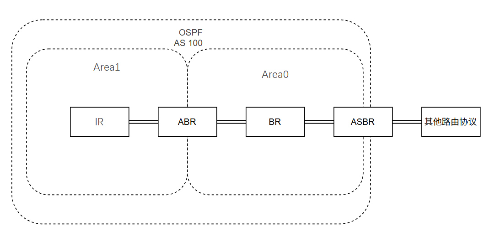

---

## **OSPF 3张表**

| **邻居表** | 记录所有邻居关系 |
| --- | --- |
| **链路状数据态库LSDB** | 记录所有链路状态信息，由此显示了全网的网络拓扑。 |
| **路由表** | 记录最佳路由 |

---

## **OSPF 4种网络类型**

### **BMA(广播网络)**

- 缺省情况下，OSPF默认**以太网**为广播类型。
- Hello、LSU、LSACK报文通过组播发送，DD与LSR通过单播发送。
- 默认Hello10秒，Dead30秒。
- 进行DR选举
- 邻居不需要手动指定

### **NBMA（非广播多点网络）**

- 缺省情况下，**帧中继**，**ATM**的网络是NBMA类型。
- OSPF报文通过单播发送
- 默认Hello30秒，Dead120秒
- 进行DR选举
- 邻居需要手动指定

### **P2P（点到点）**

- 缺省情况下，**PPP**，**HDLC**的网络是P2P（点到点）类型。
- 非必要MAC与ip地址
- OSPF报文通过组播传播
- 默认Hello10秒，Dead40秒。
- 不进行DR选举
- 邻居不需要手动指定

### **P2MP(点到多点)**

- **没有任何链路层协议**被认为是P2MP的，管理员手动配置。
- OSPFHello报文通过组播传播，其他通过单播传播。
- 默认Hello 30秒，Dead 120秒
- 不进行DR选举
- 邻居不需要手动指定

---

## **OSPF 5种数据包**

### OSPF数据包类型

| OSPF数据包类型 | 作用 |
| --- | --- |
| Hello | 发现，建立与维护邻居关系 |
| Database Description（DD或DBD） | **数据库描述包**，LSDB的包头（仅包含LSA头）用于确定已有和未有路由的路由，减少网络开销。 |
| Link Stata Request(LSR) | **链路状态请求包**，请求[LSA]，OSPF邻居双方成功交换DD报文后才会向对方发出LSR报文，请求自己没有的LSA。 |
| Link Stata Update（LSU） | **链路状态更新包**，回应LSR，向对端发送[LSA]。或泛红新的LSA。内容为多条LSA。 |
| Link Stata Acknowledge（LS Aac） | **链路状态确认包**，对LSU进行确认，靠包的报文中的序列号（Sequence Number）确认。 |

**OSPF数据包结构：**

| 数据链路帧报头 | IP数据报头 | OSPF数据报头 | OSPF数据包特定类型数据（如Hello包） |
| --- | --- | --- | --- |

封装在ip协议之上，IP协议号89。

### OSPF数据报头

位：

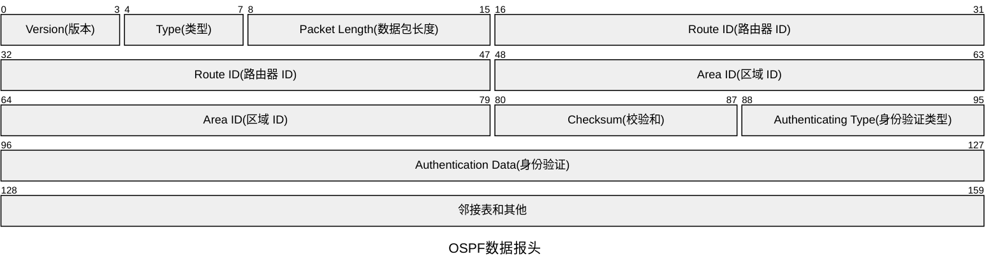

- **Version（版本）：**OSPF的版本。

- **Type（类型）：**数据包的类型

1. Hello包
2. DBD包
3. LSU包
4. LSR包
5. LS Ack包

- **Packet Length(数据包长度):** 数据包长度。
- **Route ID(路由器 ID)：**发送这个数据包的路由器的ID。
- **Area ID（区域 ID）：**发送这个数据包的路由器所在的区域的区域ID。
- **Checksum（校验和）：**确保数据包未被篡改过（之前讲过了不过的赘述）。
- **Authenticating Tyoe（身份验证类型）：**身份验证的类型，0为没有身份验证。
- **Authentication data（身份验证）：**身份验证的信息，可选择，开启身份验证则有。

### Hello数据包

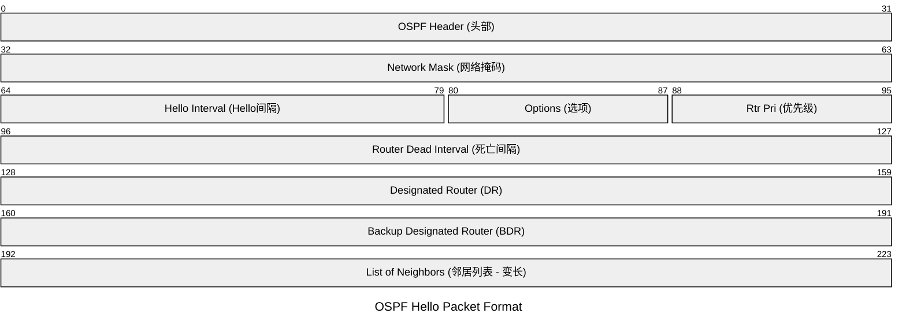

- **Network Mask :** 发送Hello报文的接口所在的网络掩码。
- **Hello Interval :** 发送Hello报文的间隔，默认10s。
- **Options :** 可选项，详见DBD数据包。
- **Router Priority :** 接口DR优先级，默认为1。
- **Router Dead :** 死亡时间，如果在此时建内未发现邻居的hello包，则判定邻居死亡（失效），默认40s。
- **DR：** DR的接口IP地址。
- **BDR ：**BDR的接口IP地址。
- **Active Neighbors：**邻居表（目前仍在活动的邻居）。

### DBD数据包

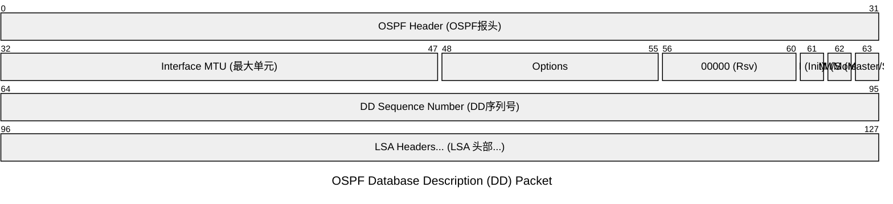

用于主从选举的报文（不包含LSA）：

用于描述LSA的报文：

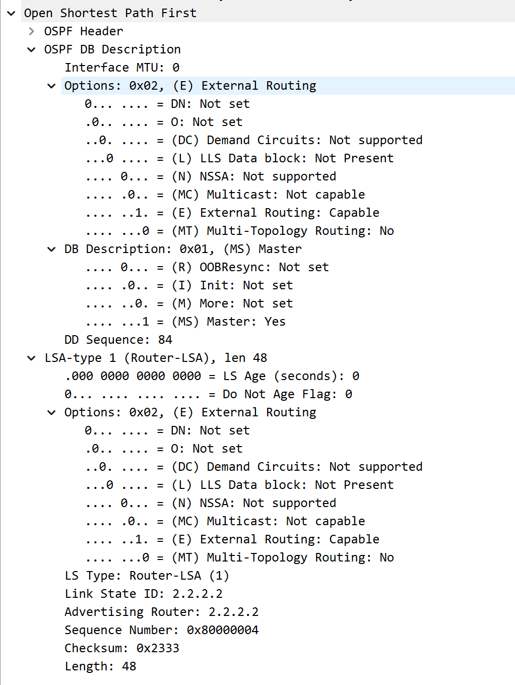

- **Interface MTU：**

接口传输最大单元，用于描述接口的MTU值。在虚链路上，这个值通常为0。华为默认为0，不去检测。

关于MTU详见[TCP/IP传输层]和[TCP/IP网络层]

- **Options：**
  - DN：用于指示路由器所在的区域编号。在某些特殊情况下，如MPLS VPN中，DN位可以用来避免环路。
  - O：表示路由器是否支持不透明LSA的传输。
  - DC：表示路由器是否支持需求电路。需求电路是一种逻辑链路，只在有数据传输时才会建立，有助于节省带宽资源。
  - L：用来标识是否拥有LLS数据块，为了提高OSPF协议的性能，华为公司引入了LLS数据块。可以用于传输附加的参数和属性，改进认证功能。
  - N/P：用来指示非标准区域（NSSA）的存在。
  - MC： 用来表示是否支持组播。
  - E：用来指示路由器是否支持扩展外部路由功能。
  - MT：用来指示路由器是否支持多拓扑功能。多拓扑是指在一个OSPF域中使用多个拓扑结构，每个拓扑结构可以有不同的组网策略。（多播）。
- **DBD标记位：**
  - R：默认都是0，大概应该也许没啥屁用。
  - I：如果值为“1”，表示这是第一个DBD报文，用于主从关系选举。
  - M：更多标志位。如果值为“1”，表示后面还有更多的DBD报文；如果为“0”，则表示这是最后一个DBD报文。
  - MS：主从标志位。如果值为“1”，表示发送者是主设备（Master）；如果为“0”，则表示发送者是从设备（Slave）。
- **DD Sequence(DD序列号)：**

描述收到的DBD报文的序列号。在主从关系选举后，主设备会主导后续的DBD报文交互，并通过序列号来确保报文的有序可靠传输。

- **主从关系**

通过前2个DBD数据包来选举，比较RID，RID高者为主人。低者为仆人。

注意：

建立邻居过程中前2个DBD数据包不包含LSA，只用来选举主从关系。

主从选举不是DR选举，无论什么网络，路由器必须要进行主从选举主从选举。而DR选举只在BMA，NBMA网络下路由器才进行选举。

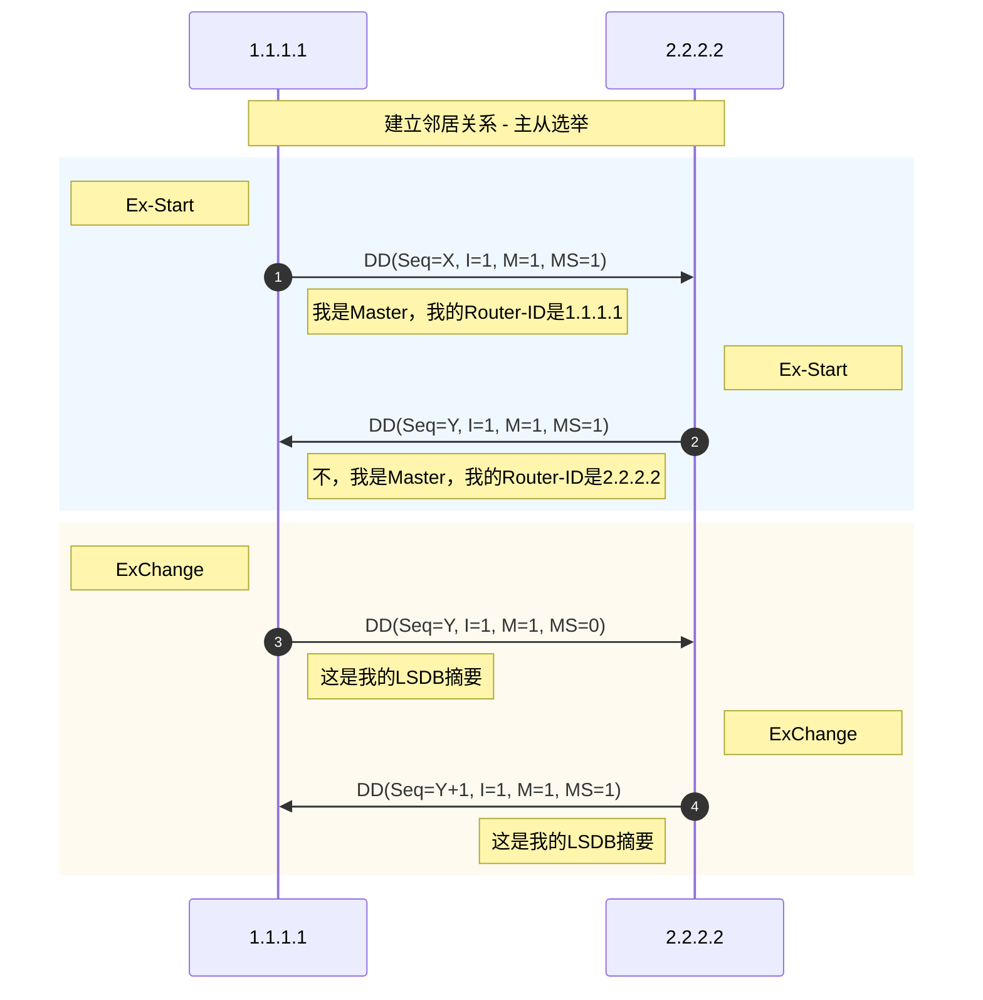

### LSR数据包

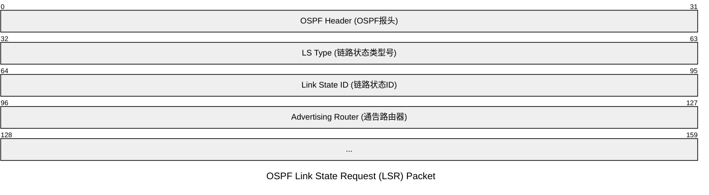

这辈子没见过这么好画的数据报

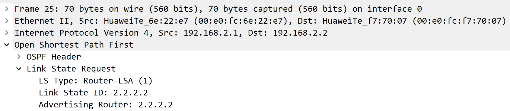

**LS type（路状态类型号）**：用于标识LSA的格式和功能。

**Linj State ID（链路状态ID）**：描述需要的LSA，

**Advertising Router（通告路由器）**：它表示该LSA是由哪一台路由器生成的。

当两个LSA一样时，需要根据LSA中的LS sequence number、LS checksum和LS age来判断出所需要LSA的新旧。

### LSU数据包

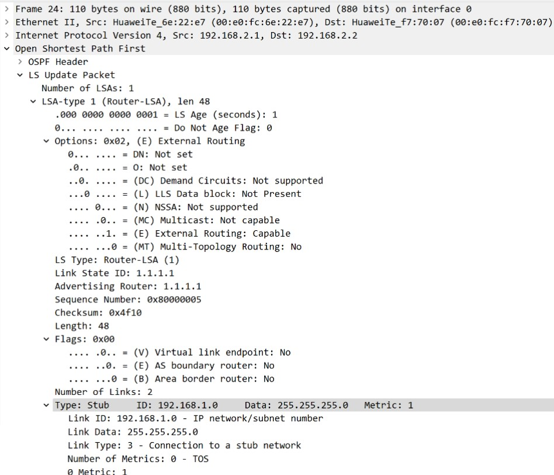

Number of LSAs（链路状态通告的数量）：数据包内LSA的数量。

其他的没啥可说的了，数据作用前面都讲过了。细看上文。

### LSAck数据包

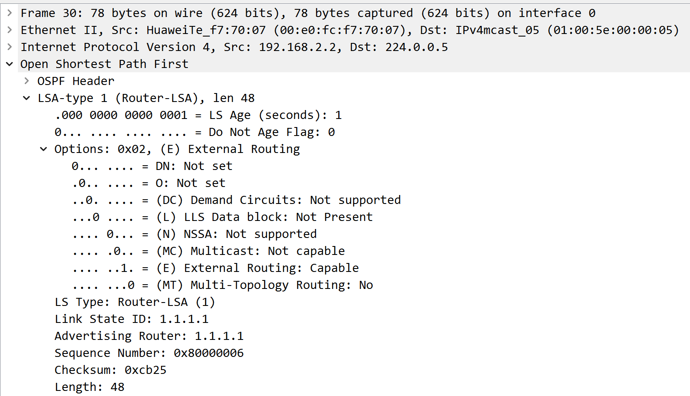

通过LSA序列号（sequenceNumber）对LSA进行接收确认。

一样，没啥可说的了，细看上文。

## **OSPF 8种状态和通讯过程**

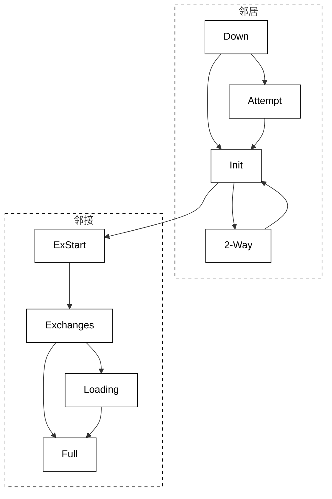

### 建立邻居关系

1. **Down（失效状态）**

已开启OSPF进程，没有收到Hello包。

1. **Init（初始状态）**

收到Hello包，但没有看到自己，此时会在自己的Hello包中添加对方并发送。

 人话：

1.A  大家好，我是A，我现在一个都不认识。

2.B（收到A数据包）🡪大家好我是B，我有一个邻居A。

3.A（收到B数据包）🡪大家好我是A，我有一个邻居B。

1. **Attempt**

此状态只在NBMA网络上存在，表示没有收到邻居的任何信息，但是已经周期性的向邻居发送报文，发送间隔为HelloInterval。如果RouterDeadInterval间隔内未收到邻居的Hello报文，则转为Down状态。

1. **2-Way（双向通讯状态)**

收到Hello包，并发现了自己，形成邻居关系，但是没有与邻居建立邻接关系。

### 建立邻接关系

1. **Exstart（交换初始状态）**

路由器开始发送DD数据包，决定信息交换时路由器的主从关系，在此状态下发送的DD报文不包含链路状态描述。

1. **ExChange（交换状态）**

开始向邻居发送包含链路状态描述的DD数据包.描述本地LSDB内容。

1. **Loading（加载状态）**

开始LSR和LSU的交换，同步LSDB。

1. **Full（完全邻接状态）**

路由器的LSDB已经完成同步。 到此也代表着邻接关系建立。

### 建立邻居要求

OSPF路由器应该在**2-Way（邻居）**或**Full（邻接）**状态才是正确的。

- Hello/Dead时间间隔一致
- 区域ID一致
- RID唯一
- 认证（如果启用了认证）一致
- 链路MTU大小一致（默认不开启检查，思科默认开启)
- 子网掩码一致（以太网环境)
- 网络地址一致
- 末梢区域设置一致（Option)
- OSPF建立关系不看网络类型，但由于网络类型不LSA 1中的link type不同，以及LSA 2的描述不同，所以无法完成l路由计算。

## **OSPF工作原理**

1. **发现并建立邻居**

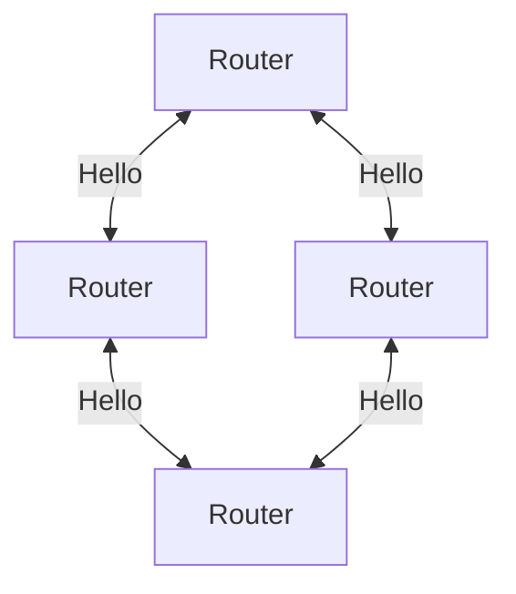

2. **泛洪LSAs**

- Link State Advertisement，链路状态宣告（路况信息)
- 链路：路由器接口
- 状态：描述接口信息（地址、掩码、开销、网络类型、邻居关系等)将LSA泛洪到区域中的所有OSPF路由器，而不仅是直连的路由器

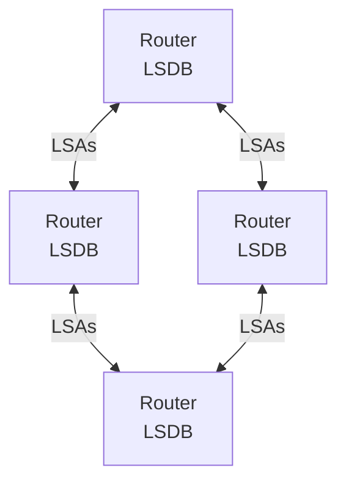

3. **收集LSA创建LSDB**（链路状态数据库、地图)

4. **使用SPF算法计算到每个目标网络的最短距离**

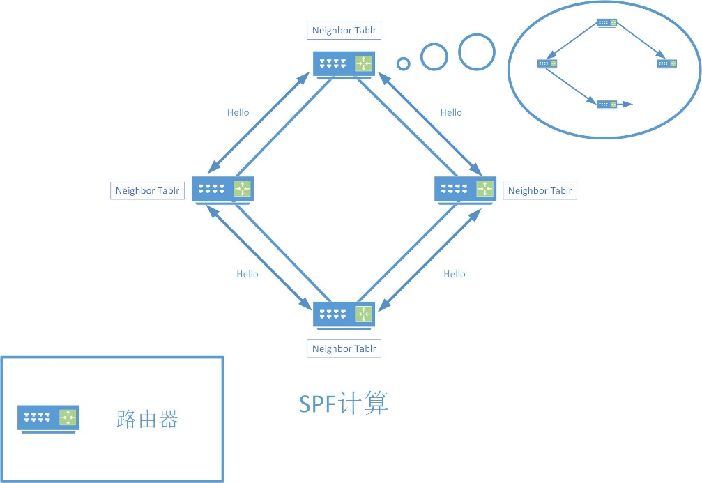

5. **生成路由**

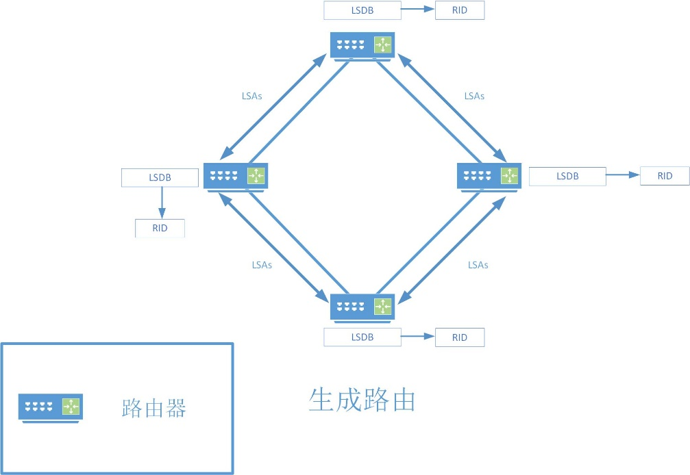

## **LSA（链路状态通告）**

LSA包含了**路由器所知道的关于网络拓扑的详细信息**，它的主要目的是让OSPF路由器能够了解网络中的链路状态变化，从而更新其路由表。

- LSA通过泛洪在OSPF网络中传播。
- 每个LSA都有一个序列号，用于确保信息的最新性和一致性。当链路状态发生变化时，序列号会增加。

### 类型

1. **Router LSA（LSA 1）**

- 产生者：区域内的所有路由器。
- 内容：描述路由器的链路状态和花费。
- 特点：这类LSA包含了路由器与其邻居之间的链路信息，包括链路类型、接口IP地址及掩码、链路上所连接的邻居路由器以及链路的带宽（开销）。
- 泛洪范围：只会在产生它的区域内进行泛洪。

2. **Network LSA（LSA 2）**

- 产生者：多址网络中的指定路由器（DR）。
- 内容：描述本网段的链路状态，包括DR本身以及所有与DR相连的路由器。
- 泛洪范围：只会在产生它的区域内进行泛洪。

3. **Network Summary LSA（LSA 3）**

- 产生者：区域边界路由器（ABR）。
- 内容：描述区域内某一网段的路由，并汇总后通告给相关区域。
- 泛洪范围：通告给除产生它的区域外的其他区域。
- 特点：ABR会把区域外部的路由信息汇总后，以网络LSA通告的方式通告给区域内的其他路由器；同时，也会把内部的路由信息汇总后通告到骨干区域。

4. **ASBR Summary LSA（LSA 4）**

- 产生者：区域边界路由器（ABR）。
- 内容：与类型3相似，但通告的目的地是一个自治系统边界路由器（ASBR）而不是一个网络。
- 泛洪范围：通告给需要知道如何到达ASBR的路由器。即告诉其他区域"ASBR在哪里，如何到达ASBR"。

5. **Autonomous System External LSA（LSA 5）**

- 产生者：ASBR。
- 内容：通告到达OSPF自治系统外部的目的地或到OSPF自治系统外部的默认路由。
- 泛洪范围：在整个自治系统内进行泛洪。
- 特点：是引入外部路由信息的主要方式，允许OSPF自治系统内的路由器了解如何到达外部网络。

6. **NSSA External LSA（LSA 7）**

- 产生者：非纯末梢区域（NSSA）中的ASBR。
- 内容：与自治系统外部LSA通告相同。通告到达OSPF自治系统外部的目的地或到OSPF自治系统外部的默认路由。
- 泛洪范围：只在产生它的NSSA区域内进行泛洪。
- 特点：允许NSSA区域在不影响其他OSPF区域的情况下，引入外部路由信息。

7. **Group Membership LSA（LSA 6）**

- 用途：用于向 OSPF 网络通告其直连网络上的组播组成员。现在极为少见。
- 内容：描述了每个组成员的IP地址以及它们所属的组。
- 特点： LSA6仅在 MOSPF中由支持组播的路由器生成。例如，当一个主机加入组播组 **239.1.1.1** 时，直连路由器会生成 LSA 6，通知其他路由器该组播组的成员位置。
- MOSPF：（Multicast OSPF，组播扩展OSPF）， 是 OSPF 的早期组播扩展，定义于RFC 1584，但在实际部署中逐渐被 PIM（协议无关组播） 取代，因为如果使用MOSPF就必须要求正4个网络中的单播路由都是OSPF的路由。

[百度百科_MOSPF](https://baike.c114.com.cn/view.php?id=3832-D1993469&word=)

[RFC 1584](https://baike.c114.com.cn/view.php?id=3832-D1993469&word=)

8. **External Attributes LSA（LSA 8）**

- 用途：用于传递类型5或类型7 LSA的外部度量和外部路由标签等属性信息。
- 内容：包含了关于外部路由的额外属性，如度量值和路由标签。
- 特点：这种LSA类型允许路由器在引入外部路由时，能够携带更多的路由属性信息，从而提供更丰富的路由选择依据。

9. **Opaque LSA（LSA 9、10、11）**

- 用途：用于在OSPF中扩展新的功能。
- 内容：可以包含多种类型的信息，如扩展的路由信息、流量工程信息、多协议标签交换（MPLS）信息等。
- 分类：
- **Intra-area-Prefix LSA（LSA 9）**：

> LSA9是OSPFv3中引入的一种新类型的LSA，用于支持IPv6网络。LSA 9独立携带 IPv6 前缀信息，包括子网地址、前缀长度及关联的路由器或网络。与LSA5类似，LSA9也描述了到达外部网络的路径信息。

- **Opaque LSA：本地区域范围（LSA 10）：**

> LSA10是一种不透明LSA，目前主要用于MPLS，它允许网络管理员在OSPF区域内定义和传播额外的、非标准的链路状态信息。作用范围限定在本地OSPF区域内，不会跨越区域边界传播。

- **Opaque LSA：AS范围（LSA 11）：**

> LSA11是另一种不透明LSA，与LSA10类似，它也主要用于MPLS网络中的流量工程。但不同的是，LSA11的作用范围是整个OSPF自治系统（AS），可以跨越多个区域传播。

### **常见LSA可传播区域传播表**

| **区域类型** | **Type1** | **Type2** | **Type3** | **Type4** | **Type5** | **Type7** |
| --- | --- | --- | --- | --- | --- | --- |
| 普通区域（包括标准区域和骨干区域） | 是 | 是 | 是 | 是 | 是 | 否 |
| Stub区域 | 是 | 是 | 是 | 否 | 否 | 否 |
| Totally Stub区域 | 是 | 是 | 否 | 否 | 否 | 否 |
| NSSA区域 | 是 | 是 | 是 | 否 | 否 | 是 |
| Totally NSSA区域 | 是 | 是 | 是 | 否 | 否 | 是 |

**LSA优先级：**

LSA1 1 , LSA 2 > LSA 3 > LSA 4 > LSA 7

## **LSA数据结构（未完成）**

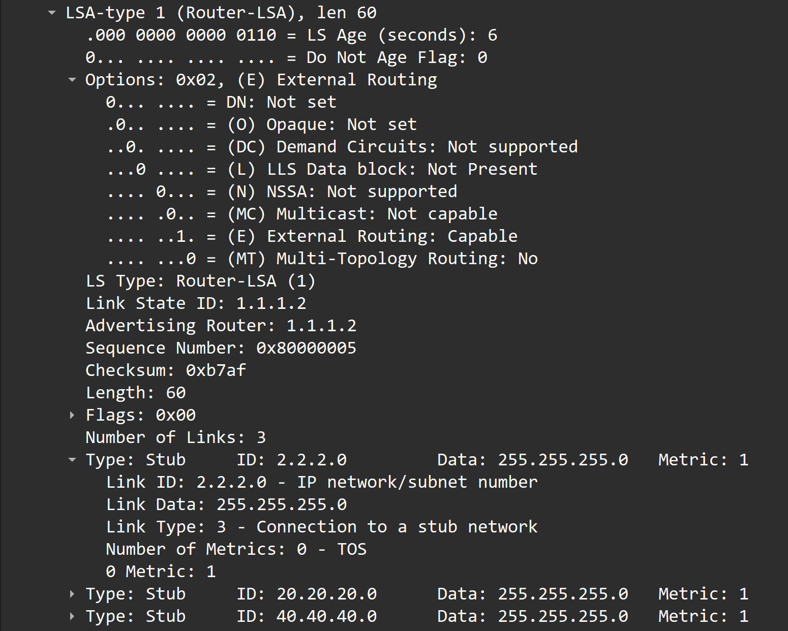

LSA抓包

### LSA头部

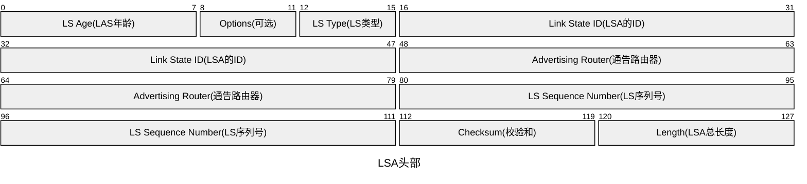

包含LSA的类型、链路状态ID、广告路由器ID、序列号、校验和等信息。

- **LS Age（LS年龄）**

LSA产生所经过的时间，随时间增加而增大，LS Age越大，LSA越老，当LS Age为max-即3600s时，删除LSA。

- **Options(可选)**

- DN：用于指示路由器所在的区域编号。在某些特殊情况下，如MPLS VPN中，DN位可以用来避免环路。
- O：表示路由器是否支持不透明LSA的传输。
- DC：表示路由器是否支持需求电路。需求电路是一种逻辑链路，只在有数据传输时才会建立，有助于节省带宽资源。
- L：用来标识是否拥有LLS数据块，为了提高OSPF协议的性能，华为公司引入了LLS数据块。可以用于传输附加的参数和属性，改进认证功能。
- N/P：用来指示非标准区域（NSSA）的存在。
- MC： 用来表示是否支持组播。
- E：允许泛洪LSA 5 外部路由。0=不支持，1等于=支持。
- MT：用来指示路由器是否支持多拓扑功能。多拓扑是指在一个OSPF域中使用多个拓扑结构，每个拓扑结构可以有不同的组网策略。（多播）。

- **LSA Type（LS类型）**

用于标记LSA的类型，LSA简写后面的数字便LSA是Type，LSA 1 的LSA Type为1，LSA 2的LSA Type为2，以此类推。

P2P网络中，无LSA 2

LSA 9，LSA 10 ，LSA 11 统称为不透明LSA。

- **Link State ID(LSA的ID)**

用于标识LSA，可以确定唯一LSA，取值由LSA的Type相关。

- **Advertising Router(通告路由器)**

产生此LSA的路由器的Router ID。

- **LS Sequence number（LS 序列号）**

具有最高序列号的LSA越新。范围为0x8000 0001 ~ 0x7FFF FFFF

LSA每30min泛洪一次，序列号就加1

- **LS checksum**

校验和，不包括LS Age。

- **length**

LSA的总长度，包括LSA头，以字节为单位。

### LSA体部

包含具体的链路状态信息，如路由器ID、邻居信息、链路成本等

### Router LSA（LSA 1）

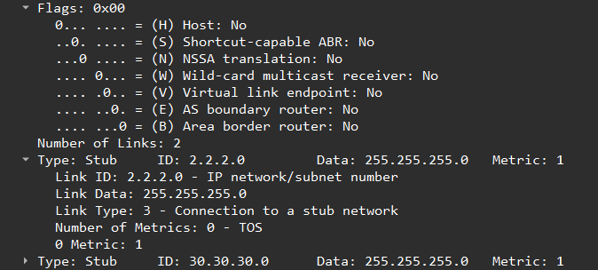

**Link State ID**

生成LSA的Router ID

**flags**

仅有3bit有用。

V：Virtual Link，1bit，如果产生此LSA的路由器是虚连接的端点，则置为1。

E：External，1bit，如果产生此LSA的路由器是ASBR，则置为1。

B：Border，1bit，如果产生此LSA的路由器是ABR，则置为。

**# Links**

这条LSA的所描述的链路信息数量。

**Link ID**

根据链路类型不同而变化。

1：邻居设备的Router ID；

2：DR的接口IP地址；

3：网段／子网号；

4：虚连接中对端的Router ID。

**Link Data**

连接数据，其值取决于连接的类型：

unnumbered P2P：接口的索引值；

stub网络：子网掩码；

其它连接：路由器接口的IP地址。

**Type**

路由器连接的基本描述：

1：P2P连接到另一台路由器；

2：连接到传输网络；

3：连接到stub网络；

4：虚拟链路。

**#TOS**

服务类型ToS（Type of Service）数量。

**Metric**

链路的开销值。

**TOS**

服务类型ToS

**TOS 0**：默认路径。

**TOS 1**：最小货币成本。

**TOS 2**：最高可靠性。

**TOS 3**：最大吞吐量。

**TOS 4**：最小延迟。

RFC 2328移除了对TOS的支持，LSA1现在仅保留默认的TOS 0，即普通路由。其他TOS字段被忽略。

**TOS metric**

和指定TOS值相关联的度量。

### Network LSA（LSA 2）

**Link State ID**

DR的接口IP地址。

**Network Mask**

该广播网或NBMA网络地址的掩码。

**Attached Router**

连接在同一个网络上的所有设备的Router ID，也包括DR的Router ID。

### Summary LSA（LSA 3）（LSA 4）

**Link State ID**

通告的网络地址。

**Netwrk Mask**

该广播网或NBMA网络地址的掩码。

**metric**

到目的地址的路由开销。

**TOS**

服务类型ToS。

**TOS metric**

和指定ToS值相关联的度量。

### Autonomous System External LSA（LSA 5）

**Link State ID**

通告的网络地址。

**Network Mask**

通告的目的地址的掩码。

**E**

外部度量值类型：

0：第一类外部路由；

1：第二类外部路由。

**metric**

到目的地址的路由开销。

**Forwarding Address**

到所通告的目的地址的报文将被转发到这个地址。

**External Route Tag**

添加到外部路由上的标记。OSPF本身并不使用这个字段，它可以用来对外部路由进行管理。

**TOS**

服务类型。RFC 2328移除了对TOS的支持，LSA5现在仅保留E位。

**TOS metric**

和指定TOS值相关联的度量。

### NSSA External LSA（LSA 7）

**Network Mask**

外部路由的网络掩码。

**External Type**

仅有E位有效，外部路由类型。

1：Type 2外部路由（仅计算外部Metric）。

0：Type 1外部路由（总Metric = 内部链路Cost + 外部Metric）。

**Metric**

外部路由的度量值。

**Forwarding Address**

转发地址，如果为**0.0.0.0**，则使用引入该路由的ASBR地址。

**External Route Tag**

外部路由标记，用于策略路由或过滤。

### 其他：

暂时没写到，以及笔记被word吞了

参考：

ensp实验

[ospf_末梢.7z](attachment:c00c1d8b-89dd-4d46-b704-1f7b7cc4abe8:ospf_末梢.7z)

数据包

[LSA NSSA-1.pcapng](attachment:e2ab4bf9-f615-4e2a-9444-6b8b064e0d1b:LSA_NSSA-1.pcapng)

[LSA NSSA-2.pcapng](attachment:bc45dae0-30d7-44ac-85fd-32e4fffd60ce:LSA_NSSA-2.pcapng)

文档

https://www.rfc-editor.org/rfc/rfc1583

https://www.rfc-editor.org/rfc/rfc2328

[OSPF LSA格式 - CloudEngine S5700, S6700 V600R022C00 配置指南-IP路由 - 华为](https://support.huawei.com/enterprise/zh/doc/EDOC1100278276/dd80564e)

[OSPF LSU - IP 报文格式大全 - 华为](https://support.huawei.com/enterprise/zh/doc/EDOC1100174722/d66fde50)。

## **LSA的更新**

- **触发更新**

> 产生这条LSA的路由器发现这条LSA的状态发生了变化，会产生触发更新的行为，此时LSA的seq + 1 ,chksum 重新计算、 ls age置0。
> 
- **低频率周期性更新**
- 一定周期内路由器会把LSDB中的所有内容发送更新一遍。（默认每30分钟1周期 ）此时LSA的seq + 1 ，chksum重新计算、Ls age置0。
- LSA在一段时间内（默认是30分钟）没有被更新时，会被认为是过时的，并从链路状态数据库中删除。
- **LSA的更新过程**
- 如果接收到LSA比自己的新：

> 确认-->泛洪分享-->SPF计算路由表
> 
- 如果接收到的LSA比自己的旧：

> 将自己的LSA发送给send LSU(发来LSA的设备)
> 

- **辨别LSA的新旧**
- seq 越大越新
- chksum 越大越新
- ls age = 3600 最新
- ls age 差值 > 900，ls age小的最新
- ls age 差值 < 900，ls age一样

## **LSDB（链路状态数据库）**

LSDB由多个LSA构成。

查看LSDB里的内容与LSA头部里的内容高度相似，这里就不再赘述了。

**Metric（度量值）**

表示**到达目标网络的代价即**Cost。

## **开销（COST）**

OSPF用COST（开销）作为度量值，每一个激活的OSPF端口上都有一个COST值。

CSOT=10^8/BW(bps)=100Mbps/BW=接口带宽参考值/接口带宽。

到一个目标网络的度量值=

从源到目标所有出站接口的COST值累加（数据方向）

从源到本路由器沿途所有入站接口的Cost值累加（路由方向)

- **出站接口**

> 路由器发送数据包的接口
> 
- **入站接口**

> 路由器接收数据包的接口
> 

COST的默认最小单位为个位所有小于1的数都会被约为1，可以使用命令修改，但一经修改所有的OSPF路由器都需要修改。

## **OSPF 3种通信量**

- **域内通信量**

单个区域内的路由器之间交换数据包构成的通信量

- **域间通信量**

不同区域的路由器之间交换数据包构成的通信量

- **外部通信量**

> OSPF域内的路由器与OSPF区域外或另一个自治系统内的路由器之间交换数据包构成的通信量
> 

## **OSPF 4种末梢区域**

种类

1. **标准区域**

标准区域是OSPF协议中的正常传输数据的区域

- 标准区域能够接收和处理所有类型的LSA
1. **stub (末梢区域，存根区域)**
- LSA：
- 不允许LSA4，LSA5泛洪（不支持外部路由）
- 允许接收和传递LSA1、LSA2、SA3，明细LSA3（允许骨干区域的LSA3进入，同时ABR会自动下发3类缺省路由。）
- 特点：
- stub不能是骨干区域
- stub不支持部署vink（虚拟链路）
- ABR会生成一条默认路由（通常是0.0.0.0/0）来代替外部路由，使得末梢区域内的路由器能够通过这条默认路由来访问外部网络。
1. **Totally stubby（完全末梢区域，完全存根区域）**
- LSA：
- 不允许LSA4，LSA5泛洪（不支持外部路由）
- 除一条LSA3的默认路由通告外，没有LSA3、4、5、通告
- Totally stubby属于stub的一种，stub的简化路由版，**拥有stub的特点**。

stub区域和Totally stub区别

区别在于把区域内的明细路由LSA3替换为缺省LSA3， Totally stubby内的路由器只需要维护一个默认的出口路由，减少LSDB的规模。（ABR不仅生成默认路由来代替外部路由，还将区域间路由也替换为默认路由）

1. **NSSA（非纯末梢区域）**
- LSA：
- 通过ABR把接收的LSA4，LSA5转换为缺省的LSA7
- nssa区域存在LSA1，LSA2，明细LSA3和缺省LSA7和明细LSA7
- 由于LSA7仅存于nssa区域，由ABR执行LSA7转换LSA5注入至其他区域
- 特点：
- nssa不能是骨干区域
- nssa不支持部署vlink（虚拟链路）
- nssa与stub不同的是能够引入外部路由，引入的外部路由信息通过LSA 7来传播
1. **Totally nssa（非纯完全末梢区域）**
- LSA：
- 通过ABR生成缺省LSA7取代原本LSA4，LSA5 ，NSSA区域不包含明细LSA3
- 通过ABR把接收的LSA4，LSA5转换为缺省的LSA7
- 由于LSA7仅存于nssa区域，由ABR执行LSA7转换LSA5传至其他区域
- Totally nssa属于nssa的一种，nssa的简化路由版，**拥有nssa的特点**。

> NSSA区域与Totally nssa区域区别
> 
> 
> 在NSSA基础上，把区域内的明细路由LSA3替换为缺省LSA3 与外部接收的缺省lsa7共存。减少LSDB的规模（缺省lsa3>缺省lsa7）（ABR不仅将LSA 7转换为LSA 5并注入到其他区域中，还将区域间路由替换为默认路由）
> 

## **虚链路技术**

一种逻辑链路。因为[OSPF](https://so.csdn.net/so/search?q=OSPF&spm=1001.2101.3001.7020)采用了区域化的设计，并且区域也采用了Hub-Spoke的架构，所有区域与Area0相连，当有些区域无法与Area0直接相连时就需要用到虚链路（Virtual Link）将骨干区域的范围通过虚拟的方法进行扩展到相邻常规区域的位置，因而让不能直接与骨干区域相连的区域可以与骨干区域相连。

- **Virtual-link（虚链路）：**
- 是指在两台ABR之间通过一个非骨干区域建立一条逻辑上的连接通道，修复被分割的Area0。
- 虚了链路必须在两端同时配置。
- 在配置网络时应尽量减少虚链路的使用，以方便管理，网络存在永久虚链路通常表面该网络拥有缺陷。
- **Transit Area（传输区域）：**
- 为虚链路两端提供一条非骨干区域内部路由的区域被称为传输区域（Transit Area）。

### 应用场景

- **非骨干区域未能与骨干区域相连：**

↓虚链路↓

在进行OSPF虚链路扩展后，Area1被虚拟成了骨干区域，而这时的AR3等同于连接Area0和Area2的ABR（因为有一个virtual接口在区域0，因此变成了ABR），所以可以将自己所有的LSA发进区域2。在扩展OSPF虚链路时，是通过连接R2（ABR）与R3（ABR）的Router-ID 来建立的。

- **骨干区域未能与骨干区域相连：**

↓虚链路↓

在经过OSPF虚链路将Area1也扩展为骨干区域后，可见所有的区域都变成了骨干区域，从而使网络中骨干区域能够收到另外一边被分割的骨干区域的路由,( 把发生“分割”的骨干区域合并)并且最后骨干区域自己的路由都为Intra-Area Route（区域内路由），但Area 1与骨干区域的路由将仍然为O IA（区域间路由）。

- **逻辑冗余：**

图中，存在次优路径及骨干区域不健壮的问题。

R3和R4间在Areal.上创建Vlink，作用有两个，一个作用是可以用于提高Area0 的健壮性，避免R1和R2之间链路断开而导致的Area0分裂。另一个作用在于，若R4访问R3的G0/0/0接口，如果不做Vlink，需要经过Area0中的R2和R1（此接口通告进入了R0），而做了Vlink后，R4访问G0/0/0经过R5到R3，这可解决次优路径问题。即R4访问G0/0/0接口，路径R4-R5-R3优于R4-R2-R1-R3。

### 注意点：

- 虚链路必须配置在两台ABR之间，这两个ABR都有一个端口与同一个非主干区域相连, （只能也必须跨越一个区域） 其中必须至少有一个ABR是连接骨干的。
- 虚链路被认为是骨干区域的一个接口，一条链路，也需要建立OSPF邻居，但在邻居建立之后，链路上是没有Hello包传递的。
- 虚链路的开销不可配置。但是其值可以被虚链路端点的两台ABR通过此区域路径的cost来控制。
- 虚链路一端的ABR会在OSPF邻居表里，列出虚链路对端与其建立邻接关系的ABR的RID。
- ABR至少要通过虚链路与一台邻居路由器建立起状态为Full的邻接关系，才会在它生成的Virtual1类LSA中将V位置位为1。
- 若ABR要在类型1 LSA的“链路ID”和“链路数据”字段中，描述一条虚链路，便会将与以上两个字段相对应的“ 链路类型”字段值设置为4。
- 在类型1类LSA中，Link ID字段是链路对端路由器的Router ID。
- 在虚链路跨越的区域内部，从虚链路过的OSPF 数据会以区域内数据包的形式来传输。只有在此情况下，才不要求OSPF数据包在其直连的邻居路由器之间传输。
- 穿虚链路的OSPF数据包，它的OSPF头部中的区域ID字段会被设置为0。
- 通过虚链路发送的OSPF的Hello包里，子网掩码的值会被设置为0.0.0.0。
- 通过虚链路的数据包，接口的MTU字段值将会设置为0。
- 传输区域必须是普通区域，不能是末梢区域。

### 虚链路LSA（未完成）

## **OSPF认证（需扩展）**

OSPF认证的主要作用是防止不受信任的设备引入有害路由信息，影响网络的安全性和稳定性。

### 认证类型：

两台OSPF路由器需要同样认证才可成为邻居。

- **空认证（无认证）：**

默认情况，不需要密码来认证身份。

- **明文认证：**

> 使用明文密码进行认证，密码在传输过程中不被加密，因此存在被窃听的风险。
> 
- **密文认证：**

> 密文认证使用加密方式传输密码，提高了安全性。常见的密文认证方式包括MD5和SHA-HMAC等哈希算法，它们通过对OSPF消息进行哈希运算，生成固定长度的认证码或哈希值，从而确保消息的完整性和真实性。
> 
> 
> MD5和SHA-HMAC详见VPN
> 

### 认证方式：

- **接口认证：**

在ospf路由器的接口上进行认证

- 接口认证是对每一个OSPF接口进行验证的基本级别。当接口启用认证时，只有那些配置了正确的密码或共享密钥的邻居路由器才能与其建立邻接关系。
- **区域认证：**

对整个OSPF区域中的所有路由器进行认证。

- 区域认证涉及到整个OSPF区域，要求区域内所有路由器配置统一的认证方式和密钥。
- 如果某个路由器缺少相应配置，它将无法与区域内其他路由器建立邻居关系，从而影响网络稳定性和安全。
- **虚链路认证：**

对虚链路进行认证。

接口认证优先级大于区域认证。

|  | 密钥 | 启用 |
| --- | --- | --- |
| 接口认证 | 接口 | 接口 |
| 区域认证 | 接口 | 进程 |
| 虚链路认证 | 进程 | 进程 |

## **SPF（最短路径优先算法）**

SPF算法是一种单源最短路径算法，即从指定的源点出发，求出到其余各个顶点的最短路径。该算法的主要特点是单个节点拥有“上帝视角”，以源点为中心向外层层扩展，直到达到终点。

**应用场景:**

地图导航以及网络路由等

**必要条件:**

已知有限个节点和唯一的源点;已知每一条边的权重并且是正数.

**循环周期:**

先确认距离最短的下一跳,再更新下一跳的邻居.

### 构建SPF树：

SPF树是一种有向无环图（DAG），与stp（生成树）作用相似，以一个源节点为根，创造出一个无环的拓扑结构。

SPF树中只有单项最短路径，保证了OSPF区域内不会出现环路。

广播网络中DR和所有连接路由器的Cost值为0。

路由器将自己作为最短路径的树根，根据Type1 LSA和Type 2 LSA中的拓扑信息，依次添加到SPF树中，路由器以Router-ID或者DR标识。

1. **初始：**

> 创建一个候选节点列表，用于存储待处理的节点。
> 
> 
> 路由器以自己为根，检查Type1 LSA，对非StubNet类的Link，将Link ID加入候选列表并记录路由开销。
> 
1. **迭代构建：**
    1. 通过Type1 LSA中的Cost，选取一个距离根最近（Cost最小）的节点（路由器端口）添加到SPF树中，并从候选表中删除。
    2. 查询Type2 LSA，通过已确定最短路径的节点，更新其邻居节点的开销值。具体地，对于每个邻居节点，计算从源点通过当前节点到达邻居节点的总开销，并与邻居节点当前的Cost进行比较，将Cost最小的添加到SPF树上，并从候选表中删除。如果节点在SPF树上已存在则忽略该节点。
2. **重复步骤：**

重复上述过程，直到候选节点列表为空，即所有节点都已加入SPF树中。

### 计算最优路由：

将 Type1 LSA和Type2 LSA中的路由信息以叶子节点的形式附加在对应的OSPF路由器上计算最优路径。已经出现的路由信息不会再添加到SPF树上。

从根节点依次添加各节点的LSA路由信息，添加顺序为各节点加入SPF树的顺序，已出现的节点忽略。

## **路由选择**

O > O IA > N1 > E1 > N2 > E2

| 路径类型 | 优先级顺序 | 区别和特点 |
| --- | --- | --- |
| 区域内 (O) | 第一 | 在同一区域内的路径，基于链路成本选择最短路径。 |
| 区域间 (O IA) | 第二 | 用于跨越不同区域的路径，提高网络可扩展性。 |
| NSSA 类型 1 (N1) | 第三 | 在特殊区域内连接外部网络，考虑到成本。 |
| 外部类型 1 (E1) | 第四 | 考虑到区域内和外部网络的成本，优选经济路径。 |
| NSSA 类型 2 (N2) | 第五 | 在特殊区域内连接外部网络，仅考虑区域内成本。 |
| 外部类型 2 (E2) | 第六 | 仅考虑区域内成本，用于简化路由计算。 |