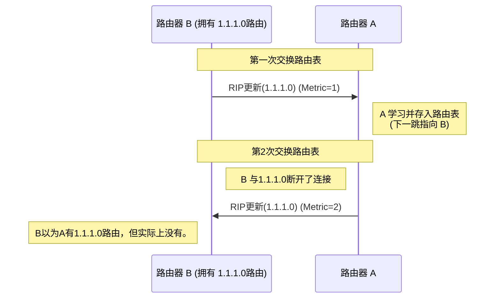

# **RIP(Routing Information Protocol，路由信息协议)**

RIP是非常古早的路由协议，现如今应用较少，但学习RIP可以了解动态路由的原理，在实际运用上，能不用RIP就不要用RIP，如必须要使用RIP则尽可能使用RIPv2。

如果部分设备性能不足可以使用OSPF等进行配置，（叠个甲，AI说的）。

RIPv1由RFC-1923定义，RIPv2由RFC-2453定义。

- 距离矢量路由协议
- IGP协议
- 基于UDP，目标端口号520
- 周期性更新
- 适用于小型网络，有RIPv1和RIPv2两个版本。
- 周期性更新
- 支持水平分割，毒性逆转等防环特性。
- RIPv2使用组播地址224.0.0.9

---

## **RIP工作原理**

- 跳数

RIP使用跳数作为度量值来衡量到达目的的网络的距离

缺省情况下，直连网络的路由跳数为0，当路由器发送路由更新时，会把度量值加1，

RIP规定超过15跳则为网络不可达。因此RIP难以试用于大型网络。

## **RIPv1与RIPv2**

### **RIPv1**

RIPv1是有类路由协议，不支持VLSM和CIDR。

以广播的形式发送报文

不支持认证

### **RIPv2**

RIPv2为无类路由协议，支持VLSM，支持聚合与CIDR

支持以广播或者组播方式发送报文

组播地址为（224.0.0.9）

支持明文认证和MD5密文认证。

## **RIPv1数据报**

## **RIPv2数据报**

## 水平分割和毒性逆转

在距离矢量协议中，路由器之间会定期交换路由表。如果没有保护机制，可能会出现“环路”和“无穷计数”（Count-to-Infinity）的问题。

**水平分割**和**毒性逆转**是RIP和其他距离矢量协议中的广泛运用的两大防环机制，RIP中这两个功能的默认开启的。

### **水平分割**

开启水平分割的路由器从**接口A收到的路由信息，将不会再把这个路由信息发回给这个接口A。**即**从哪学来的路由，就不再从哪发回去**。

如果没有水平分割那

- 第一次交换路由表

### **毒性逆转**
