# 组播_IGMP_PIM

---

# **组播**

HCIA学习过组播是共同监听一个IP，用这个IP来收发信息，HCIP阶段主要学习的是组播地址、组播协议以及组播是如何在网络中传输的。

## **组播网络架构**

组播源需要封装报文的目标地址，包括目标IP和目标MAC。

路由器之间需要对组播报文进行路由寻址，在此需要使用到IGMP和PIM

客户端到路由器需要加入特定的组播组

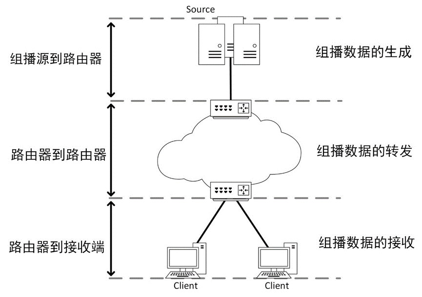

## **IP组播地址**

IPv4的组播地址为D类的地址范围（224.0.0.0–239.255.255.255），管理这些地址分配的组织为IANA。

IANA对组播IP地址空间进行了进一步的划分

- **范围：224.0.0.0–224.0.0.255**

本地网络控制块（Local Network Control Block），此类组播地址为永久组播地址，主要为一些路由协议等预留。其工作的范围为本地网络，数据包不跨路由器转发，目的IP为此类地址的组播报文在IP头部中的TTL值通常为1。

常见地址：

| 地址 | 用途 |
| --- | --- |
| **224.0.0.1** | 所有支持组播的主机 |
| **224.0.0.2** | 所有支持组播的路由器。 |
| **224.0.0.5** | OSPF |
| **224.0.0.6** | OSPF的DR |
| **224.0.0.9** | RIPv2 |
| **224.0.0.10** | EIGRP |
| **224.0.0.13** | PIM地址 |
| **224.0.0.18** | VRRP |
| **224.0.0.22** | IGMP |
| **224.0.0.102** | HSRP |
| **224.0.0.251** | mDNS |

- **范围：224.0.1.0~231.255.255.255，233.0.0.0~238.255.255.255**

ASM（Any-Source）的临时组播地址，这类地址全局有效。

- **范围：232.0.0.0~232.255.255.255**

SSM（Source-Specific）的临时组播地址。

- **范围：239.0.0.0~239.255.255.255**

本地管理ASM（Any-Source）的管理地址，与私有IP的概念类似。

- **ASM地址（Any-Source Multicast，任意源地址）**

接收者加入组播组（G），允许**任何源（S）**向该组（G）发送数据，任何设备都可以作为组播源。

例：我想要看电视，不管什么服务器上发过来的视频都可以。

ASM又可以分为全网ASM地址和内网ASM地址，全网ASM地址类似IP的公网地址，不可冲突，内网ASM地址类似IP的私网地址，只要不发送到公网即可。

- **SSM地址（Source-Specific Multicast，指定源地址）**

接收者需同时指定组播组（G）和源地址（S），仅接收来自指定源（S）的数据。只有指定的设备才可以作为组播源，IGMPv3上开始支持SSM。

例：远程授课，只希望看教师机上的画面。

- **组播IP与MAC的映射**

组播IP地址

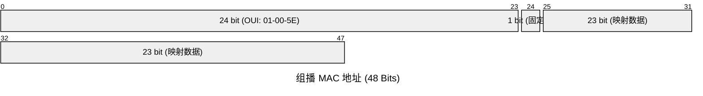

MAC地址的第23bit为组播IP的低23bit，直接照搬。

组播IP开头4bit必为1110，开头9 bit无论怎样变化，组播MAC的开头都为01-00-5E-0。因此在配置时要避免组播MAC相同的情况。

> 有一个有趣的故事是关于为什么只有 23 位有价值的 MAC 地址空间分配给 IP 组播。回到 20 世纪 90 年代初，Steve Deering 取得了一些关于 IP 组播研究工作的成果，因此，他希望 IEEE 配置 16 个连续不断的组织机构唯一性标识符(OUI)作为 IP 组播 MAC 地址使用。因为一个 OUI 包含 24 位有价值的地址空间，16 个连续不断的 OUI 将提供全部 28 位有价值的 MAC 地址空间，并且允许一对一地把第 3 层 IP 组播地址映射到 MAC 地址。很遗憾，当时一个 OUI 的价格是 $1 000，Steve 的经理，Jon Postel，不愿花$ 16 000 购买全部 28 位有价值 MAC 地址。相反，Jon 愿意在预算外花 $ 1 000 购买一个 OUI，并且拿出一半地址(23 位)给 Steve 供 IP 组播研究之用。

更多详细内容：

网页

[https://www.cisco.com/c/dam/en/us/support/docs/ip/ip-multicast/ipmlt_wp.pdf](https://www.cisco.com/c/dam/en/us/support/docs/ip/ip-multicast/ipmlt_wp.pdf#:~:text=The%20range%20of%20224.0.0.0%20through%20224.0.0.255%20is%20considered,the%20Link-Local%20Block%E2%80%94and%20isusedby%20networkprotocols%20on%20alocal%20subnetsegment.)

---

# **IGMP（Internet Group Management Protocol，互联网组管理协议）**

IGMP是用于管理与组播路由器相邻的客户端（Client）的关系，管理组播组的协议，位于网络层，与ICMP类似，属于控制协议，目前IGMP有3个版本，分别为IGMPv1、IGMPv2、IGMPv3，现在主流使用的版本是IGMPv2。

IGMPv1由RFC-1112定义，IGMPv2由RFC-2236定义，IGMPv3由RFC-3376定义。

- **查询器**

IGMP查询器（Querier）负责发送查询报文，所有的IGMP都需要查询器，查询器会定期去查询是否有客户在某个组里，在一群IGMP路由器中并不需要每一台路由器都去做查询，所以需要选举出一个查询器，进行统一的查询。

路由器启动时会主动发出查询消息，发现有多台IGMP路由器时进行选举，IP地址最小的路由器成为查询器。

非查询器在Other Querier Present Interval内未收到查询报文，会触发重新选举，可通过 timer other-querier-present interval 修改。

IGMPv1不支持查询器选举

- **IGMPv1**

IGMP的最初版本，路由器开启IGMP后则会发送Membership Query查询报文，缺省时间为60s，即每60s查询一遍是否有人想要加入组播组；如有设备想加入，则发送Membership Report响应报文。

## **报文**

[IGMP报文格式 - IGMP报文格式 - IP 报文格式大全 - 华为](https://support.huawei.com/enterprise/zh/doc/EDOC1100174722/35dbfbdd)

查询报文：

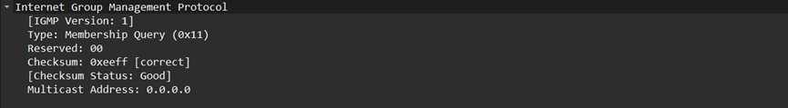

响应报文：

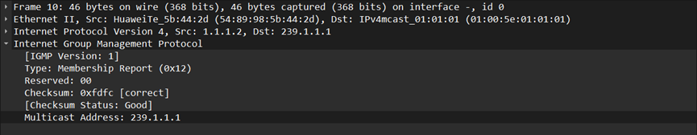

格式：

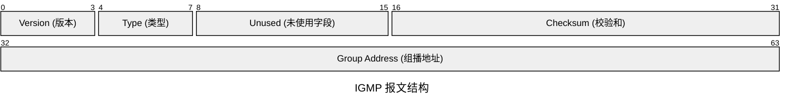

- **Version：**

IGMP版本号，在IGMPv1中应为0x1。

- **Type：**

1 = Host Membership Query 主机成员查询

2 = Host Membership Report 主机成员报告

- **Unused：**

未使用的字段，发送时必须填0，接收时忽略。

### **缺点**

- **静默离开**

IGMPv1使用静默离开的方式离开，离开后不再发送响应报告。

路由器普遍查询时间为60s，普遍组查询130s没有收到响应，则路由器认为该组不存在组播成员。也就是说，组播成员离开后，路由器还会发送130s的数据，十分浪费带宽。

- **无选举机制**

IGMP需要选举出查询器，但IGMPv1没有选举功能，只能通过PIM协议进行选举。

## **IGMPv2**

IGMPv2相较于IGMPv1，

新增了Leave Group消息，来确定离开。如果组播成员离开，会发送一个Leave Group消息，组播路由器收到Leave Group消息后便会发送特定组查询报文，确认没有其他成员后停止向下游发送数据包。

新增了选举机制，不需要依靠PIM来选举查询器。

一般设备开启IGMP默认开启的便是IGMPv2。

### 报文

查询消息

[imag4.png](images/组播_image/image4.png)

成员报告消息

离开消息

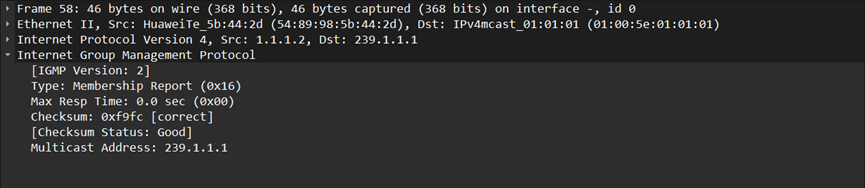

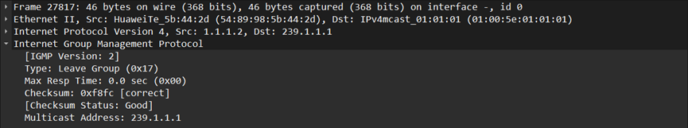

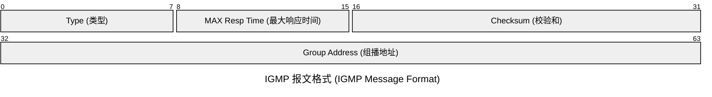

- **Type**

报文类型，有以下几种类型：

- 0x11：Membership Query，IGMP查询消息。
- 0x12：Version 1 Membership Report，IGMPv1成员报告消息。
- 0x16：Version 2 Membership Report，IGMPv2成员报告消息。
- 0x17：Leave Group，离开消息。

在IGMP版本2中，旧的4位版本字段和旧的4位类型字段拼成了一个新的8位类型字段，通过分别将成员查询（版本1和版本2的）及版本1的成员报告报文的IGMP版本2的类型代码置为0x11和0x12，保持了IGMP版本1和版本2包格式的向后兼容。

- **Max Resp Time**

在发出响应报告前的以1/10秒为单位的最长时间，缺省值为10秒。

新的最大响应时间（以1/10秒为单位）字段允许查询用路由器为它的查询报文指定准确的查询间隔响应时间。IGMP版本2主机在随机选择它们的响应时间值时以此作为上限。

这样在查询响应间隔时有助于控制响应的爆发。

## **IGMPv3**

IGMPv3新增了对SSM的支持，可指定组播源同时取消了专门的离开报文，转而使用不含任何source IP（源）的igmp report报文离开。IGMPv3 向下兼容IGMPv2与IGMPv1

### 报文

- **查询报文**

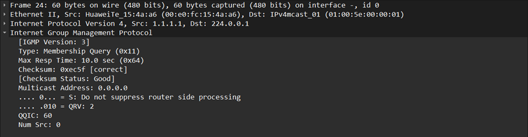

- **查询消息有三种类型的变体：**
- 1、“普通查询”由多播路由器发出，用于获知邻接接口(即与查询器传输网络相连的接口)的完整的多播接收状态。在一个普通查询中，组地址字段和源数量(N)字段都为0。
- 2、“指定组查询”由一台多播路由器发出，用于获知邻接接口中跟某一个组播IP地址相关的多播接收状态。在指定组查询中，“组地址”字段含有需要查询的那个组地址，源数量(N)字段为0。
- 3、“指定组和源查询”由一台多播路由器发出，用于获知邻接接口是否需要接收来自指定的这些源的，发往指定组的多播数据报。在一个指定组和源的查询中，组地址字段含有要查询的多播地址,源地址[i]字段含有相关的源地址。
- **Type**

成员关系查询 Type = 0x11。

- **Max Resp Code**

设备接收到查询消息后发出响应报文的最大延迟时间，超过该时间没有发出响应报文，则查询设备认为此次查询超时，单位是1/10秒。

- **Resv**

保留字段，发送报文时置0；接收到报文时，对该字段不做任何处理。

- **S**

该比特位置1时，所有收到此查询消息的其他路由器不启动定时器刷新过程，但是此查询消息并不抑制查询器选举过程和路由器的主机侧处理过程。

- **QRV**

查询者的健壮变量，如果不为0，QRV中包含一个被查询者使用的“健壮变量”的值，如果查询者的健壮变量的值超过7，即QRV字段的最大值，那么QRV被设成0。路由器取最近收到的查询中的QRV值作为它们自己的健壮性变量的值，除非最近收到的QRV是0，在这种情况下，接收者使用缺省的健壮性变量值，或者是一个静态配置的值

- **QQIC**

查询器的查询间隔，单位是秒。非查询器收到查询报文时，如果发现该字段非0，则将自己的查询间隔参数调整为该字段的值。

- **Number of Sources (N)**

消息中包含的组播源的数量。对于普遍组查询报文和特定组查询报文，该字段为0；对于特定组/源地址查询报文，该字段非0。此参数的大小受到所在网络MTU大小的限制。

- **Source Address**

组播源地址，一个查询报文可以有多个组播源地址其数量受到Number of Sources字段值大小的限制。

- **报告报文**

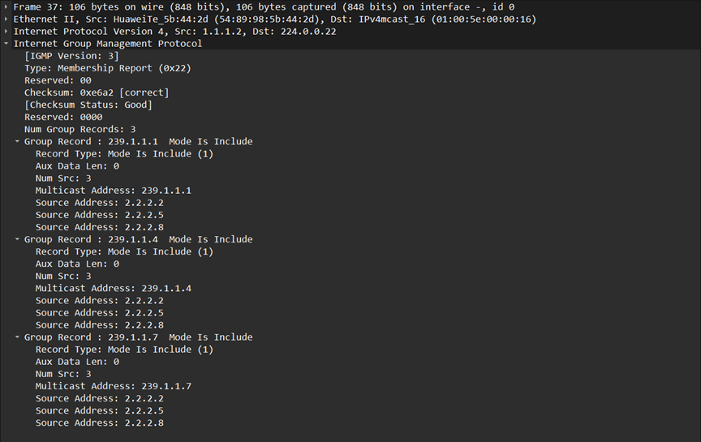

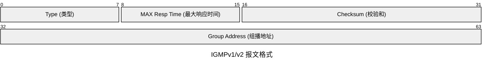

Group Record字段格式

IGMPv3包含成员查询消息和成员报告消息两种不同格式的消息报文。成员报告消息是主机向组播路由器发送的报告消息，用报告加入某组播组并只接收由指定组播源发往该组的数据。

- **Type**

Type = 0x22表示成员关系报告

- **Reserved**

保留字段，在发送的时候是以0填充，在接收的时候是不作任何处理的。

- **Checksum**

校验和是对整个IGMP消息以16位为一段进行取反求和。为了计算校验和，校验和字段首先必须被置0。当收到一个数据，在处理之前，必须先对校验和进行验证。

- **Reserved**

T保留字段，在发送的时候是以0填充，在接收的时候是不作任何处理的。

- **Number of Group Records (M)**

该字段表示该报告报文中包含有几个组记录。

- **Group Record（可变长度）**

一个主机可能需要点播多个组播地址的组播业务，每个记录包含了对应于其中一个组播地址的源地址列表等信息，它受到Number_of_Group_Records的大小的影响。

每一个组记录字段是一整块数据，其含有的信息是关于发送者在报告发送接口上的某一个多播组的成员关系。

- **Record Type**

Group Record消息的类型。

- MODE_IS_INCLUDE：接收源地址列表包含的源发往该组的组播数据。如果指定源地址列表为空，该消息为无效消息。
- MODE_IS_EXCLUDE：不接收源地址列表包含的源发往该组的组播数据。
- CHANGE_TO_INCLUDE_MODE：过滤模式由EXCLUDE转换到INCLUDE，接收源地址列表包含的新组播源发往该组播组的数据。如果指定源地址列表为空，主机离开组播组。
- CHANGE_TO_EXCLUDE_MODE：过滤模式由INCLUDE转换到EXCLUDE，拒绝源地址列表中新组播源发往该组的组播数据。
- ALLOW_NEW_SOURCES：表示在现有的基础上，需要接收源地址列表包含的源发往该组播组的组播数据。如果当前对应关系为INCLUDE，则向现有源列表中添加这些组播源；如果当前对应关系为EXCLUDE，则从现有阻塞源列表中删除这些组播源。
- BLOCK_OLD_SOURCES：表示在现有的基础上，不再接收从源地址列表包含的源组播源发往该组播组的组播数据。如果当前对应关系为INCLUDE，则从现有源列表中删除这些组播源；如果当前对应关系为EXCLUDE，则向现有源列表中添加这些组播源。

- **Aux Data Len**

辅助数据长度含有在组记录中的辅助数据的实际长度，其单位是32bit字。它有可能是0，这就表示辅助数据不存在。

- **Number of Sources (N)**

源数量(N)字段标明在组记录中存在多少源地址。

- **Multicast Address**

多播地址字段标明该组记录从属的多播IP地址。

- **Source Address**

源地址[i]字段是一个数组，含有n个单播地址。n就是该记录的源数量(N)字段的值。

- **Auxiliary Data（可变长度）**

附加数据。如果收到的报告中的IP首部的数据报长度字段标明在最后一个组记录后面有附加的数据存在。IGMPv3的实现必须在计算和验证校验和的时候包含这些附加数据，但是同时必须忽略这些附加数据。当发送一个报告时，一个IGMPv3的实现在最后一个组记录后面不能包含附加数据。

工作过程

- **加入组**：主机发送**INCLUDE**报告，指定接收的源列表。
- **离开组**：主机发送**EXCLUDE**报告，源列表为空。
- **查询响应**：路由器定期发送查询，主机响应报告以更新组成员状态。

## **IGMP Snooping**

### **二层组播的问题**

IGMP是三层协议，当交换机收到组播时，会从所有接口发出，这样便会将组播数据发送到其他非该组播组设备上。

### **IGMP Snooping工作原理**

开启IGMP Snooping，交换机会监听IGMP协议报文，哪个接口收到igmp report即和该组播组有关系，构建 **组播成员表**，记录哪些端口的主机加入了特定组播组，当收到组播数据时只从有关系的组播接口发出。

## **IGMP之间版本差异**

| 机制 | IGMPv1 | IGMPv2 | IGMPv3 |
| --- | --- | --- | --- |
| 查询器选举 | 依靠其他协议 | 自己选举 | 自己选举 |
| 成员离开方式 | 静默离开 | 主动发送离开报文 | 主动发送离开报文 |
| 特定组查询 | 不支持 | 支持 | 支持 |
| 指定源，组 | 不支持 | 不支持 | 支持 |

# **PIM（Protocol Independent Multicast，协议无关组播）**

如名字一样，PIM不像MOSPF、DVMRP那样需要使用特定的多播路由协议来构建组播路由表，而是直接利用已有的单播路由表构建组播路由表，这使得PIM成为了主流。

要使用PIM组建组播路由表需要单播先通。

目前PIM有两种模式—PIM-DM和PIM-SM。

- **PIM路由表**

PIM的路由表叫MRI（组播路由信息库），往下，PIM的转发包含（S，G） 和 （*，G）两种类型，

S为源地址，G为组播地址，*则代表任意源，RPT会用到。

### **PIM-DM（Dense Mode，密集模式）**

DM使用“推（Push）模式”传送组播数据，假设全网都有成员，配置较为方便，通常适用于组播组成员相对比较密集的小型网络，大型网络会造成带宽的浪费。

DM主要靠扩散，剪枝，嫁接等机制工作。

- **扩散（Flooding）**

当组播源发送组播数据时，第一跳路由器会将其泛洪到所有接口上。第二跳路由器收到后也会泛洪到所有接口上，这个过程会逐级进行，直到数据包到达网络中的所有 PIM 路由器，每次转发前会进行RPF检测。

RPF检查：

当路由器收到多播数据包时，它会执行以下验证过程：

1，查看数据包中的源IP地址

2，在单播路由表中查找到达该源地址的最佳路径（即出接口）

3，检查数据包实际到达的接口是否就是该出接口

如果数据包确实从通向源的最佳路径接收，则通过RPF检查；否则，路由器会认为这可能形成环路，因此丢弃该数据包。

- **剪枝（Prune）**

当下游路由器无组播组成员时，回复以剪枝消息给上游路由器，上游路由器收到剪枝，便会抑制没有成员的接口（收到剪枝报文的接口）。抑制接口不发送组播数据。被剪枝的接口会维持一个剪枝定时器。

- **嫁接（Graft）**

某下游路由器新增成员时，会向上游发送一个嫁接消息，请求数据，上游路由器便会取消该接口的抑制，重启发送数据。

- **断言（Assert）**

目的是为了避免重复报文，一个网络中，可能会有多个 PIM 路由器连接。当这些路由器都从上游接收到同一个组播包并试图向该网段转发时，就会产生重复的组播流量。

断言机制会在网段上选举一个唯一的组播转发者，避免数据冗余。

Assert选举优先级：

- 1，组播源的单播路由协议优先级较小者获胜。
- 2，组播源的路由协议开销较小者获胜。
- 3，到接收者MA网络接口IP地址最大者获胜。

根据Assert竞选结果，路由器将执行不同的操作：

获胜一方的下游接口称为Assert Winner，将负责后续对该网段组播报文的转发。

落败一方的下游接口称为Assert Loser，后续不会对该网段转发组播报文，PIM路由器也会将其从（S，G）表项下游接口列表中删除。

Assert竞选结束后，该网段上只存在一个下游接口，只传输一份组播报文，所有Assert Loser可以周期性恢复组播报文转发。

- **状态刷新（State Refresh）**

为了维持剪枝状态，离组播源最近的第一跳路由器会周期性地触发状态刷新（State Refresh）报文在全网扩散，收到该报文的 PIM 路由器会刷新其剪枝定时器的状态，防止被剪枝的接口因定时器超时而错误地恢复转发。

### **PIM-SM（Sparse Mode，稀疏模式）**

恰恰与DM相反，SM采用“拉（Pull）”模式，假设全网都没有成员，当接收者明确请求加入某个组播组时，组播数据才会向其转发。

- **RP（Rendezvous Point，汇聚点）**

RP 是 PIM-SM 网络中的一个核心路由器，或一组路由器配置为 Anycast RP 以实现冗余和负载均衡，组播源需要去找RP，组播客户端也需要去找RP，所有RP在整个网络中有“会合点”的意义。

RP选举可以通过静态指定和动态选举实现。手动配置静态RP时，由于不支持通过BSR动态发布，当RP故障时容易导致组播瘫痪。

- **BSR机制选举**
- 1，候选 BSR (Candidate-BSR, C-BSR)

手动在PIM域内指定一个或多个路由器作为C-BSR，每个C-BSR都可以配置优先级，缺省为0。

- 2，BSR选举

C-BSR域内的所有 PIM 路由器（目标地址 224.0.0.13）发送**引导报文 (Bootstrap Messages, BSMs)**。PIM路由器收到BSMs后会选举出唯一的BSR。

BSR选举优先级：

- 1 ，优先级最高的C-BSR选举为BSR
- 2 ，优先级相同，则最大IP的C-BSR选举为BSR。

一旦 BSR 被选举出来，其他 C-BSR 仍会继续发送 BSMs，如果当前的 BSR 发生故障，将触发新的选举过程。

- 3，候选RP (Candidate-RP, C-RP)

手动在PIM域内指定一个或多个路由器作为C-RP，每个C-BSR也可以配置优先级。

C-RP周期性地向**已选举出的 BSR** 单播发送**候选 RP 通告报文 (Candidate-RP-Advertisement Messages)**。这些报文包含了 C-RP 的地址、其服务的组播组范围以及优先级等信息。

- 4，BSR收集，分发RP信息

BSR 接收来自各个 C-RP 的通告报文，收集这些信息并形成一个 **RP 集合 (RP-Set)**。RP-Set 是一个组播组范围到 RP 地址的映射列表。

收集完成后，BSR会将这个RP-Set包含在新的BSMs中，使用224.0.0.13周期性发送给整个PIM域。

- 5，PIM路由器选举出RP

PIM 路由器根据从 BSR 接收到的 RP-Set，为特定的组播组选择一个合适的 RP。

如果一个组播组范围有多个 C-RP 通告，路由器会根据 RP 的优先级优选。

- **RPT，SPT建立过程：**

MDT可分为SPT（源树，最短路径树）和RPT（汇聚点树，共享树）

RPT即以RP为根，客户到RP的路径，SPT即以源为根，源到RP的路径，选举出DR后即可开始建立RPT和SPT。

- 1，选举DR（Designated Router，指定路由器）

PIM 路由器之间周期性发送 PIM Hello，默认间隔为30s，通过DR Priority字段来选举DR，

选举规则：

- 有最高 DR Priority 值的路由器被选为 DR
- 如DR Priority值相同，则选择IP地址最大的路由器作为 DR。

源端 DR 的职责：

- 当组播源开始发送数据时，源端所在网段的 DR 负责将组播数据封装成 PIM Register 消息，通过单播方式发送给 RP（集合点）
- 源端 DR 负责触发从源到 RP 的源树（SPT）建立过程
- 源端 DR 会维护源活跃状态并定期向 RP 报告

接收端 DR 的职责：

- 当接收到主机的 IGMP Join 请求后，接收端 DR 负责向 RP 发送 PIM Join 消息以加入 RPT
- 在需要切换到 SPT 时，接收端 DR 负责发起向源的 PIM Join 消息以建立 SPT
- 接收端 DR 代表整个共享网段处理所有组播成员关系事务
- 2，建立RPT

客户加入某个组播组时，发送IGMP成员通告。接收端DR路由器向RP发送PIM Join消息，开始构建主机到RP的路径。PIM Join消息到达RP的过程中，沿途经过的各路由器都会生成相应的（*，G）组播转发条目。RP收到PIM Join更新(*，G）Join表，将收此消息的接口 添加到出接口列表中。

接收端DR路由器会每隔一定时间发送一条（*，G）join消息给RP，缺省情况下时间为 60s，如果3个周期未收到（*，G）join消息则将接口从出接口中删除。

DR到RP一路来，所生成的（*，G）即为DR到RP的路径，这样客户便可以找到RP了。

从所有接收者到 RP 的路径形成一棵以 RP 为根的树。RPT实现了组播数据按需转发的目的，减少了数据泛洪对网络带宽的占用。

- 3，建立SPT

一旦源端 DR 知道了 RP 的地址，注册过程如下：

1. 组播源开始发送组播数据包到特定组 G
2. 源所在网段的 DR 接收到这些组播数据包
3. DR 将这些组播数据包封装在 PIM Register 消息中（单播封装）
4. DR 通过单播将这些 Register 消息发送给 RP
5. RP 收到 Register 消息后，解封装出原始组播数据
6. RP 通过已建立的 RPT 将组播数据转发给组成员
7. 同时，RP 向源方向发送 (S,G) Join 消息，建立从源到 RP 的 SPT
8. 一旦 SPT 建立完成，RP 开始通过 SPT 接收组播数据
9. 此时，RP 向源端 DR 发送 Register-Stop 消息
10. 收到 Register-Stop 后，源端 DR 停止封装和发送 Register 消息

每一个源都有着自己独立的SPT树。

- **Switchover机制**

SPT和RPT构建的树都经过RP，但这可能不是客户到源的最佳线路，Switchover机制即是解决这一问题。

一开始客户不知道源在哪，需要找到RP，再由RP转到源。

当源和客户都找到RP，RP告诉了源和客户的地址，这即意味着源和客户知道了对方的地址，通过单播路由表即可知道最佳路径，不再需要去找RP。

- **PIM-SM数据包（待定）**
- **Auto-RP思科专有技术（待定）**

### **Bidir-PIM（双向PIM）**

一种PIM的变体，在RFC-5015中被定义。双向PIM针对多对多通信场景，构建双向的共享树。

## •  **Auto-RP思科专有技术（待定）**

## •  **PIM-SM数据包（待定）**
